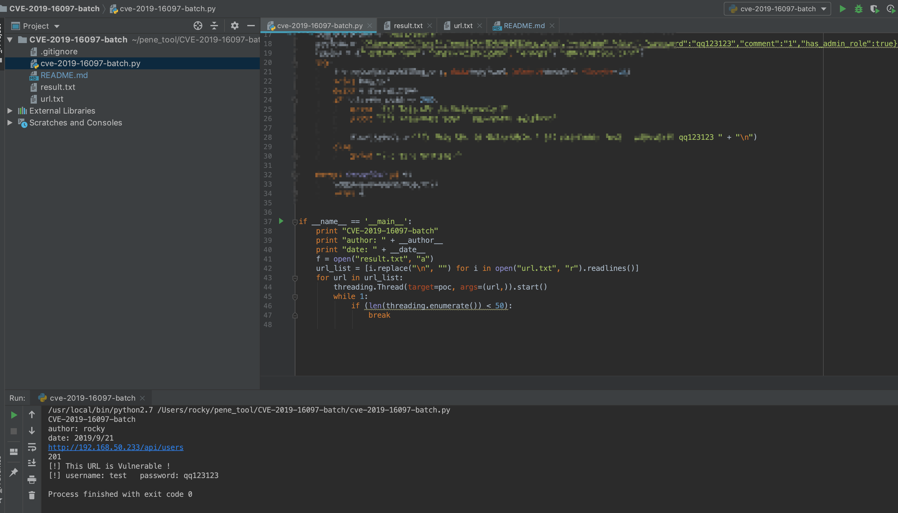

# CVE-2019-16097-batch
## 免责声明
只做安全研究使用，不得做非法测试，后果自行承担！！！

CVE-2019-16097-batch

批量漏洞利用脚本

在 url.txt文件 批量添加目标地址

http://1.1.1.1
http://2.2.2.2

使用python 运行 此脚本 在 result.txt 可以看到最终的验证结果

## 漏洞背景
近日，镜像仓库Harbor爆出任意管理员注册漏洞，攻击者在请求中构造特定字符串，在未授权的情况下可以直接创建管理员账号，从而接管Harbor镜像仓库。我们得到消息，第一时间对该漏洞进了验证，官方已发布公告说明，最新的1.7.6和1.8.3已修复此漏洞，请使用到的用户尽快升级至安全版本。

## 漏洞描述

Harbor是一个用于存储和分发Docker镜像的企业级Registry服务器。Harbor 1.7.0版本至1.8.2版本中的core/api/user.go文件存在安全漏洞。攻击者通过在请求中添加关键参数，即可利用该漏洞创建管理员账户，从而接管Harbor镜像仓库。

## 影响版本

Harbor 1.7.0版本至1.8.2版本

## 漏洞复现

我们通过编写批量验证脚本，成功复现了该漏洞。

## 安全建议

升级Harbor版本到 1.7.6 和 1.8.3

参考下载链接：https://github.com/goharbor/harbor/releases

## 参考链接

https://github.com/evilAdan0s/CVE-2019-16097

https://github.com/goharbor/harbor/issues/8951

https://unit42.paloaltonetworks.com/critical-vulnerability-in-harbor-enables-privilege-escalation-from-zero-to-admin-cve-2019-16097/