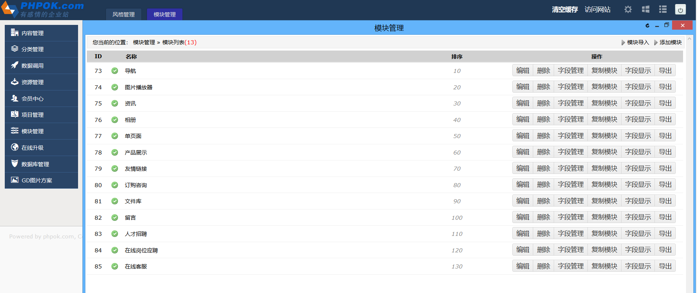
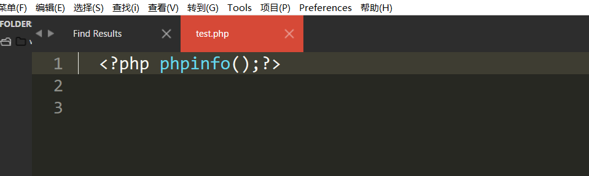
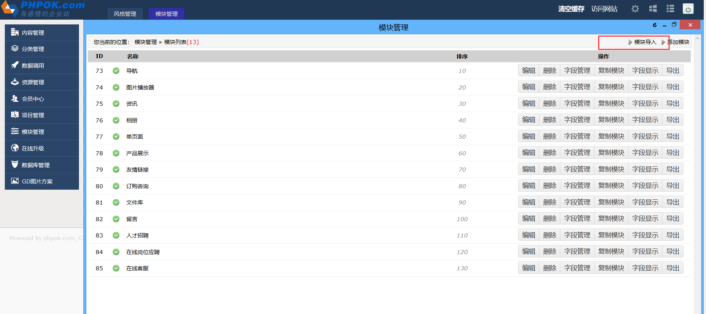
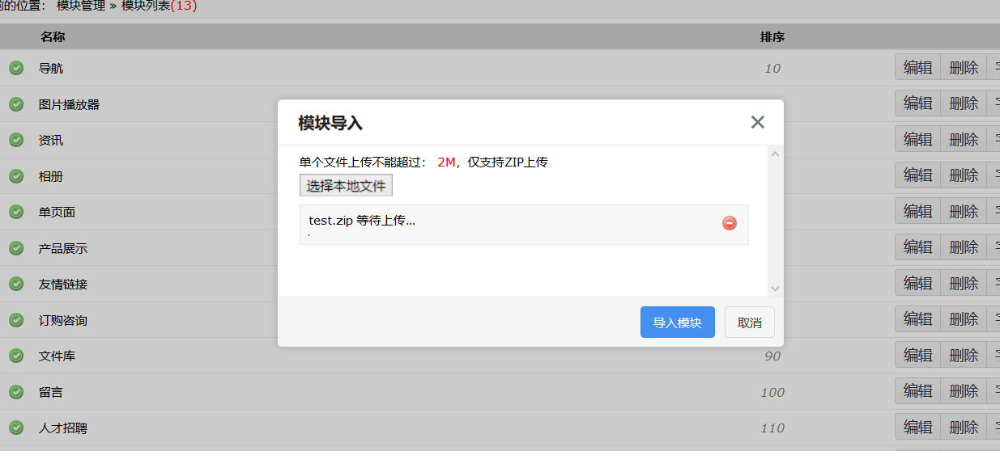
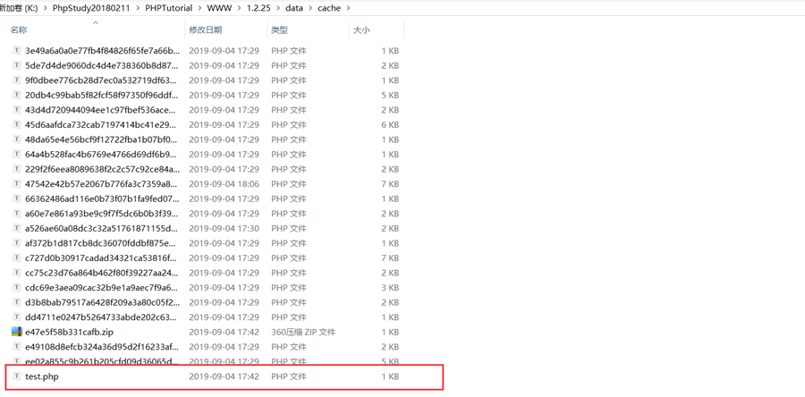
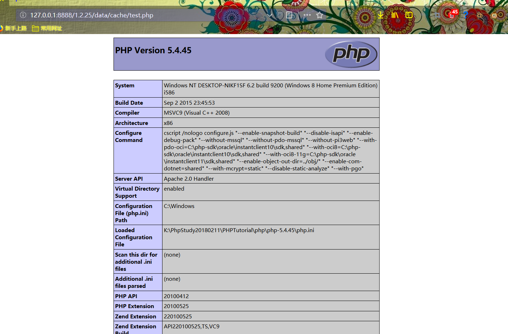

## 前言  

OKLite v1.2.25 存在任意文件上传漏洞

## 漏洞简介  

Ethan发现OKLite v1.2.25 存在任意文件上传漏洞（需要登录后台）

## 漏洞危害  

直接上传getshell

## 影响范围  

### 产品  

> OKLite

### 版本  

> OKLite v1.2.25 版本  

### 组件  

> OKLite  

## 漏洞复现  

登录后台，点击模块管理  

编辑一个测试文件test.php,压缩为test.zip上传。 

然后导入模块

点击开始上传，上传shell生成在解压主目录下面

访问`http://127.0.0.1:8888/1.2.25/data/cache/test.php`

