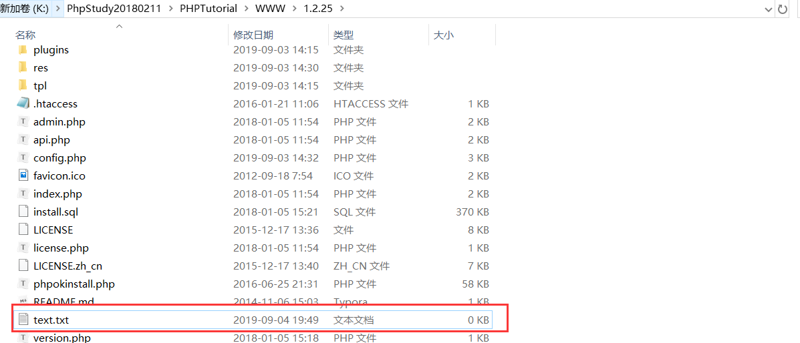
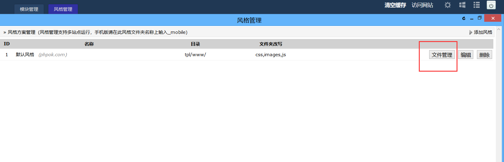
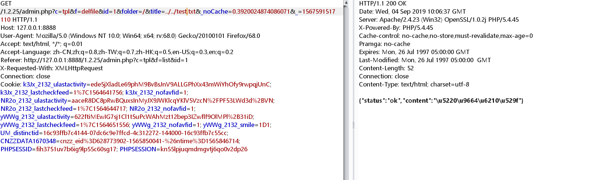
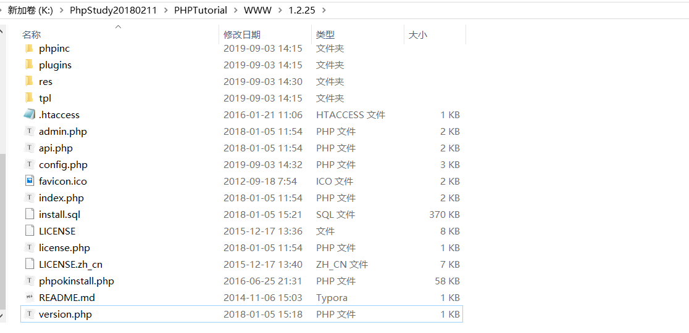

## 前言  

OKLite v1.2.25 存在任意文件删除漏洞

## 漏洞简介  

Ethan发现OKLite v1.2.25 存在任意文件删除漏洞（需要登录后台）

## 漏洞危害  

后台删除文件时抓包修改`title`参数可以直接删除网站任意文件

## 影响范围  

### 产品  

> OKLite

### 版本  

> OKLite v1.2.25 版本  

### 组件  

> OKLite  

## 漏洞复现  

在主目录下创建一个index.txt用来测试

登录后台，在设置->风格管理

点击文件管理

随便删除一个文件，点击抓包，修改title参数为../../test.txt

发送请求，主目录下的test.txt已被删除

