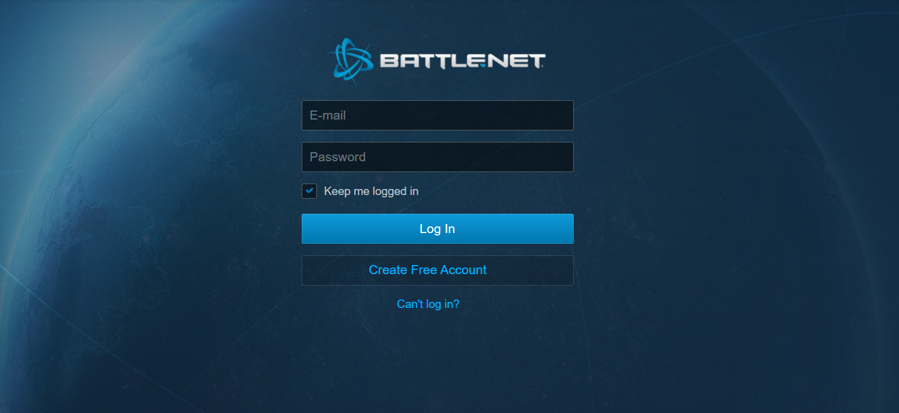
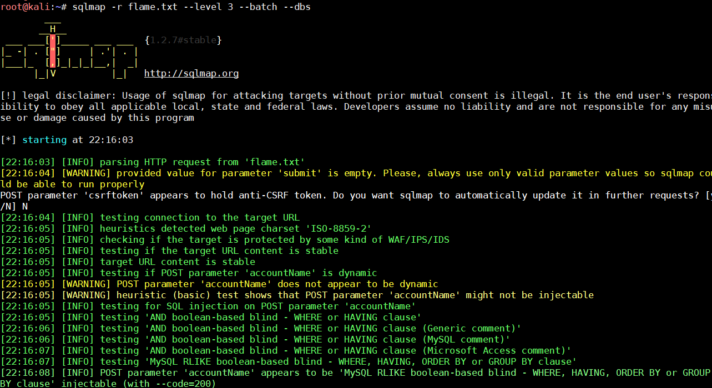
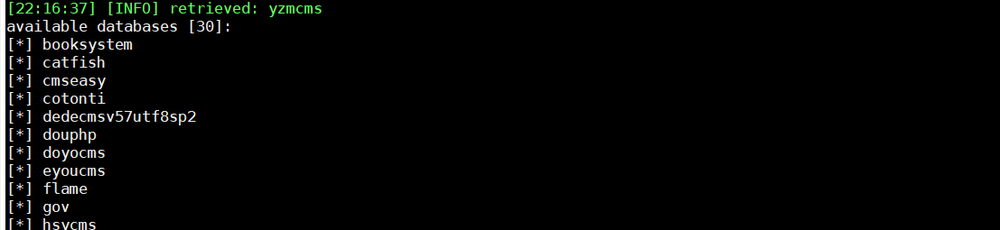

## 前言  

CVE-2019-16309 FlameCMS 3.3.5 后台登录处存在sql注入漏洞

## 漏洞简介  

Ethan发现FlameCMS 3.3.5 后台登录处存在sql注入漏洞

## 漏洞危害  

后台登录处存在sql注入漏洞，可以通过`sqlmap`直接跑出所有表

## 影响范围  

### 产品  

> FlameCMS

### 版本  

> FlameCMS 3.3.5 版本  

### 组件  

> FlameCMS  

## 漏洞复现  

访问后台登陆处抓包`http://127.0.0.1:8888/FlameCMS-master/account/login.php`

然后把抓取的post包，放进sqlmap跑，成功使用盲注跑出

