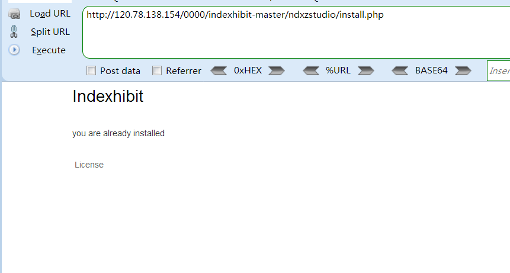
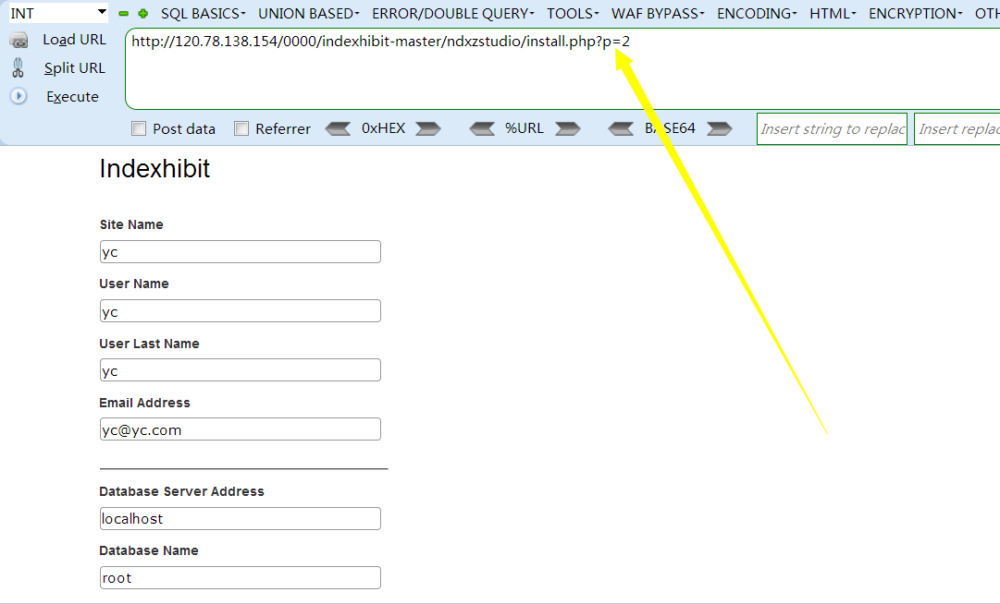
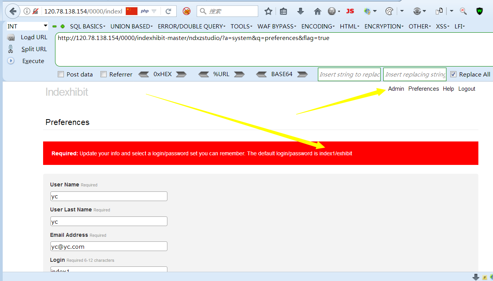

## 前言  

CVE-2019-16314 indexhibit cms v2.1.5 存在重装并导致getshell

## 漏洞简介  

夜程 发现indexhibit cms v2.1.5 存在重装并导致getshell 漏洞

## 漏洞危害  

如果没有删除 install.php 则可以通过直接提交参数进行重装，并在后台直接getshell

## 影响范围  

### 产品  

> indexhibit cms

### 版本  

> indexhibit cms  v2.1.5 版本  

### 组件  

> indexhibit cms  

## 漏洞复现  

直接访问/ndxzstudio/install.php，提示已安装

但是，通过参数p可以绕过，直接重新安装

填写相关信息后安装成功：

## POC：
> /ndxzstudio/install.php?p=2
