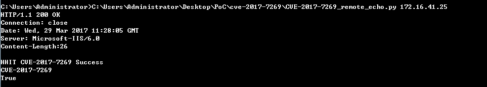

### CVE-2017-7269 远程代码执行回显验证

---
我们团队对此次 CVE-2017-7269(IIS6-0远程命令执行漏洞) 漏洞的分析报告: https://ht-sec.org/cve-2017-7269-vulnerabilities/

默认PoC 只能弹`calc.exe` ,现在修改成可以响应请求,命令格式为: 

`CVE-2017-7269_remote_echo.py ip_address port`

 

### 利用条件

- iis6.0
- 开启WebDav功能（具体为PROPFIND方法，成功则返回207或者200）
- windows server 2003 R2  

效果如下: 

来源: https://github.com/lcatro/CVE-2017-7269-Echo-PoC   