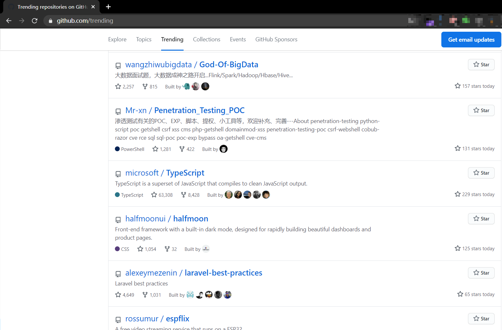

##  Penetration_Testing_POC

搜集有关渗透测试中用到的POC、脚本、工具、文章等姿势分享，作为笔记吧，欢迎补充。

- [ Penetration_Testing_POC](#head1)
- [ 请善用搜索[`Ctrl+F`]查找](#head2)
- [IOT Device&Mobile Phone](#head3)
- [Web APP](#head4)
- [ 提权辅助相关](#head5)
- [ PC](#head6)
- [ tools-小工具集合](#head7)
- [ 文章/书籍/教程相关](#head8)
- [ 说明](#head9)

##  请善用搜索[`Ctrl+F`]查找

## IOT Device&Mobile Phone

- [天翼创维awifi路由器存在多处未授权访问漏洞](天翼创维awifi路由器存在多处未授权访问漏洞.md)
- [华为WS331a产品管理页面存在CSRF漏洞](华为WS331a产品管理页面存在CSRF漏洞.md)
- [CVE-2019-16313 蜂网互联企业级路由器v4.31密码泄露漏洞](./CVE-2019-16313%20蜂网互联企业级路由器v4.31密码泄露漏洞.md)
- [D-Link路由器RCE漏洞](./CVE-2019-16920-D-Link-rce.md)
- [CVE-2019-13051-Pi-Hole路由端去广告软件的命令注入&权限提升](./CVE-2019-13051)
- [D-Link DIR-859 - RCE UnAutenticated (CVE-2019–17621)](https://github.com/s1kr10s/D-Link-DIR-859-RCE)
- [Huawei HG255 Directory Traversal[目录穿越]](https://packetstormsecurity.com/files/155954/huaweihg255-traversal.rb.txt)|[本地备份文件](./tools/huaweihg255-traversal.rb)
- [D-Link Devices - Unauthenticated Remote Command Execution in ssdpcgi (Metasploit)CVE-2019-20215(Metasploit)](./POC_Details/D-Link%20Devices%20-%20Unauthenticated%20Remote%20Command%20Execution%20in%20ssdpcgi%20(Metasploit)%20CVE-2019-20215.rb)
- [从 Interfaces.d 到 RCE：Mozilla WebThings IoT 网关漏洞挖掘](https://research.nccgroup.com/2020/02/10/interfaces-d-to-rce/)
- [小米系列路由器远程命令执行漏洞（CVE-2019-18370，CVE-2019-18371）](https://github.com/UltramanGaia/Xiaomi_Mi_WiFi_R3G_Vulnerability_POC/blob/master/report/report.md)
- [Intelbras Wireless N 150Mbps WRN240 - Authentication Bypass (Config Upload-未经验证即可替换固件)](https://www.exploit-db.com/exploits/48158)
- [cve-2020-8634&cve-2020-8635](https://www.exploit-db.com/exploits/48160)|[Wing FTP Server 6.2.3权限提升漏洞发现分析复现过程](https://www.hooperlabs.xyz/disclosures/cve-2020-8635.php)|[Wing FTP Server 6.2.5权限提升](https://www.exploit-db.com/exploits/48154)
- [CVE-2020-9374-TP LINK TL-WR849N - RCE](./CVE-2020-9374.md)
- [CVE-2020-12753-LG 智能手机任意代码执行漏洞](https://github.com/shinyquagsire23/CVE-2020-12753-PoC)
- [CVE-2020-12695-UPnP 安全漏洞](https://github.com/yunuscadirci/CallStranger)
- [79款 Netgear 路由器遭远程接管0day](https://github.com/grimm-co/NotQuite0DayFriday/blob/master/2020.06.15-netgear/exploit.py)
- [dlink-dir610-exploits-Exploits for CVE-2020-9376 and CVE-2020-9377](https://github.com/renatoalencar/dlink-dir610-exploits)
- [wacker：一组脚本，可辅助对WPA3接入点执行在线词典攻击](https://github.com/blunderbuss-wctf/wacker)
- [CVE-2020-24581 D-Link DSL-2888A 远程命令执行漏洞分析](./books/CVE-2020-24581%20D-Link%20DSL-2888A%20远程命令执行漏洞分析.pdf)-[原地址](https://www.anquanke.com/post/id/229323)
- [CNVD-2021-14536_锐捷RG-UAC统一上网行为管理审计系统账号密码信息泄露漏洞](./CNVD-2021-14536_锐捷RG-UAC统一上网行为管理审计系统账号密码信息泄露漏洞.md)
- [CNVD-2021-14544:Hikvision 海康威视流媒体管理服务器任意文件读取](https://github.com/Henry4E36/Hikvision)
- [CNVD-2020-25078:D-link 敏感信息泄漏，可以直接获取账户密码查看监控](https://github.com/Henry4E36/D-link-information)
- [ios-gamed-0day](https://github.com/illusionofchaos/ios-gamed-0day)
- [ios-nehelper-wifi-info-0day](https://github.com/illusionofchaos/ios-nehelper-wifi-info-0day)
- [ios-nehelper-enum-apps-0day](https://github.com/illusionofchaos/ios-nehelper-enum-apps-0day)
- [iOS 15.0.1 RCE PoC](https://github.com/jonathandata1/ios_15_rce)
- [CVE-2021-36260：海康威视产品命令注入漏洞](https://watchfulip.github.io/2021/09/18/Hikvision-IP-Camera-Unauthenticated-RCE.html)
- [CVE-2021-33044、CVE-2021-33045 大华摄像头POC](https://github.com/mcw0/DahuaConsole)|[相关分析](https://github.com/mcw0/PoC/blob/master/Dahua%20authentication%20bypass.txt)|[登录绕过chrome 插件](https://github.com/bp2008/DahuaLoginBypass)
- [CVE-2021-36260：海康威视命令注入漏洞](https://github.com/rabbitsafe/CVE-2021-36260)|[又一个CVE-2021-36260利用脚本](https://github.com/Cuerz/CVE-2021-36260)
- [CVE-2021-41653：TP-Link TL-WR840N V5(EU) - RCE ](./books/TP-Link%20TL-WR840N%20V5(EU)%20-%20RCE%20-%20CVE-2021-41653.pdf)
- [DirtyPipe-Android：Dirty Pipe root exploit for Android](https://github.com/polygraphene/DirtyPipe-Android)
- [CVE-2022-30075：Tp-Link Archer AX50 Authenticated RCE](https://github.com/aaronsvk/CVE-2022-30075)
- [NotQuite0day：D-Link 1960相关漏洞](https://github.com/star-sg/NotQuite0day)
- [HuaYuReportRCE：华域数广Report组件GetShell](https://github.com/h0r1g/HuaYuReportRCE)
- [IOT_Vul：IOT相关漏洞收集](https://github.com/zhefox/IOT_Vul)
- [CameraHack：批量扫描破解海康威视、大华等摄像头的常见漏洞](https://github.com/WhaleFell/CameraHack)
- [CVE-2022-32832：apple macos 的 apfs 导致内核任意代码执行漏洞](https://github.com/Muirey03/CVE-2022-32832)
- [HookWechatRecall：通过frida工具 拦截 微信撤回Demo](https://github.com/GaoGuohao/HookWechatRecall)
- [IOT_vuln：IOT相关漏洞仓库](https://github.com/EPhaha/IOT_vuln)
- [hikvision_CVE-2017-7921_auth_bypass_config_decryptor：解密受CVE-2017-7921影响的海康威视的配置文件](https://github.com/chrisjd20/hikvision_CVE-2017-7921_auth_bypass_config_decryptor)
- [CVE-2022-20866：思科自适应安全设备软件和 Firepower 威胁防御软件 RSA 私钥泄漏检查](https://github.com/CiscoPSIRT/CVE-2022-20866)
- [WLAN-AP-WEA453e RCE:三星路由器远程命令执行漏洞](./WLAN-AP-WEA453e%20RCE三星路由器远程命令执行漏洞.md)

## Web APP

- [致远OA_A8_getshell_0day](致远OA_A8_getshell_0day.md)
- [Couch through 2.0存在路径泄露漏洞 ](Couch%20through%202.0存在路径泄露漏洞.md)
- [Cobub Razor 0.7.2存在跨站请求伪造漏洞](Cobub%20Razor%200.7.2存在跨站请求伪造漏洞.md)
- [joyplus-cms 1.6.0存在CSRF漏洞可增加管理员账户](joyplus-cms%201.6.0存在CSRF漏洞可增加管理员账户.md)
- [MiniCMS 1.10存在CSRF漏洞可增加管理员账户](MiniCMS%201.10存在CSRF漏洞可增加管理员账户.md)
- [Z-Blog 1.5.1.1740存在XSS漏洞](Z-Blog%201.5.1.1740存在XSS漏洞.md)
- [YzmCMS 3.6存在XSS漏洞](YzmCMS%203.6存在XSS漏洞.md)
- [Cobub Razor 0.7.2越权增加管理员账户](Cobub%20Razor%200.7.2越权增加管理员账户.md)
- [Cobub Razor 0.8.0存在SQL注入漏洞](Cobub%20Razor%200.8.0存在SQL注入漏洞.md)
- [Cobub Razor 0.8.0存在物理路径泄露漏洞](Cobub%20Razor%200.8.0存在物理路径泄露漏洞.md)
- [五指CMS 4.1.0存在CSRF漏洞可增加管理员账户](五指CMS%204.1.0存在CSRF漏洞可增加管理员账户.md)
- [DomainMod的XSS集合](DomainMod的XSS集合.md)
- [GreenCMS v2.3.0603存在CSRF漏洞可获取webshell&增加管理员账户](GreenCMS%20v2.3.0603存在CSRF漏洞可获取webshell&增加管理员账户.md)
- [yii2-statemachine v2.x.x存在XSS漏洞](yii2-statemachine%20v2.x.x存在XSS漏洞.md)
- [maccms_v10存在CSRF漏洞可增加任意账号](maccms_v10存在CSRF漏洞可增加任意账号.md)
- [LFCMS 3.7.0存在CSRF漏洞可添加任意用户账户或任意管理员账户](LFCMS%203.7.0存在CSRF漏洞可添加任意用户账户或任意管理员账户.md)
- [Finecms_v5.4存在CSRF漏洞可修改管理员账户密码](Finecms_v5.4存在CSRF漏洞可修改管理员账户密码.md)
- [Amazon Kindle Fire HD (3rd Generation)内核驱动拒绝服务漏洞](Amazon%20Kindle%20Fire%20HD%20\(3rd%20Generation\)内核驱动拒绝服务漏洞.md)
- [Metinfo-6.1.2版本存在XSS漏洞&SQL注入漏洞](Metinfo-6.1.2版本存在XSS漏洞&SQL注入漏洞.md)
- [Hucart cms v5.7.4 CSRF漏洞可任意增加管理员账号](Hucart%20cms%20v5.7.4%20CSRF漏洞可任意增加管理员账号.md)
- [indexhibit cms v2.1.5 直接编辑php文件getshell](indexhibit%20cms%20v2.1.5%20直接编辑php文件getshell.md)
- [S-CMS企业建站系统PHP版v3.0后台存在CSRF可添加管理员权限账号](S-CMS企业建站系统PHP版v3.0后台存在CSRF可添加管理员权限账号.md)
- [S-CMS PHP v3.0存在SQL注入漏洞](S-CMS%20PHP%20v3.0存在SQL注入漏洞.md)
- [MetInfoCMS 5.X版本GETSHELL漏洞合集](MetInfoCMS%205.X版本GETSHELL漏洞合集.md)
- [MetInfo7.5.0代码审计(后台SQL注入+md5弱类型比较).pdf](./books/MetInfo7.5.0代码审计(后台SQL注入+md5弱类型比较).pdf)
- [discuz ml RCE 漏洞检测工具](discuz-ml-rce/README.md)
- [thinkphp5框架缺陷导致远程代码执行](thinkphp5框架缺陷导致远程代码执行.md)
- [FineCMS_v5.0.8两处getshell](FineCMS_v5.0.8两处getshell.md)
- [Struts2_045漏洞批量检测|搜索引擎采集扫描](Struts2_045-Poc)
- [thinkphp5命令执行](thinkphp5命令执行.md)
- [typecho反序列化漏洞](typecho反序列化漏洞.md)
- [CVE-2019-10173 Xstream 1.4.10版本远程代码执行](CVE-2019-10173%20Xstream%201.4.10版本远程代码执行漏洞.md)
- [IIS/CVE-2017-7269-Echo-PoC](./IIS/CVE-2017-7269-Echo-PoC)
- [CVE-2019-15107 Webmin RCE](./CVE-2019-15107)
- [thinkphp5 rce漏洞检测工具](./tp5-getshell)
- [thinkphp5_RCE合集](./tp5-getshell/TP5_RCE合集.md)
- [thinkphp3.X-thinkphp5.x](./tp5-getshell/ThinkPHP.md)
- [关于ThinkPHP框架的历史漏洞分析集合](https://github.com/Mochazz/ThinkPHP-Vuln)
- [CVE-2019-11510](./CVE-2019-11510)
- [Redis(<=5.0.5) RCE](./redis-rogue-server)
- [Redis 4.x/5.x RCE（主从复制导致RCE）](https://github.com/Ridter/redis-rce)
- [生成Redis恶意模块so文件配合主从复制RCE达到命令执行](https://github.com/n0b0dyCN/RedisModules-ExecuteCommand)|[相关文章](https://www.freebuf.com/vuls/224235.html)
- [RedisWriteFile-通过 `Redis` 主从写出无损文件，可用于 `Windows` 平台下写出无损的 `EXE`、`DLL`、 `LNK` 和 `Linux` 下的 `OS` 等二进制文件](https://github.com/r35tart/RedisWriteFile)
- [WeblogicScanLot系列，Weblogic漏洞批量检测工具](./WeblogicScanLot)
- [jboss_CVE-2017-12149](./jboss_CVE-2017-12149)
- [Wordpress的拒绝服务（DoS）-CVE-2018-6389](./CVE-2018-6389)
- [Webmin Remote Code Execution (authenticated)-CVE-2019-15642](https://github.com/jas502n/CVE-2019-15642)
- [CVE-2019-16131 OKLite v1.2.25 任意文件上传漏洞](./CVE-2019-16131%20OKLite%20v1.2.25%20任意文件上传漏洞.md)
- [CVE-2019-16132 OKLite v1.2.25 存在任意文件删除漏洞](./CVE-2019-16132%20OKLite%20v1.2.25%20存在任意文件删除漏洞.md)
- [CVE-2019-16309 FlameCMS 3.3.5 后台登录处存在sql注入漏洞](./CVE-2019-16309%20FlameCMS%203.3.5%20后台登录处存在sql注入漏洞.md)
- [CVE-2019-16314 indexhibit cms v2.1.5 存在重装并导致getshell](./CVE-2019-16314%20indexhibit%20cms%20v2.1.5%20存在重装并导致getshell.md)
- [泛微OA管理系统RCE漏洞利用脚本](./泛微OA管理系统RCE漏洞利用脚本.md)
- [CVE-2019-16759 vBulletin 5.x 0day pre-auth RCE exploit](./CVE-2019-16759%20vBulletin%205.x%200day%20pre-auth%20RCE%20exploit.md)
- [zentao-getshell 禅道8.2 - 9.2.1前台Getshell](./zentao-getshell)
- [泛微 e-cology OA 前台SQL注入漏洞](./泛微%20e-cology%20OA%20前台SQL注入漏洞.md)
- [Joomla-3.4.6-RCE](./Joomla-3.4.6-RCE.md)
- [Easy File Sharing Web Server 7.2 - GET 缓冲区溢出 (SEH)](./Easy%20File%20Sharing%20Web%20Server%207.2%20-%20GET%20缓冲区溢出%20(SEH).md)
- [构建ASMX绕过限制WAF达到命令执行(适用于ASP.NET环境)](./构建ASMX绕过限制WAF达到命令执行.md)
- [CVE-2019-17662-ThinVNC 1.0b1 - Authentication Bypass](./CVE-2019-17662-ThinVNC%201.0b1%20-%20Authentication%20Bypass.md)
- [CVE-2019-16278andCVE-2019-16279-about-nostromo-nhttpd](./CVE-2019-16278andCVE-2019-16279-about-nostromo-nhttpd.md)
- [CVE-2019-11043-PHP远程代码执行漏](./CVE-2019-11043)
- [ThinkCMF漏洞全集和](./ThinkCMF漏洞全集和.md)
- [CVE-2019-7609-kibana低于6.6.0未授权远程代码命令执行](./CVE-2019-7609-kibana低于6.6.0未授权远程代码命令执行.md)
- [ecologyExp.jar-泛微ecology OA系统数据库配置文件读取](./tools/ecologyExp.jar)
- [freeFTP1.0.8-'PASS'远程缓冲区溢出](./freeFTP1.0.8-'PASS'远程缓冲区溢出.md)
- [rConfig v3.9.2 RCE漏洞](./rConfig%20v3.9.2%20RCE漏洞.md)
- [apache_solr_rce](./solr_rce.md)
- [CVE-2019-7580 thinkcmf-5.0.190111后台任意文件写入导致的代码执行](CVE-2019-7580%20thinkcmf-5.0.190111后台任意文件写入导致的代码执行.md)
- [Apache Flink任意Jar包上传导致远程代码执行](https://github.com/LandGrey/flink-unauth-rce)
- [Jwt_Tool - 用于验证、伪造、扫描和篡改 JWT（JSON Web 令牌）](https://github.com/ticarpi/jwt_tool)
- [cve-2019-17424 nipper-ng_0.11.10-Remote_Buffer_Overflow远程缓冲区溢出附PoC](cve-2019-17424%20nipper-ng_0.11.10-Remote_Buffer_Overflow远程缓冲区溢出附PoC.md)
- [CVE-2019-12409_Apache_Solr RCE](https://github.com/jas502n/CVE-2019-12409)
- [Shiro RCE (Padding Oracle Attack)](https://github.com/wuppp/shiro_rce_exp)
- [CVE-2019-19634-class.upload.php <= 2.0.4任意文件上传](https://github.com/jra89/CVE-2019-19634)
- [Apache Solr RCE via Velocity Template Injection](./Apache%20Solr%20RCE%20via%20Velocity%20Template%20Injection.md)
- [CVE-2019-10758-mongo-express before 0.54.0 is vulnerable to Remote Code Execution ](https://github.com/masahiro331/CVE-2019-10758/)
- [CVE-2019-2107-Android播放视频-RCE-POC(Android 7.0版本，7.1.1版本，7.1.2版本，8.0版本，8.1版本，9.0版本)](https://github.com/marcinguy/CVE-2019-2107)
- [CVE-2019-19844-Django重置密码漏洞(受影响版本:Django master branch,Django 3.0,Django 2.2,Django 1.11)](https://github.com/ryu22e/django_cve_2019_19844_poc/)
- [CVE-2019-17556-unsafe-deserialization-in-apache-olingo(Apache Olingo反序列化漏洞，影响: 4.0.0版本至4.6.0版本)](https://medium.com/bugbountywriteup/cve-2019-17556-unsafe-deserialization-in-apache-olingo-8ebb41b66817)
- [ZZCMS201910 SQL Injections](./ZZCMS201910%20SQL%20Injections.md)|[ZZCMS201910代码审计](./books/ZZCMS201910代码审计.pdf)
- [WDJACMS1.5.2模板注入漏洞](./WDJACMS1.5.2模板注入漏洞.md)
- [CVE-2019-19781-Remote Code Execution Exploit for Citrix Application Delivery Controller and Citrix Gateway](https://github.com/projectzeroindia/CVE-2019-19781)
- [CVE-2019-19781.nse---use Nmap check  Citrix ADC Remote Code Execution](https://github.com/cyberstruggle/DeltaGroup/tree/master/CVE-2019-19781)
- [Mysql Client 任意文件读取攻击链拓展](https://paper.seebug.org/1112/)
- [CVE-2020-5504-phpMyAdmin注入(需要登录)](https://xz.aliyun.com/t/7092)-[另一篇关于次漏洞的 复现](https://mp.weixin.qq.com/s/epQdTdy6E8QdQTqBbq_Edw)
- [CVE-2020-5509-Car Rental Project 1.0版本中存在远程代码执行漏洞](https://github.com/FULLSHADE/CVE-2020-5509-POC)
- [CryptoAPI PoC CVE-2020-0601](https://github.com/kudelskisecurity/chainoffools/blob/master/README.md)|[另一个PoC for CVE-2020-0601](https://github.com/ollypwn/CVE-2020-0601)
- [New Weblogic RCE  (CVE-2020-2546、CVE-2020-2551) CVE-2020-2546](https://mp.weixin.qq.com/s/Q-ZtX-7vt0JnjNbBmyuG0w)|[WebLogic WLS核心组件RCE分析（CVE-2020-2551）](https://www.anquanke.com/post/id/199695)|[CVE-2020-2551-Weblogic IIOP 反序列化EXP](https://github.com/Y4er/CVE-2020-2551)
- [CVE-2020-5398 - RFD(Reflected File Download) Attack for Spring MVC](https://github.com/motikan2010/CVE-2020-5398/)
- [PHPOK v5.3&v5.4getshell](https://www.anquanke.com/post/id/194453) | [phpok V5.4.137前台getshell分析](https://forum.90sec.com/t/topic/728) | [PHPOK 4.7从注入到getshell](https://xz.aliyun.com/t/1569)
- [thinkphp6 session 任意文件创建漏洞复现 含POC](./books/thinkphp6%20session%20任意文件创建漏洞复现%20含POC.pdf) --- 原文在漏洞推送公众号上
- [ThinkPHP 6.x反序列化POP链（一）](./books/ThinkPHP%206.x反序列化POP链（一）.pdf)|[原文链接](https://mp.weixin.qq.com/s/rEjt9zb-AksiVwF1GngFww)
- [ThinkPHP 6.x反序列化POP链（二）](./books/ThinkPHP%206.x反序列化POP链（二）.pdf)|[原文链接](https://mp.weixin.qq.com/s/q8Xa3triuXEB3NoeOgka1g)
- [ThinkPHP 6.x反序列化POP链（三）](./books/ThinkPHP%206.x反序列化POP链（三）.pdf)|[原文链接](https://mp.weixin.qq.com/s/PFNt3yF0boE5lR2KofghBg)
- [WordPress InfiniteWP - Client Authentication Bypass (Metasploit)](https://www.exploit-db.com/exploits/48047)
- [【Linux提权/RCE】OpenSMTPD 6.4.0 < 6.6.1 - Local Privilege Escalation + Remote Code Execution](https://www.exploit-db.com/exploits/48051)
- [CVE-2020-7471-django1.11-1.11.282.2-2.2.103.0-3.0.3 StringAgg(delimiter)使用了不安全的数据会造成SQL注入漏洞环境和POC](https://github.com/Saferman/CVE-2020-7471)
- [CVE-2019-17564 : Apache Dubbo反序列化漏洞](https://www.anquanke.com/post/id/198747)
- [CVE-2019-2725(CNVD-C-2019-48814、WebLogic wls9-async)](https://github.com/lufeirider/CVE-2019-2725)
- [YzmCMS 5.4 后台getshell](https://xz.aliyun.com/t/7231)
- 关于Ghostcat(幽灵猫CVE-2020-1938漏洞)：[CNVD-2020-10487(CVE-2020-1938), tomcat ajp 文件读取漏洞poc](https://github.com/nibiwodong/CNVD-2020-10487-Tomcat-ajp-POC)|[Java版本POC](https://github.com/0nise/CVE-2020-1938)|[Tomcat-Ajp协议文件读取漏洞](https://github.com/YDHCUI/CNVD-2020-10487-Tomcat-Ajp-lfi/)|[又一个python版本CVE-2020-1938漏洞检测](https://github.com/xindongzhuaizhuai/CVE-2020-1938)|[CVE-2020-1938-漏洞复现环境及EXP](https://github.com/laolisafe/CVE-2020-1938)
- [CVE-2020-8840：Jackson-databind远程命令执行漏洞（或影响fastjson）](https://github.com/jas502n/CVE-2020-8840)
- [CVE-2020-8813-Cacti v1.2.8 RCE远程代码执行 EXP以及分析（需要认证/或开启访客即可不需要登录）(一款Linux是基于PHP,MySQL,SNMP及RRDTool开发的网络流量监测图形分析工具)](https://shells.systems/cacti-v1-2-8-authenticated-remote-code-execution-cve-2020-8813/)|[EXP](./CVE-2020-8813%20-%20Cacti%20v1.2.8%20RCE.md)|[CVE-2020-8813MSF利用脚本](https://www.exploit-db.com/exploits/48159)
- [CVE-2020-7246-PHP项目管理系统qdPM< 9.1 RCE](https://www.exploit-db.com/exploits/48146)
- [CVE-2020-9547：FasterXML/jackson-databind 远程代码执行漏洞](https://github.com/fairyming/CVE-2020-9547)
- [CVE-2020-9548：FasterXML/jackson-databind 远程代码执行漏洞](https://github.com/fairyming/CVE-2020-9548)
- [Apache ActiveMQ 5.11.1目录遍历/ Shell上传](https://cxsecurity.com/issue/WLB-2020030033)
- [CVE-2020-2555：WebLogic RCE漏洞POC](https://mp.weixin.qq.com/s/Wq6Fu-NlK8lzofLds8_zoA)|[CVE-2020-2555-Weblogic com.tangosol.util.extractor.ReflectionExtractor RCE](https://github.com/Y4er/CVE-2020-2555)
- [CVE-2020-1947-Apache ShardingSphere UI YAML解析远程代码执行漏洞](https://github.com/jas502n/CVE-2020-1947)
- [CVE-2020-0554：phpMyAdmin后台SQL注入](./CVE-2020-0554：phpMyAdmin后台SQL注入.md)
- [泛微E-Mobile Ognl 表达式注入](./泛微e-mobile%20ognl注入.md)|[表达式注入.pdf](./books/表达式注入.pdf)
- [泛微10前台上传 getshell](https://github.com/west9b/Weaver/tree/7130bc856cf8b5cbc739a7934cdc01872f4107f3)|[Python 版本 getshell](https://github.com/gglvv/2022hvv-eoffice10-getshell)
- [通达OA RCE漏洞](https://github.com/fuhei/tongda_rce)|[通达OAv11.6版本RCE复现分析+EXP](./books/通达OAv11.6版本漏洞复现分析.pdf)-[EXP下载](./tools/通达OA_v11.6_RCE_EXP.py)
- [CVE-2020-10673-jackson-databind JNDI注入导致远程代码执行](https://github.com/0nise/vuldebug)
- [CVE-2020-10199、CVE-2020-10204漏洞一键检测工具，图形化界面（Sonatype Nexus <3.21.1）](https://github.com/magicming200/CVE-2020-10199_CVE-2020-10204)
- [CVE-2020-2555-Oracle Coherence 反序列化漏洞](https://github.com/wsfengfan/CVE-2020-2555)|[分析文章](https://paper.seebug.org/1141/)
- [cve-2020-5260-Git凭证泄露漏洞](https://github.com/brompwnie/cve-2020-5260)
- [通达OA前台任意用户伪造登录漏洞批量检测](./通达OA前台任意用户伪造登录漏洞批量检测.md)
- [CVE-2020-11890 JoomlaRCE <3.9.17  远程命令执行漏洞(需要有效的账号密码)](https://github.com/HoangKien1020/CVE-2020-11890)
- [CVE-2020-10238【JoomlaRCE <= 3.9.15 远程命令执行漏洞(需要有效的账号密码)】&CVE-2020-10239【JoomlaRCE 3.7.0 to 3.9.15 远程命令执行漏洞(需要有效的账号密码)】](https://github.com/HoangKien1020/CVE-2020-10238)
- [CVE-2020-2546，CVE-2020-2915 CVE-2020-2801 CVE-2020-2798 CVE-2020-2883 CVE-2020-2884 CVE-2020-2950 WebLogic T3 payload exploit poc python3](https://github.com/hktalent/CVE_2020_2546)|[CVE-2020-2883-Weblogic coherence.jar RCE](https://github.com/Y4er/CVE-2020-2883)|[WebLogic-Shiro-shell-WebLogic利用CVE-2020-2883打Shiro rememberMe反序列化漏洞，一键注册filter内存shell](https://github.com/Y4er/WebLogic-Shiro-shell)|[shiro_rce_tool：可能是最好用的shiro利用工具](https://github.com/wyzxxz/shiro_rce_tool)|[ShiroExploit：ShiroExploit 是一款 Shiro 可视化利用工具，集成密钥爆破，命令回显内存马注入等功能](https://github.com/KpLi0rn/ShiroExploit)
- [tongda_oa_rce-通达oa 越权登录+文件上传getshell](https://github.com/clm123321/tongda_oa_rce)
- [CVE-2020-11651-SaltStack Proof of Concept【认证绕过RCE漏洞】](https://github.com/0xc0d/CVE-2020-11651)|[CVE-2020-11651&&CVE-2020-11652 EXP](https://github.com/heikanet/CVE-2020-11651-CVE-2020-11652-EXP)
- [showdoc的api_page存在任意文件上传getshell](./showdoc的api_page存在任意文件上传getshell.md)
- [Fastjson <= 1.2.47 远程命令执行漏洞利用工具及方法](https://github.com/CaijiOrz/fastjson-1.2.47-RCE)
- [SpringBoot_Actuator_RCE](https://github.com/jas502n/SpringBoot_Actuator_RCE)
- [jizhicms(极致CMS)v1.7.1代码审计-任意文件上传getshell+sql注入+反射XSS](./books/jizhicms(极致CMS)v1.7.1代码审计引发的思考.pdf)
- [CVE-2020-9484：Apache Tomcat Session 反序列化代码执行漏洞](./tools/CVE-2020-9484.tgz)|[CVE-2020-9484：Apache Tomcat 反序列化RCE漏洞的分析和利用](https://www.redtimmy.com/java-hacking/apache-tomcat-rce-by-deserialization-cve-2020-9484-write-up-and-exploit/)
- [PHPOK 最新版漏洞组合拳 GETSHELL](./books/PHPOK最新版漏洞组合拳GETSHELL.pdf)
- [Apache Kylin 3.0.1命令注入漏洞](https://community.sonarsource.com/t/apache-kylin-3-0-1-command-injection-vulnerability/25706)
- [weblogic T3 collections java InvokerTransformer Transformer InvokerTransformer weblogic.jndi.WLInitialContextFactory](https://github.com/hktalent/weblogic_java_des)
- [CVE-2020-5410 Spring Cloud Config目录穿越漏洞](https://xz.aliyun.com/t/7877)
- [NewZhan CMS 全版本 SQL注入（0day）](./books/NewZhan%20CMS%20全版本%20SQL注入（0day）.pdf)
- [盲注 or 联合？记一次遇见的奇葩注入点之SEMCMS3.9（0day）](./books/盲注%20or%20联合？记一次遇见的奇葩注入点之SEMCMS3.9（0day）.pdf)
- [记一次SEMCMS代码审计](./books/记一次SEMCMS代码审计.pdf)
- [对 SEMCMS 再一次审计](./books/对SEMCMS再一次审计.pdf)
- [从PbootCMS(2.0.3&2.0.7前台RCE+2.0.8后台RCE)审计到某狗绕过](./books/从PbootCMS(2.0.3&2.0.7前台RCE+2.0.8后台RCE)审计到某狗绕过.pdf)
- [CVE-2020-1948 : Apache Dubbo 远程代码执行漏洞](https://github.com/ctlyz123/CVE-2020-1948)
- [CVE-2020-5902-F5 BIG-IP 远程代代码执行（RCE）&任意文件包含读取](https://github.com/jas502n/CVE-2020-5902)|[CVE-2020-5902又一EXP加测试docker文件](https://github.com/superzerosec/cve-2020-5902)
- [CVE-2020-8193-Citrix未授权访问任意文件读取](https://github.com/jas502n/CVE-2020-8193)
- [通读审计之天目MVC_T框架带Home版(temmokumvc)_v2.01](./books/通读审计之天目MVC_T框架带Home版(temmokumvc)_v2.01.pdf)
- [CVE-2020-14645-WebLogic 远程代码执行漏洞](https://github.com/Y4er/CVE-2020-14645)|[Weblogic_CVE-2020-14645](https://github.com/DSO-Lab/Weblogic_CVE-2020-14645)
- [CVE-2020-6287-SAP NetWeaver AS JAVA 授权问题漏洞-创建用户EXP](https://github.com/duc-nt/CVE-2020-6287-exploit)|[SAP_RECON-PoC for CVE-2020-6287, CVE-2020-6286 (SAP RECON vulnerability)](https://github.com/chipik/SAP_RECON)
- [CVE-2018-1000861, CVE-2019-1003005 and CVE-2019-1003029-jenkins-rce](https://github.com/orangetw/awesome-jenkins-rce-2019)
- [CVE-2020-3452：Cisco ASA/FTD 任意文件读取漏洞](./CVE-2020-3452：Cisco_ASAFTD任意文件读取漏洞.md)
- [74CMS_v5.0.1后台RCE分析](./books/74CMS_v5.0.1后台RCE分析.pdf)
- [CVE-2020-8163 - Remote code execution of user-provided local names in Rails](https://github.com/sh286/CVE-2020-8163)
- [【0day RCE】Horde Groupware Webmail Edition RCE](./%E3%80%900day%20RCE%E3%80%91Horde%20Groupware%20Webmail%20Edition%20RCE.md)
- [pulse-gosecure-rce-Tool to test for existence of CVE-2020-8218](https://github.com/withdk/pulse-gosecure-rce-poc)
- [Exploit for Pulse Connect Secure SSL VPN arbitrary file read vulnerability (CVE-2019-11510)](https://github.com/BishopFox/pwn-pulse)
- [Zblog默认Theme_csrf+储存xss+getshell](./Zblog默认Theme_csrf+储存xss+getshell.md)
- [用友GRP-u8 注入+天融信TopApp-LB 负载均衡系统sql注入](https://mrxn.net/Infiltration/292.html)|[绿盟UTS综合威胁探针管理员任意登录复现](https://mrxn.net/Infiltration/276.html)|[HW弹药库之深信服EDR 3.2.21 任意代码执行漏洞分析](https://mrxn.net/jswz/267.html)
- [CVE-2020-13935-Tomcat的WebSocket安全漏洞可导致拒绝服务攻击](https://github.com/RedTeamPentesting/CVE-2020-13935)
- [Douphp 网站后台存储型XSS漏洞分析](./books/Douphp%20网站后台存储型XSS漏洞分析.pdf)-[原文地址](https://mp.weixin.qq.com/s/dmFoMJaUH_ULnhu_T9jSGA)
- [Adminer 简单的利用](./books/Adminer简单的利用.pdf)-[原文地址](https://mp.weixin.qq.com/s/fgi4S-2vdvc-pSmFGGQzgw)
- [骑士CMS assign_resume_tpl远程代码执行分析](./books/骑士CMS%20远程代码执行分析%20-%20Panda.pdf)-[原文地址](https://www.cnpanda.net/codeaudit/827.html)
- [kibana由原型污染导致RCE的漏洞（CVE-2019-7609）](https://github.com/mpgn/CVE-2019-7609)-[YouTube相关报告](https://www.youtube.com/watch?v=KVDOIFeRaPQ)
- [cve-2019-17558-apache solr velocity 注入远程命令执行漏洞 ](https://github.com/SDNDTeam/CVE-2019-17558_Solr_Vul_Tool)
- [Weblogic Server（CVE-2021-2109 ）远程代码执行漏洞](./books/Weblogic%20Server（CVE-2021-2109%20）远程代码执行漏洞复现.pdf)-[原文地址](https://mp.weixin.qq.com/s/kEi1s3Ki-h7jjdO7gyDsaw)
- [辰光PHP客服系统源码3.6 前台 getshell-0day](./books/辰光PHP客服系统源码3.620%前台20%getshell-0day.pdf)|[原文地址](https://mp.weixin.qq.com/s/jWqhZYXuBQ2kfpvnWsfeXA)
- [zzzcms(asp)前台Getshell](./zzzcms(asp)前台Getshell.md)
- [wjdhcms前台Getshell(条件竞争)](./books/wjdhcms前台Getshell(条件竞争).pdf)-[原文地址](https://www.t00ls.net/articles-59727.html)
- [glpi_cve-2020-11060](https://github.com/zeromirror/cve_2020-11060)-[相关文章](https://xz.aliyun.com/t/9144)
- [CVE-2021-21315-PoC-Node.js组件systeminformation代码注入漏洞](https://github.com/ForbiddenProgrammer/CVE-2021-21315-PoC)
- [CVE-2021-23132-Joomla! 目录遍历导致 RCE 漏洞EXP](https://github.com/HoangKien1020/CVE-2021-23132)|[复现文章](./books/Joomla!%E7%9B%AE%E5%BD%95%E9%81%8D%E5%8E%86%E5%AF%BC%E8%87%B4RCE%E6%BC%8F%E6%B4%9E%E5%A4%8D%E7%8E%B0%EF%BC%88CVE-2021-23132%EF%BC%89.pdf)-[原文链接](https://mp.weixin.qq.com/s/rRTCG4Q2X310KoqZNvpuPA)
- [对ShirneCMS的一次审计思路-反序列化getshell](./books/对ShirneCMS的一次审计思路.pdf)-[原文地址](https://mp.weixin.qq.com/s/aps0k7O6BO-UQ0gXbTN3KQ)-[cms地址1](https://gitee.com/shirnecn/ShirneCMS)-[cms地址2](https://github.com/80027505/shirne)
- [Apache Solr最新版任意文件读取0day](./books/Apache%20Solr最新版任意文件读取0day.pdf)|[原文地址](https://mp.weixin.qq.com/s/HMtAz6_unM1PrjfAzfwCUQ)
- [KiteCMS的漏洞挖掘之旅(任意文件写入、任意文件读取和反序列化)](./books/KiteCMS的漏洞挖掘之旅(任意文件写入、任意文件读取和反序列化).pdf)|[原文地址](https://mp.weixin.qq.com/s/ETm92MHTNksURjOPNqFgHg)
- [CVE-2021-22986-F5 BIG-IP 远程代码执行漏洞EXP](https://github.com/S1xHcL/f5_rce_poc)|[CVE-2021-22986批量检测](https://github.com/Al1ex/CVE-2021-22986)
- [CNVD-2021-10543：MessageSolution 企业邮件归档管理系统 EEA 存在信息泄露漏洞](https://github.com/Henry4E36/CNVD-2021-10543)
- [CVE-2021-26295-POC](https://github.com/yumusb/CVE-2021-26295-POC)
- [eyouRCE：（CNVD-2021-26422）亿邮电子邮件系统 远程命令执行漏洞 python版本](https://github.com/Henry4E36/eyouRCE)|[EYouMailRCE：jar单文件版本](https://github.com/Tas9er/EYouMailRCE)
- [ThinkPHP3.2.x RCE漏洞](./books/ThinkPHP3.2.x%20RCE漏洞通报.pdf)
- [Apache Solr SSRF(CVE-2021-27905)](https://github.com/Henry4E36/Solr-SSRF)
- [Coremail任意文件上传漏洞POC,支持单个或者批量检测](https://github.com/jimoyong/CoreMailUploadRce)
- [CVE-2021-26086 ：Atlassian Jira Server/Data Center 8.4.0 File Read 漏洞](https://github.com/ColdFusionX/CVE-2021-26086)
- [CVE-2021-41773 CVE-2021-42013漏洞批量检测工具：Apache 2.4.49 和 2.4.50版本任意文件读取和命令执行漏洞绕过利用工具](https://github.com/inbug-team/CVE-2021-41773_CVE-2021-42013)
- [CVE-2021-24499：Workreap Theme 小于2.2.1 未授权任意文件上传导致 RCE](https://github.com/RyouYoo/CVE-2021-24499)
- [CVE-2021-30632：chrome V8越界写入漏洞可至内存损坏](https://github.com/Phuong39/PoC-CVE-2021-30632)
- [laravel-exploits：Exploit for CVE-2021-3129](https://github.com/ambionics/laravel-exploits)
- [CVE-2021-21234：Spring Boot 目录遍历](https://github.com/xiaojiangxl/CVE-2021-21234)
- [CVE-2021-22205：gitlab ce 文件上传 ExifTool导致命令执行 的 RCE 漏洞](https://github.com/RedTeamWing/CVE-2021-22205)
- [Hadoop Yarn RPC未授权RCE](https://github.com/cckuailong/YarnRpcRCE)
- [CVE-2021-41277：Metabase 敏感信息泄露](https://github.com/Seals6/CVE-2021-41277)
- [Alibaba Sentinel 前台 SSRF](https://github.com/alibaba/Sentinel/issues/2451)
- [CVE-2021-37580：Apache ShenYu权限认证绕过](https://github.com/fengwenhua/CVE-2021-37580)
- [log4j2_rce](https://github.com/dbgee/log4j2_rce)|[apache-log4j-poc](https://github.com/tangxiaofeng7/apache-log4j-poc)|[CVE-2021-44228：Log4j2](https://github.com/jas502n/Log4j2-CVE-2021-44228)|[log4shell-vulnerable-app:又一个 log4j 练习 APP](https://github.com/christophetd/log4shell-vulnerable-app)
- [cve-2021-45232-exp：Apache apisix dashboard unauthcation rce](https://github.com/wuppp/cve-2021-45232-exp)
- [Spring Boot + H2数据库JNDI注入](./books/Spring%20Boot%20+%20H2数据库JNDI注入.html)|[原文地址](https://mp.weixin.qq.com/s/Yn5U8WHGJZbTJsxwUU3UiQ)
- [CVE-2021-43297：Apache Dubbo Hessian2异常处理时的反序列化](https://github.com/longofo/Apache-Dubbo-Hessian2-CVE-2021-43297)
- [CVE-2022-21371：Oracle WebLogic Server LFI](https://github.com/Mr-xn/CVE-2022-21371)
- [CVE-2022-0332：Moodle 3.11 to 3.11.4 - SQL injection](https://github.com/numanturle/CVE-2022-0332)
- [CVE-2022-0185：Linux 内核漏洞可导致逃逸Kubernetes中的容器](https://github.com/Crusaders-of-Rust/CVE-2022-0185)
- [cve-2022-23131：zabbix-saml-bypass-exp](https://github.com/Mr-xn/cve-2022-23131)|[另一个 cve-2022-23131](https://github.com/jweny/zabbix-saml-bypass-exp)
- [CVE-2022-22947：Spring Cloud Gateway远程代码执行](https://github.com/lucksec/Spring-Cloud-Gateway-CVE-2022-22947)|[CVE-2022-22947：golang 版本](https://github.com/tangxiaofeng7/CVE-2022-22947-Spring-Cloud-Gateway)|[cve-2022-22947-godzilla-memshell：CVE-2022-22947 注入Godzilla内存马](https://github.com/whwlsfb/cve-2022-22947-godzilla-memshell)
- [spring-cloud-function-SpEL-RCE：Spring Cloud Function SpEL RCE](https://github.com/cckuailong/spring-cloud-function-SpEL-RCE)|[相关文章](https://hosch3n.github.io/2022/03/26/SpringCloudFunction%E6%BC%8F%E6%B4%9E%E5%88%86%E6%9E%90/)
- [CVE-2022-22963：Spring-cloud-function-SpEL-RCE](https://github.com/chaosec2021/Spring-cloud-function-SpEL-RCE)
- [CVE-2022-22965：spring mvc RCE 的分析](https://www.lunasec.io/docs/blog/spring-rce-vulnerabilities/)|[CVE-2022-22965：Spring Framework RCE (CVE-2022-22965) Nmap (NSE) Checker (Non-Intrusive)](https://github.com/alt3kx/CVE-2022-22965)|[CVE-2022-22965:Spring4Shell的golang 版本检测实现](https://github.com/zer0yu/CVE-2022-22965)
- [CVE-2022-22954-VMware-RCE：VMware Workspace ONE Access RCE](https://github.com/chaosec2021/CVE-2022-22954-VMware-RCE)|[VMware-CVE-2022-22954](https://github.com/sherlocksecurity/VMware-CVE-2022-22954)
- [CVE-2021-31805：S2-062 Apache Struts2 远程代码执行漏洞](https://github.com/YanMu2020/s2-062)
- [CVE-2021-21300：Git符号链接代码执行漏洞](https://github.com/Roboterh/CVE-2021-21300)
- [YonyouNC_Tip：用友NC历史漏洞](https://github.com/j2ekim/YonyouNC_Tip)
- [CVE-2022-1388-EXP：CVE-2022-1388 F5 BIG-IP RCE 批量检测](https://github.com/bytecaps/CVE-2022-1388-EXP)|[CVE-2022-1388 nuclei 模板](https://github.com/numanturle/CVE-2022-1388)|[CVE-2022-1388：另一个扫描脚本](https://github.com/0xf4n9x/CVE-2022-1388)
- [CVE-2022-24734： MyBB论坛后台 RCE](https://github.com/Altelus1/CVE-2022-24734)
- [CVE-2022-0540：Atlassian Jira Seraph Authentication Bypass RCE](https://github.com/Pear1y/CVE-2022-0540-Preauth-RCE)
- [CVE-2022-25237：Bonitasoft Platform 从认证绕过到RCE](https://github.com/RhinoSecurityLabs/CVEs/tree/master/CVE-2022-25237)|[CVE-2022-25237 Bonitasoft Platform 从认证绕过到未公开反序列化漏洞发现之旅](./books/CVE-2022-25237%20Bonitasoft%20Platform%20从认证绕过到未公开反序列化漏洞发现之旅.pdf)
- [CVE-2022-22978：Spring Security身份认证绕过漏洞](https://github.com/XuCcc/VulEnv/tree/master/springboot/cve_2022_22978)|[相关分析](https://bbs.huaweicloud.com/blogs/355165)
- [FastjsonPoc：Fastjson 1.2.80 反序列化代码 Demo 以及环境](https://github.com/YoungBear/FastjsonPoc)
- [CVE-2022-26133：Atlassian Bitbucket Data Center 反序列化漏洞批量验证和利用](https://github.com/Trhackno/CVE-2022-26133)
- [CVE-2022-26134：Confluence OGNL 注入RCE漏洞](https://github.com/Nwqda/CVE-2022-26134)|[另一个cve-2022-26134漏洞利用工具](https://github.com/iveresk/cve-2022-26134)
- [CVE-2022-32275：GRAFANA 8.4.3 DASHBOARD 目录遍历](https://github.com/BrotherOfJhonny/grafana)|[CVE-2022-32276：未授权绕过漏洞](https://github.com/BrotherOfJhonny/grafana)
- [SXF_SSLVPN_arbitrary_get_session：SSLVPN任意用户登录漏洞](https://github.com/DaxiaSec/SXF_SSLVPN_arbitrary_get_session)
- [CVE-2022-28346：DjangoSQL注入QuerySet.annotate(), aggregate(), and extra()环境](https://github.com/YouGina/CVE-2022-28346)|[另一个CVE-2022-28346环境](https://github.com/DeEpinGh0st/CVE-2022-28346)|[CVE-2022-28346相关文章分析](https://www.freebuf.com/vuls/332893.html)
- [CVE-2022-32532：Apache Shiro身份认证绕过漏洞](https://github.com/4ra1n/CVE-2022-32532)
- [CVE-2022-34265：Django SQL注入漏洞](https://github.com/aeyesec/CVE-2022-34265)
- [CVE-2022-33980-Apache-Commons-Configuration-RCE](https://github.com/tangxiaofeng7/CVE-2022-33980-Apache-Commons-Configuration-RCE)
- [cve-2022-33891：Apache Spark Shell命令注入](https://github.com/HuskyHacks/cve-2022-33891)|[又一个cve-2022-33891漏洞利用工具](https://github.com/W01fh4cker/cve-2022-33891)
- [LandrayOATreexmlRCE：蓝凌OA Treexml远程命令执行](https://github.com/Tas9er/LandrayOATreexmlRCE)
- [ZentaoSqli：Zentao v16.5 SQL注入漏洞 POC](https://github.com/z92g/ZentaoSqli)
- [CVE-2022-36446-Webmin-Software-Package-Updates-RCE：Webmin 远程代码执行漏洞](https://github.com/p0dalirius/CVE-2022-36446-Webmin-Software-Package-Updates-RCE)
- [CVE-2022-33980 Apache Commons Configuration 远程命令执行漏洞](https://github.com/HKirito/CVE-2022-33980)
- [CVE-2022-31101：PrestaShop bockwishlist module 2.1.0 SQLi](https://github.com/karthikuj/CVE-2022-31101)
- [CVE-2022-30525：CVE-2022-30525 Zyxel 防火墙命令注入漏洞 POC&EXPC](https://github.com/west9b/CVE-2022-30525)
- [CVE-2022-2185：gitlab 远程代码执行（需要身份验证）](https://github.com/ESUAdmin/CVE-2022-2185)
- [CVE-2022-27925-PoC：Zimbra Collaboration 存在路径穿越漏洞最终导致RCE](https://github.com/vnhacker1337/CVE-2022-27925-PoC)|[zaber：golang 编写的 CVE-2019-9670 XXE 漏洞利用工具](https://github.com/oppsec/zaber)
- [CVE-2022-1040：Sophos XG115w 防火墙 17.0.10 MR-10 - 身份验证绕过](https://github.com/APTIRAN/CVE-2022-1040)
- [CVE-2022-31269：Nortek Control Linear eMerge E3-Series 信息泄露](https://github.com/Henry4E36/CVE-2022-31269)

##  提权辅助相关

- [windows-kernel-exploits Windows平台提权漏洞集合](https://github.com/SecWiki/windows-kernel-exploits)
- [windows 溢出提权小记](https://klionsec.github.io/2017/04/22/win-0day-privilege/)/[本地保存了一份+Linux&Windows提取脑图](./tools/Local%20Privilege%20Escalation.md)
- [Windows常见持久控制脑图](./tools/Windows常见持久控制.png)
- [CVE-2019-0803 Win32k漏洞提权工具](./CVE-2019-0803)
- [脏牛Linux提权漏洞](https://github.com/Brucetg/DirtyCow-EXP)-[reverse_dirty-更改的脏牛提权代码，可以往任意文件写入任意内容](https://github.com/Rvn0xsy/reverse_dirty)|[linux_dirty：更改后的脏牛提权代码，可以往任意文件写入任意内容，去除交互过程](https://github.com/Rvn0xsy/linux_dirty)
- [远控免杀从入门到实践之白名单（113个）](https://github.com/TideSec/BypassAntiVirus)|[远控免杀从入门到实践之白名单（113个）总结篇.pdf](./books/远控免杀从入门到实践之白名单（113个）总结篇.pdf)
- [Linux提权-CVE-2019-13272  A linux kernel Local Root Privilege Escalation vulnerability with PTRACE_TRACEME](https://github.com/jiayy/android_vuln_poc-exp/tree/master/EXP-CVE-2019-13272-aarch64)
- [Linux权限提升辅助一键检测工具](https://github.com/mzet-/linux-exploit-suggester)
- [将powershell脚本直接注入到进程中执行来绕过对powershell.exe的限制](https://github.com/EmpireProject/PSInject)
- [CVE-2020-2696 – Local privilege escalation via CDE dtsession](https://github.com/0xdea/exploits/blob/master/solaris/raptor_dtsession_ipa.c)
- [CVE-2020-0683-利用Windows MSI “Installer service”提权](https://github.com/padovah4ck/CVE-2020-0683/)
- [Linux sudo提权辅助工具—查找sudo权限配置漏洞](https://github.com/TH3xACE/SUDO_KILLER)
- [Windows提权-CVE-2020-0668：Windows Service Tracing本地提权漏洞](https://github.com/RedCursorSecurityConsulting/CVE-2020-0668)
- [Linux提取-Linux kernel XFRM UAF poc (3.x - 5.x kernels)2020年1月前没打补丁可测试](https://github.com/duasynt/xfrm_poc)
- [linux-kernel-exploits Linux平台提权漏洞集合](https://github.com/SecWiki/linux-kernel-exploits)
- [Linux提权辅助检测Perl脚本](https://github.com/jondonas/linux-exploit-suggester-2)|[Linux提权辅助检测bash脚本](https://github.com/mzet-/linux-exploit-suggester)|[Unix-PrivEsc：本地 Unix 系统提权集合](https://github.com/FuzzySecurity/Unix-PrivEsc)
- [CVE-2020-0796 - Windows SMBv3 LPE exploit #SMBGhost](https://github.com/danigargu/CVE-2020-0796)|[【Windows提取】Windows SMBv3 LPE exploit 已编译版.exe](https://github.com/f1tz/CVE-2020-0796-LPE-EXP)|[SMBGhost_RCE_PoC-远程代码执行EXP](https://github.com/chompie1337/SMBGhost_RCE_PoC)|[Windows_SMBv3_RCE_CVE-2020-0796漏洞复现](./books/Windows_SMBv3_RCE_CVE-2020-0796漏洞复现.pdf)|[CVE-2020-0796](https://github.com/ran-sama/CVE-2020-0796)
- [getAV---windows杀软进程对比工具单文件版](./tools/getAV/)
- [【Windows提权工具】Windows 7 to Windows 10 / Server 2019](https://github.com/CCob/SweetPotato)|[搭配Cobalt Strike的修改版可上线system权限的session](https://github.com/lengjibo/RedTeamTools/tree/master/windows/SweetPotato)|[RoguePotato：又一个 Windows 提权工具](https://github.com/antonioCoco/RoguePotato)
- [【Windows提权工具】SweetPotato修改版，用于webshell下执行命令](https://github.com/uknowsec/SweetPotato)|[本地编译好的版本](./tools/SweetPotato.zip)|[点击下载或右键另存为](https://raw.githubusercontent.com/Mr-xn/Penetration_Testing_POC/master/tools/SweetPotato.zip)|[SweetPotato_webshell下执行命令版.pdf](./books/SweetPotato_webshell下执行命令版.pdf)|[JuicyPotato修改版-可用于webshell](https://github.com/uknowsec/JuicyPotato)
- [【bypass UAC】Windows 8.1 and 10 UAC bypass abusing WinSxS in "dccw.exe"](https://github.com/L3cr0f/DccwBypassUAC/)
- [【Windows提权】CVE-2018-8120 Exploit for Win2003 Win2008 WinXP Win7](https://github.com/alpha1ab/CVE-2018-8120)
- [【Windows提权 Windows 10&Server 2019】PrintSpoofer-Abusing Impersonation Privileges on Windows 10 and Server 2019](https://github.com/itm4n/PrintSpoofer)|[配合文章食用-pipePotato复现](./books/pipePotato复现.pdf)|[Windows 权限提升 BadPotato-已经在Windows 2012-2019 8-10 全补丁测试成功](https://github.com/BeichenDream/BadPotato)
- [【Windows提权】Windows 下的提权大合集](https://github.com/lyshark/Windows-exploits)
- [【Windows提权】-CVE-2020-1048 | PrintDemon本地提权漏洞-漏洞影响自1996年以来发布(Windows NT 4)的所有Windows版本](https://github.com/ionescu007/PrintDemon)
- [【Windows bypass UAC】UACME-一种集成了60多种Bypass UAC的方法](https://github.com/hfiref0x/UACME)
- [CVE-2020–1088： Windows wersvc.dll 任意文件删除本地提权漏洞分析](https://medium.com/csis-techblog/cve-2020-1088-yet-another-arbitrary-delete-eop-a00b97d8c3e2)
- [【Windows提权】CVE-2019-0863-Windows中错误报告机制导致的提权-EXP](https://github.com/sailay1996/WerTrigger)
- [【Windows提权】CVE-2020-1066-EXP](https://github.com/cbwang505/CVE-2020-1066-EXP)
- [【Windows提权】CVE-2020-0787-EXP-ALL-WINDOWS-VERSION-适用于Windows所有版本的提权EXP](https://github.com/cbwang505/CVE-2020-0787-EXP-ALL-WINDOWS-VERSION)|[CVE-2020-0787：提权带回显](https://github.com/yanghaoi/CVE-2020-0787)|[CVE-2020-0787_CNA：适用于Cobalt Strike的CVE-2020-0787提权文件](https://github.com/yanghaoi/CobaltStrike_CNA/tree/main/ReflectiveDllSource/CVE-2020-0787_CNA)
- [【Windows提权】CVE-2020-1054-Win32k提权漏洞Poc](https://github.com/0xeb-bp/cve-2020-1054)|[CVE-2020-1054-POC](https://github.com/Iamgublin/CVE-2020-1054)
- [【Linux提权】对Linux提权的简单总结](./books/对Linux提权的简单总结.pdf)
- [【Windows提权】wesng-Windows提权辅助脚本](https://github.com/bitsadmin/wesng)|[Windows-Exploit-Suggester：又一个 Windows 提权辅助Python脚本](https://github.com/AonCyberLabs/Windows-Exploit-Suggester)
- [【Windows提权】dazzleUP是一款用来帮助渗透测试人员进行权限提升的工具，可以在window系统中查找脆弱面进行攻击。工具包括两部分检查内容，exploit检查和错误配置检查。](https://github.com/hlldz/dazzleUP)
- [【Windows提权】KernelHub-近二十年Windows权限提升集合](https://github.com/Ascotbe/KernelHub)
- [【Windows提权】Priv2Admin-Windows提权工具](https://github.com/gtworek/Priv2Admin)
- [【windows提权】利用有漏洞的技嘉驱动程序来加载恶意的驱动程序提升权限或干掉驱动级保护的杀软](https://github.com/alxbrn/gdrv-loader)|[备份地址](https://github.com/Mr-xn/gdrv-loader)
- [【windows提权】byeintegrity-uac：通过劫持位于本机映像缓存中的DLL绕过UAC](https://github.com/AzAgarampur/byeintegrity-uac)
- [【Windows 提权】InstallerFileTakeOver：Windows Installer 本地提权漏洞PoC](https://github.com/klinix5/InstallerFileTakeOver)
- [【Linux 提权】CVE-2021-4034：Linux Polkit 权限提升漏洞（pkexec）](https://github.com/berdav/CVE-2021-4034)|[PwnKit：cve-2021-4034](https://github.com/ly4k/PwnKit)|[cve-2021-4034：单命令执行版本](https://github.com/wudicainiao/cve-2021-4034)|[CVE-2021-4034-NoGCC：CVE-2021-4034简单优化，以应对没有安装gcc和make的目标环境](https://github.com/EstamelGG/CVE-2021-4034-NoGCC)
- [【Windows 提权】CVE-2022-21882：win32k LPE bypass CVE-2021-1732](https://github.com/KaLendsi/CVE-2022-21882)|[又一个CVE-2022-21882提权工具](https://github.com/L4ys/CVE-2022-21882)
- [【Windows 提权】CVE-2022-21999：Windows 打印机提权漏洞（此漏洞是去年打印机提权漏洞Printnightmare的续集）](https://github.com/ly4k/SpoolFool)
- [【Windows 提权】CVE-2022-29072：7-Zip帮助页面命令注入漏洞](https://github.com/kagancapar/CVE-2022-29072)
- [PEASS-ng：提权检测工具，支持 Windows 和 Linux](https://github.com/carlospolop/PEASS-ng)
- [【Linux提权】LinEnum：Linux 提权检查脚本](https://github.com/rebootuser/LinEnum)
- [【Windows 提权】sam-the-admin：CVE-2021-42278 and CVE-2021-42287域内提权](https://github.com/WazeHell/sam-the-admin)
- [【Windows 提权】KrbRelayUp：域内提权](https://github.com/Dec0ne/KrbRelayUp)
- [【Windows 提权】Auto-Elevate：通过bypass UAC 和令牌模拟提权到 system权限](https://github.com/FULLSHADE/Auto-Elevate)
- [【Linux 提权】CVE-2021-4204：Linux Kernel eBPF Local Privilege Escalation](https://github.com/tr3ee/CVE-2021-4204)
- [【Linux 提权】CVE-2022-23222：Linux Kernel eBPF Local Privilege Escalation](https://github.com/tr3ee/CVE-2022-23222)
- [【Windows 提权】PrivExchange：通过滥用Exchange将您的权限交换为域管理权限](https://github.com/dirkjanm/PrivExchange)
- [【Windows 提权】PetitPotam：替代PrintBug用于本地提权的新方式，主要利用MS-EFSR协议中的接口函数](https://github.com/crisprss/PetitPotam)
- [【Windows 提权】DiagTrackEoP：绕过服务账户限制滥用DiagTrack服务与SeImpersonate权限进行权限提升](https://github.com/Wh04m1001/DiagTrackEoP)
- [【Windows 提权】WinPwnage：UAC bypass, Elevate, Persistence methods](https://github.com/rootm0s/WinPwnage)
- [【Windows 提权】CVE-2022-31262：GOG Galaxy LPE Exploit](https://github.com/secure-77/CVE-2022-31262)
- [【Linux】CVE-2021-4034：pkexec 本地提权漏洞](https://github.com/arthepsy/CVE-2021-4034)|[又一个cve-2021-4034](https://github.com/Silencecyber/cve-2021-4034)
- [【Linux 提权】CVE-2021-4154：Linux Kernel 资源管理错误漏洞](https://github.com/Markakd/CVE-2021-4154)
- [【Linux 提权】CVE-2022-34918：netfilter nf_tables 本地提权](https://github.com/veritas501/CVE-2022-34918)
- [【Linux 提权】CVE-2022-1972-infoleak-PoC：Linux-netfilter-越界写入漏洞](https://github.com/randorisec/CVE-2022-1972-infoleak-PoC)
- [【Linux 提权】CVE-2022-32250-exploit](https://github.com/theori-io/CVE-2022-32250-exploit)

##  PC

- [ 微软RDP远程代码执行漏洞（CVE-2019-0708）](./BlueKeep)-[CVE-2019-0708-EXP-Windows-CVE-2019-0708-EXP-Windows版单文件exe版,运行后直接在当前控制台反弹System权限Shell](https://github.com/cbwang505/CVE-2019-0708-EXP-Windows)

- [CVE-2019-0708-python版](./BlueKeep/bluekeep-CVE-2019-0708-python)

- [MS17-010-微软永恒之蓝漏洞](https://github.com/Mr-xn/MS17-010)

- [macOS-Kernel-Exploit](./macOS-Kernel-Exploit)

- [CVE-2019-1388 UAC提权 (nt authority\system)](https://github.com/jas502n/CVE-2019-1388)

- [CVE-2019-1405和CVE-2019-1322：通过组合漏洞进行权限提升 Microsoft Windows 10 Build 1803 < 1903 - 'COMahawk' Local Privilege Escalation](https://github.com/apt69/COMahawk)

- [CVE-2019-11708](https://github.com/0vercl0k/CVE-2019-11708)

- [Telegram(macOS v4.9.155353) 代码执行漏洞](https://github.com/Metnew/telegram-links-nsworkspace-open)

- [Remote Desktop Gateway RCE bugs CVE-2020-0609 & CVE-2020-0610](https://www.kryptoslogic.com/blog/2020/01/rdp-to-rce-when-fragmentation-goes-wrong/)

- [Microsoft SharePoint - Deserialization Remote Code Execution](https://github.com/Voulnet/desharialize/blob/master/desharialize.py)

- [CVE-2020-0728-Windows Modules Installer Service 信息泄露漏洞](https://github.com/irsl/CVE-2020-0728/)

- [CVE-2020-0618: 微软 SQL Server Reporting Services远程代码执行（RCE）漏洞](https://www.mdsec.co.uk/2020/02/cve-2020-0618-rce-in-sql-server-reporting-services-ssrs/)|[GitHub验证POC(其实前文的分析文章也有)](https://github.com/euphrat1ca/CVE-2020-0618)

- [CVE-2020-0767Microsoft ChakraCore脚本引擎【Edge浏览器中的一个开源的ChakraJavaScript脚本引擎的核心部分】安全漏洞](https://github.com/phoenhex/files/blob/master/pocs/cve-2020-0767.js)

- [CVE-2020-0688：微软EXCHANGE服务的远程代码执行漏洞](https://github.com/random-robbie/cve-2020-0688)|[CVE-2020-0688_EXP---另一个漏洞检测利用脚本](https://github.com/Yt1g3r/CVE-2020-0688_EXP)|[又一个cve-2020-0688利用脚本](https://github.com/Ridter/cve-2020-0688)|[Exploit and detect tools for CVE-2020-0688](https://github.com/zcgonvh/CVE-2020-0688)

- [CVE-2020-0674: Internet Explorer远程代码执行漏洞检测](https://github.com/binaryfigments/CVE-2020-0674)

- [CVE-2020-8794: OpenSMTPD 远程命令执行漏洞](./CVE-2020-8794-OpenSMTPD%20远程命令执行漏洞.md)

- [Linux平台-CVE-2020-8597: PPPD 远程代码执行漏洞](https://github.com/marcinguy/CVE-2020-8597)

- [Windows-CVE-2020-0796：疑似微软SMBv3协议“蠕虫级”漏洞](https://cert.360.cn/warning/detail?id=04f6a686db24fcfa478498f55f3b79ef)|[相关讨论](https://linustechtips.com/main/topic/1163724-smbv3-remote-code-execution-cve-2020-0796/)|[CVE-2020–0796检测与修复](CVE-2020-0796检测与修复.md)|[又一个CVE-2020-0796的检测工具-可导致目标系统崩溃重启](https://github.com/eerykitty/CVE-2020-0796-PoC)

- [SMBGhost_RCE_PoC（CVE-2020-0796）](https://github.com/chompie1337/SMBGhost_RCE_PoC)

- [WinRAR 代码执行漏洞 (CVE-2018-20250)-POC](https://github.com/Ridter/acefile)|[相关文章](https://research.checkpoint.com/2019/extracting-code-execution-from-winrar/)|[全网筛查 WinRAR 代码执行漏洞 (CVE-2018-20250)](https://xlab.tencent.com/cn/2019/02/22/investigating-winrar-code-execution-vulnerability-cve-2018-20250-at-internet-scale/)

- [windows10相关漏洞EXP&POC](https://github.com/nu11secur1ty/Windows10Exploits)

- [shiro rce 反序列 命令执行 一键工具](https://github.com/wyzxxz/shiro_rce)

- [CVE-2019-1458-Win32k中的特权提升漏洞【shell可用-Windows提取】](https://github.com/unamer/CVE-2019-1458)

- [CVE-2019-1253-Windows权限提升漏洞-AppXSvc任意文件安全描述符覆盖EoP的另一种poc](https://github.com/sgabe/CVE-2019-1253)|[CVE-2019-1253](https://github.com/padovah4ck/CVE-2019-1253)

- [BypassAV【免杀】Cobalt Strike插件，用于快速生成免杀的可执行文件](https://github.com/hack2fun/BypassAV)

- [CS-Loader-cobalt strike免杀生成](https://github.com/Gality369/CS-Loader)

- [CVE-2020-0674：Internet Explorer UAF 漏洞exp【在64位的win7测试了IE 8, 9, 10, and 11】](https://github.com/maxpl0it/CVE-2020-0674-Exploit)

- [SMBGhost_AutomateExploitation-SMBGhost (CVE-2020-0796) Automate Exploitation and Detection](https://github.com/Barriuso/SMBGhost_AutomateExploitation)

- [MS Windows OLE 远程代码执行漏洞(CVE-2020-1281)](https://github.com/guhe120/Windows-EoP/tree/master/CVE-2020-1281)

- [CVE-2020-1350-Windows的DNS服务器RCE检测的powershell脚本](https://github.com/T13nn3s/CVE-2020-1350)|[CVE-2020-1350-DoS](https://github.com/maxpl0it/CVE-2020-1350-DoS)

- [CVE-2020-1362-Microsoft Windows WalletService权限提升漏洞](https://github.com/Q4n/CVE-2020-1362)

- [CVE-2020-10713-GRUB2 本地代码执行漏洞](https://github.com/eclypsium/BootHole)

- [CVE-2020-1313-Microsoft Windows Update Orchestrator Service权限提升漏洞，可用于Windows提权操作，支持新版的Windows server 2004](https://github.com/irsl/CVE-2020-1313)

- [CVE-2020-1337-exploit-Windows 7/8/10上Print Spooler组件漏洞修复后的绕过](https://github.com/math1as/CVE-2020-1337-exploit/)|[cve-2020-1337-poc](https://github.com/sailay1996/cve-2020-1337-poc)

- [CVE-2020-1472: NetLogon特权提升漏洞（接管域控制器）](https://github.com/VoidSec/CVE-2020-1472)|[CVE-2020-1472 .NET版本的，可以编译成独立EXE文件，可以尝试webshell执行](https://github.com/nccgroup/nccfsas/tree/main/Tools/SharpZeroLogon/SharpZeroLogon)|[同类型脚本](https://github.com/SecuraBV/CVE-2020-1472)|[同类型脚本二](https://github.com/dirkjanm/CVE-2020-1472)|[同类型脚本三](https://github.com/risksense/zerologon)|[同类型脚本4](https://github.com/bb00/zer0dump)

- [awesome-browser-exploit-浏览器漏洞集合](https://github.com/Escapingbug/awesome-browser-exploit)

- [【Linux提权】CVE-2021-3156-SUDO缓冲区溢出漏洞](https://github.com/blasty/CVE-2021-3156)

- [CVE-2021-21972-任意文件上传](https://github.com/NS-Sp4ce/CVE-2021-21972)|[CVE-2021-21972-vCenter-6.5-7.0-RCE-POC](https://github.com/QmF0c3UK/CVE-2021-21972-vCenter-6.5-7.0-RCE-POC)|[CVE-2021-21972](https://github.com/yaunsky/CVE-2021-21972)

- [CVE-2021-26855-ssrf通过golang实现，可读取邮件标题，id，FQND以及下载邮件功能](https://github.com/Mr-xn/CVE-2021-26855)|[针对CVE-2021-26855进行利用下载邮件的python脚本](https://github.com/Mr-xn/CVE-2021-26855-d)|[exchange-ssrf-rce-利用SSRF直接获取命令执行权限](https://github.com/jeningogo/exchange-ssrf-rce)
  
    [exprolog-ProxyLogon Full Exploit Chain PoC (CVE-2021–26855, CVE-2021–26857, CVE-2021–26858, CVE-2021–27065)](https://github.com/herwonowr/exprolog)

- [CVE-2021-21978- VMware View Planner Harness 4.X 未授权任意文件上传至RCE](https://github.com/GreyOrder/CVE-2021-21978)

- [VMware vCenter Server RCE_SSRF[CVE-2021-21972_3]](./books/VMware%20vCenter%20Server%20RCE_SSRF%5BCVE-2021-21972_3%5D.pdf)-[原文地址](https://mp.weixin.qq.com/s/NoqpuklgwNOalJgAuFnlcA)

- [CVE-2021-1732 Windows 本地权限提升漏洞](https://github.com/jessica0f0116/cve_2021_1732)

- [CVE-2021-31166：HTTP协议栈远程代码执行漏洞](https://github.com/0vercl0k/CVE-2021-31166)

- [Windows本地提权漏洞：CVE-2021-1732-Exploit](https://github.com/KaLendsi/CVE-2021-1732-Exploit)

- [【Linux提权】CVE-2021-3560 Local PrivEsc Exploit](https://github.com/swapravo/polkadots)|[CVE-2021-3560-Authentication-Agent](https://github.com/RicterZ/CVE-2021-3560-Authentication-Agent)

- [【windows提权】CVE-2021-1675 Windows Print Spooler远程代码执行漏洞](./CVE-2021-1675.md)

- [【Linux提权】CVE-2021-22555: Linux Netfilter本地权限提升漏洞](./CVE-2021-22555.md)

- [【Linux提权】CVE-2021-33909：Linux kernel 本地提权漏洞](https://github.com/Liang2580/CVE-2021-33909)

- [【windows提权】CVE-2021-36934：Windows 特权提升漏洞](./books/CVE-2021-36934：Windows提权漏洞.pdf)|[CVE-2021-36934 POC](https://github.com/cube0x0/CVE-2021-36934)

- [【Linux提权】CVE-2021-3490：Linux kernel 缓冲区错误漏洞](https://github.com/chompie1337/Linux_LPE_eBPF_CVE-2021-3490)

- [CVE-2021-34473：Microsoft Exchange Server Remote Code Execution](https://github.com/phamphuqui1998/CVE-2021-34473)|[proxyshell-auto：自动化的ProxyShell漏洞利用](https://github.com/Udyz/proxyshell-auto)

- [【Linux 提权】CVE-2021-33909：Linux kernel 本地提权漏洞](https://github.com/ChrisTheCoolHut/CVE-2021-33909)

- [CVE-2021-40444：Windows MSHTML 0day漏洞](https://github.com/lockedbyte/CVE-2021-40444)

- [PrintNightmare：CVE-2021-1675 / CVE-2021-34527 exploit](https://github.com/outflanknl/PrintNightmare)|[CVE-2021-1675的 PowerShell 版本](https://github.com/calebstewart/CVE-2021-1675)|[CVE-2021-1675：Impacket实现的py 脚本](https://github.com/cube0x0/CVE-2021-1675)

- [CVE-2021-40444：MSHTML代码执行漏洞 RCE](https://github.com/lockedbyte/CVE-2021-40444)

- [CVE-2021-37980：Google Chrome 沙箱漏洞 POC](https://github.com/ZeusBox/CVE-2021-37980)

- [【Windows 提权】CVE-2021-40449 EXP about windows 10 14393 LPE](https://github.com/KaLendsi/CVE-2021-40449-Exploit)|[CallbackHell：CVE-2021-40449 Win32k提权漏洞](https://github.com/ly4k/CallbackHell)

- [CVE-2021-22005：VMware vCenter Server任意文件上传漏洞](https://github.com/r0ckysec/CVE-2021-22005)|[又一个 cve-2021-22005利用工具（仅支持 Linux 版本的vCenter）](https://github.com/shmilylty/cve-2021-22005-exp)

- [CVE-2021-40539：ManageEngine ADManager Plus 未授权访问RCE](https://github.com/synacktiv/CVE-2021-40539)

- [CVE-2021-42321:微软Exchange Server远程代码执行漏洞(需要省份验证)](https://github.com/DarkSprings/CVE-2021-42321)

- [VMware_vCenter：VMware vCenter版本小于7.0.2.00100的未授权任意文件读取+SSRF+XSS](https://github.com/l0ggg/VMware_vCenter)

- [noPac：CVE-2021-42287/CVE-2021-42278 Scanner & Exploiter（Microsoft Windows Active Directory 权限许可和访问控制问题漏洞）](https://github.com/cube0x0/noPac)|[Python 版本noPac](https://github.com/Ridter/noPac)|[NoPacScan：又一个 Python 的CVE-2021-42287/CVE-2021-42278扫描工具](https://github.com/knightswd/NoPacScan)|[CVE-2022-21907：DOS 攻击脚本](https://github.com/polakow/CVE-2022-21907)|[Pachine：CVE-2021-42278的Python 版本实现](https://github.com/ly4k/Pachine)

- [CVE-2022-21907](https://github.com/nu11secur1ty/Windows10Exploits/tree/master/2022/CVE-2022-21907)|[CVE-2022-21907：Windows HTTP协议栈远程代码执行漏洞（有待验证）](https://github.com/antx-code/CVE-2022-21907)|[PowerShell 版本CVE-2022-21907：Windows HTTP协议栈远程代码执行漏洞检查工具](https://github.com/mauricelambert/CVE-2022-21907)

- [sunlogin_rce：向日葵 RCE](https://github.com/Mr-xn/sunlogin_rce)|[Sunlogin_RCE-GUI：向日葵漏洞图形化利用工具](https://github.com/savior-only/Sunlogin_RCE-GUI-)|[sunlogin_exp_for_tututu：基于 nmap的向日葵RCE 扫描工具](https://github.com/SkyBlueEternal/sunlogin_exp_for_tututu)

- [CVE-2022-0847：Linux Dirty Pipe 内核提权漏洞](https://github.com/Arinerron/CVE-2022-0847-DirtyPipe-Exploit)|[CVE-2022-0847](https://github.com/bbaranoff/CVE-2022-0847)|[又一个CVE-2022-0847利用](https://github.com/EagleTube/CVE-2022-0847)

- [CVE-2022-0543：Redis Lua沙盒绕过命令执行](https://github.com/vulhub/vulhub/tree/master/redis/CVE-2022-0543)|[REDIS-CVE-2022-0543：golang 写的利用工具](https://github.com/Newbee740/REDIS-CVE-2022-0543)

- [CVE-2022-24122的验证型 payload](https://github.com/meowmeowxw/CVE-2022-24122)

- [CVE-2022-25636：Linux kernel越界写入漏洞](https://github.com/Bonfee/CVE-2022-25636)

- [CVE-2022-0778：openssh DOS 漏洞](https://github.com/drago-96/CVE-2022-0778)

- [CVE-2019-13272：Linux 4.10 < 5.1.17 PTRACE_TRACEME local root](https://github.com/jas502n/CVE-2019-13272)

- [CVE-2021-3493：Ubuntu OverlayFS Local Privesc](https://github.com/briskets/CVE-2021-3493)

- [CVE-2022-0995：Linux 内核watch_queue内存损坏导致代码执行](https://github.com/Bonfee/CVE-2022-0995)

- [CVE-2022-27666：Linux local privilege escalation](https://github.com/plummm/CVE-2022-27666)

- [CVE-2022-22639：MAC 权限提升漏洞](https://github.com/jhftss/CVE-2022-22639)

- [CVE-2022-1015：Linux 权限提升漏洞](https://github.com/pqlx/CVE-2022-1015)

- [CVE-2022-25372：Local Privilege Escalation In Pritunl VPN Client](https://github.com/RhinoSecurityLabs/CVEs/tree/master/CVE-2022-25372)

- [CVE-2022-22972：VMware 身份验证绕过漏洞](https://github.com/horizon3ai/CVE-2022-22972)

- [cve-2022-26809：RPC 高危漏洞](https://github.com/corelight/cve-2022-26809)|[PoC-CVE-2022-26809](https://github.com/s1ckb017/PoC-CVE-2022-26809)|[相关分析文章](https://paper.seebug.org/1906/)

- [CVE-2022-30190：Microsoft Office Word Rce ](https://github.com/bytecaps/CVE-2022-30190)|[CVE-2022-30190](https://github.com/JMousqueton/PoC-CVE-2022-30190)|[follina.py：CVE-2022-30190 检测工具](https://github.com/chvancooten/follina.py)|[CVE-2022-30190：又一个](https://github.com/onecloudemoji/CVE-2022-30190)|[CVE-2022-30190-follina-Office-MSDT-Fixed：可以自定义word模板](https://github.com/komomon/CVE-2022-30190-follina-Office-MSDT-Fixed)|[CVE-2022-30190---Follina---Poc-Exploit](https://github.com/WesyHub/CVE-2022-30190---Follina---Poc-Exploit)

- [【Windows 提权】CVE-2021-31956-EXP：Windows 内核堆栈溢出漏洞利用工具](https://github.com/aazhuliang/CVE-2021-31956-EXP)

- [【Linux 提权】vault_range_poc：CVE-2021-26708 四字节写特殊竞争UAF转化为内核任意读写漏洞](https://github.com/hardenedvault/vault_range_poc)

- [【Windows 提权】CVE-2021-21551：Dell BIOS驱动权限提升漏洞](https://github.com/waldo-irc/CVE-2021-21551)|[CVE-2021-21551 cobaltstrike BOF 版的利用工具](https://github.com/tijme/kernel-mii)

- [Chrome-Android-and-Windows-0day-RCE-SBX：chrome 的 Windows 和 Android 版本RCE+SBX（沙箱逃逸）漏洞](https://github.com/emredavut/Chrome-Android-and-Windows-0day-RCE-SBX)

- [CoreTrustDemo：macOS 12.3.1 上 CVE-2022-26766 的概念验证](https://github.com/zhuowei/CoreTrustDemo)

- [CVE-2022-0337-PoC-Google-Chrome-Microsoft-Edge-Opera：chrome 内核系列浏览器泄露环境变量漏洞](https://github.com/Puliczek/CVE-2022-0337-PoC-Google-Chrome-Microsoft-Edge-Opera)

- [unrar-cve-2022-30333-poc：unRAR 6.11之前版本存在目录穿越漏洞](https://github.com/rbowes-r7/unrar-cve-2022-30333-poc)|[cve-2022-30333 另一个 POC](https://github.com/TheL1ghtVn/CVE-2022-30333-PoC)

- [CVE-2022-21894：Windows Secure Boot 绕过漏洞](https://github.com/Wack0/CVE-2022-21894)

- [CVE-2022-29968：Linux内核版本号码低于或等于5.17.5 kiocb fs/io_uring.c io_rw_init_file初始化漏洞](https://github.com/jprx/CVE-2022-29968)

- [CVE-2022-36946：Linux kernel 5.18.14及以前版本存在造成拒绝服务(panic)漏洞](https://github.com/Pwnzer0tt1/CVE-2022-36946)

- [CVE-2022-28281：Firefox 越界写入漏洞](https://github.com/0vercl0k/CVE-2022-28281)

##  tools-小工具集版本合

- [java环境下任意文件下载情况自动化读取源码的小工具](https://github.com/Artemis1029/Java_xmlhack)
- [Linux SSH登录日志清除/伪造](./tools/ssh)
- [python2的socks代理](./tools/s5.py)
- [dede_burp_admin_path-dedecms后台路径爆破(Windows环境)](./tools/dede_burp_admin_path.md)
- [PHP 7.1-7.3 disable_functions bypass](./tools/PHP%207.1-7.3%20disable_functions%20bypass.md)
- [一个各种方式突破Disable_functions达到命令执行的shell](https://github.com/l3m0n/Bypass_Disable_functions_Shell)
- [【PHP】bypass disable_functions via LD_PRELOA (no need /usr/sbin/sendmail)](https://github.com/yangyangwithgnu/bypass_disablefunc_via_LD_PRELOAD)
- [另一个bypass PHP的disable_functions](https://github.com/mm0r1/exploits)
- [cmd下查询3389远程桌面端口](./tools/cmd下查询3389远程桌面端口.md)
- [伪装成企业微信名片的钓鱼代码](./tools/伪装成企业微信名片的钓鱼代码.txt)
- [vbulletin5-rce利用工具(批量检测/getshell)](https://github.com/theLSA/vbulletin5-rce)/[保存了一份源码:vbulletin5-rce.py](./tools/vbulletin5-rce.py)
- [CVE-2017-12615](./tools/CVE-2017-12615.py)
- [通过Shodan和favicon icon发现真实IP地址](https://github.com/pielco11/fav-up)
- [Cobalt_Strike扩展插件](./tools/Cobalt_Strike扩展插件.md)
- [Windows命令行cmd的空格替换](./tools/Windows命令行cmd的空格替换.md)
- [绕过disable_function汇总](./tools/绕过disable_function汇总.md)
- [WAF Bypass](https://chybeta.gitbooks.io/waf-bypass/content/)
- [命令注入总结](./tools/命令注入总结.md)
- [隐藏wifi-ssid获取 · theKingOfNight's Blog](./books/隐藏wifi-ssid获取%20·%20theKingOfNight's%20Blog.pdf)
- [crt.sh证书/域名收集](./tools/crt.sh证书收集.py)
- [TP漏洞集合利用工具py3版本-来自奇安信大佬Lucifer1993](https://github.com/Mr-xn/TPscan)
- [TPScan.jar-Java编写的单文件版的TP漏洞扫描利用](./tools/TPScan.jar)-[源处](https://github.com/tangxiaofeng7/TPScan)
- [Python2编写的struts2漏洞全版本检测和利用工具-来自奇安信大佬Lucifer1993](https://github.com/Mr-xn/struts-scan)
- [sqlmap_bypass_D盾_tamper](./tools/sqlmap_bypass_D盾_tamper.py)
- [sqlmap_bypass_安全狗_tamper](./tools/sqlmap_bypass_安全狗_tamper.py)
- [sqlmap_bypass安全狗2tamper](./tools/sqlmap_bypass_安全狗2_tamper.py)
- [sqlmap_bypass_空格替换成换行符-某企业建站程序过滤_tamper](./tools/sqlmap_bypass_空格替换成换行符-某企业建站程序过滤_tamper.py)
- [sqlmap_bypass_云锁_tamper](./tools/sqlmap_bypass_云锁_tamper.py)
- [sqlmap bypass云锁tamper（利用云锁的注释不拦截缺陷，来自t00ls师傅）](https://github.com/Hsly-Alexsel/Bypass)-[t00ls原文地址](https://www.t00ls.net/thread-57788-1-1.html)|[项目留存PDF版本](./books/10种方法绕过云锁以及tamper.pdf)
- [masscan+nmap扫描脚本](./tools/masscan%2Bnmap.py)
- [PHP解密扩展](https://github.com/Albert-Zhan/php-decrypt)
- [linux信息收集/应急响应/常见后门检测脚本](https://github.com/al0ne/LinuxCheck)
- [RdpThief-从远程桌面客户端提取明文凭据辅助工具](https://github.com/0x09AL/RdpThief)
- [使用powershell或CMD直接运行命令反弹shell](https://github.com/ZHacker13/ReverseTCPShell)
- [GitHack-.git泄露利用脚本](https://github.com/lijiejie/GitHack)
- [GitHacker---比GitHack更好用的git泄露利用脚本](https://github.com/WangYihang/GitHacker)
- [git-dumper:一款优秀的.git泄漏文件dump工具](https://github.com/arthaud/git-dumper)
- [GitHackTool：号称Git信息泄露唯一可用工具](https://github.com/safesword/GitHackTool)
- [SVN源代码泄露全版本Dump源码](https://github.com/admintony/svnExploit)
- [dumpall-多种泄漏形式，一种利用方式【支持.git源代码泄漏.svn源代码泄漏.DS_Store信息泄漏目录列出信息泄漏】](https://github.com/0xHJK/dumpall)
- [ds_store_exp：.DS_Store 文件泄漏利用脚本，它解析.DS_Store文件并递归地下载文件到本地](https://github.com/lijiejie/ds_store_exp)
- [多进程批量网站备份文件扫描](https://github.com/sry309/ihoneyBakFileScan)
- [Empire](https://github.com/BC-SECURITY/Empire/)|相关文章:[后渗透测试神器Empire详解](https://mp.weixin.qq.com/s/xCtkoIwVomx5f8hVSoGKpA)
- [FOFA Pro view 是一款FOFA Pro 资产展示浏览器插件，目前兼容 Chrome、Firefox、Opera](https://github.com/0nise/fofa_view)
- [Zoomeye Tools-一款利用Zoomeye 获取有关当前网页IP地址的各种信息(需要登录)](https://chrome.google.com/webstore/detail/zoomeye-tools/bdoaeiibkccgkbjbmmmoemghacnkbklj)
- [360 0Kee-Team 的 crawlergo动态爬虫 结合 长亭XRAY扫描器的被动扫描功能](https://github.com/timwhitez/crawlergo_x_XRAY)
- [内网神器Xerosploit-娱乐性质(端口扫描|DoS攻击|HTML代码注入|JavaScript代码注入|下载拦截和替换|嗅探攻击|DNS欺骗|图片替换|Web页面篡改|Drifnet)](https://github.com/LionSec/xerosploit)
- [一个包含php,java,python,C#等各种语言版本的XXE漏洞Demo](https://github.com/c0ny1/xxe-lab)
- [内网常见渗透工具包](https://github.com/yuxiaokui/Intranet-Penetration)
- [从内存中加载 SHELLCODE bypass AV查杀](https://github.com/brimstone/go-shellcode)|[twitter示例](https://twitter.com/jas502n/status/1213847002947051521)
- [流量转发工具-pingtunnel是把tcp/udp/sock5流量伪装成icmp流量进行转发的工具](https://github.com/esrrhs/pingtunnel)
- [内网渗透-创建Windows用户(当net net1 等常见命令被过滤时,一个文件执行直接添加一个管理员【需要shell具有管理员权限l】](https://github.com/newsoft/adduser)|[adduser使用方法](./adduser添加用户.md) |[【windows】绕过杀软添加管理员用户的两种方法](https://github.com/lengjibo/RedTeamTools/tree/master/windows/bypass360%E5%8A%A0%E7%94%A8%E6%88%B7)|[【windows】使用vbs脚本添加管理员用户](./使用vbs脚本添加管理员用户.md)
- [NetUser-使用windows　api添加用户，可用于net无法使用时（支持Nim版本）](https://github.com/lengjibo/NetUser)
- [pypykatz-通过python3实现完整的Mimikatz功能(python3.6+)](https://github.com/skelsec/pypykatz)
- [【windows】Bypassing AV via in-memory PE execution-通过在内存中加载多次XOR后的payload来bypass杀软](https://blog.dylan.codes/bypassing-av-via/)|[作者自建gitlab地址](https://git.dylan.codes/batman/darkarmour)
- [wafw00f-帮助你快速识别web应用是否使用何种WAF(扫描之前很有用)](https://github.com/EnableSecurity/wafw00f)
- [Linux提取其他用户密码的工具(需要root权限)](https://github.com/huntergregal/mimipenguin)
- [apache2_BackdoorMod-apache后门模块](https://github.com/VladRico/apache2_BackdoorMod)
- [对密码已保存在 Windwos 系统上的部分程序进行解析,包括：Navicat,TeamViewer,FileZilla,WinSCP,Xmangager系列产品（Xshell,Xftp)](https://github.com/uknowsec/SharpDecryptPwd)
- [一个简单探测jboss漏洞的工具](https://github.com/GGyao/jbossScan)
- [一款lcx在golang下的实现-适合内网代理流量到公网,比如阿里云的机器代理到你的公网机器](https://github.com/cw1997/NATBypass)
- [Cobalt Strike Aggressor 插件包](https://github.com/timwhitez/Cobalt-Strike-Aggressor-Scripts)
- [Erebus-Cobalt Strike后渗透测试插件,包括了信息收集、权限获取、密码获取、痕迹清除等等常见的脚本插件](https://github.com/DeEpinGh0st/Erebus)|[Aggressor：巨龙拉冬集成的 cobaltstrike 插件](https://github.com/k8gege/Aggressor)
- [cobaltstrike后渗透插件，偏向内网常用工具（目前包含1.定位域管理员2.信息收集(采用ADfind)3.权限维持(增加了万能密码,以及白银票据)4.内网扫描(nbtscan(linux/windows通用))5.dump数据库hash(支持mysql/mssql(快速获取数据库的hash值))）](https://github.com/wafinfo/cobaltstrike)
- [AggressorScripts-适用于Cobalt Strike 3.x & 4.x 的插件【信息搜集/提权/定位域管/读取密码/内网扫描/RDP相关/添加用户/内网穿透/权限维持/日志清除/辅助模块/】](https://github.com/z1un/Z1-AggressorScripts)
- [IP/IP段资产扫描-->扫描开放端口识别运行服务部署网站-->自动化整理扫描结果-->输出可视化报表+整理结果](https://github.com/LangziFun/LangNetworkTopology3)
- [A script to scan for unsecured Laravel .env files](https://github.com/tismayil/laravelN00b)
- [STS2G-Struts2漏洞扫描Golang版-【特点:单文件、全平台支持、可在webshell下使用】](https://github.com/x51/STS2G)|[编译好的Windows版本](./tools/ST2G.exe)｜[Linux版本](./tools/ST2SG_linux)
- [Struts2_Chek_BypassWAF.jar-struts2全版本漏洞测试工具17-6过WAF版 by:ABC_123 仅供天融信内部使用,勿用于非法用途](./tools/Struts2_Chek_BypassWAF.jar)
- [ShiroScan-Shiro<=1.2.4反序列化，一键检测工具](https://github.com/sv3nbeast/ShiroScan)|[Apache shiro <= 1.2.4 rememberMe 反序列化漏洞利用工具](https://github.com/acgbfull/Apache_Shiro_1.2.4_RCE)|[ShiroScan-Shiro RememberMe 1.2.4 反序列化漏洞图形化检测工具(Shiro-550)](https://github.com/fupinglee/ShiroScan)|[shiro_attack-shiro反序列化漏洞综合利用,包含（回显执行命令/注入内存马,支持shiro > 1.4.2 ）](https://github.com/j1anFen/shiro_attack)-[shiro_attack_1.5.zip下载](./tools/shiro_attack_1.5.zip)|[又一个Shiro反序列化利用工具](https://github.com/LWZXS/JavaTools)
- [weblogicScanner-完整weblogic 漏洞扫描工具修复版](https://github.com/0xn0ne/weblogicScanner)
- [GitHub敏感信息泄露监控](https://github.com/FeeiCN/GSIL)
- [Java安全相关的漏洞和技术demo](https://github.com/threedr3am/learnjavabug)
- [在线扫描-网站基础信息获取|旁站|端口扫描|信息泄露](https://scan.top15.cn/web/)
- [bayonet是一款src资产管理系统，从子域名、端口服务、漏洞、爬虫等一体化的资产管理系统](https://github.com/CTF-MissFeng/bayonet)
- [SharpToolsAggressor-内网渗透中常用的c#程序整合成cs脚本，直接内存加载](https://github.com/uknowsec/SharpToolsAggressor)
- [【漏洞库】又一个各种漏洞poc、Exp的收集或编写](https://github.com/coffeehb/Some-PoC-oR-ExP)
- [【内网代理】内网渗透代理转发利器reGeorg](https://github.com/sensepost/reGeorg)|相关文章:[配置reGeorg+Proxifier渗透内网](https://www.k0rz3n.com/2018/07/06/如何使用reGeorg+Proxifier渗透内网)|[reGeorg+Proxifier实现内网sock5代理](http://jean.ink/2018/04/26/reGeorg/)|[内网渗透之reGeorg+Proxifier](https://sky666sec.github.io/2017/12/16/内网渗透之reGeorg-Proxifier)|[reGeorg+Proxifier使用](https://xz.aliyun.com/t/228)
- [【内网代理】Neo-reGeorg重构的reGeorg ](https://github.com/L-codes/Neo-reGeorg)
- [【内网代理】Tunna-通过http隧道将TCP流量代理出来](https://github.com/SECFORCE/Tunna)
- [【内网代理】proxy.php-单文件版的php代理](https://github.com/mcnemesis/proxy.php)
- [【内网代理】pivotnacci-通过HTTP隧道将TCP流量代理出来或进去](https://github.com/blackarrowsec/pivotnacci)
- [【内网代理】毒刺(pystinger)通过webshell实现**内网SOCK4代理**,**端口映射**.](https://github.com/FunnyWolf/pystinger)|[pystinger.zip-下载](./tools/pystinger.zip)
- [【内网代理】php-proxy-app-一款代理访问网站的工具](https://github.com/Athlon1600/php-proxy-app)
- [【内网代理】reDuh-通过http隧道搭建代理（比较远古，酌情使用）](https://github.com/sensepost/reDuh)
- [【内网代理】chisel：一款快速稳定的隧道工具(通过HTTP传输使用SSH加密)](https://github.com/jpillora/chisel) - [相关文章介绍](https://www.anquanke.com/post/id/234771)
- [【内网代理】Ecloud是一款基于http/1.1协议传输TCP流量的工具，适用于内网不出网时通过web代理脚本转发tcp流量，以达到socket5隧道、内网cs等程序上线、反弹虚拟终端等功能](https://github.com/CTF-MissFeng/Ecloud)
- [【内网代理】Stowaway：一个利用go语言编写、专为渗透测试工作者制作的多级代理工具](https://github.com/ph4ntonn/Stowaway)
- [【内网代理】FastTunnel：高性能跨平台的内网穿透解决方案](https://github.com/FastTunnel/FastTunnel)
- [get_Team_Pass-获取目标机器上的teamviewerID和密码(你需要具有有效的目标机器账号密码且目标机器445端口可以被访问(开放445端口))](https://github.com/kr1shn4murt1/get_Team_Pass/)
- [chromepass-获取chrome保存的账号密码/cookies-nirsoft出品在win10+chrome 80测试OK](./tools/chromepass/)|[SharpChrome-基于.NET 2.0的开源获取chrome保存过的账号密码/cookies/history](https://github.com/djhohnstein/SharpChrome)|[ChromePasswords-开源获取chrome密码/cookies工具](https://github.com/malcomvetter/ChromePasswords)
- [java-jdwp远程调试利用](https://github.com/Lz1y/jdwp-shellifier)|相关文章:[jdwp远程调试与安全](https://qsli.github.io/2018/08/12/jdwp/)
- [社会工程学密码生成器，是一个利用个人信息生成密码的工具](https://github.com/zgjx6/SocialEngineeringDictionaryGenerator)
- [云业CMS(yunyecms)的多处SQL注入审计分析](./books/云业CMS(yunyecms)的多处SQL注入审计分析.pdf)|[原文地址](https://xz.aliyun.com/t/7302)|[官网下载地址](http://www.yunyecms.com/index.php?m=version&c=index&a=index)|[sqlmap_yunyecms_front_sqli_tamp.py](./tools/sqlmap_yunyecms_front_sqli_tamp.py)
- [www.flash.cn 的钓鱼页，中文+英文](https://github.com/r00tSe7en/Fake-flash.cn)|[Flash-Pop：flash 钓鱼弹窗优化版](https://github.com/r00tSe7en/Flash-Pop)|[Flash-Pop2：Flash-Pop升级版](https://github.com/chroblert/Flash-Pop2)
- [织梦dedecms全版本漏洞扫描](https://github.com/Mr-xn/dedecmscan)
- [CVE、CMS、中间件漏洞检测利用合集 Since 2019-9-15](https://github.com/mai-lang-chai/Middleware-Vulnerability-detection)
- [Dirble -快速目录扫描和爬取工具【比dirsearch和dirb更快】](https://github.com/nccgroup/dirble)
- [RedRabbit - Red Team PowerShell脚本](https://github.com/securethelogs/RedRabbit)
- [Pentest Tools Framework - 渗透测试工具集-适用于Linux系统](https://github.com/pikpikcu/Pentest-Tools-Framework)
- [白鹿社工字典生成器，灵活与易用兼顾。](https://github.com/HongLuDianXue/BaiLu-SED-Tool)
- [NodeJsScan-一款转为Nodejs进行静态代码扫描开发的工具](https://github.com/ajinabraham/NodeJsScan)
- [一款国人根据poison ivy重写的远控](https://github.com/killeven/Poison-Ivy-Reload)
- [NoXss-可配合burpsuite批量检测XSS](https://github.com/lwzSoviet/NoXss)
- [fofa 采集脚本](https://raw.githubusercontent.com/ggg4566/SomeTools/master/fofa_search.py)
- [java web 压缩文件 安全 漏洞](https://github.com/jas502n/Java-Compressed-file-security)
- [可以自定义规则的密码字典生成器,支持图形界面](https://github.com/bit4woo/passmaker)
- [dump lass 工具(绕过/干掉卡巴斯基)](./books/dump%20lass%20工具.pdf)|[loader.zip下载](./tools/loader.zip)
- [GO语言版本的mimikatz-编译后免杀](https://github.com/vyrus001/go-mimikatz)
- [CVE-2019-0708-批量检测扫描工具](./tools/cve0708.rar)
- [dump lsass的工具](https://github.com/outflanknl/Dumpert)|[又一个dump lsass的工具](https://github.com/7hmA3s/dump_lsass)
- [Cobalt Strike插件 - RDP日志取证&清除](https://github.com/QAX-A-Team/EventLogMaster)
- [xencrypt-一款利用powershell来加密并采用Gzip/DEFLATE来绕过杀软的工具](https://github.com/the-xentropy/xencrypt)
- [SessionGopher-一款采用powershell来解密Windows机器上保存的session文件，例如： WinSCP, PuTTY, SuperPuTTY, FileZilla, and Microsoft Remote Desktop，支持远程加载和本地加载使用](https://github.com/Arvanaghi/SessionGopher)
- [CVE-2020-0796 Local Privilege Escalation POC-python版本](https://github.com/ZecOps/CVE-2020-0796-LPE-POC)|[CVE-2020-0796 Remote Code Execution POC](https://github.com/ZecOps/CVE-2020-0796-RCE-POC)
- [Windows杀软在线对比辅助](https://github.com/r00tSe7en/get_AV)
- [递归式寻找域名和api](https://github.com/p1g3/JSINFO-SCAN)
- [mssqli-duet-用于mssql的sql注入脚本,使用RID爆破,从Active Directory环境中提取域用户](https://github.com/Keramas/mssqli-duet)
- [【Android 移动app渗透】之一键提取APP敏感信息](https://github.com/TheKingOfDuck/ApkAnalyser)
- [【android 移动app渗透】apkleaks-扫描APK文件提取URL、终端和secret](https://github.com/dwisiswant0/apkleaks)
- [ShiroExploit-Deprecated-Shiro系列漏洞检测GUI版本-ShiroExploit GUI版本](https://github.com/feihong-cs/ShiroExploit-Deprecated)
- [通过phpinfo获取cookie突破httponly](./通过phpinfo获取cookie突破httponly.md)
- [phpstudy RCE 利用工具 windows GUI版本](https://github.com/aimorc/phpstudyrce)
- [WebAliveScan-根据端口快速扫描存活的WEB](https://github.com/broken5/WebAliveScan)
- [bscan-bscan的是一款强大、简单、实用、高效的HTTP扫描器。（WebAliveScan的升级版本）](https://github.com/broken5/bscan)
- [扫描可写目录.aspx](./tools/扫描可写目录.aspx)
- [PC客户端（C-S架构）渗透测试](https://github.com/theLSA/CS-checklist)
- [wsltools-web扫描辅助python库](https://github.com/Symbo1/wsltools)
- [struts2_check-用于识别目标网站是否采用Struts2框架开发的工具](https://github.com/coffeehb/struts2_check)
- [sharpmimi.exe-免杀版mimikatz](./tools/sharpmimi.exe)
- [thinkPHP代码执行批量检测工具](https://github.com/admintony/thinkPHPBatchPoc)
- [pypykatz-用纯Python实现的Mimikatz](https://github.com/skelsec/pypykatz)
- [Flux-Keylogger-具有Web面板的现代Javascript键盘记录器](https://github.com/LimerBoy/Flux-Keylogger)
- [JSINFO-SCAN-递归式寻找域名和api](https://github.com/p1g3/JSINFO-SCAN)
- [FrameScan-GUI 一款python3和Pyqt编写的具有图形化界面的cms漏洞检测框架](https://github.com/qianxiao996/FrameScan-GUI)
- [SRC资产信息聚合网站](https://github.com/cckuailong/InformationGather)
- [Spring Boot Actuator未授权访问【XXE、RCE】单/多目标检测](https://github.com/rabbitmask/SB-Actuator)
- [JNDI 注入利用工具【Fastjson、Jackson 等相关漏洞】](https://github.com/JosephTribbianni/JNDI)|[JNDIExploit](https://github.com/0x727/JNDIExploit)|[JNDIExploit](https://github.com/WhiteHSBG/JNDIExploit)|[JNDI-Exploit-Kit](https://github.com/pimps/JNDI-Exploit-Kit)|[JNDIScan：无须借助dnslog且完全无害的JNDI反连检测工具，解析RMI和LDAP协议实现，可用于甲方内网自查](https://github.com/EmYiQing/JNDIScan)|[JNDI-Inject-Exploit：解决FastJson、Jackson、Log4j2、原生JNDI注入漏洞的高版本JDKBypass利用，探测本地可用反序列化gadget达到命令执行、回显命令执行、内存马注入（支持JNDI注入高版本JDK Bypass命令回显、内存马注入）](https://github.com/exp1orer/JNDI-Inject-Exploit)|[MYJNDIExploit：一款用于 `JNDI注入` 利用的工具，大量参考/引用了 `Rogue JNDI` 项目的代码，支持直接`植入内存shell`，并集成了常见的`bypass 高版本JDK`的方式，适用于与自动化工具配合使用](https://github.com/achuna33/MYJNDIExploit)|[jndi_tool：JNDI服务利用工具 RMI/LDAP，支持部分场景回显、内存shell，高版本JDK场景下利用等，fastjson rce命令执行，log4j rce命令执行 漏洞检测辅助工具](https://github.com/wyzxxz/jndi_tool)
- [fastjson_rec_exploit-fastjson一键命令执行（python版本）](https://github.com/mrknow001/fastjson_rec_exploit)|[FastjsonExploit：fastjson漏洞快速利用框架](https://github.com/c0ny1/FastjsonExploit)|[fastjsonScan：fastjson漏洞burp插件](https://github.com/zilong3033/fastjsonScan)
- [各种反弹shell的语句集合页面](https://krober.biz/misc/reverse_shell.php)
- [解密weblogic AES或DES加密方法](https://github.com/Ch1ngg/WebLogicPasswordDecryptorUi)
- [使用 sshLooterC 抓取 SSH 密码](https://github.com/mthbernardes/sshLooterC)|[相关文章](https://www.ch1ng.com/blog/208.html)|[本地版本](./books/使用sshLooterC抓取SSH密码.pdf)
- [redis-rogue-server-Redis 4.x/5.x RCE](https://github.com/AdministratorGithub/redis-rogue-server)
- [Rogue-MySql-Server-搭建mysql虚假服务端来读取链接的客户端的文件](https://github.com/allyshka/Rogue-MySql-Server)
- [ew-内网穿透(跨平台)](https://github.com/idlefire/ew)
- [xray-weblisten-ui-一款基于GO语言写的Xray 被动扫描管理](https://github.com/virink/xray-weblisten-ui)
- [SQLEXP-SQL 注入利用工具，存在waf的情况下自定义编写tamper脚本 dump数据](https://github.com/ggg4566/SQLEXP)
- [SRC资产在线管理系统 - Shots](https://github.com/broken5/Shots)
- [luject：可以将动态库静态注入到指定应用程序包的工具，目前支持Android/iPhonsOS/Windows/macOS/Linux](https://github.com/lanoox/luject)|[相关文章](https://tboox.org/cn/2020/04/26/luject/)
- [CursedChrome：Chrome扩展植入程序，可将受害Chrome浏览器转变为功能齐全的HTTP代理，使你能够以受害人身份浏览网站](https://github.com/mandatoryprogrammer/CursedChrome)
- [pivotnacci：通过HTTP隧道进行Socks连接](https://github.com/blackarrowsec/pivotnacci)
- [PHPFuck-一款适用于php7以上版本的代码混淆](https://github.com/splitline/PHPFuck)|[PHPFuck在线版本](https://splitline.github.io/PHPFuck/)
- [冰蝎 bypass open_basedir 的马](./tools/冰蝎bypass_open_basedir_shell.md)
- [goproxy heroku 一键部署套装，把heroku变为免费的http(s)\socks5代理](https://github.com/snail007/goproxy-heroku)
- [xFTP6密码解密](./tools/xFTP6密码解密.md)
- [Mars-战神TideSec出品的WDScanner的重写一款综合的漏洞扫描,资产发现/变更,域名监控/子域名挖掘,Awvs扫描,POC检测,web指纹探测、端口指纹探测、CDN探测、操作系统指纹探测、泛解析探测、WAF探测、敏感信息检测等等工具](https://github.com/TideSec/Mars)
- [Shellcode Compiler：用于生成Windows 和 Linux平台的shellcode工具](https://github.com/NytroRST/ShellcodeCompiler)
- [BadDNS 是一款使用 Rust 开发的使用公共 DNS 服务器进行多层子域名探测的极速工具](https://github.com/joinsec/BadDNS)
- [【Android脱壳】XServer是一个用于对方法进行分析的Xposed插件](https://github.com/monkeylord/XServer)|[相关文章：Xposed+XServer无需脱壳抓取加密包](https://xz.aliyun.com/t/7669)|[使用xserver对某应用进行不脱壳抓加密包](https://blog.csdn.net/nini_boom/article/details/104400619)
- [masscan_to_nmap-基于masscan和nmap的快速端口扫描和指纹识别工具](https://github.com/7dog7/masscan_to_nmap)
- [Evilreg -使用Windows注册表文件的反向Shell (.Reg)](https://github.com/thelinuxchoice/evilreg)
- [Shecodject工具使用python注入shellcode bypass 火絨,360,windows defender](https://github.com/TaroballzChen/Shecodject)
- [Malleable-C2-Profiles-Cobalt Strike的C2隐藏配置文件相关](https://github.com/xx0hcd/Malleable-C2-Profiles)|[渗透利器Cobalt Strike - 第2篇 APT级的全面免杀与企业纵深防御体系的对抗](https://xz.aliyun.com/t/4191)
- [AutoRemove-自动卸载360](https://github.com/DeEpinGh0st/AutoRemove)
- [ligolo：用于渗透时反向隧道连接工具](https://github.com/sysdream/ligolo)
- [RMIScout: Java RMI爆破工具](https://github.com/BishopFox/rmiscout)
- [【Android脱壳】FRIDA-DEXDump-【使用Frida来进行Android脱壳】](https://github.com/hluwa/FRIDA-DEXDump)
- [XAPKDetector-全平台的android查壳工具](https://github.com/horsicq/XAPKDetector)
- [Donut-Shellcode生成工具](https://github.com/TheWover/donut)
- [JSP-Webshells集合【2020最新bypass某云检测可用】](https://github.com/threedr3am/JSP-Webshells)
- [one-scan-多合一网站指纹扫描器，轻松获取网站的 IP / DNS 服务商 / 子域名 / HTTPS 证书 / WHOIS / 开发框架 / WAF 等信息](https://github.com/Jackeriss/one-scan)
- [ServerScan一款使用Golang开发的高并发网络扫描、服务探测工具。](https://github.com/Adminisme/ServerScan)
- [域渗透-Windows hash dump之secretsdump.py](https://github.com/SecureAuthCorp/impacket/blob/master/examples/secretsdump.py)|[相关文章](https://github.com/PythonPig/PythonPig.github.io/blob/730be0e55603df96f45680c25c56ba8148052d2c/_posts/2019-07-16-Windows%20hash%20dump%E4%B9%8Bsecretsdump.md)
- [WindowsVulnScan：基于主机的漏洞扫描工【类似windows-exp-suggester】](https://github.com/chroblert/WindowsVulnScan)
- [SpoofWeb：一键部署HTTPS钓鱼站](https://github.com/klionsec/SpoofWeb)
- [VpsEnvInstall：一键部署VPS渗透环境](https://github.com/klionsec/VpsEnvInstall)
- [tangalanga：Zoom会议扫描工具](https://github.com/elcuervo/tangalanga)
- [碎遮SZhe_Scan Web漏洞扫描器，基于python Flask框架，对输入的域名/IP进行全面的信息搜集，漏洞扫描，可自主添加POC](https://github.com/Cl0udG0d/SZhe_Scan)
- [Taie-RedTeam-OS-泰阿安全实验室-基于XUbuntu私人订制的红蓝对抗渗透操作系统](https://github.com/taielab/Taie-RedTeam-OS)
- [naiveproxy-一款用C语言编写类似于trojan的代理工具](https://github.com/klzgrad/naiveproxy)
- [BrowserGhost-一个抓取浏览器密码的工具，后续会添加更多功能](https://github.com/QAX-A-Team/BrowserGhost)
- [GatherInfo-渗透测试信息搜集/内网渗透信息搜集](https://github.com/Paper-Pen/GatherInfo)
- [EvilPDF：一款把恶意文件嵌入在 PDF 中的工具](https://github.com/thelinuxchoice/evilpdf)
- [SatanSword-红队综合渗透框架，支持web指纹识别、漏洞PoC检测、批量web信息和端口信息查询、路径扫描、批量JS查找子域名、使用google headless、协程支持、完整的日志回溯](https://github.com/Lucifer1993/SatanSword)
- [Get-WeChat-DB-获取目标机器的微信数据库和密钥](https://github.com/A2kaid/Get-WeChat-DB)
- [ThinkphpRCE-支持代理IP池的批量检测Thinkphp漏洞或者日志泄露的py3脚本](https://github.com/sukabuliet/ThinkphpRCE)
- [fakelogonscreen-伪造（Windows）系统登录页面,截获密码](https://github.com/bitsadmin/fakelogonscreen)
- [WMIHACKER-仅135端口免杀横向移动](https://github.com/360-Linton-Lab/WMIHACKER)|[使用方法以及介绍](./books/WMIHACKER（仅135端口免杀横向移动）.pdf)|[横向移动工具WMIHACKER](./books/横向移动工具WMIHACKER.pdf)|[原文链接](https://www.anquanke.com/post/id/209665)
- [cloud-ranges-部分公有云IP地址范围](https://github.com/pry0cc/cloud-ranges)
- [sqltools_ch-sqltools2.0汉化增强版](./ttools/sqltools_ch.rar)
- [railgun-poc_1.0.1.7-多功能端口扫描/爆破/漏洞利用/编码转换等](./tools/railgun-poc_1.0.1.7.zip)|[railgun作者更新到GitHub了，目前是1.2.8版本](https://github.com/lz520520/railgun)｜[railgun-v1.2.8.zip-存档](./tools/railgun.zip)
- [dede_funcookie.php-DEDECMS伪随机漏洞分析 (三) 碰撞点(爆破，伪造管理员cookie登陆后台getshell](./tools/dede_funcookie.php)
- [WAScan-一款功能强大的Web应用程序扫描工具【基于python开发的命令行扫描器】](https://github.com/m4ll0k/WAScan)
- [Peinject_dll-Cobalt Strike插件之另类持久化方法-PE感染](https://github.com/m0ngo0se/Peinject_dll)
- [MSSQL_BackDoor-摆脱MSSMS和 Navicat 调用执行 sp_cmdExec](https://github.com/evi1ox/MSSQL_BackDoor)
- [xShock-一款针对Shellshock漏洞的利用工具【例如低版本cgi的默认配置页面进行利用】](https://github.com/capture0x/xShock/)
- [tini-tools-针对红蓝对抗各个场景使用的小工具-【主要是Java写的工具】【目前有phpstudy.jar和域名转IP工具.jar】](https://github.com/sunird/tini-tools)
- [code6-码小六是一款 GitHub 代码泄露监控系统，通过定期扫描 GitHub 发现代码泄露行为](https://github.com/4x99/code6)
- [taowu-cobalt-strike-适用于cobalt strike3.x与cobalt strike4.x的插件](https://github.com/pandasec888/taowu-cobalt-strike)
- [Weblogic-scan-Weblogic 漏洞批量扫描工具](./tools/Weblogic-scan)
- [revp：反向HTTP代理，支持Linux，Windows和macOS](https://github.com/jafarlihi/revp)
- [fofa2Xray-一款联合fofa与xray的自动化批量扫描工具,使用Golang编写，适用于windows与linux](https://github.com/piaolin/fofa2Xray)
- [CasExp-Apereo CAS 反序列化利用工具](https://github.com/potats0/CasExp)
- [C_Shot-shellcode远程加载器](https://github.com/anthemtotheego/C_Shot)|[相关文章](./books/C_shot–shellcode远程加载器.pdf)
- [dz_ml_rce.py-Discuz! ml RCE漏洞利用工具](./tools/dz_ml_rce.py)
- [Redis未授权访问漏洞利用工具](./tools/Redis_Exp-by_PANDA墨森.zip)
- [Shiro 回显利用工具](./tools/shiroPoc-1.0-SNAPSHOT-jar-with-dependencies_20200726_130831.jar)|[相关文章](./books/Shiro_回显利用工具.pdf)
- [GetIPinfo-用于寻找多网卡主机方便内网跨网段渗透避免瞎打找不到核心网](https://github.com/r35tart/GetIPinfo)
- [Layer子域名挖掘机-Layer5.0 SAINTSEC](https://github.com/euphrat1ca/LayerDomainFinder)
- [cve_2020_14644.jar-Weblogic 远程命令执行漏洞（CVE-2020-14644）回显利用工具](./tools/cve_2020_14644.jar)
- [TechNet-Gallery-PowerShell武器库](https://github.com/MScholtes/TechNet-Gallery)|[Powershell ebserver：PowerShell实现的Web服务器，无需IIS，支持PowerShell命令执行、脚本执行、上传、下载等功能](https://github.com/MScholtes/TechNet-Gallery/tree/master/Powershell%20Webserver)|[PS2EXE-GUI：将PowerShell脚本转换为EXE文件](https://github.com/MScholtes/TechNet-Gallery/tree/master/PS2EXE-GUI)
- [spybrowse：窃取指定浏览器的配置文件](https://github.com/1d8/spybrowse)
- [FavFreak：执行基于favicon.ico的侦察](https://github.com/devanshbatham/FavFreak)
- [gorailgun_v1.0.7-集漏洞端口扫描利用于一体的工具](./tools/gorailgun_v1.0.7.zip)
- [【shell管理工具】Godzilla-哥斯拉](https://github.com/BeichenDream/Godzilla)|[AntSword-蚁剑](https://github.com/AntSwordProject)|[Behinder-冰蝎](https://github.com/rebeyond/Behinder)
- [由python编写打包的Linux下自动巡检工具](./tools/linux_auto_xunjian)|[源处](https://github.com/heikanet/linux_auto_xunjian)
- [【内网探测】SharpNetCheck-批量检测机器是否有出网权限，可在dnslog中回显内网ip地址和计算机名，可实现内网中的快速定位可出网机器](https://github.com/uknowsec/SharpNetCheck)
- [fofa搜索增强版-使用fofa的url+cookies即可自动下载所有结果](./tools/fofa搜索增强版.zip)
- [SharpBlock-A method of bypassing EDR's active projection DLL's by preventing entry point exection](https://github.com/CCob/SharpBlock)|[相关文章](https://www.pentestpartners.com/security-blog/patchless-amsi-bypass-using-sharpblock/)
- [bypasswaf-云锁数字型注入tamper/安全狗的延时、布尔、union注入绕过tamper](https://github.com/pureqh/bypasswaf)
- [通达OA 2017 版本SQL注入脚本](./tools/tongda_oa_2017_sql_injection.py)
- [t14m4t：一款封装了THC-Hydra和Nmap的自动化爆破工具](https://github.com/MS-WEB-BN/t14m4t)
- [ksubdomain：一款基于无状态子域名爆破工具](https://github.com/knownsec/ksubdomain)
- [smuggler-一款用python3编写的http请求走私验证测试工具](https://github.com/defparam/smuggler)
- [Fuzz_dic：又一个类型全面的参数和字典收集项目](https://github.com/SmithEcon/Fuzz_dic)
- [【爆破字典】自己收集整理的端口、子域、账号密码、其他杂七杂八字典，用于自己使用](https://github.com/cwkiller/Pentest_Dic)
- [【爆破字典】基于实战沉淀下的各种弱口令字典](https://github.com/Mr-xn/SuperWordlist)
- [【爆破字典整合推荐】PentesterSpecialDict-该项目对 [ fuzzDicts | fuzzdb | Dict ] 等其他网上字典开源项目进行整合精简化和去重处理](https://github.com/ppbibo/PentesterSpecialDict)
- [可能是目前最全面的开源模糊测试字典集合了](https://github.com/salmonx/dictionaries)
- [PowerUpSQL：为攻击SQLServer而设计的具有攻击性的PowerShell脚本](https://github.com/NetSPI/PowerUpSQL)|[利用PowerUpSQL攻击SQL Server实例](./books/%E5%88%A9%E7%94%A8PowerUpSQL%E6%94%BB%E5%87%BBSQL%20Server%E5%AE%9E%E4%BE%8B.pdf)
- [adbsploit-一个基于Python3和ADB的安卓设备漏洞利用和管理工具](https://github.com/mesquidar/adbsploit)
- [monsoon-一个用Go语言编写的目录扫描工具，类似于dirsearch](https://github.com/RedTeamPentesting/monsoon)
- [feroxbuster：rust 编写的目录扫描工具](https://github.com/epi052/feroxbuster)
- [【Android脱壳】Youpk-又一款基于ART的主动调用的脱壳机](https://github.com/Youlor/Youpk)
- [【webshell免杀】php免杀D盾webshell生成工具](https://github.com/pureqh/webshell)
- [Steganographer-一款能够帮助你在图片中隐藏文件或数据的Python隐写工具](https://github.com/priyansh-anand/steganographer)
- [AV_Evasion_Tool:掩日 - 免杀执行器生成工具](https://github.com/1y0n/AV_Evasion_Tool)
- [GODNSLOG-河马师傅（河马webshell检测作者）基于go语言开发的一款DNSLOG工具，支持docker一键部署](https://github.com/chennqqi/godnslog)
- [SweetPotato_Cobalt Strike-修改的SweetPotato，使之可以用于CobaltStrike v4.0](https://github.com/Tycx2ry/SweetPotato_CS)
- [ServerScan-一款使用Golang开发的高并发网络扫描、服务探测工具](https://github.com/Adminisme/ServerScan)
- [ShellcodeLoader-将shellcode用rsa加密并动态编译exe，自带几种反沙箱技术](https://github.com/Hzllaga/ShellcodeLoader)
- [shellcodeloader-Windows平台的shellcode免杀加载器](https://github.com/knownsec/shellcodeloader)
- [Go_Bypass：一个golang 编写的免杀生成器模板，目前可以过国内主流杀毒](https://github.com/Arks7/Go_Bypass)
- [FourEye-重明-又一款基于python开发的对shellcode和exe文件免杀的工具](https://github.com/lengjibo/FourEye)
- [Invoke-CustomKatz.ps1-bypass AMSI 的Mimikatz PS脚本](./tools/Invoke-CustomKatz.ps1)-[原文地址](https://s3cur3th1ssh1t.github.io/Bypass-AMSI-by-manual-modification-part-II/)-[原gits链接](https://gist.github.com/S3cur3Th1sSh1t/b33b978ea62a4b0f6ef545f1378512a6)
- [SimpleShellcodeInjector-shellcode加载器](https://github.com/DimopoulosElias/SimpleShellcodeInjector)
- [Arsenal-Cobalt Strike直接生成payload插件免杀360和火绒](https://github.com/Cliov/Arsenal)
- [ShellCodeFramework-【免杀框架】](https://github.com/mai1zhi2/ShellCodeFramework)
- [cool：Golang Gin 框架写的免杀平台](https://github.com/Ed1s0nZ/cool)
- [abuse-ssl-bypass-waf-使用不同的ssl加密方式来寻找防火墙不支持但服务器支持的加密方式来绕过waf](https://github.com/LandGrey/abuse-ssl-bypass-waf)
- [CrossC2](https://github.com/gloxec/CrossC2)|[CrossC2 framework - 生成CobaltStrike的跨平台beacon](https://github.com/Mr-xn/CrossC2)
- [csbruter-爆破Cobalt Strike的服务端密码](https://github.com/ryanohoro/csbruter)
- [yjdirscan-御剑目录扫描专业版【仅支持windows】](https://github.com/foryujian/yjdirscan)
- [Vmware Vcenter 任意文件读取批量检测](./books/Vmware%20Vcenter%20任意文件读取批量检测.md)
- [CVE-2020-16898检测工具](https://github.com/advanced-threat-research/CVE-2020-16898)
- [Nette框架远程代码执行(CVE-2020-15227)](https://github.com/hu4wufu/CVE-2020-15227)
- [flask-session-cookie-manager-Flask Session Cookie Decoder/Encoder(flask框架的cookie或session编码/解码工具)](https://github.com/noraj/flask-session-cookie-manager)
- [【钓鱼】Mail-Probe-邮箱探针后台管理系统](https://github.com/r00tSe7en/Mail-Probe)
- [momo-code-sec-inspector-java-IDEA静态代码安全审计及漏洞一键修复插件](https://github.com/momosecurity/momo-code-sec-inspector-java)
- [pyrdp-RDP中间人攻击工具](https://github.com/GoSecure/pyrdp)
- [【端口爆破】PortBrute-一款跨平台小巧的端口爆破工具，支持爆破FTP/SSH/SMB/MSSQL/MYSQL/POSTGRESQL/MONGOD](https://github.com/awake1t/PortBrute)
- [【端口爆破】x-crack-一款FTP/SSH/SNMP/MSSQL/MYSQL/PostGreSQL/REDIS/ElasticSearch/MONGODB弱口令爆破工具](https://github.com/netxfly/x-crack)
- [【威胁日志分析】DeepBlueCLI-通过Windows事件日志来搜寻威胁的powershell模块](https://github.com/sans-blue-team/DeepBlueCLI)
- [Pentest-and-Development-Tips-三好学生大佬出品的有关渗透测试和开发的小技巧](https://github.com/3gstudent/Pentest-and-Development-Tips)
- [【免杀】ImgLoaderShellCode-将shellcode注入bmp图片文件](https://github.com/sv3nbeast/ImgLoaderShellCode)-[配合这个更佳](https://www.svenbeast.com/post/xue-xi-tu-pian-yin-xie-shellcode-jin-xing-yuan-cheng-jia-zai-guo-av/)
- [【免杀】DLL 代理转发与维权](./books/%E3%80%90%E5%85%8D%E6%9D%80%E3%80%91DLL%20%E4%BB%A3%E7%90%86%E8%BD%AC%E5%8F%91%E4%B8%8E%E7%BB%B4%E6%9D%83.pdf)-[原文地址](https://mp.weixin.qq.com/s/zUXrNsf9IsZWocrb7z3i1Q)
- [【免杀】使用nim语言进行shellcode加载](https://github.com/M-Kings/BypassAv-web)
- [【免杀】bypassAV：借助Win-PS2EXE项目编写cna脚本方便快速生成免杀可执行文件](https://github.com/cseroad/bypassAV)
- [【免杀】FuckThatPacker：混淆加密 PowerShell 脚本免杀 Windows defender的 py 脚本工具](https://github.com/Unknow101/FuckThatPacker)
- [LangNetworkTopologys-快速进行内网资产扫描，支持端口扫描，指纹识别，网站探测，结果支持图表展示](https://github.com/LangziFun/LangNetworkTopologys)
- [weblogic_exploit-weblogic漏洞利用工具【包括了weblogic常见高危漏洞的利用】](https://github.com/21superman/weblogic_exploit)
- [rsync_weakpass.py-rsync弱口令爆破脚本](https://github.com/hi-unc1e/some_scripts/blob/master/EXPs/rsync_weakpass.py)
- [Findomain-跨平台的子域名爆破工具](https://github.com/Findomain/Findomain)
- [wfuzz-web应用fuzz工具kali自带工具之一](https://github.com/xmendez/wfuzz)
- [ffuf-基于go开发的快速fuzz工具](https://github.com/ffuf/ffuf)
- [linglong-一款甲方资产巡航扫描系统,系统定位是发现资产，进行端口爆破。帮助企业更快发现弱口令问题。主要功能包括: 资产探测、端口爆破、定时任务、管理后台识别、报表展示](https://github.com/awake1t/linglong)
- [fscan-一键大保健（支持主机存活探测、端口扫描、常见服务的爆破、ms17010、redis批量写私钥、计划任务反弹shell、读取win网卡信息等）](https://github.com/shadow1ng/fscan)
- [anti-honeypot-一款可以检测WEB蜜罐并阻断请求的Chrome插件](https://github.com/cnrstar/anti-honeypot)
- [myscan-又一款被动扫描工具](https://github.com/amcai/myscan)
- [360SafeBrowsergetpass-一键辅助抓取360安全浏览器密码的Cobalt Strike脚本](https://github.com/hayasec/360SafeBrowsergetpass)
- [BrowserView-还原浏览器（支持国产主流浏览器）密码/历史记录/收藏夹/cookie](./tools/BrowserView.exe)-[原地址](http://www.liulanqicode.com/browserview.htm)
- [HackBrowserData-是一个解密浏览器数据（密码|历史记录|Cookie|书签 | 信用卡 | 下载记录）的导出工具，支持全平台主流浏览器](https://github.com/moonD4rk/HackBrowserData)
- [OffensiveNim-简称Nim的跨平台shellcode加载执行器](https://github.com/byt3bl33d3r/OffensiveNim)
- [gshark-GitHub敏感信息扫描收集管理工具](https://github.com/madneal/gshark)
- [domainNamePredictor-一个简单的现代化公司域名使用规律预测及生成工具](https://github.com/LandGrey/domainNamePredictor)
- [r0capture-安卓应用层抓包通杀脚本](https://github.com/r0ysue/r0capture)
- [【免杀】py2exe-将python脚本转换为单文件版可执行的exe文件](https://github.com/py2exe/py2exe)
- [Kunlun-Mirror 专注于安全研究员使用的代码审计辅助工具](https://github.com/LoRexxar/Kunlun-M)
- [JsLoader-js免杀shellcode，绕过杀毒添加自启](https://github.com/Hzllaga/JsLoader)
- [NoMSBuild-MSBuild without MSbuild.exe](https://github.com/rvrsh3ll/NoMSBuild)
- [thinkphp-RCE-POC-Collection-thinkphp v5.x 远程代码执行漏洞-POC集合](https://github.com/SkyBlueEternal/thinkphp-RCE-POC-Collection)
- [possessor-【过杀软行为检测】原理：在win10下创建一个第二桌面，模拟用户执行命令](https://github.com/gnxbr/Fully-Undetectable-Techniques/tree/main/possessor)
- [MemProcFS-The Memory Process File System](https://github.com/ufrisk/MemProcFS)
- [vulmap-Web漏洞扫描和验证工具，可对Web容器、Web服务器、Web中间件以及CMS等Web程序进行漏洞扫描，并且具备漏洞利用功能](https://github.com/zhzyker/vulmap)
- [Ary 是一个集成类工具，主要用于调用各种安全工具，从而形成便捷的一键式渗透](https://github.com/TeraSecTeam/ary)
- [AKtools-Java版的aliyun-accesskey-Tools](https://github.com/Moon3r/AKtools)|[aliyun-accesskey-Tools-此工具用于查询ALIYUN_ACCESSKEY的主机，并且远程执行命令](https://github.com/mrknow001/aliyun-accesskey-Tools)|[alicloud-tools：阿里云ECS、策略组辅助小工具](https://github.com/iiiusky/alicloud-tools)
- [MDAT-一款用于数据库攻击的利用工具，集合了多种主流的数据库类型](https://github.com/SafeGroceryStore/MDAT)
- [sqlmap-gtk-sqlmap的GUI界面实现](https://github.com/needle-wang/sqlmap-gtk)
- [Viper-msf（metasploit-framework）图形界面](https://github.com/FunnyWolf/Viper)
- [Web-Fuzzing-Box - Web 模糊测试字典与一些Payloads，主要包含：弱口令暴力破解、目录以及文件枚举、Web漏洞](https://github.com/gh0stkey/Web-Fuzzing-Box)
- [emp3r0r-Linux后渗透框架](https://github.com/jm33-m0/emp3r0r)
- [dnstunnel-一款多会话的二进制DNS隧道远控](https://github.com/bigBestWay/dnstunnel)
- [CVE-2020-17519-Apache Flink 目录遍历漏洞批量检测](https://github.com/B1anda0/CVE-2020-17519)
- [Internal-Monologue-通过 SSPI 调⽤ NTLM 身份验证，通过协商使⽤预定义 challenge 降级为 NetNTLMv1，获取到 NetNTLMv1 hash](https://github.com/eladshamir/Internal-Monologue)
- [domainTools-内网域渗透小工具](https://github.com/SkewwG/domainTools)
- [HackTools(如当)-红队浏览器插件](https://github.com/s7ckTeam/HackTools)
- [CVE-2020-36179-Jackson-databind SSRF&RCE](https://github.com/Al1ex/CVE-2020-36179)
- [leaky-paths-一份有关major web CVEs, known juicy APIs, misconfigurations这类的特别应用路径字典收集](https://github.com/ayoubfathi/leaky-paths)
- [QuJing(曲境)-曲境是一个xposed模块，可实现在PC浏览器上动态监控（hook）函数调用和查看堆栈信息，及反射调用（invoke）等功能](https://github.com/Mocha-L/QuJing)
- [r0tracer-安卓Java层多功能追踪脚本](https://github.com/r0ysue/r0tracer)
- [TFirewall-防火墙出网探测工具,内网穿透型socks5代理](https://github.com/FunnyWolf/TFirewall)
- [`Cooolis-ms`是一个包含了Metasploit Payload Loader、Cobalt Strike External C2 Loader、Reflective DLL injection的代码执行工具，它的定位在于能够在静态查杀上规避一些我们将要执行且含有特征的代码，帮助红队人员更方便快捷的从Web容器环境切换到C2环境进一步进行工作。](https://github.com/Rvn0xsy/Cooolis-ms)
- [GScan-为安全应急响应人员对Linux主机排查时提供便利，实现主机侧Checklist的自动全面化检测，根据检测结果自动数据聚合，进行黑客攻击路径溯源](https://github.com/grayddq/GScan)
- [Kscan-一款轻量级的资产发现工具，可针对IP/IP段或资产列表进行端口扫描以及TCP指纹识别和Banner抓取，在不发送更多的数据包的情况下尽可能的获取端口更多信息](https://github.com/lcvvvv/kscan)
- [【字典】Dictionary-Of-Pentesting-认证类、文件路径类、端口类、域名类、无线类、正则类](https://github.com/insightglacier/Dictionary-Of-Pentesting)
- [【免杀框架】*Veil*-Evasion是一个用python写的*免杀*框架](https://github.com/Veil-Framework/Veil)
- [Shellcoding-shellcode生成+shellcode混淆](https://github.com/Mr-Un1k0d3r/Shellcoding)
- [【免杀】bypassAV-条件触发式远控](https://github.com/pureqh/bypassAV)
- [SystemToken-通过遍历所有进程来寻找一个以SYSTEM权限运行且所有者为 Administrators的进程后，以当前token新启一个SYSTEM权限的shell](https://github.com/yusufqk/SystemToken)
- [通达OA综合利用工具_圈子社区专版](./tools/通达OA综合利用工具_圈子社区专版.jar)
- [IoT-vulhub-IoT 固件漏洞复现环境](https://github.com/firmianay/IoT-vulhub)
- [RedisWriteFile-通过 Redis 主从写出无损文件](https://github.com/r35tart/RedisWriteFile)
- [AWVS-13-SCAN-PLUS_一个基于Acunetix Web Vulnerability Scanner 13 （AWVS13）扫描引擎的辅助软件](https://github.com/x364e3ab6/AWVS-13-SCAN-PLUS)
- [sonar-java_java代码质量检查和安全性测试](https://github.com/SonarSource/sonar-java)
- [CSS-Exchange_微软自家出品的Exchange server检查工具](https://github.com/microsoft/CSS-Exchange)
- [frpModify-修改frp支持域前置与配置文件自删除](https://github.com/uknowsec/frpModify)|[FrpProPlugin-frp0.33修改版,过流量检测,免杀,支持加载远程配置文件可用于cs直接使用的插件](https://github.com/mstxq17/FrpProPlugin)
- [Vulfocus-一个漏洞集成平台，将漏洞环境 docker 镜像，放入即可使用，开箱即用](https://github.com/fofapro/vulfocus)
- [vulnReport-安服自动化脚本：包括 Nessus、天境主机漏洞扫描6.0、APPscan、awvs等漏洞报告的整理，Google翻译等](https://github.com/wysec2020/vulnReport)
- [.NETWebShell-动态编译实现任意命令执行，Windows Defender 免杀](https://github.com/Ivan1ee/.NETWebShell)
- [NetDLLSpy-.NET后渗透下的权限维持，附下载DLL](https://github.com/Ivan1ee/NetDLLSpy)
- [DuckMemoryScan-一个简单寻找包括不限于iis劫持,无文件木马,shellcode免杀后门的工具](https://github.com/huoji120/DuckMemoryScan)
- [PocList-jar单文件版的各种poc利用工具](https://github.com/Yang0615777/PocList)
- [swagger-hack:自动化爬取并自动测试所有swagger-ui.html显示的接口](https://github.com/jayus0821/swagger-hack)|[Swagger API Exploit-一个 Swagger REST API 信息泄露利用工具](https://github.com/lijiejie/swagger-exp)
- [weblogic-framework:weblogic漏洞检测框架](https://github.com/0nise/weblogic-framework)
- [Finger-web指纹识别工具『质量根据规则库』](https://github.com/EASY233/Finger)
- [Sunflower_get_Password-一款针对向日葵的识别码和验证码提取工具](https://github.com/wafinfo/Sunflower_get_Password)
- [LaZagne:一键抓取目标机器上的所有明文密码（有点类似于mimikatz）](https://github.com/AlessandroZ/LaZagne)
- [gitrecon-从gitlab或者github的提交记录和个人主页提取个人信息，如邮箱、公司、地址、twitter、blog等等](https://github.com/GONZOsint/gitrecon)
- [SharpClipboard：用c#写的获取剪贴板内容的工具，也可用于cobalt strike中使用](https://github.com/slyd0g/SharpClipboard)
- [Limelighter-应用程序伪造签名](https://github.com/Tylous/Limelighter)
- [aLIEz-java杀内存马工具](https://github.com/r00t4dm/aLIEz)
- [weblogic_memshell-适用于weblogic的无shell的内存马](https://github.com/keven1z/weblogic_memshell)
- [FofaSpider-Fofa爬虫支持高级查询语句批量爬取](https://github.com/KpLi0rn/FofaSpider)
- [SpringBoot 持久化 WebShell](https://github.com/threedr3am/ZhouYu)
- [nuclei引擎的exp库](https://github.com/projectdiscovery/nuclei-templates)
- [smarGate-内网穿透，c++实现，无需公网IP，小巧，易用，快速，安全，最好的多链路聚合（p2p+proxy）模式](https://github.com/lazy-luo/smarGate)
- [200个shiro key 来自lscteam的分享](./shiro_keys_200.txt)
- [shiro-exploit-Shiro反序列化利用工具，支持新版本(AES-GCM)Shiro的key爆破，配合ysoserial，生成回显Payload](https://github.com/Ares-X/shiro-exploit)|[备份下载](./tools/shiro_tool.zip)
- [fastjson_rce_tool-fastjson命令执行自动化利用工具， remote code execute，JNDI服务利用工具 RMI/LDAP](https://github.com/wyzxxz/fastjson_rce_tool)|[备份下载](./tools/fastjson_tool.jar)
- [Eeyes(棱眼)-快速筛选真实IP并整理为C段](https://github.com/EdgeSecurityTeam/Eeyes)
- [EHole(棱洞)2.0 重构版-红队重点攻击系统指纹探测工具](https://github.com/EdgeSecurityTeam/EHole)
- [ListRDPConnections-C# 读取本机对外RDP连接记录和其他主机对该主机的连接记录，从而在内网渗透中获取更多可通内网网段信息以及定位运维管理人员主机](https://github.com/Heart-Sky/ListRDPConnections)
- [PandaSniper-熊猫狙击手的Linux C2框架demo](https://github.com/QAX-A-Team/PandaSniper)
- [CaptfEncoder是一款可扩展跨平台网络安全工具套件，提供网络安全相关编码转换、古典密码、密码学、非对称加密、特殊编码、杂项等工具，并聚合各类在线工具](https://github.com/guyoung/CaptfEncoder)
- [Evasor - 自动化查找可执行文件的安全评估工具](https://github.com/cyberark/Evasor)
- [jenkins-attack-framework-Jenkins攻击框架](https://github.com/Accenture/jenkins-attack-framework)
- [MicroBackdoor-适用于Windows目标的小型便捷C2工具](https://github.com/Cr4sh/MicroBackdoor)
- [puredns-子域爆破工具](https://github.com/d3mondev/puredns)
- [dnsub:子域名扫描工具](https://github.com/yunxu1/dnsub)
- [DcRat-C#编写的简易远控工具](https://github.com/qwqdanchun/DcRat)
- [PhishingLnk-windows钓鱼快捷方式link生成工具](https://github.com/qwqdanchun/PhishingLnk)
- [paragon-Red Team互动平台，旨在统一简单UI后的进攻工具](https://github.com/KCarretto/paragon)
- [vaf-非常先进的Web Fuzzer工具](https://github.com/d4rckh/vaf)
- [nginxpwner-寻找常见Nginx错误配置和漏洞的简单工具](https://github.com/stark0de/nginxpwner)
- [pentest_lab：使用docker-compose搭建常见的几种靶机系统](https://github.com/oliverwiegers/pentest_lab)
- [SharpWebServer：搭建HTTP和WebDAV服务器来捕获Net-NTLM哈希](https://github.com/mgeeky/SharpWebServer)
- [interactsh：用于带外数据提取的开源解决方案，一种用于检测导致外部交互的错误的工具，例如：Blind SQLi，Blind CMDi，SSRF等](https://github.com/projectdiscovery/interactsh)
- [Autoscanner-一款自动化扫描器，其功能主要是遍历所有子域名、及遍历主机所有端口寻找出所有http服务，并使用集成的工具(oneforall、masscan、nmap、crawlergo、dirsearch、xray、awvs、whatweb等)进行扫描，最后集成扫描报告](https://github.com/zongdeiqianxing/Autoscanner)
- [Z1-AggressorScripts：适用于Cobalt Strike 3.x & 4.x 的插件](https://github.com/z1un/Z1-AggressorScripts)
- [TongdaOA-通达OA 11.7 任意用户登录](https://github.com/z1un/TongdaOA)
- [charlotte：又一款免杀 C++ Shellcode加载器](https://github.com/9emin1/charlotte)
- [Bytecode Viewer是一个高级的轻量级Java字节码查看器](https://github.com/Konloch/bytecode-viewer)
- [go-crack：go 语言写的弱口令爆破工具](https://github.com/niudaii/go-crack)
- [Metarget-一个脆弱基础设施自动化构建框架，主要用于快速、自动化搭建从简单到复杂的脆弱云原生靶机环境](https://github.com/brant-ruan/metarget)
- [NessusToReport-nessus扫描报告自动化生成工具](https://github.com/Hypdncy/NessusToReport)
- [cloudflare-bypass：使用Cloudflare Workers来绕过Cloudflare 的机器人验证](https://github.com/jychp/cloudflare-bypass)
- [安全测试工具集:在学习和渗透测试过程中自己写的一些小脚本、小工具和一些常用字典、木马](https://github.com/echohun/tools)
- [php_code_analysis：python编写的代码审计脚本（关键词匹配，类似于seay代码审计）](https://github.com/kira2040k/php_code_analysis)
- [schemeflood：基于Schemeflood技术实现对已安装的软件进行探测](https://github.com/TomAPU/schemeflood)
- [pocscan：指纹识别后，进行漏洞精准扫描](https://github.com/DSO-Lab/pocscan)
- [DNSLog-Platform-Golang：一键搭建Dnslog平台的golang版本](https://github.com/yumusb/DNSLog-Platform-Golang)
- [WinAPI-Tricks：恶意软件使用或滥用的各种 WINAPI 技巧/功能的集合](https://github.com/vxunderground/WinAPI-Tricks)
- [go_meterpreter：Golang实现的x86下的Meterpreter reverse tcp](https://github.com/insightglacier/go_meterpreter)
- [sharpwmi：一个基于rpc的横向移动工具，具有上传文件和执行命令功能](https://github.com/QAX-A-Team/sharpwmi)
- [RedWarden：灵活的配置C2反向代理来隐藏自己的CS](https://github.com/mgeeky/RedWarden)
- [MemoryShellLearn:java内存马的学习记录以及demo](https://github.com/bitterzzZZ/MemoryShellLearn)
- [图形化漏洞利用Demo-JavaFX版:ExpDemo-JavaFX ](https://github.com/yhy0/ExpDemo-JavaFX)
- [Security_Product:开源安全产品源码](https://github.com/birdhan/Security_Product)
- [flask_memory_shell:Flask 内存马](https://github.com/iceyhexman/flask_memory_shell)
- [SourceDetector:用于发现源码文件(*.map)的chrome插件](https://github.com/SunHuawei/SourceDetector)
- [CrossNet-Beta:红队行动中利用白利用、免杀、自动判断网络环境生成钓鱼可执行文件](https://github.com/dr0op/CrossNet-Beta)
- [slopShell：一款功能强大的PHP Webshell](https://github.com/oldkingcone/slopShell)
- [rustcat:netcat的代替品](https://github.com/robiot/rustcat)
- [Backstab:通过加载恶意的驱动文件干掉杀软](https://github.com/Yaxser/Backstab)
- [ncDecode：用友nc数据库密码解密工具](https://github.com/jas502n/ncDecode)
- [JSFinder是一款用作快速在网站的js文件中提取URL，子域名的工具](https://github.com/Threezh1/JSFinder)|[JSFinder的油猴脚本版本](https://github.com/Threezh1/Deconstruct/tree/main/DevTools_JSFinder)
- [Packer-Fuzzer：一款针对Webpack等前端打包工具所构造的网站进行快速、高效安全检测的扫描工具](https://github.com/rtcatc/Packer-Fuzzer)
- [post-hub：内网仓库：远控、提权、免杀、代理、横向、清理](https://github.com/ybdt/post-hub)
- [FridaHooker：Android 图形化Frida管理器](https://github.com/wrlu/FridaHooker)
- [firefox浏览器密码dump工具之.net版](https://github.com/gourk/FirePwd.Net)|[firepwd：firefox密码dump解密工具python版](https://github.com/lclevy/firepwd)|[FireFox-Thief：又一个解密firefox浏览器密码的工具-windows版本](https://github.com/LimerBoy/FireFox-Thief)|[chrome>80的密码解密提取工具-windows版本](https://github.com/LimerBoy/Adamantium-Thief)
- [Noah-golang版本的批量高速获取单IP 或 C段 title 工具『可指定端口和线程，支持文本批量的单IP或IP段』](https://github.com/ody5sey/Noah)
- [bmc-tools：从RDP连接的缓存文件中还原图片](https://github.com/ANSSI-FR/bmc-tools)|[RdpCacheStitcher：协助拼图还原RDP缓存图像的工具，和前面的是好搭档](https://github.com/BSI-Bund/RdpCacheStitcher)
- [phpshell：php大马|php一句话](https://github.com/weepsafe/phpshell)
- [goShellCodeByPassVT：通过线程注入及-race参数免杀全部VT](https://github.com/fcre1938/goShellCodeByPassVT)
- [NGLite-基于区块链网络的匿名跨平台远控程序](https://github.com/Maka8ka/NGLite)-[相关文章](./books/NGLite-基于区块链网络的匿名跨平台远控程序%20_%20Maka8ka's%20Garden.pdf)
- [SocksOverRDP:通过RDP连接开一个socks代理](https://github.com/nccgroup/SocksOverRDP)-[SharpRDP:通过RDP执行命令](https://github.com/0xthirteen/SharpRDP)-[rdpcmd:通过RDP执行命令](https://github.com/kost/rdpcmd)
- [wpscvn：供渗透测试人员、网站所有者测试他们的网站是否有一些易受攻击的插件或主题的工具](https://github.com/sabersebri/wpscvn)
- [xjar：Spring Boot JAR 安全加密运行工具，支持的原生JAR](https://github.com/core-lib/xjar)
- [process_ghosting：Windows上通过篡改内存中的可执行文件映射达到绕过杀软的行为查杀](https://github.com/hasherezade/process_ghosting)
- [kali-whoami: 隐私工具, 旨在让您在 Kali Linux 上保持最高级别的匿名性](https://github.com/omer-dogan/kali-whoami)
- [goon：一款基于golang开发的扫描及爆破工具](https://github.com/i11us0ry/goon)
- [OXID：通过windows的DCOM接口进行网卡进行信息枚举，无需认证，只要目标的135端口开放即可获得信息](https://github.com/canc3s/OXID)
- [gnc：golang 版本的 nc ，支持平时使用的大部分功能，并增加了流量rc4加密](https://github.com/canc3s/gnc)
- [post-attack：内网渗透：远控、免杀、代理、横向，专注于打点后的内网渗透中涉及到的各类技术](https://github.com/ybdt/post-attack)
- [jndiat：专为测试Weblogic T3协议安全的工具](https://github.com/quentinhardy/jndiat)
- [RabR：Redis-Attack By Replication (通过主从复制攻击Redis)](https://github.com/0671/RabR)
- [hysteria：恶劣网络环境下的双边加速工具](https://github.com/HyNetwork/hysteria)
- [Cobaltstrike_4.3源码](https://github.com/nice0e3/Cobaltstrike_4.3_Source)
- [Beaconator：CS becaon 生成](https://github.com/capt-meelo/Beaconator)
- [MicrosoftWontFixList-微软的设计缺陷导致的提权漏洞列表](https://github.com/cfalta/MicrosoftWontFixList)
- [unfuck: Python 2.7 字节码反混淆器](https://github.com/landaire/unfuck)
- [Mimikore: .NET 5 单文件应用程序. Mimikatz 或任何 Base64 PE 加载程序](https://github.com/secdev-01/Mimikore)
- [kinject: 内核Shellcode注入器](https://github.com/w1u0u1/kinject)
- [Tiny-XSS-Payloads：超级精简的XSS payload](https://github.com/terjanq/Tiny-XSS-Payloads)
- [domhttpx：用python开发的 google搜索 工具](https://github.com/naufalardhani/domhttpx)
- [NSE-scripts：nmap检测脚本（CVE-2020-1350 SIGRED and CVE-2020-0796 SMBGHOST, CVE-2021-21972, proxyshell, CVE-2021-34473）](https://github.com/psc4re/NSE-scripts)
- [vscan：开源、轻量、快速、跨平台 的红队(redteam)外网打点扫描器，功能 端口扫描(port scan) 指纹识别(fingerprint) nday检测(nday check) 智能爆破 (admin brute) 敏感文件扫描(file fuzz)](https://github.com/veo/vscan)
- [evilzip：制作恶意的zip压缩包工具](https://github.com/TheKingOfDuck/evilzip)
- [oFx-漏洞批量扫描框架，0Day/1Day全网概念验证](https://github.com/bigblackhat/oFx)
- [shiro rememberMe 在线加解密工具](https://github.com/M-Kings/WEB-shiro_rememberMe_encode_decode)
- [tp_scan：thinkphp 一键化扫描工具 优化版](https://github.com/cqkenuo/tp_scan)
- [apitool：Windows Api调用【添加用户，添加用户到组，更改用户密码，删除用户，列出计算机上所有用户，列出计算机上所有组】](https://github.com/M-Kings/apitool)
- [spring-boot-upload-file-lead-to-rce-tricks：spring boot Fat Jar 任意写文件漏洞到稳定 RCE 利用技巧](https://github.com/LandGrey/spring-boot-upload-file-lead-to-rce-tricks)
- [Frog-Fp：批量深度指纹识别框架](https://github.com/timwhitez/Frog-Fp)
- [AlliN：python单文件，无依赖的快速打点的综合工具](https://github.com/P1-Team/AlliN)
- [Troy：更高级的免杀webshell生成工具](https://github.com/pureqh/Troy)
- [aksk_tool：AK利用工具，阿里云/腾讯云 AccessKey AccessKeySecret，利用AK获取资源信息和操作资源，ECS/CVM操作，OSS/COS管理，RDS管理，域名管理，添加RAM账号等](https://github.com/wyzxxz/aksk_tool)-[备份下载](./tools/aksk_tool.zip)
- [heapdump_tool：heapdump敏感信息查询工具，例如查找 spring heapdump中的密码明文，AK,SK等](https://github.com/wyzxxz/heapdump_tool)-[备份下载](./tools/heapdump_tool.jar)
- [ShuiZe_0x727：水泽-信息收集自动化工具](https://github.com/0x727/ShuiZe_0x727)
- [SharpBeacon：CobaltStrike Beacon written in .Net 4 用.net重写了stager及Beacon，其中包括正常上线、文件管理、进程管理、令牌管理、结合SysCall进行注入、原生端口转发、关ETW等一系列功能](https://github.com/mai1zhi2/SharpBeacon)
- [RocB：Java代码审计IDEA插件 SAST](https://github.com/XianYanTechnology/RocB)
- [sx：快速易用的现代化网络扫描工具](https://github.com/v-byte-cpu/sx)
- [【内网】RestrictedAdmin：远程启用受限管理员模式](https://github.com/GhostPack/RestrictedAdmin)
- [NewNtdllBypassInlineHook_CSharp：通过文件映射加载 ntdll.dll 的新副本以绕过 API 内联hook](https://github.com/Kara-4search/NewNtdllBypassInlineHook_CSharp)
- [spp：简单强大的多协议双向代理工具 A simple and powerful proxy](https://github.com/esrrhs/spp)
- [【免杀】AVByPass：一款Web在线自动免杀工具（利用 Python 反序列化免杀）](https://github.com/yhy0/AVByPass)
- [【免杀】ZheTian：免杀shellcode加载框架](https://github.com/yqcs/ZheTian)
- [LSTAR：CobaltStrike 综合后渗透插件](https://github.com/lintstar/LSTAR)
- [SharpSQLTools：有了 sqlserver 权限后，可用来上传下载文件，xp_cmdshell与sp_oacreate执行命令回显和clr加载程序集执行相应操作](https://github.com/uknowsec/SharpSQLTools)
- [spring-boot-webshell：但文件版 spring-boot webshell环境](https://github.com/durkworf/spring-boot-webshell)|[SpringBootWebshell：Springboot的一个webshell](https://github.com/fupinglee/SpringBootWebshell)
- [java-object-searcher：java内存对象搜索辅助工具](https://github.com/c0ny1/java-object-searcher)
- [GTFOBins：通过Linux 系统中错误的配置来提升权限](https://gtfobins.github.io/)
- [QueenSono: 使用 ICMP 协议进行数据渗透](https://github.com/ariary/QueenSono)
- [Pollenisator: 具有高度可定制工具的协作渗透测试工具](https://github.com/AlgoSecure/Pollenisator)
- [arsenal：常用黑客程序的命令补全快速启动工具](https://github.com/Orange-Cyberdefense/arsenal)
- [AllatoriCrack：破解 Java 混淆工具 Allatori](https://github.com/lqs1848/AllatoriCrack)
- [CuiRi：一款红队专用免杀木马生成器，基于shellcode生成绕过所有杀软的木马](https://github.com/NyDubh3/CuiRi)
- [Xjar_tips：Spring Boot JAR 安全加密运行工具, 同时支持的原生JAR](https://github.com/jas502n/Xjar_tips)
- [druid_sessions：提取 Druid 的 session 工具](https://github.com/yuyan-sec/druid_sessions)
- [xmap：快速网络扫描器, 专为执行互联网范围内的 IPv6 和IPv4 网络研究扫描而设计](https://github.com/idealeer/xmap)
- [WAF-bypass-xss-payloads：一直更新的 bypass waf 的 XSS payload 仓库](https://github.com/Walidhossain010/WAF-bypass-xss-payloads)
- [vshell：基于蚁剑控制台编写的rat，使用蚁剑远程控制主机](https://github.com/veo/vshell)
- [CVE-2021-21985：VMware vCenter Server远程代码执行漏洞](https://github.com/testanull/Project_CVE-2021-21985_PoC)|[可回显的POC](https://github.com/r0ckysec/CVE-2021-21985)
- [FuckAV：python写的一款免杀工具（shellcode加载器）BypassAV](https://github.com/iframepm/FuckAV)
- [【免杀】avcleaner：通过分析抽象语法树的方式进行字符串混淆并重写系统调用来隐藏API函数的使用，使其绕过杀软的静态文件扫描和动态的API函数行为检测](https://github.com/scrt/avcleaner)
- [cDogScan：又一款多服务口令爆破、内网常见服务未授权访问探测，端口扫描工具](https://github.com/fuzz7j/cDogScan)
- [henggeFish：自动化批量发送钓鱼邮件](https://github.com/SkewwG/henggeFish)
- [EXOCET-AV-Evasion：可绕过杀软的 Payload 投递工具](https://github.com/tanc7/EXOCET-AV-Evasion)
- [DNSlog-GO：DNSLog-GO 是一款golang编写的监控 DNS 解析记录的工具，自带WEB界面](https://github.com/lanyi1998/DNSlog-GO)
- [SCFProxy：一个利用腾讯云函数服务做 HTTP 代理、SOCKS5 代理、反弹 shell、C2 域名隐藏的工具](https://github.com/shimmeris/SCFProxy)
- [firezone：通过 web 界面来管理 wireguard ](https://github.com/firezone/firezone)
- [Atlas：帮助你快速筛选测试能够绕过 waf 的 sqlmap tamper](https://github.com/m4ll0k/Atlas)
- [cobaltstrike-bof-toolset：在cobaltstrike中使用的bof工具集，收集整理验证好用的bof](https://github.com/AttackTeamFamily/cobaltstrike-bof-toolset)
- [domainNamePredictor：一个简单的现代化公司域名使用规律预测及生成工具](https://github.com/LandGrey/domainNamePredictor)
- [GoScan：采用Golang语言编写的一款分布式综合资产管理系统，适合红队、SRC等使用](https://github.com/CTF-MissFeng/GoScan)
- [Finger：一款红队在大量的资产中存活探测与重点攻击系统指纹探测工具](https://github.com/EASY233/Finger)
- [ast-hook-for-js-RE：浏览器内存漫游解决方案（JS逆向）](https://github.com/CC11001100/ast-hook-for-js-RE)
- [SharpOXID-Find：OXID_Find by Csharp（多线程） 通过OXID解析器获取Windows远程主机上网卡地址](https://github.com/uknowsec/SharpOXID-Find)
- [yak gRPC Client GUI - 集成化单兵工具平台](https://github.com/yaklang/yakit)
- [reFlutter：辅助逆向Flutter生成的APP](https://github.com/ptswarm/reFlutter)
- [SillyRAT：跨平台、多功能远控](https://github.com/hash3liZer/SillyRAT)
- [HandleKatz: 使用 Lsass 的克隆句柄来创建相同的混淆内存转储](https://github.com/codewhitesec/HandleKatz)
- [HTTPUploadExfil: 用于渗透数据/文件的简易 HTTP 服务器](https://github.com/IngoKl/HTTPUploadExfil)
- [CSAgent：CobaltStrike 4.x通用白嫖及汉化加载器](https://github.com/Twi1ight/CSAgent)|[备份下载](./tools/CSAgent.zip)
- [nemo_go：用来进行自动化信息收集的一个简单平台，通过集成常用的信息收集工具和技术，实现对内网及互联网资产信息的自动收集，提高隐患排查和渗透测试的工作效率](https://github.com/hanc00l/nemo_go)
- [SpringBootExploit：根据Spring Boot Vulnerability Exploit Check List清单编写，目的hvv期间快速利用漏洞、降低漏洞利用门槛](https://github.com/0x727/SpringBootExploit)|[备份下载](./tools/SpringBootExploit-1.1-SNAPSHOT-all.jar)
- [WiFiDuck：一款通过无线键盘来注入攻击的近源渗透攻击](https://github.com/SpacehuhnTech/WiFiDuck)
- [AggressorScripts_0x727：Cobalt Strike AggressorScripts For Red Team](https://github.com/0x727/AggressorScripts_0x727)
- [android_virtual_cam：xposed安卓虚拟摄像头-可绕过部分人脸检测](https://github.com/w2016561536/android_virtual_cam)
- [X-WebScan：Vulcan2.0|分布式扫描器|漏洞扫描|指纹识别](https://github.com/RedTeamWing/X-WebScan)
- [Taie-AutoPhishing：剑指钓鱼基建快速部署自动化](https://github.com/taielab/Taie-AutoPhishing)
- [rotateproxy：利用fofa搜索socks5开放代理进行代理池轮切的工具](https://github.com/akkuman/rotateproxy)
- [PassDecode-jar：帆软/致远密码解密工具](https://github.com/Rvn0xsy/PassDecode-jar)
- [pwcrack-framework：是一个用Ruby编写的密码自动破解框架，目前提供了 25 个在线破解和 25 个离线破解接口，支持 48 种算法破解](https://github.com/L-codes/pwcrack-framework)
- [通过编写 CS 的信标文件(BOF)来进行shellcode 注入、执行等操作](https://github.com/boku7/HOLLOW)
- [CS-Situational-Awareness-BOF：大量已经编译好的 CS 信标文件](https://github.com/trustedsec/CS-Situational-Awareness-BOF)
- [HostCollision：用于host碰撞而生的小工具,专门检测渗透中需要绑定hosts才能访问的主机或内部系统](https://github.com/pmiaowu/HostCollision)
- [Hosts_scan：用于IP和域名碰撞匹配访问的小工具，旨意用来匹配出渗透过程中需要绑定hosts才能访问的弱主机或内部系统](https://github.com/fofapro/Hosts_scan)
- [自动化Host碰撞工具，帮助红队快速扩展网络边界，获取更多目标点](https://github.com/cckuailong/hostscan)
- [JSPHorse：结合反射调用、Javac动态编译、ScriptEngine调用JS技术和各种代码混淆技巧的一款免杀JSP Webshell生成工具，已支持蚁剑免杀](https://github.com/EmYiQing/JSPHorse)
- [gitlab-version-nse：用于gitlab 版本探测以及漏洞信息检索的 Nmap 脚本](https://github.com/righel/gitlab-version-nse)
- [natpass：新一代NAT内网穿透+shell+vnc工具](https://github.com/lwch/natpass)
- [rs_shellcode：rust 语言编写的 shellcode 加载器](https://github.com/b1tg/rs_shellcode)
- [Web-Attack-Cheat-Sheet：web 攻击清单](https://github.com/riramar/Web-Attack-Cheat-Sheet)
- [awvs13_batch_py3：针对 AWVS扫描器开发的批量扫描脚本，支持联动xray、burp、w13scan等被动批量](https://github.com/test502git/awvs13_batch_py3)
- [Jira-Lens：一款专门扫描 jira 漏洞的工具](https://github.com/MayankPandey01/Jira-Lens)
- [Sec-Tools：一款基于Python-Django的多功能Web安全渗透测试工具，包含漏洞扫描，端口扫描，指纹识别，目录扫描，旁站扫描，域名扫描等功能](https://github.com/jwt1399/Sec-Tools)
- [Fvuln：漏洞批量扫描集合工具(闭源)](https://github.com/d3ckx1/Fvuln)
- [MySQL_Fake_Server：用于渗透测试过程中的假MySQL服务器，纯原生python3实现，不依赖其它包](https://github.com/fnmsd/MySQL_Fake_Server)
- [ysomap：一款适配于各类实际复杂环境的Java反序列化利用框架，可动态配置具备不同执行效果的Java反序列化利用链payload，以应对不同场景下的反序列化利用](https://github.com/wh1t3p1g/ysomap)
- [CobaltStrike_CNA：使用多种WinAPI进行权限维持的CobaltStrike脚本，包含API设置系统服务，设置计划任务，管理用户等(CVE-2020-0796+CVE-2020-0787)](https://github.com/yanghaoi/CobaltStrike_CNA)
- [webshell-bypassed-human：过人 webshell 的生成工具](https://github.com/Macr0phag3/webshell-bypassed-human)
- [BlueShell：一个Go语言编写的持续远控工具，拿下靶机后，根据操作系统版本下载部署对应的bsClient，其会每隔固定时间向指定的C&C地址发起反弹连接尝试，在C&C端运行bsServer即可连接bsClient，从而实现对靶机的持续控制](https://github.com/whitehatnote/BlueShell)
- [SimpleRemoter：基于gh0st的远程控制器：实现了终端管理、进程管理、窗口管理、桌面管理、文件管理、语音管理、视频管理、服务管理、注册表管理等功能](https://github.com/yuanyuanxiang/SimpleRemoter)
- [Caesar：全新的敏感文件发现工具](https://github.com/SafeGroceryStore/Caesar)
- [LinuxFlaw：Linux 平台的漏洞 PoC、Writeup 收集](https://github.com/mudongliang/LinuxFlaw)
- [fuso：扶桑一款RUST 编写的快速, 稳定, 高效, 轻量的内网穿透, 端口转发工具](https://github.com/editso/fuso)
- [SpringMemShell：Spring内存马检测和隐形马研究](https://github.com/EmYiQing/SpringMemShell)
- [SharpMemshell：.NET写的内存shell](https://github.com/A-D-Team/SharpMemshell)
- [jsForward：解决web及移动端H5数据加密Burp调试问题](https://github.com/CTF-MissFeng/jsForward)|[JS-Forward：原版](https://github.com/G-Security-Team/JS-Forward)
- [Command2API：将执行命令的结果返回到Web API上](https://github.com/gh0stkey/Command2API)
- [ProxyAgent：在有 root 权限的手机上安装代理以方便使用 burpsuite 代理流量](https://github.com/GovTech-CSG/ProxyAgent)
- [reapoc：开源POC的收集和漏洞验证环境](https://github.com/cckuailong/reapoc)
- [yaml-payload-for-ruoyi：若依 snakeyaml 反序列化漏洞注入内存马](https://github.com/lz2y/yaml-payload-for-ruoyi)|[yaml-payload：可生成命令执行的 jar 包](https://github.com/artsploit/yaml-payload)
- [goHashDumper：用于Dump指定进程的内存,主要利用静默退出机制(SilentProcessExit)和Windows API(MiniDumpW)实现](https://github.com/crisprss/goHashDumper)
- [wxappUnpacker：小程序反编译(支持分包)](https://github.com/xuedingmiaojun/wxappUnpacker)
- [MyFuzzAll：fuzz、爆破字典](https://github.com/yyhuni/MyFuzzAll)
- [NPPSpy：获取Windows明文密码的小工具](https://github.com/gtworek/PSBits/tree/master/PasswordStealing/NPPSpy)|[CMPSpy：改进版本](https://github.com/fengwenhua/CMPSpy)
- [PoC-in-GitHub：收录 github 上公开的 POC 按照年份排列](https://github.com/nomi-sec/PoC-in-GitHub)
- [icp-domains：输入一个域名，输出ICP备案所有关联域名](https://github.com/1in9e/icp-domains)
- [netspy：一款快速探测内网可达网段工具](https://github.com/shmilylty/netspy)
- [rathole：一个用 rust 编写，功能类似 FRP 和 NGROK的内网代理穿透工具](https://github.com/rapiz1/rathole)
- [CodeAnalysis：腾讯开源的静态代码扫描器](https://github.com/Tencent/CodeAnalysis)
- [GetOut360：管理员权限下强制关闭360](https://github.com/Yihsiwei/GetOut360)
- [goby_poc：分享goby最新网络安全漏洞检测或利用代码](https://github.com/aetkrad/goby_poc)
- [Fiora：漏洞PoC框架的图形版，快捷搜索PoC、一键运行Nuclei](https://github.com/bit4woo/Fiora)
- [BypassUserAdd：通过反射DLL注入、Win API、C#、以及底层实现NetUserAdd方式实现BypassAV进行增加用户的功能,实现Cobalt Strike插件化](https://github.com/crisprss/BypassUserAdd)
- [WebBatchRequest：使用 JAVA 编写的批量请求工具，可做获取 title 或者web存活检测](https://github.com/ScriptKid-Beta/WebBatchRequest)
- [ICP-Checker：备案查询，可查询企业或域名的ICP备案信息](https://github.com/wongzeon/ICP-Checker)
- [SMBeagle：一款功能强大的SMB文件共享安全审计工具](https://github.com/punk-security/SMBeagle)
- [wJa：java闭源项目的自动化白盒+黑盒测试工具](https://github.com/Wker666/wJa)
- [Poc-Exp：有关OA、中间件、框架、路由器等应用的漏洞搜集](https://github.com/pen4uin/Poc-Exp)
- [GoTokenTheft：用 golang 写的进程token 窃取工具](https://github.com/Aquilao/GoTokenTheft)
- [pwncat：功能强大的反向Shell&BindShell处理工具](https://github.com/calebstewart/pwncat)
- [ReverseRDP_RCE：反向 RCE 连接 RDP 的客户端](https://github.com/klinix5/ReverseRDP_RCE)
- [Urldns：通过 Urldns 链来探测是否存在某个类，以便针对性的使用攻击链](https://github.com/kezibei/Urldns)
- [COFFLoader2：Load and execute COFF files and Cobalt Strike BOFs in-memory](https://github.com/Yaxser/COFFLoader2)
- [Cobalt-Clip：Cobaltstrike addons to interact with clipboard](https://github.com/DallasFR/Cobalt-Clip)
- [Invoke-Bof：Load any Beacon Object File using Powershell](https://github.com/airbus-cert/Invoke-Bof)
- [InlineWhispers2：Tool for working with Direct System Calls in Cobalt Strike's Beacon Object Files (BOF) via Syswhispers2](https://github.com/Sh0ckFR/InlineWhispers2)
- [Geacon：Using Go to implement CobaltStrike's Beacon](https://github.com/DongHuangT1/Geacon)
- [DLL-Hijack-Search-Order-BOF：DLL Hijack Search Order Enumeration BOF](https://github.com/EspressoCake/DLL-Hijack-Search-Order-BOF)
- [PortBender：TCP Port Redirection Utility](https://github.com/praetorian-inc/PortBender)
- [winrmdll：C++ WinRM API via Reflective DLL](https://github.com/mez-0/winrmdll)
- [Readfile_BoF：read file contents to beacon output](https://github.com/trainr3kt/Readfile_BoF)
- [BokuLoader：Cobalt Strike User-Defined Reflective Loader written in Assembly & C for advanced evasion capabilities](https://github.com/boku7/BokuLoader)
- [HOLLOW：EarlyBird process hollowing technique (BOF) - Spawns a process in a suspended state, inject shellcode, hijack main thread with APC, and execute shellcode](https://github.com/boku7/HOLLOW)
- [MemReader_BoF：search and extract specific strings from a target process memory and return what is found to the beacon output](https://github.com/trainr3kt/MemReader_BoF)
- [secinject：Section Mapping Process Injection (secinject): Cobalt Strike BOF](https://github.com/apokryptein/secinject)
- [BOF-Builder：C# .Net 5.0 project to build BOF (Beacon Object Files) in mass](https://github.com/ceramicskate0/BOF-Builder)
- [ServiceMove-BOF：New lateral movement technique by abusing Windows Perception Simulation Service to achieve DLL hijacking code execution](https://github.com/netero1010/ServiceMove-BOF)
- [TrustedPath-UACBypass-BOF：Beacon object file implementation for trusted path UAC bypass](https://github.com/netero1010/TrustedPath-UACBypass-BOF)
- [Quser-BOF：Cobalt Strike BOF for quser.exe implementation using Windows API](https://github.com/netero1010/Quser-BOF)
- [SharpGhosting：C#写的创建幽灵进程的工具](https://github.com/Wra7h/SharpGhosting)
- [Pentesting-Active-Directory-CN：域渗透脑图中文翻译版](https://github.com/NyDubh3/Pentesting-Active-Directory-CN)|[英文原版](https://github.com/Orange-Cyberdefense/arsenal/)
- [fuzzware：针对固件的自动化、自配置的 Fuzzing 工具](https://github.com/fuzzware-fuzzer/fuzzware)
- [python-codext：Python 编码/解码库, 扩展了原生的 codecs 库, 提供 120 多个新编解码器](https://github.com/dhondta/python-codext)
- [chrome-bandit：在 Mac 上通过 chrome 自动填充获取保存的密码](https://github.com/masasron/chrome-bandit)
- [GoBypass：Golang免杀生成工具](https://github.com/EmYiQing/GoBypass)
- [sliver：一个通用的跨平台的支持多种连接形式的远控框架](https://github.com/BishopFox/sliver)
- [ripgen：根据子域名生成新的相关子域名](https://github.com/resyncgg/ripgen)
- [GUI_Tools：一个由各种图形化渗透工具组成的工具集](https://github.com/ghealer/GUI_Tools)
- [MDUT：一款中文的数据库跨平台利用工具，基于前人 SQLTOOLS 的基础开发了这套程序](https://github.com/SafeGroceryStore/MDUT)
- [GoWard：A robust Red Team proxy written in Go](https://github.com/chdav/GoWard)
- [DynWin32-ReverseShell.ps1：通过 PowerShell 来获得反弹shell](https://gist.github.com/qtc-de/a87b2c97fd9e0330ad2dc67789a62ba5)
- [pentest-book：渗透测试有关的脚本、信息和知识总结](https://github.com/six2dez/pentest-book)
- [My-Shodan-Scripts：shodan搜索脚本集合](https://github.com/random-robbie/My-Shodan-Scripts)
- [rebeyond-Mode：修改版冰蝎](https://github.com/angels520/rebeyond-Mode)
- [vulnerability-lab：OA/中间件/框架/路由器相关漏洞](https://github.com/pen4uin/vulnerability-lab)
- [Exploits_and_Advisories：由项目作者自己跟踪或者是发现的一些公开的漏洞和利用](https://github.com/rdomanski/Exploits_and_Advisories)
- [dll-merger：将dll和32位的exe文件进行合并，区别于传统的LoadLibrary方式，通过在exe的pe结构中添加.dlls和.ldr段，实现自动加载dll](https://github.com/ytk2128/dll-merger)
- [hvcs：资产信息整理与脆弱性检测工具（类似与 kscan）](https://github.com/yqcs/hvcs)
- [garble：Obfuscate Go builds(go 编译混淆)](https://github.com/burrowers/garble)
- [ihoneyBakFileScan_Modify：批量网站备份文件泄露扫描工具](https://github.com/VMsec/ihoneyBakFileScan_Modify)
- [Sylas：数据库综合利用工具](https://github.com/Ryze-T/Sylas)
- [Space_view：一款Hunter(鹰图平台)或者FOFA平台 资产展示的浏览器油猴插件](https://github.com/0x727/Space_view)
- [goShellCodeByPassVT：通过线程注入及-race参数免杀全部VT](https://github.com/ort4u/goShellCodeByPassVT)
- [DongTai：火线-洞态IAST，一款开源的被动式交互式安全测试(IAST)产品](https://github.com/HXSecurity/DongTai)
- [transfer：集合多个API的大文件传输工具（go 编写跨平台，适合渗透测试传输文件上传出网）](https://github.com/Mikubill/transfer)
- [SharpXDecrypt：Xshell全版本密码恢复工具（截至目前最新7.1版本）](https://github.com/JDArmy/SharpXDecrypt)
- [pocV：一个兼容xray V2 poc和nuclei的poc扫描框架](https://github.com/WAY29/pocV)
- [ClassHound：利用任意文件下载漏洞循环下载反编译 Class 文件获得网站 Java 源代码](https://github.com/LandGrey/ClassHound)
- [blueming：备份文件扫描，并自动进行下载](https://github.com/bufsnake/blueming)
- [CamOver：摄像头漏洞利用工具](https://github.com/EntySec/CamOver)
- [JDumpSpider：HeapDump敏感信息提取工具](https://github.com/whwlsfb/JDumpSpider)
- [sgn-html：MSF 的Shikata Ga Nai编码器web 端使用](https://github.com/akkuman/sgn-html)|[相关文章：将Shikata ga nai带到前端](https://mp.weixin.qq.com/s/KtX8hMg1V0R752U60jkfVQ)
- [net2nimv2：nim快速免杀.net exe程序](https://github.com/yougar0/net2nimv2)
- [InjectJDBC：注入JVM进程 动态获取目标进程连接的数据库](https://github.com/BeichenDream/InjectJDBC)
- [LinuxEelvation：Linux 提权漏洞集合](https://github.com/Al1ex/LinuxEelvation)
- [CDK：一款为容器环境定制的渗透测试工具，在已攻陷的容器内部提供零依赖的常用命令及PoC/EXP](https://github.com/cdk-team/CDK)
- [PentestDB：各种数据库的利用姿势](https://github.com/safe6Sec/PentestDB)
- [gadgetinspector：一个利用ASM对字节码进行污点传播分析的静态代码审计应用（添加了大量代码注释，适合大家进行源码学习）。也加入了挖掘Fastjson反序列化gadget chains和SQLInject（JdbcTemplate、MyBatis、JPA、Hibernate、原生jdbc等）静态检测功能。并且加入了很多功能以方便进行漏洞自动化挖掘](https://github.com/threedr3am/gadgetinspector)
- [Safe-development：全国dns解析识别cdn,图形化ip反查域名,自动化输入验证码](https://github.com/gubeihc/Safe-development)
- [ast_tools：ast基础框架-基于babel](https://github.com/sml2h3/ast_tools)
- [AM：bypass amsi resurrection whit code payload link](https://github.com/3xploit666/AM)
- [QingScan：一个批量漏洞挖掘工具，黏合各种好用的扫描器](https://github.com/78778443/QingScan)
- [exploitalert：漏洞搜索网站](https://www.exploitalert.com/)
- [zscan：Zscan是一个开源的内网端口扫描器、爆破工具和其他实用工具的集合体可以称为工具包](https://github.com/zyylhn/zscan)
- [redis-rce：redis主从复制rce的go版本，可独立编译使用【支持执行命令+上传文件】](https://github.com/zyylhn/redis_rce)
- [Fastjson-Gadgets-Automatic-Scanner：Python 编写的扫码 jar 包里的 fastjson 利用链](https://github.com/H3rmesk1t/Fastjson-Gadgets-Automatic-Scanner)
- [AgentInjectTool：改造BeichenDream/InjectJDBC加入shiro获取key和修改key功能](https://github.com/SummerSec/AgentInjectTool)
- [ByPassBehinder4J：冰蝎Java WebShell免杀生成](https://github.com/Tas9er/ByPassBehinder4J)
- [ecapture：通过 hook ebpf 技术，无需CA证书，进行HTTPS的明文通讯抓包、bash 命令捕获和 MySQL query 等数据库审计](https://github.com/ehids/ecapture)
- [udpme：从协议层面借助 EDNS0 过滤掉有问题的 UDP 报文](https://github.com/IrineSistiana/udpme)
- [FirmWire：支持三星和联发科的全系统基带固件分析平台](https://github.com/FirmWire/FirmWire)
- [apache-afl：使用 AFL++ 对 Apache httpd 进行 Fuzz 的自动化配置](https://github.com/0xbigshaq/apache-afl)
- [container-escape-check：容器逃逸检测脚本](https://github.com/teamssix/container-escape-check)
- [EvilSelenium：将Selenium 武器化以攻击 Chrome 的工具](https://github.com/mrd0x/EvilSelenium)
- [PHPGGC：PHP 反序列化工具](https://github.com/ambionics/phpggc)
- [GBByPass：冰蝎 哥斯拉 WebShell bypass](https://github.com/czz1233/GBByPass)
- [AtlasC2：C#写的C2远控工具](https://github.com/Gr1mmie/AtlasC2)
- [【免杀】GoBypass：Golang免杀生成工具](https://github.com/Sec-Fork/GoBypass)
- [GolangBypassAV：研究利用golang各种姿势bypassAV](https://github.com/safe6Sec/GolangBypassAV)
- [YouMayPasser](https://github.com/waldo-irc/YouMayPasser)
- [Java-Shellcode-Loader：基于Java实现的Shellcode加载器](https://github.com/yzddmr6/Java-Shellcode-Loader)
- [xss-payload-list：XSS payload](https://github.com/payloadbox/xss-payload-list)
- [owa_info：获取Exchange信息的小工具](https://github.com/Ridter/owa_info)
- [cdb-wds：利用白名单文件 cdb.exe 执行 shellcode](https://github.com/Ryze-T/cdb-wds)
- [cdn-proxy：克隆目标网站并禁用CDN+WAF](https://github.com/RyanJarv/cdn-proxy)
- [Cronos-Rootkit：适用于 Windows10和11的进程保护、隐藏和权限提升工具](https://github.com/XaFF-XaFF/Cronos-Rootkit)
- [RPCSCAN：RPC未授权远程主机信息获取工具](https://github.com/JDArmy/RPCSCAN)
- [CandyPotato：烂土豆提权，增加自动化利用](https://github.com/klezVirus/CandyPotato)
- [PasswordDecrypts：密码解密相关，目前支持 VNC 解密](https://github.com/frizb/PasswordDecrypts)
- [tetanus：用 rust 开发的一款针对 Windows 和Linux 的 C2 工具](https://github.com/MythicAgents/tetanus)
- [mortar：可有效规避安全产品的检测 shellcode 加载器](https://github.com/0xsp-SRD/mortar)
- [go-mitmproxy：用 Golang 实现的中间人攻击，解析、监测、篡改 HTTP/HTTPS 流量](https://github.com/lqqyt2423/go-mitmproxy)
- [dll_inject_vs_binaries：将 dll 注入指定进程](https://github.com/mrd0x/dll_inject_vs_binaries)
- [go4Hacker：golang 编写支持 DNSLOG、HTTPLOG、Rebinding和多用户的工具，支持 docker 一键部署](https://github.com/hktalent/go4Hacker)
- [GetMail：利用NTLM Hash读取Exchange邮件](https://github.com/b0bac/GetMail)
- [xss2png：把 XSS 写入PNG 图片IDAT区域](https://github.com/vavkamil/xss2png)
- [Hello-Java-Sec：Java漏洞平台，结合漏洞代码和安全编码](https://github.com/j3ers3/Hello-Java-Sec)
- [PSSW100AVB：bypass AV 的 PowerShell 脚本](https://github.com/tihanyin/PSSW100AVB)
- [JavaShellcodeInjector：JAVA shellcode 注入工具](https://github.com/xxDark/JavaShellcodeInjector)
- [Java-Shellcode-Loader：基于Java实现的Shellcode加载器](https://github.com/yzddmr6/Java-Shellcode-Loader)
- [shellcode-factory：shellcode 生成框架](https://github.com/lainswork/shellcode-factory)
- [BcryptCrack_Jenkins：针对于Jenkins控制台用户的暴力破解工具](https://github.com/rabbitmask/BcryptCrack_Jenkins)
- [SB-Actuator：Spring Boot Actuator未授权访问【XXE、RCE】单/多目标检测](https://github.com/rabbitmask/SB-Actuator)
- [csOnvps：CobaltStrike4.4 一键部署脚本](https://github.com/AlphabugX/csOnvps)
- [GoFileBinder：golang免杀捆绑器](https://github.com/Yihsiwei/GoFileBinder)
- [byeintegrity2-uac：利用 Windows IE 浏览器加载安装程序 bypass UAC](https://github.com/AzAgarampur/byeintegrity2-uac)
- [LeakedHandlesFinder：查找泄露的 Windows 进程句柄](https://github.com/lab52io/LeakedHandlesFinder)
- [nim-loader：nim 编写的 shellcode 加载器](https://github.com/adamsvoboda/nim-loader)
- [session_enum：通过NetSessionEnum获取域内机器对应用户](https://github.com/n0thing0x01/session_enum)
- [httpfinger：Http指纹管理工具](https://github.com/lcvvvv/httpfinger)
- [dwm-screen-shot：将shellcode注入dwm.exe以进行屏幕截取](https://github.com/lainswork/dwm-screen-shot)
- [XY-AASTools-1.7：一款交互的免杀工具](https://github.com/liusuxyds-only/XY-AASTools-1.7)
- [CDNCheck：CDN 检测](https://github.com/wwl012345/CDNCheck)
- [ipcdn：检查 IP 列表属于哪些 CDN 提供商](https://github.com/six2dez/ipcdn)
- [CloudFail：利用配置错误的 DNS 和旧数据库记录来查找 CloudFlare 网络背后的隐藏 IP](https://github.com/m0rtem/CloudFail)
- [DLLirant：对指定二进制文件进行自动 dll 劫持检测](https://github.com/Sh0ckFR/DLLirant)
- [DLLHijackTest：通过 powershell 脚本查找 dll 劫持](https://github.com/slyd0g/DLLHijackTest)
- [ImpulsiveDLLHijack：用 c#编写的工具来查找 dll劫持](https://github.com/knight0x07/ImpulsiveDLLHijack)
- [golang-RCE-0day-POC](https://github.com/hktalent/golang-RCE-0day-POC)
- [Atlassian（Jira、Confluence、Bitbucket）产品和 Jenkins、Solr、Nexus 的 PoC 集合](https://github.com/shadowsock5/Poc)
- [SharPyShell：适用于 c# web 应用的经过asp.net混淆的webshell](https://github.com/antonioCoco/SharPyShell)
- [RunPE：使用 c#反射加载二进制文件](https://github.com/nettitude/RunPE)
- [0day：各种CMS、各种平台、各种系统、各种软件漏洞的EXP、POC 该项目将不断更新](https://github.com/helloexp/0day)
- [poc-collection：对 github 上公开的 PoC 进行收集的一个项目](https://github.com/TeraSecTeam/poc-collection)
- [sec-note：记录安全方面的笔记/工具/漏洞合集](https://github.com/reidmu/sec-note)
- [POChouse：POC&EXP仓库、hvv弹药库、Nday、1day](https://github.com/DawnFlame/POChouse)
- [eyes.sh：基于bugscan dnslog 优化版](https://github.com/lijiejie/eyes.sh)
- [CVE-2022-22965-POC：CVE-2022-22965 spring-core批量检测脚本](https://github.com/chaosec2021/CVE-2022-22965-POC)|[漏洞环境：tomcat 的 war 包](https://github.com/fengguangbin/spring-rce-war)|[漏洞环境：docker 版](https://github.com/lunasec-io/Spring4Shell-POC)|[支持注入冰蝎内存马和解决持续追加问题](https://github.com/liangyueliangyue/spring-core-rce)
- [ConPtyShell：适用于 Windows  的反弹互式 shell工具](https://github.com/antonioCoco/ConPtyShell)
- [RemotePotato0：Windows 提权工具，从普通用户提前至域管理员](https://github.com/antonioCoco/RemotePotato0)
- [jfscan：masscan和 nmap 联合的端口扫描脚本](https://github.com/nullt3r/jfscan)
- [NativePayload_CBT：通过回调函数加载代码执行](https://github.com/DamonMohammadbagher/NativePayload_CBT)
- [RPCDump：通过RP来 dump 信息](https://github.com/csandker/RPCDump)
- [gadgetinspector：利用链、漏洞检测工具](https://github.com/5wimming/gadgetinspector)
- [LinuxMirrors：GNU/Linux 一键更换国内软件源](https://github.com/SuperManito/LinuxMirrors)
- [AnonymousSMBServer：一个红队脚本，可以快速对指定文件夹开启和关闭匿名SMB共享，适合搭配 PrintNightmare 漏洞使用](https://github.com/NyDubh3/AnonymousSMBServer)
- [CMSCheck：可以对多个网站进行批量CMS识别，寻找网站指纹，进行漏洞利用](https://github.com/wwl012345/CMSCheck)
- [cobaltstrike-beacon-data：Open Dataset of Cobalt Strike Beacon metadata (2018-2022)](https://github.com/fox-it/cobaltstrike-beacon-data)
- [Banli：一款简单好用的高危资产和高危漏洞扫描工具](https://github.com/Goqi/Banli)
- [spring4shell-scan：Spring4Shell and Spring Cloud RCE 漏洞检测脚本](https://github.com/fullhunt/spring4shell-scan)
- [SqlKnife_0x727：适合在命令行中使用的轻巧的SQL Server数据库安全检测工具](https://github.com/0x727/SqlKnife_0x727)
- [decodeObfuscator：免安装一键还原Obfuscator混淆过的代码](https://github.com/Tsaiboss/decodeObfuscator)
- [v_jstools：模仿着写一个开源的 chrome 插件，用来快速调试前端 js 代码](https://github.com/cilame/v_jstools)
- [Java_agent_without_file：Java agent without file 无文件的Java agent](https://github.com/xiaopan233/Java_agent_without_file)
- [mullet：梭鱼扫描器，Python 编写支持主动扫描和被动扫描](https://github.com/Ciyfly/mullet)
- [SpringInspector：Java自动代码审计工具](https://github.com/4ra1n/SpringInspector)
- [PrintSpoofer：PrintSpoofer的反射dll实现，结合Cobalt Strike使用](https://github.com/crisprss/PrintSpoofer)
- [ntlmquic：POC tools for exploring SMB over QUIC protocol](https://github.com/xpn/ntlmquic)
- [SharpDecryptPwd：解密工具，支持Navicat、Xmanager、TeamViewer、FileZilla、Foxmail、TortoiseSVN、WinSCP、Chrome、RDCMan、SunLogin](https://github.com/RowTeam/SharpDecryptPwd)
- [CcRemote：一个基于gh0st远程控制的项目](https://github.com/Cc28256/CcRemote)
- [H：一款强大的资产收集管理平台](https://github.com/SiJiDo/H)
- [Anti-Virus-PHP：【随机动态生成】php免杀webshell](https://github.com/JZY-nuist/Anti-Virus-PHP)
- [DarkEye：渗透测试情报收集工具](https://github.com/b1gcat/DarkEye)
- [Ortau：一个用于隐藏C2的、开箱即用的反向代理服务器](https://github.com/ort4u/Ortau)
- [Shack2ToolsWithoutBackdoor：去掉获取系统信息回传到www.shack2.org的工具](https://github.com/NS-Sp4ce/Shack2ToolsWithoutBackdoor)
- [theHarvester：邮件、子域和雇员、开放端口等信息](https://github.com/laramies/theHarvester)
- [PowerRemoteDesktop：通过PowerShell连接远程桌面](https://github.com/DarkCoderSc/PowerRemoteDesktop)
- [Auto_proxy：利用IP地址池进行自动切换Http代理，防止IP封禁](https://github.com/Mustard404/Auto_proxy)
- [snakeyaml-memshell：springboot跨线程注入内存马](https://github.com/passer-W/snakeyaml-memshell)
- [fastjson-c3p0：fastjson不出网利用、c3p0](https://github.com/depycode/fastjson-c3p0)
- [awsKeyTools：aws云平台 accessKey 泄漏利用工具](https://github.com/Aabyss-Team/awsKeyTools)
- [goqifrp：frp的修改版-去除特征流量免杀信息隐藏](https://github.com/Goqi/goqifrp)
- [Diamorphine：LKM rootkit for Linux Kernels 2.6.x/3.x/4.x/5.x (x86/x86_64 and ARM64)](https://github.com/m0nad/Diamorphine)
- [Gobypass：golang 加载器免杀](https://github.com/huadema/Gobypass)
- [frp-modify：frp0.38.1 支持域前置、远程加载配置文件、配置文件自删除、流量特征修改](https://github.com/atsud0/frp-modify)
- [Ruoyi-All：若依后台定时任务一键利用](https://github.com/passer-W/Ruoyi-All)
- [VulScanner：一款适合在渗透测试中随时记录和保存的漏洞检测工具](https://github.com/passer-W/VulScanner)
- [FinalShell-Decoder：FinallShell 密码解密GUI工具](https://github.com/passer-W/FinalShell-Decoder)
- [Decrypt_Weblogic_Password：绝大部分weblogic解密方式](https://github.com/TideSec/Decrypt_Weblogic_Password)
- [SpringExploit：spring 系列漏洞检测工具](https://github.com/SummerSec/SpringExploit)
- [nanodump：A crappy LSASS dumper with no ASCII art](https://github.com/helpsystems/nanodump)
- [dynascan：动态敏感文件扫描器，实现动态字典渲染、动态结果判断、自动命中记录、的敏感文件扫描器](https://github.com/winezer0/dynascan)
- [ExploitDepository：一个花里胡哨的Exploit运行框架](https://github.com/ca3tie1/ExploitDepository)
- [collision-webshell：制作相同 MD5的 webshell 文件绕过基于缓存文件 webshell 检测](https://github.com/phith0n/collision-webshell)
- [KDStab：a Beacon Object File combined implementation of Yaxser's Backstab and pwn1sher's KillDefender for use with Cobalt Strike](https://github.com/Octoberfest7/KDStab)
- [DumpSMBShare：通过 SMB 共享下载文件和文件夹](https://github.com/p0dalirius/DumpSMBShare)
- [stunner：a tool to test and exploit STUN, TURN and TURN over TCP servers](https://github.com/firefart/stunner)
- [Aopo：内网自动化快速打点工具｜资产探测｜漏洞扫描｜服务扫描｜弱口令爆破](https://github.com/ExpLangcn/Aopo)
- [commix：命令注入自动化检测工具](https://github.com/commixproject/commix)
- [awesome-cloud-security：收集一些国内外不错的云安全资源，主要是国内](https://github.com/teamssix/awesome-cloud-security)
- [JavaFileDict：Java应用的一些配置文件字典，来源于公开的字典与平时收集](https://github.com/f0ng/JavaFileDict)
- [RedisEXP：Redis 漏洞利用工具](https://github.com/yuyan-sec/RedisEXP/tree/5e61d700eb389c65436fb95fd8baad9943352bbe)
- [reverse-shell-generator：各种反弹 shell 格式在线生成](https://github.com/0dayCTF/reverse-shell-generator)
- [another-tmp-mailbox：部署在线匿名邮箱服务](https://github.com/rev1si0n/another-tmp-mailbox)
- [ELFLoader：在内存中加载或者运行 ELF 对象的通用工具](https://github.com/trustedsec/ELFLoader)
- [DInjector：shellcode 注入技术集合](https://github.com/snovvcrash/DInjector)
- [CS-Remote-OPs-BOF：通过CS 的远程BOF 文件来实现各种实用功能](https://github.com/trustedsec/CS-Remote-OPs-BOF)
- [shiro-framework：shiro 漏洞检测利用工具](https://github.com/dream0x01/shiro-framework)
- [shiro_killer：shiro 漏洞批量检测工具](https://github.com/Peony2022/shiro_killer)
- [weblogic-framework：weblogic漏洞检测利用工具](https://github.com/dream0x01/weblogic-framework)
- [GoRottenTomato：Go实现部分Rubeus功能，可执行asktgt, asktgs, s4u, describe ticket, renew ticket, asreproast等](https://github.com/1ight-2020/GoRottenTomato)
- [Struts2Scanner：一款Golang编写的Struts2漏洞检测和利用工具，支持并发批量检测](https://github.com/1ight-2020/Struts2Scanner)
- [RuijieRCE：锐捷Ruijie Networks RCE漏洞检测工具，可批量检测上菜刀、冰蝎、哥斯拉](https://github.com/1ight-2020/RuijieRCE)
- [natpass：支持web vnc和web shell的远程管理工具](https://github.com/jkstack/natpass)
- [SigFlip：修改已经签名的PE文件且不破坏签名的工具](https://github.com/med0x2e/SigFlip)
- [supplier：主流供应商的一些攻击性漏洞汇总](https://github.com/r0eXpeR/supplier)
- [PPLDump_BOF：PPLdump项目的BOF 移植，dump 指定进程](https://github.com/EspressoCake/PPLDump_BOF)
- [SharpWSUS：通过 Windows 升级服务来进行横向移动的CSharp工具](https://github.com/nettitude/SharpWSUS)
- [NSNGFW-RCE-POC_EXP：NSNGFW网康下一代防火墙RCE 漏洞批量检测&利用&批量getshell](https://github.com/S0por/NSNGFW-RCE-POC_EXP)
- [A-collection-of-configuration-file-paths：国内各种软件的配置文件目录](https://github.com/testfdasfsdff/A-collection-of-configuration-file-paths)
- [nosferatu：Windows NTLM验证后门](https://github.com/kindtime/nosferatu)
- [takeover：子域名接管漏洞扫描工具](https://github.com/m4ll0k/takeover)
- [subdomain-takeover：子域名接管扫描工具](https://github.com/antichown/subdomain-takeover)
- [Chunk-Proxy：通过 http chunk 传输代理（类似 reGeorg）](https://github.com/BeichenDream/Chunk-Proxy)
- [NtCreateUserProcess：通过NtCreateUserProcess() APi 创建进程](https://github.com/capt-meelo/NtCreateUserProcess)
- [shiro-550-with-NoCC： Shiro-550 不依赖CC链利用工具](https://github.com/dr0op/shiro-550-with-NoCC)
- [14Finger：基于vue3+django前后端分离，功能齐全的Web指纹扫描和分享平台](https://github.com/b1ackc4t/14Finger)
- [rotateproxy：利用fofa搜索socks5开放代理进行代理池轮切的工具](https://github.com/akkuman/rotateproxy)
- [Auto_proxy：利用IP地址池进行自动切换Http代理，防止IP封禁](https://github.com/Mustard404/Auto_proxy)
- [Aazhen-v3.1：自研JavaFX图形化漏洞扫描工具，支持ThinkPHP 2.x RCE，Thinkphp5 5.0.22/5.1.29RCE，ThinkPHP5 5.0.23RCE和ThinkPHP5 SQL注入漏洞和敏感信息泄露漏洞的漏洞检测，以及命令执行的功能](https://github.com/zangcc/Aazhen-v3.1)
- [MS17010_AllInOne：MS7010 利用工具，功能包括自动探测主机系统类型 -> 选择合适的EXP并利用 -> 植入后门 -> 创建后门自启服务 -> 创建系统账号 -> 开放后门监听端口](https://github.com/weizn11/MS17010_AllInOne)
- [All-Defense-Tool：优秀开源攻防项目集合](https://github.com/guchangan1/All-Defense-Tool)
- [RedGuard：一款C2设施前置流量控制技术的衍生作品](https://github.com/wikiZ/RedGuard)
- [gomasscan：gomasscan是一个纯go编写的masscan扫描库](https://github.com/lcvvvv/gomasscan)
- [cdnlookup：一个使用 Edns-Client-Subnet(ECS) 遍历智能CDN节点IP地址的工具](https://github.com/burpheart/cdnlookup)
- [DefaultCreds-cheat-sheet：默认账号密码列表](https://github.com/ihebski/DefaultCreds-cheat-sheet)
- [riskscanner：开源的多云安全合规扫描平台，基于 Cloud Custodian 和 Nuclei 引擎，实现对主流公(私)有云资源的安全合规扫描和漏洞扫描](https://github.com/riskscanner/riskscanner)
- [Mythic：一个协作、多平台、红队的框架](https://github.com/its-a-feature/Mythic)
- [BlastWithCaptcha：验证码识别 爆破 本地ocr 多线程爆破](https://github.com/AbelChe/BlastWithCaptcha)
- [python-shellcode-loader：python免杀shellcode加载器 加密混淆](https://github.com/HZzz2/python-shellcode-loader)
- [go-shellcode-loader：GO免杀shellcode加载器混淆AES加密](https://github.com/HZzz2/go-shellcode-loader)
- [ThinkphpGUI：Thinkphp(GUI)漏洞利用工具，支持各版本TP漏洞检测，命令执行，getshell和日志泄露检查](https://github.com/Lotus6/ThinkphpGUI)
- [webprobe：一款快速探测web存活并获取title的工具](https://github.com/damit5/webprobe)
- [CHAOS：开源远控管理工具](https://github.com/tiagorlampert/CHAOS)
- [gitdorks_go：一款在github上发现敏感信息的自动化收集工具](https://github.com/damit5/gitdorks_go)
- [ScareCrow：一款为bypass EDR的框架](https://github.com/optiv/ScareCrow)
- [InCloud：运行于GitHub Actions 的仓库中自动化、自定义和执行软件开发工作流程，定制好十种针对网段和域名的不同场景的信息收集与漏洞扫描流程](https://github.com/inbug-team/InCloud)
- [Log4j_RCE_Tool：Log4j 多线程批量检测利用工具](https://github.com/inbug-team/Log4j_RCE_Tool)
- [np：解析、去重和查询多个端口扫描的工具](https://github.com/leesoh/np)
- [Nidhogg：一款适用于红队的一体化简单易用的 rootkit](https://github.com/Idov31/Nidhogg)
- [KillDefender：通过删除其令牌特权并降低令牌完整性来杀掉defender](https://github.com/pwn1sher/KillDefender)
- [KillDefender_BOF：KillDefender的BOF 实现](https://github.com/Octoberfest7/KillDefender_BOF)
- [fscan-POC：强化fscan的漏扫POC库](https://github.com/chaosec2021/fscan-POC)
- [Krakatau：Java 反编译器、汇编器和反汇编器](https://github.com/Storyyeller/Krakatau)
- [heartsk_community：Hearts K-企业资产发现与脆弱性检查工具，自动化资产信息收集与漏洞扫描](https://github.com/yqcs/heartsk_community)
- [URLFinder：类似JSFinder的golang实现，更快更全更舒服](https://github.com/pingc0y/URLFinder)
- [Memoryshell-JavaALL：收集内存马打入方式](https://github.com/achuna33/Memoryshell-JavaALL)
- [codeql_compile：自动反编译闭源应用，创建codeql数据库](https://github.com/ice-doom/codeql_compile)
- [SerializationDumper：一种以更易读的形式转储 Java 序列化流的工具](https://github.com/NickstaDB/SerializationDumperc)
- [ThunderSearch：闪电搜索器，GUI图形化渗透测试信息搜集工具](https://github.com/xzajyjs/ThunderSearch)
- [TerminalController：windows/linux 远程管理：屏幕监控、键盘记录、文件管理、命令执行、内网穿透、socks5](https://github.com/mycve/TerminalController)
- [bypassAV：免杀 defender 360 cobalstrike shellcode](https://github.com/mycve/bypassAV)
- [steganography：golang 编写的图片隐写工具库](https://github.com/auyer/steganography)
- [des.hex-encodefile：Golang:采用随机deskey和hex进行文件加密，常用于加密shellcode](https://github.com/TryHello/des.hex-encodefile)
- [go-shellcode-webimg-load：golang shellcode loader 远程图片隐写加载执行 无文件落地](https://github.com/TryHello/go-shellcode-webimg-load)
- [C2_Demo：golang+c#乱写了一个基于http的垃圾远控(支持团队协同作战,功能很少)(三端)](https://github.com/TryHello/C2_Demo)
- [multiplexing_port_socks5：一款golang写的支持http与socks5的端口复用小工具，并且可以开启socks5代理](https://github.com/TryHello/multiplexing_port_socks5)
- [MateuszEx：bypass AV生成工具,目前免杀效果不是很好了，但是过个360，火绒啥的没问题](https://github.com/sairson/MateuszEx)
- [PyC2：通过python实现的简易版c2](https://github.com/1derian/PyC2)
- [go-nc：使用go语言实现nc的命令执行, 完美解决tcp粘包](https://github.com/1derian/go-nc)
- [ElecFuzz：电器协议 fuzz 工具](https://github.com/M-Kings/ElecFuzz)
- [Caesium：JAVA 字节码混淆工具](https://github.com/sim0n/Caesium)
- [Chromium-based-XSS-Taint-Tracking：Cyclops 是一款具有 XSS 检测功能的浏览器](https://github.com/v8blink/Chromium-based-XSS-Taint-Tracking)
- [Khepri：使用Golang和C++编写类似CobaltStrike的后渗透工具，免费、开源、跨平台C2工具](https://github.com/geemion/Khepri)
- [BiFang：自动化生成loader，实现加密、混淆、bypass沙箱、多种现有进程注入技术，动态编译生成](https://github.com/MicrobBlue/BiFang)
- [MoreFind：一款用于快速导出URL、Domain和IP的命令行小工具](https://github.com/mstxq17/MoreFind)
- [Bypass_AV：Bypass_AV msf免杀，ShellCode免杀加载器 ，免杀shellcode执行程序 ，360&火绒&Windows Defender](https://github.com/Axx8/Bypass_AV)
- [BypassAV_Script：绕过杀软学习的项目](https://github.com/komomon/BypassAV_Script)
- [SXF_aTrust_sandbox_bypass：深信服零信任沙箱逃逸](https://github.com/DaxiaSec/SXF_aTrust_sandbox_bypass)
- [PHP-Vuln：PHP漏洞靶场，涉及OWASP TOP10漏洞](https://github.com/Wileysec/PHP-Vuln)
- [Remote_ShellcodeLoader：远程shellcode加载&权限维持+小功能](https://github.com/LDrakura/Remote_ShellcodeLoader)
- [subDomainsBrute：高并发的DNS暴力（子域名）枚举工具](https://github.com/lijiejie/subDomainsBrute)
- [PostConfluence：哥斯拉Confluence后渗透插件 MakeToken SearchPage ListAllUser AddAdminUser ListAllPage](https://github.com/BeichenDream/PostConfluence)
- [evilarc：创建带目录创越的zip/tar 压缩包](https://github.com/ptoomey3/evilarc)
- [DDexec：一种在 Linux 上无文件且隐秘地运行二进制文件的技术，使用 dd 将 shell 替换为另一个进程](https://github.com/arget13/DDexec)
- [Bypass_WindowsDefender](https://github.com/Ryze-T/Bypass_WindowsDefender)
- [iprange：计算Ip 范围](https://github.com/ffffffff0x/iprange)
- [DictGenerate：使用Go语言编写的社工字典生成器](https://github.com/seventh-letter/DictGenerate)
- [scan4all：基于优化后的vscan，继续走更多集成、自动化功能，开源、轻量、快速、跨平台 的网站漏洞扫描工具](https://github.com/hktalent/scan4all)
- [PwdBUD：一款SRC密码生成工具，尝试top字典无果后，可以根据域名、公司名等因素来生成特定的字典](https://github.com/sry309/PwdBUD)
- [MYExploit：一款扩展性高的渗透测试框架渗透测试框架](https://github.com/achuna33/MYExploit)
- [ysoserial：魔改版ysoserial，支持更多更全的利用链+内存马+防御绕过+MSF/CS 上线](https://github.com/su18/ysoserial)
- [PowerRunAsSystem：通过已有 system 权限进程来启动一个新的以 system 权限运行的 PowerShell 脚本](https://github.com/DarkCoderSc/PowerRunAsSystem)
- [Ekko：一种使用 CreateTimerQueueTimer 将执行 Sleep 混淆的 ROP 链排队的小型 sleep 混淆技术](https://github.com/Cracked5pider/Ekko)
- [bypassuac](https://github.com/liuxigu/bypassuac)
- [ActuatorExploit：SpringBoot Actuator未授权自动化利用，支持信息泄漏/RCE](https://github.com/LFYSec/ActuatorExploit)
- [SharpMapExec：CrackMapExec的C#实现版本](https://github.com/cube0x0/SharpMapExec)|[CrackMapExec：一款针对大型Windows活动目录(AD)的后渗透工具](https://github.com/byt3bl33d3r/CrackMapExec)
- [MiniDump：用C# 实现的dump lsass 进程工具](https://github.com/cube0x0/MiniDump)
- [KrbRelay：Kerberos中继框架](https://github.com/cube0x0/KrbRelay)
- [CurveBall：CVE-2020-0601 ECC证书欺骗漏洞利用工具](https://github.com/ly4k/CurveBall)
- [WaterDragon：水龙：用Github Action实现IP代理功能](https://github.com/sh3d0ww01f/WaterDragon)
- [SharpFrp：FRP 修改版，配置文件不落地](https://github.com/Conyon1/SharpFrp)
- [TaskSchedulerMisc：通过IElevatedFactoryServer 对象达到 UAC Bypass 获取 system 权限](https://github.com/zcgonvh/TaskSchedulerMisc)
- [Awesome-POC：一个各类漏洞POC知识库](https://github.com/Threekiii/Awesome-POC)
- [fc-proxy：利用阿里云函数当作代理池](https://github.com/lyc8503/fc-proxy)
- [Serein：一款图形化、批量采集url、批量对采集的url进行各种nday检测的工具](https://github.com/W01fh4cker/Serein)
- [freeBokuLoader：一个简单的 BOF，它试图释放存储用户定义反射加载器的内存区域](https://github.com/S4ntiagoP/freeBokuLoader)
- [ThreadStackSpoofer：线程堆栈欺骗，以此达到欺骗 AV 检查和分析注入的 shellcode](https://github.com/mgeeky/ThreadStackSpoofer)
- [quiltflower：强调反编译后的代码质量和准确的现代 JAVA 反编译器](https://github.com/QuiltMC/quiltflower)
- [WinPacketsEdit：用C#开发的仿 WPE 的封包拦截器，可以抓取指定进程的数据包](https://github.com/x-nas/WinPacketsEdit)
- [iomoath/SharpSpray：Active Directory密码喷洒工具。自动获取用户列表并避免潜在的锁定](https://github.com/iomoath/SharpSpray)
- [SharpSpray：域内密码喷射工具](https://github.com/JDArmy/SharpSpray)
- [SharpSpray：一个简单用LDAP对域的所有用户执行密码喷射攻击，并与Cobalt Strike兼容。](https://github.com/jnqpblc/SharpSpray)
- [TokenPlayer：操纵和滥用Windows访问令牌，以达到令牌模拟、窃取、提权、bypass UAC、派生、执行 EXE等操作](https://github.com/S1ckB0y1337/TokenPlayer)
- [【免杀】nim_shellloader：nim 免杀，支持远程、本地、命令行加载 shellcode](https://github.com/sh3d0ww01f/nim_shellloader)
- [injection：Windows 线程注入方法](https://github.com/odzhan/injection)
- [e9patch：一个强大的静态二进制重写工具](https://github.com/GJDuck/e9patch)
- [Plog：仅用于提取登录密码的 Mimikatz（免杀大多数 AV）](https://github.com/GamehunterKaan/Plog)
- [ShellcodeLoader：绕过防病毒软件的Shellocde加载器](https://github.com/ByPassAVTeam/ShellcodeLoader)
- [iisScaner：多线程批量检测IIS短文件名漏洞+漏洞利用](https://github.com/VMsec/iisScaner)
- [Alphalog：DNSLog、httplog、rmilog、ldaplog、jndi 等都支持](https://github.com/AlphabugX/Alphalog)
- [DHook：DHook是一个交互式自定义动态hook的工具。通过javaagent+ASM技术对运行时的java应用进行字节码修改，并可以以界面和配置文件的方式来增加hook点，修改执行方法的返回值以及参数等。如破解cs等](https://github.com/keven1z/DHook)
- [waybackurls：通过在web.archive.org、virustotal.com和commoncrawl.org上获取域名所有域名的 URL](https://github.com/tomnomnom/waybackurls)
- [AlternativeShellcodeExec：通过回调函数执行 shellcode](https://github.com/aahmad097/AlternativeShellcodeExec)
- [PE-infector：将 shellcode 注入exe 文件，目前只支持32位程序](https://github.com/MastMind/PE-infector)
- [MSSQL-Pentest-Cheatsheet：MSSQL渗透测试备忘录](https://github.com/Ignitetechnologies/MSSQL-Pentest-Cheatsheet)
- [dismember：扫描内存里敏感内容，其实就是类似 OD的内存字符串搜索](https://github.com/liamg/dismember)
- [Nimcrypt2：用 nim编写shellcodeloader或者打包](https://github.com/icyguider/Nimcrypt2)
- [Mangle：修改已编译的EXE 或者 DLL 文件用以绕过EDR检查](https://github.com/optiv/Mangle)
- [Bridge：无回显漏洞测试辅助平台，平台使用Java编写，提供DNSLOG，HTTPLOG等功能](https://github.com/SPuerBRead/Bridge)
- [badflare：查找 cloudflare 网站背后的真实 IP](https://github.com/LeeBrotherston/badflare)
- [MalSeclogon：一个使用 Seclogon 服务的小工具，支持Dump lsass、句柄欺骗、句柄克隆](https://github.com/antonioCoco/MalSeclogon)
- [WindTerm：专业的跨平台 SSH/Sftp/Shell/Telnet/Serial 终端](https://github.com/kingToolbox/WindTerm)
- [WEF：WIFI 攻击框架](https://github.com/D3Ext/WEF)
- [SharpRDPBatch：批量检查远程桌面密码或ntlm是否正确](https://github.com/1y0n/SharpRDPBatch)
- [Caesar：一个全新的敏感文件发现工具](https://github.com/0ps/Caesar)
- [SMB-Session-Spoofing：SMB会话欺骗蜜罐](https://github.com/Sq00ky/SMB-Session-Spoofing)
- [JavaDeserialize-Note：Tomcat内存马、XStream、Fastjson、Weblogic T3安全笔记](https://github.com/BMSK1994/JavaDeserialize-Note)
- [SQLRecon：一个 C# MS SQL 工具包，专为进攻性侦察和后期利用而设计](https://github.com/skahwah/SQLRecon)
- [toolset：免杀小小工具集](https://github.com/akkuman/toolset)
- [EvilEye：它用于从内存中检测cobaltstrike信标并提取一些配置](https://github.com/akkuman/EvilEye)
- [bypassAVNote：免杀死亡笔记](https://github.com/a1phaboy/bypassAVNote)
- [crackHashList：爆破fastjson1.2.42版本之后的hash黑名单](https://github.com/a1phaboy/crackHashList)
- [MenoyGone：DOS 攻击 cobaltstrike 服务器](https://github.com/a1phaboy/MenoyGone)
- [sx：快速、现代、易于使用的扫描器](https://github.com/v-byte-cpu/sx)
- [JPGtoMalware：制作 JPG 木马](https://github.com/abdulkadir-gungor/JPGtoMalware)
- [rpcfirewall：RPC 防火墙](https://github.com/zeronetworks/rpcfirewall)
- [RMI-Memory：rmi打内存马工具，适用于目标用不了ldap的情况](https://github.com/novysodope/RMI-Memory)
- [Whisker：一个 C# 工具，用于通过操作其 msDS-KeyCredentialLink 属性来接管 Active Directory 用户和计算机帐户，从而有效地将“影子凭据”添加到目标帐户](https://github.com/eladshamir/Whisker)
- [CVE-2021-44228-PoC-log4j-bypass-words](https://github.com/Puliczek/CVE-2021-44228-PoC-log4j-bypass-words)
- [Red-Teaming-TTPs：红蓝队技巧](https://github.com/RoseSecurity/Red-Teaming-TTPs)
- [BOF.NET：A .NET Runtime for Cobalt Strike's Beacon Object Files](https://github.com/CCob/BOF.NET)
- [memit：在 Linux 中直接从内存中运行二进制文件](https://github.com/liamg/memit)
- [DCSec：域控安全one for all](https://github.com/JDArmy/DCSec)
- [rust-windows-shellcode](https://github.com/b1tg/rust-windows-shellcode)
- [Anti-Virus-PHP：【随机动态生成】php免杀webshell](https://github.com/JZY-nuist/Anti-Virus-PHP)
- [Webshell_Generate：用于管理各类免杀webshell](https://github.com/cseroad/Webshell_Generate)
- [C2concealer：生成用于 Cobalt Strike 的随机 C2 可延展配置文件](https://github.com/FortyNorthSecurity/C2concealer)
- [gost：golang 写的隧道](https://github.com/go-gost/gost)
- [wsMemShell：一种全新的内存马](https://github.com/veo/wsMemShell)
- [WeblogicExploit-GUI：Weblogic漏洞利用图形化工具 支持注入内存马、一键上传webshell、命令执行](https://github.com/sp4zcmd/WeblogicExploit-GUI)
- [BOF-RegSave：使用BOF转储 SAM / SECURITY / SYSTEM 注册表配置单元](https://github.com/EncodeGroup/BOF-RegSave)
- [SharpToken：.NET版本的incognito，具有以下功能：枚举Token、从指定进程枚举Token、获得交互式shell、获取命令执行结果(webshell下执行)](https://github.com/BeichenDream/SharpToken)
- [qsocks：基于 quic 的 socks5代理工具](https://github.com/net-byte/qsocks)
- [CallStackSpoofer：用于在进行系统调用时欺骗任意调用堆栈的 PoC 实现（例如，通过 NtOpenProcess 获取句柄）](https://github.com/countercept/CallStackSpoofer)
- [cf：云环境利用框架 Cloud Exploitation Framework 方便红队人员在获得 AK 的后续工作](https://github.com/teamssix/cf)
- [chatViewTool：基于Java实现的图形化微信聊天记录解密查看器](https://github.com/Ormicron/chatViewTool)
- [BCELCodeman：BCEL编码/解码](https://github.com/f1tz/BCELCodeman)
- [DotNetAnywhere：小型 .NET 解释器](https://github.com/chrisdunelm/DotNetAnywhere)
- [GoSmbExec：横向移动工具SMBExec的 golang 版本实现](https://github.com/latortuga71/GoSmbExec)
- [Malleable-C2-Randomizer：随机生成 cobaltstrike 的C2配置文件，以降低被标记和发现的概率](https://github.com/bluscreenofjeff/Malleable-C2-Randomizer)
- [kdmapper：KDMapper 是一个简单的工具，它利用 iqvw64e.sys 英特尔驱动程序在内存中手动映射未签名的驱动程序](https://github.com/TheCruZ/kdmapper)
- [hue-hive-rce：使用 Hive 劫持 Hadoop 集群](https://github.com/0xBADBAC0N/hue-hive-rce)
- [sRDI：反射 DLL 注入的 Shellcode 实现，将 DLL 转换为与位置无关的 shellcode](https://github.com/monoxgas/sRDI)
- [Awesome-RCE-techniques：在各种应用程序上实现远程代码执行的步骤和技术](https://github.com/p0dalirius/Awesome-RCE-techniques)
- [ones：可用于多个网络资产测绘引擎 API 的命令行查询工具](https://github.com/ffffffff0x/ones)
- [shellcode：免杀 shellcode](https://github.com/9bie/shellcode)
- [exe2shellcode：远程下载并在内存中执行 shellcode 的框架](https://github.com/9bie/exe2shellcode)
- [fscan-Intranet：fscan的内网修改版](https://github.com/zhibx/fscan-Intranet)
- [mandibule：一个允许将 ELF 文件注入远程进程的程序](https://github.com/ixty/mandibule)
- [ReflectiveSOInjection：反射 SO 注入是一种库注入技术，其中采用反射编程的概念将库从内存加载到主机进程中](https://github.com/infosecguerrilla/ReflectiveSOInjection)
- [sshdHooker：注入SSHD进程并记录ssh登录的密码](https://github.com/9bie/sshdHooker)
- [go-cdn2proxy：使用 websocket 通过 CDN 代理您的 C2 流量](https://github.com/jm33-m0/go-cdn2proxy)
- [crayfish：更优美、更快速、更全面的渗透测试信息收集工具【闭源】](https://github.com/feitu-dev/crayfish)
- [attackRmi：使用socket直接发送数据包来攻击rmi](https://github.com/waderwu/attackRmi)
- [IDiagnosticProfileUAC：另一个 bypass UAC 的工具](https://github.com/Wh04m1001/IDiagnosticProfileUAC)
- [csharp-ShellcodeLoader：基于csharp实现的免杀shellcode加载器](https://github.com/Ormicron/csharp-ShellcodeLoader)
- [gost：GO语言实现的安全隧道](https://github.com/ginuerzh/gost)
- [glint：一款基于浏览器爬虫golang开发的web漏洞主动(被动)扫描器](https://github.com/wrenchonline/glint)
- [addMemShellsJSP：通过jsp注入valve内存马，可以忽略框架影响，通用tomcat789](https://github.com/Ghost2097221/addMemShellsJSP)
- [GarBageTools-public：支持致远、蓝凌、万户、帆软报表、fastjson、el表达式shell等功能的漏洞利用工具](https://github.com/Ghost2097221/GarBageTools-public)
- [NoNetCmdEcho-FileW.e：应对渗透中极限环境下命令回显 & 文件落地](https://github.com/Dr-S1x17/NoNetCmdEcho-FileW.e)
- [DnslogCmdEcho：命令执行不回显但DNS协议出网的命令回显场景解决方案](https://github.com/sv3nbeast/DnslogCmdEcho)
- [Goal：Goal Go Red-Team 工具类](https://github.com/code-scan/Goal)
- [Frp：魔改版 FRP 更加适合红对作战使用](https://github.com/DongHuangT1/Frp)
- [Shellcode-Loader：动态加载 shellcode](https://github.com/ReversingID/Shellcode-Loader)
- [manjusaka：牛屎花 一款C2远控](https://github.com/YDHCUI/manjusaka)
- [Chisel-Strike：使用.NET 的 XOR 加密实现适用于 cobalt strike的 socks5代理工具](https://github.com/m3rcer/Chisel-Strike)
- [socks5lb：socks5代理负载均衡工具](https://github.com/mingcheng/socks5lb)
- [foxmail_password_recovery：解密 Foxmail 保存在本地的密码](https://github.com/ryoii/foxmail_password_recovery)
- [backupGen：根据域名生成备份文件字典（不扫描）](https://github.com/damit5/backupGen)
- [antiVirusCheck：cobaltstrike 直接判断目标beacon存在的杀软](https://github.com/thekingofsex/antiVirusCheck)
- [PetitPotam：强制 Windows 通过MS-EFSRPC EfsRpcOpenFileRaw同其他机器进行认证](https://github.com/topotam/PetitPotam)
- [AMSI-Unchained：通过修补提供程序未受监控的内存空间来取消对AMSI的锁定](https://github.com/deepinstinct/AMSI-Unchained)
- [haxx：在 iOS 14 - iOS 14.8.1 上以 root 身份不受限制 + 未沙盒化代码执行](https://github.com/asdfugil/haxx)
- [BeaconEye：搜寻 CobaltStrike 信标并记录操作员命令输出](https://github.com/CCob/BeaconEye)
- [KillDriverProtect：关闭恶意驱动的文件和注册表保护](https://github.com/jxust-xiaoxiong/KillDriverProtect)
- [rust-addUser：windows 添加管理员--Rust版本](https://github.com/Ryze-T/rust-addUser)
- [ServerUntrustAccount：Active Directory 域持久性技术](https://github.com/Stealthbits/ServerUntrustAccount)
- [Jlaive：.NET/Native (x64) 可执行文件的防病毒规避工具](https://github.com/ch2sh/Jlaive)
- [BokuLoader：Cobalt Strike反射加载 loader](https://github.com/boku7/BokuLoader)
- [Koh：用C#实现的通过 BOF 文件来窃取目标的 token 和登录 session](https://github.com/GhostPack/Koh)
- [go-domain-suffix-trie：域名后缀树](https://github.com/CC11001100/go-domain-suffix-trie)
- [GoBP：golang 编写的 shellcode 免杀生成器](https://github.com/awsaaaq/GoBP)
- [MS17-010：纯 golang 实现ms17-010利用工具](https://github.com/For-ACGN/MS17-010)
- [Searpy：URL采集、Favicon哈希值查找真实IP、子域名查找](https://github.com/j3ers3/Searpy)
- [iscsicpl_bypassUAC：UAC bypass for x64 Windows 7 - 11](https://github.com/hackerhouse-opensource/iscsicpl_bypassUAC)
- [macos_shell_memory：通过CGO 在Macos内存中执行二进制文件](https://github.com/djhohnstein/macos_shell_memory)
- [HVVExploitApply：使用JAVAFX图形化界面检测对HVV中常见的重点CMS系统和OA系统的已公开的漏洞进行验证](https://github.com/ExpLangcn/HVVExploitApply)
- [CVE-2020-14882_Exploit_Gui：Weblogic 未授权命令执行漏洞GUI 利用工具](https://github.com/nice0e3/CVE-2020-14882_Exploit_Gui)
- [FragmentTransmission：适用于woodpecker-framework漏洞利用框架的FragmentTransmission分块传输插件](https://github.com/nice0e3/FragmentTransmission)
- [websocket_tunnel：将tcp连接转为websocket连接使其可以通过cdn传输 支持域前置技术以隐藏域名](https://github.com/yu1745/websocket_tunnel)
- [在线二进制分析](https://dogbolt.org/)|[项目地址](https://github.com/decompiler-explorer/decompiler-explorer)
- [IPWarden：IPWarden是一个IP资产风险发现工具](https://github.com/EnnioX/IPWarden)
- [NetLoader：在内存中加载任何c#二进制文件且绕过AMSI 和ETW](https://github.com/Flangvik/NetLoader)
- [SharpSniper：通过用户名和登录 IP地址在AD 中查找特定用户](https://github.com/HunnicCyber/SharpSniper)
- [NiceKatz：又一个不错的进程 dump 转存工具](https://github.com/0xDeku/NiceKatz)
- [MiniDump：C#实现的进程 dump 工具，支持 CS 内存加载(execute-assembly)](https://github.com/Mr-Un1k0d3r/MiniDump)
- [EasyFrp：FRP GUI 版本实现](https://github.com/Skyxmao/EasyFrp)
- [thinkphp-log-analyse：ThinkPHP日志分析](https://github.com/mrknow001/thinkphp-log-analyse)
- [Hyuga：一个用来监控带外(Out-of-Band)流量的工具](https://github.com/Buzz2d0/Hyuga)
- [SharpEventLog：c# 读取登录过本机的登录失败或登录成功（4624，4625）的所有计算机信息，在内网渗透中快速定位运维管理人员](https://github.com/uknowsec/SharpEventLog)
- [cdnCheck_go：快速判断目标解析的IP是否为CDN](https://github.com/damit5/cdnCheck_go)
- [amber：一种新的 PE 壳 - 反射式 PE 壳](https://github.com/EgeBalci/amber)
- [dnsc2：一个基于DNS隧道的简单C2](https://github.com/burpheart/dnsc2)
- [core2ELF64：从内存中 dump 并恢复还原64位可执行ELF 程序](https://github.com/enbarberis/core2ELF64)
- [SharpZip：C#写的 zip 打包工具](https://github.com/uknowsec/SharpZip)
- [AheadLib-x86-x64：DLL 劫持源码生成器](https://github.com/strivexjun/AheadLib-x86-x64)
- [AheadLib64：类似Aheadlib的DLL 劫持源码生成工具](https://github.com/w1nds/AheadLib64)
- [ATPMiniDump：通过PssCaptureSnapShot来 dump lsass 进程](https://github.com/b4rtik/ATPMiniDump)
- [CoffeeLdr：Beacon Object File Loader](https://github.com/Cracked5pider/CoffeeLdr)
- [AniYa：免杀框架](https://github.com/piiperxyz/AniYa)
- [GoBypass：Golang免杀生成工具](https://github.com/afwu/GoBypass)
- [go-shellcode：shellcode 加载器](https://github.com/Ne0nd0g/go-shellcode)
- [AScan：基于python开发的主动漏洞扫描工具](https://github.com/get0shell/AScan)
- [nacs：事件驱动的渗透测试扫描器](https://github.com/u21h2/nacs)
- [goblin：一款适用于红蓝对抗中的仿真钓鱼系统](https://github.com/xiecat/goblin)
- [fridaUiTools：一个界面化整理脚本的工具](https://github.com/dqzg12300/fridaUiTools)
- [wsm：哥斯拉、冰蝎webshell 管理工具](https://github.com/xiecat/wsm)
- [PeView：一款命令行版PE程序结构解析器](https://github.com/lyshark/PeView)
- [CSharp-Tools：CSharp工具集](https://github.com/RcoIl/CSharp-Tools)
- [peekaboo：shellcode 注入和加载器的一些示例](https://github.com/cocomelonc/peekaboo)
- [rasp-vuln：rasp靶场](https://github.com/su18/rasp-vuln)
- [SharpNBTScan：C#编写的NetBIOS扫描工具](https://github.com/BronzeTicket/SharpNBTScan)
- [pe_to_shellcode：将 PE 转换为 shellcode](https://github.com/hasherezade/pe_to_shellcode)
- [WeblogicEnvironment：weblogic 环境搭建工具](https://github.com/QAX-A-Team/WeblogicEnvironment)
- [Karlin：一款支持17种OA、19种CMS的批量漏洞检测利用工具](https://github.com/W01fh4cker/Karlin)
- [cdntest：CDN外部访问与回源可用性状态批量检测](https://github.com/BlueSkyXN/cdntest)
- [WebshellBypass：冰蝎 哥斯拉 WebShell bypass](https://github.com/h0nayuzu/WebshellBypass)
- [shc_bypass：内存加载shellcode绕过waf](https://github.com/passer-W/shc_bypass)
- [shovel：Docker容器逃逸工具](https://github.com/SPuerBRead/shovel)
- [FireEyeGoldCrystal：GitHub监控和信息收集工具](https://github.com/NHPT/FireEyeGoldCrystal)
- [FOFA_GUI：FOFA GUI工具，支持存活检测，icon_hash转换，备份扫描](https://github.com/Summer177/FOFA_GUI)
- [Invoke-PSImage：PowerShell 脚本编码存进 PNG 图片中，并生成执行命令](https://github.com/peewpw/Invoke-PSImage)
- [Python2-Reverse-Shell-Backdoor：使用 Python2的 socket 制作的反向后门](https://github.com/Drpanoukl4/Python2-Reverse-Shell-Backdoor)
- [https2http：把https的代理变成http的代理](https://github.com/LubyRuffy/https2http)
- [pxplan：lv sec收集归纳的POC](https://github.com/GREENHAT7/pxplan)
- [NiCOFF：Nim编写的加载器，可在内存中解析和执行BOF/COFF 文件](https://github.com/frkngksl/NiCOFF)
- [scLoader：CS shellcode 加载器](https://github.com/Peithon/scLoader)
- [NC：navicat激活+注册机等全流程分析](https://github.com/yzctzl/NC)
- [NimicStack：NimicStack 是调用堆栈欺骗技术的纯 Nim 实现，用于模仿合法程序](https://github.com/frkngksl/NimicStack)
- [cola_dnslog：Cola Dnslog v1.3.1 更加强大的dnslog平台/无回显漏洞探测辅助平台](https://github.com/AbelChe/cola_dnslog)
- [whichAlive：批量多线程探测url存活，获取基本信息（标题、ip、长度、跳转、server等）](https://github.com/AbelChe/whichAlive)
- [reverseShellList：快速生成反弹shell payload](https://github.com/AbelChe/reverseShellList)
- [SpringWebflux-MemShell：SpringWebflux通用内存马](https://github.com/mieeA/SpringWebflux-MemShell)
- [RDPHijack-BOF：适用于 CS使用的通过WinStationConnect API 来劫持 RDP会话](https://github.com/netero1010/RDPHijack-BOF)
- [tomcat-weak-password-scanner：tomcat后台弱口令扫描器](https://github.com/magicming200/tomcat-weak-password-scanner)
- [cobaltstrike4.5_cdf：CS4.5破解版](https://github.com/lovechoudoufu/cobaltstrike4.5_cdf)
- [EquationExploit：JAVA 版本永恒之蓝双脉冲星漏洞利用工具](https://github.com/1135/EquationExploit)
- [nps-auth-bypass：nps认证绕过利用工具](https://github.com/carr0t2/nps-auth-bypass)
- [GoBypassAV：整理了基于Go的16种API免杀测试、8种加密测试、反沙盒测试、编译混淆、加壳、资源修改等免杀技术，并搜集汇总了一些资料和工具](https://github.com/TideSec/GoBypassAV)
- [rustfuzz：rust 编写的基本 web fuzz 工具](https://github.com/d4rckh/rustfuzz)
- [geacon：修改自geacon的多功能linux运维管理工具](https://github.com/TheKingOfDuck/geacon)
- [Direct-NtCreateUserProcess](https://github.com/D0pam1ne705/Direct-NtCreateUserProcess)
- [SuperRDP：修复某些版本Windows 不支持 RDP ](https://github.com/anhkgg/SuperRDP)
- [InjectDllTool：多功能DLL注入工具：远程线程注入、消息钩子注入、输入法注入、APC注入、EIP注入、注册表注入](https://github.com/MountCloud/InjectDllTool)
- [Cobalt_Strike_Bot：CobaltStrike上线通知，飞书群聊机器人、server酱通知](https://github.com/r1is/Cobalt_Strike_Bot)
- [Cobalt-Strike：常用 CS 脚本](https://github.com/Mikasazero/Cobalt-Strike)
- [SharpBypassUAC](https://github.com/FatRodzianko/SharpBypassUAC)
- [htpwdScan：HTTP暴力破解、撞库测试工具](https://github.com/lijiejie/htpwdScan)
- [SQLiDetector：Python 编写的用于检查 SQL 回显注入漏洞的工具](https://github.com/eslam3kl/SQLiDetector)
- [Logsensor：用于发现登录面板和 POST 表单的 SQLi ](https://github.com/Mr-Robert0/Logsensor)
- [rfas：让FRP以Windows服务运行](https://github.com/pphuahua/rfas)
- [goby-poc：439个goby poc，可能会有重复自行判断，来源于网络收集的Goby&POC，实时更新](https://github.com/MY0723/goby-poc)
- [PrivilegeHelper：cs维权插件](https://github.com/fdbao/PrivilegeHelper)
- [winlog：一款基于go的windows信息收集工具，主要收集目标机器rdp端口、mstsc远程连接记录、mstsc密码和安全事件中4624、4625登录事件记录](https://github.com/i11us0ry/winlog)
- [ASP.NET-Memshell-Scanner：asp.net内存马检测工具](https://github.com/yzddmr6/ASP.NET-Memshell-Scanner)
- [beanshooter：JMX 枚举和攻击工具](https://github.com/qtc-de/beanshooter)
- [BerylEnigma：一个为渗透测试与CTF而制作的工具集，主要实现一些加解密的功能](https://github.com/ffffffff0x/BerylEnigma)
- [lazfinder：快速遍历目标目录中所有指定后缀文件中包含的敏感信息](https://github.com/thekingofsex/lazfinder)
- [SnowShadow：集成了IP查询，端口扫描，系统命令，Webshell，C段存活扫描，后台目录扫描，远程控制等功能](https://github.com/jinsezlb/SnowShadow)
- [sshpam：记录ssh或sudo明文密码](https://github.com/yaunsky/sshpam)
- [iftree：图形化展示容器网络结构](https://github.com/t1anz0ng/iftree)
- [xnLinkFinder：尽可能多的发现指定目标的相关 URL 和参数](https://github.com/xnl-h4ck3r/xnLinkFinder)
- [macos-all：Mac 上实用的有关渗透测试命令技巧](https://github.com/AbelChe/macos-all)
- [DruidCrack：Druid 密文解密工具](https://github.com/rabbitmask/DruidCrack)
- [xiaxiang-killer：提权神器，低权限强k安全软件](https://github.com/keyixiaxiang/xiaxiang-killer)
- [JSBypassAV：适用于 CS 下生成 jsbypass](https://github.com/kyxiaxiang/JSBypassAV)
- [msmap：内存webshell 生成工具](https://github.com/hosch3n/msmap)
- [ProxyVulns：ProxyLogon CVE-2021-26855 & CVE-2021-27065 利用工具](https://github.com/hosch3n/ProxyVulns)
- [rproxy：自动化的代理服务器](https://github.com/LubyRuffy/rproxy)
- [TamperingSyscalls：绕过 EDR 的系统调用达到免杀](https://github.com/rad9800/TamperingSyscalls)
- [ReturnGate：绕过 EDR 获取 sysid 来达到免杀](https://github.com/timwhitez/ReturnGate)
- [goproxy：Go HTTP(S)代理库, 支持中间人代理解密HTTPS](https://github.com/ouqiang/goproxy)
- [Armor：浏览器反蜜罐插件](https://github.com/jayus0821/Armor)
- [Forest：基于frp(0.44.0)二次开发，删除不必要功能，加密配置文件，修改流量以及文件特征](https://github.com/seventeenman/Forest)
- [grm：redis web端管理工具](https://github.com/gphper/grm)
- [default-http-login-hunter：超过380种设备的默认凭据扫描](https://github.com/InfosecMatter/default-http-login-hunter)
- [sn1per：综合漏扫平台](https://github.com/h4ck3rsguide/sn1per)
- [JmpUnhook：通用方式构造中转函数进行脱钩](https://github.com/timwhitez/JmpUnhook)
- [AceLdr：Cobalt Strike UDRL 用于内存扫描bypass](https://github.com/kyleavery/AceLdr)
- [pyhttpx：基于socket开发的一个网络测试库,供研究https/tls参考](https://github.com/zero3301/pyhttpx)
- [PocOrExp_in_Github：聚合Github上已有的Poc或者Exp](https://github.com/ycdxsb/PocOrExp_in_Github)
- [j2osWin：通过动态链接库绕过反病毒软件Hook - Break JVM](https://github.com/Rvn0xsy/j2osWin)
- [CSMB_PTH：基于SMB协议进行windows主机远程命令执行的工具 使用纯C进行SMB协议包的构造，实现哈希传递,类似Impacket的实现方式。无回显](https://github.com/D0Gshuang/CSMB_PTH)
- [reconftw：reconFTW 是一种工具，旨在通过运行最好的工具集来执行扫描和查找漏洞，对目标域执行自动侦察](https://github.com/six2dez/reconftw)
- [Amass：深入的攻击面映射和资产发现](https://github.com/OWASP/Amass)
- [axiom：集合诸如nmap、ffuf、masscan、nuclei、meg等众多开源安全测试工具的集合框架](https://github.com/pry0cc/axiom)
- [OneListForAll：针对单一目标生成完整的 fuzz 字典](https://github.com/six2dez/OneListForAll)
- [tsh：一个开源的 UNIX 后门](https://github.com/creaktive/tsh)
- [tshtun：Py写的tsh的流量加解密过程](https://github.com/Ridter/tshtun)
- [Burp2Malleable：burp 的 HTTP 请求转换为 Cobalt Strike Malleable C2 profiles](https://github.com/CodeXTF2/Burp2Malleable)
- [minbeacon：为Cobalt Strike构建最小http（s）beacon](https://github.com/th3k3ymak3r/minbeacon)
- [FakeTLS：模拟 TLS 1.3 以伪装 C2 活动的客户端/服务器代码](https://github.com/raykaryshyn/FakeTLS)
- [cs-token-vault：此CS BOF 文件为窃取来/重复的Windows访问令牌创建内存存储](https://github.com/Henkru/cs-token-vault)
- [cs-get-last-error：适用于 CS 的Windows 错误代码查询cna 脚本](https://github.com/Henkru/cs-get-last-error)
- [SchtaskCreator：远程创建任务计划工具](https://github.com/Rvn0xsy/SchtaskCreator)
- [cornershot：判断主机之间是否可访问以及对应端口状态，类似netspy](https://github.com/zeronetworks/cornershot)
- [HijackLibs：跟踪公开披露的DLL劫持](https://github.com/wietze/HijackLibs)
- [SubDomainizer：一个查找子域和隐藏在页面、文件夹和Github等Javascript文件中的有趣内容的工具](https://github.com/nsonaniya2010/SubDomainizer)
- [zgrab2:zmap官方开发的zmap 升级版](https://github.com/zmap/zgrab2)
- [Registry-Recon：绕过 EDR/AV等防护设备进行信息搜集的 CS 插件](https://github.com/optiv/Registry-Recon)
- [RPC-Backdoor：模拟 RPC 后门](https://github.com/eladshamir/RPC-Backdoor)
- [go-memorydll：内存 dll 的 go 包装器](https://github.com/nkbai/go-memorydll)
- [SQLJam：一个探索数据库查询新方法的 jam 项目](https://github.com/bvisness/SQLJam)
- [Webpackfind：类似Packer-Fuzzer的Webpack自动化信息收集工具](https://github.com/xz-zone/Webpackfind)
- [estk：查询和备份各种 Elasticsearch 和 Kibana 版本的数据工具](https://github.com/LeakIX/estk)
- [webcgi-exploits：多语言 Web CGI 接口漏洞利用](https://github.com/wofeiwo/webcgi-exploits)
- [TripleCross：A Linux eBPF rootkit with a backdoor](https://github.com/h3xduck/TripleCross)
- [mscan：一款域渗透扫描工具，方便一键自动化、全方位的信息收集及扫描域提权漏洞](https://github.com/lele8/mscan)

##  文章/书籍/教程相关

- [windwos权限维持系列12篇PDF](./books/Window权限维持)
- [Linux 权限维持之进程注入(需要关闭ptrace)](./books/Linux%E6%9D%83%E9%99%90%E7%BB%B4%E6%8C%81%E4%B9%8B%E8%BF%9B%E7%A8%8B%E6%B3%A8%E5%85%A5%20%C2%AB%20%E5%80%BE%E6%97%8B%E7%9A%84%E5%8D%9A%E5%AE%A2.pdf) | [在不使用ptrace的情况下，将共享库（即任意代码）注入实时Linux进程中。(不需要关闭ptrace)](https://github.com/DavidBuchanan314/dlinject)|[[总结]Linux权限维持](./books/[总结]Linux权限维持.pdf)-[原文地址](https://www.cnblogs.com/-mo-/p/12337766.html)
- [44139-mysql-udf-exploitation](./books/44139-mysql-udf-exploitation.pdf)
- [emlog CMS的代码审计_越权到后台getshell](./books/emlog%20CMS的代码审计_越权到后台getshell%20-%20先知社区.pdf)
- [PHPOK 5.3 最新版前台注入](./books/PHPOK%205.3%20最新版前台注入%20-%20先知社区.pdf)
- [PHPOK 5.3 最新版前台无限制注入（二）](./books/PHPOK%205.3%20最新版前台无限制注入（二）%20-%20先知社区.pdf)
- [Thinkphp5 RCE总结](./books/Thinkphp5%20RCE总结%20_%20ChaBug安全.pdf)
- [rConfig v3.9.2 RCE漏洞分析](./books/rConfig%20v3.9.2%20RCE漏洞分析.pdf)
- [weiphp5.0 cms审计之exp表达式注入](./books/weiphp5.0%20cms审计之exp表达式注入%20-%20先知社区.pdf)
- [zzzphp1.7.4&1.7.5到处都是sql注入](./books/zzzphp1.7.4%261.7.5到处都是sql注入.pdf)
- [FCKeditor文件上传漏洞及利用-File-Upload-Vulnerability-in-FCKEditor](./books/FCKeditor文件上传漏洞及利用-File-Upload-Vulnerability-in-FCKEditor.pdf)
- [zzcms 2019 版本代码审计](./books/zzcms%202019%E7%89%88%E6%9C%AC%E4%BB%A3%E7%A0%81%E5%AE%A1%E8%AE%A1%20-%20%E5%85%88%E7%9F%A5%E7%A4%BE%E5%8C%BA.pdf)
- [利用SQLmap 结合 OOB 技术实现音速盲注](./books/手把手带你利用SQLmap结合OOB技术实现音速盲注.pdf)
- [特权提升技术总结之Windows文件服务内核篇(主要是在webshell命令行执行各种命令搜集信息)](https://xz.aliyun.com/t/7261)|[(项目留存PDF版本)](./books/特权提升技术总结之Windows文件服务内核篇%20-%20先知社区.pdf)
- [WellCMS 2.0 Beta3 后台任意文件上传](./books/WellCMS%202.0%20Beta3%20后台任意文件上传.pdf)
- [国外详细的CTF分析总结文章(2014-2017年)](https://github.com/ctfs)
- [这是一篇“不一样”的真实渗透测试案例分析文章-从discuz的后台getshell到绕过卡巴斯基获取域控管理员密码](./books/这是一篇"不一样"的真实渗透测试案例分析文章-从discuz的后台getshell到绕过卡巴斯基获取域控管理员密码-%20奇安信A-TEAM技术博客.pdf)|[原文地址](https://blog.ateam.qianxin.com/post/zhe-shi-yi-pian-bu-yi-yang-de-zhen-shi-shen-tou-ce-shi-an-li-fen-xi-wen-zhang/)
- [表达式注入.pdf](./books/表达式注入.pdf)
- [WordPress ThemeREX Addons 插件安全漏洞深度分析](./books/WordPress%20ThemeREX%20Addons%20插件安全漏洞深度分析.pdf)
- [通达OA文件包含&文件上传漏洞分析](./books/通达OA文件包含&文件上传漏洞分析.pdf)
- [高级SQL注入：混淆和绕过](./books/高级SQL注入：混淆和绕过.pdf)
- [权限维持及后门持久化技巧总结](./books/权限维持及后门持久化技巧总结.pdf)
- [Windows常见的持久化后门汇总](./books/Windows常见的持久化后门汇总.pdf)
- [Linux常见的持久化后门汇总](./books/Linux常见的持久化后门汇总.pdf)
- [CobaltStrike4.0用户手册_中文翻译_3](./books/CobaltStrike4.0用户手册_中文翻译_3.pdf)
- [Cobaltstrike 4.0之 我自己给我自己颁发license.pdf](./books/Cobaltstrike%204破解之%20我自己给我自己颁发license.pdf)
- [Cobalt Strike 4.0 更新内容介绍](./books/Cobalt%20Strike%204.0%20更新内容介绍.pdf)
- [Cobal_Strike_自定义OneLiner](./books/Cobal_Strike_自定义OneLiner_Evi1cg's_blog.pdf)
- [cobalt strike 快速上手 [ 一 ]](./books/cobalt_strike_快速上手%5B%20一%20%5D.pdf)
- [Cobalt strike3.0使用手册](./books/Cobalt_strike3.0使用手册.pdf)
- [Awesome-CobaltStrike-cobaltstrike的相关资源汇总](https://github.com/zer0yu/Awesome-CobaltStrike)
- [Cobalt_Strike_Spear_Phish_Cobalt Strike邮件钓鱼制作](./books/Cobalt_Strike_Spear_Phish_Evi1cg's%20blog%20%20CS邮件钓鱼制作.md)
- [Remote NTLM relaying through Cobalt Strike](./books/Remote_NTLM_relaying_through_CS.pdf)
- [渗透测试神器Cobalt Strike使用教程](./books/渗透测试神器Cobalt%20Strike使用教程.pdf)
- [Cobalt Strike的teamserver在Windows上快速启动脚本](./books/CS_teamserver_win.md)
- [ThinkPHP v6.0.0_6.0.1 任意文件操作漏洞分析](./books/ThinkPHP%20v6.0.0_6.0.1%20任意文件操作漏洞分析.pdf)
- [Django_CVE-2020-9402_Geo_SQL注入分析](./books/Django_CVE-2020-9402_Geo_SQL注入分析.pdf)
- [CVE-2020-10189_Zoho_ManageEngine_Desktop_Central_10反序列化远程代码执行](./books/CVE-2020-10189_Zoho_ManageEngine_Desktop_Central_10反序列化远程代码执行.pdf)
- [安全狗SQL注入WAF绕过](./books/安全狗SQL注入WAF绕过.pdf)
- [通过将JavaScript隐藏在PNG图片中，绕过CSP](https://www.secjuice.com/hiding-javascript-in-png-csp-bypass/)
- [通达OA任意文件上传_文件包含GetShell](./books/通达OA任意文件上传_文件包含GetShell.pdf)
- [文件上传Bypass安全狗4.0](./books/文件上传Bypass安全狗4.0.pdf)
- [SQL注入Bypass安全狗4.0](./books/SQL注入Bypass安全狗4.0.pdf)
- [通过正则类SQL注入防御的绕过技巧](./books/通过正则类SQL注入防御的绕过技巧.pdf)
- [MYSQL_SQL_BYPASS_WIKI-mysql注入,bypass的一些心得](https://github.com/aleenzz/MYSQL_SQL_BYPASS_WIKI)
- [bypass云锁注入测试](./books/bypass云锁注入测试.md)
- [360webscan.php_bypass](./books/360webscan.php_bypass.pdf)
- [think3.2.3_sql注入分析](./books/think3.2.3_sql注入分析.pdf)
- [UEditor SSRF DNS Rebinding](./books/UEditor%20SSRF%20DNS%20Rebinding)
- [PHP代码审计分段讲解](https://github.com/bowu678/php_bugs)
- [京东SRC小课堂系列文章](https://github.com/xiangpasama/JDSRC-Small-Classroom)
- [windows权限提升的多种方式](https://medium.com/bugbountywriteup/privilege-escalation-in-windows-380bee3a2842)|[Privilege_Escalation_in_Windows_for_OSCP](./books/Privilege_Escalation_in_Windows_for_OSCP.pdf)
- [bypass CSP](https://medium.com/bugbountywriteup/content-security-policy-csp-bypass-techniques-e3fa475bfe5d)|[Content-Security-Policy(CSP)Bypass_Techniques](./books/Content-Security-Policy(CSP)Bypass_Techniques.pdf)
- [个人维护的安全知识框架,内容偏向于web](https://github.com/No-Github/1earn)
- [PAM劫持SSH密码](./PAM劫持SSH密码.md)
- [零组资料文库-(需要邀请注册)](https://wiki.0-sec.org/)
- [redis未授权个人总结-Mature](./books/redis未授权个人总结-Mature.pdf)
- [NTLM中继攻击的新方法](https://www.secureauth.com/blog/what-old-new-again-relay-attack)
- [PbootCMS审计](./books/PbootCMS审计.pdf)
- [PbootCMS 3.0.4 SQL注入漏洞复现](./books/PbootCMS%203.0.4%20SQL注入漏洞复现.pdf)
- [De1CTF2020系列文章](https://github.com/De1ta-team/De1CTF2020)
- [xss-demo-超级简单版本的XSS练习demo](https://github.com/haozi/xss-demo)
- [空指针-Base_on_windows_Writeup--最新版DZ3.4实战渗透](./books/空指针-Base_on_windows_Writeup--最新版DZ3.4实战渗透.pdf)
- [入门KKCMS代码审计](./books/入门KKCMS代码审计.pdf)
- [SpringBoot 相关漏洞学习资料，利用方法和技巧合集，黑盒安全评估 checklist](https://github.com/LandGrey/SpringBootVulExploit)
- [文件上传突破waf总结](./books/文件上传突破waf总结.pdf)
- [极致CMS（以下简称_JIZHICMS）的一次审计-SQL注入+储存行XSS+逻辑漏洞](./books/极致CMS（以下简称_JIZHICMS）的一次审计-SQL注入+储存行XSS+逻辑漏洞.pdf)|[原文地址](https://xz.aliyun.com/t/7872)
- [代码审计之DTCMS_V5.0后台漏洞两枚](./books/代码审计之DTCMS_V5.0后台漏洞两枚.pdf)
- [快速判断sql注入点是否支持load_file](./快速判断sql注入点是否支持load_file.md)
- [文件上传内容检测绕过](./books/文件上传内容检测绕过.md)
- [Fastjson_=1.2.47反序列化远程代码执行漏洞复现](./books/Fastjson_=1.2.47反序列化远程代码执行漏洞复现.pdf)
- [【Android脱壳】_腾讯加固动态脱壳（上篇）](./books/移动安全（九）_TengXun加固动态脱壳（上篇）.pdf)
- [【Android脱壳】腾讯加固动态脱壳（下篇）](./books/移动安全（十）_TengXun加固动态脱壳（下篇）.pdf)
- [【Android脱壳】记一次frida实战——对某视频APP的脱壳、hook破解、模拟抓包、协议分析一条龙服务](./books/记一次frida实战——对某视频APP的脱壳、hook破解、模拟抓包、协议分析一条龙服务.pdf)
- [【Android脱壳】-免root脱腾讯御安全加固](./books/免root脱腾讯御安全加固.pdf)
- [【Android抓包】记一次APP测试的爬坑经历.pdf](./books/记一次APP测试的爬坑经历.pdf)
- [完整的内网域渗透-暗月培训之项目六](./books/完整的内网域渗透-暗月培训之项目六.pdf)
- [Android APP渗透测试方法大全](./books/Android%20APP渗透测试方法大全.pdf)
- [App安全检测指南-V1.0](./books/App安全检测指南-V1.0.pdf)
- [借github上韩国师傅的一个源码实例再次理解.htaccess的功效](./books/借github上韩国师傅的一个源码实例再次理解.htaccess的功效.pdf)
- [Pentest_Note-渗透Tips，总结了渗透测试常用的工具方法](https://github.com/xiaoy-sec/Pentest_Note)
- [红蓝对抗之Windows内网渗透-腾讯SRC出品](./books/红蓝对抗之Windows内网渗透-腾讯SRC出品.pdf)
- [远程提取Windows中的系统凭证](./books/远程提取Windows中的系统凭证.pdf)
- [绕过AMSI执行powershell脚本](./books/绕过AMSI执行powershell脚本.md)|[AmsiScanBufferBypass-相关项目](https://github.com/rasta-mouse/AmsiScanBufferBypass)
- [踩坑记录-Redis(Windows)的getshell](./books/踩坑记录-Redis(Windows)的getshell.pdf)
- [Cobal_Strike踩坑记录-DNS Beacon](./books/Cobal_Strike踩坑记录-DNS%20Beacon.pdf)
- [windows下隐藏webshell的方法](./books/windows下隐藏webshell的方法.md)
- [DEDECMS伪随机漏洞分析 (三) 碰撞点(爆破，伪造管理员cookie登陆后台getshell](./books/DEDECMS伪随机漏洞分析(三)碰撞点.pdf)
- [针对宝塔的RASP及其disable_functions的绕过](./books/针对宝塔的RASP及其disable_functions的绕过.pdf)
- [渗透基础WMI学习笔记](./books/渗透基础WMI学习笔记.pdf)
- [【海洋CMS】SeaCMS_v10.1代码审计实战](./books/SeaCMS_v10.1代码审计实战.pdf)
- [红队攻防实践：闲谈Webshell在实战中的应用](./books/红队攻防实践：闲谈Webshell在实战中的应用.pdf)
- [红队攻防实践：unicode进行webshell免杀的思考](./books/红队攻防实践：unicode进行webshell免杀的思考.pdf)
- [php无eval后门](./books/php无eval后门.pdf)
- [【代码审计】ThinkPhp6任意文件写入](./books/[代码审计]ThinkPhp6任意文件写入.pdf)
- [YzmCMS代码审计](./books/YzmCMS代码审计.pdf)
- [BadUSB简单免杀一秒上线CobaltStrike](./books/BadUSB/BadUSB简单免杀一秒上线CobaltStrike.pdf)
- [BasUSB实现后台静默执行上线CobaltStrike](./books/BadUSB/BadUSB实现后台静默执行上线CobaltStrike.pdf)
- [手把手带你制作一个X谁谁上线的BadUSB](./books/BadUSB/手把手带你制作一个X谁谁上线的BadUSB.pdf)|[近源渗透-BadUsb](./books/近源渗透-BadUsb.pdf)-[原文地址](https://mp.weixin.qq.com/s/3tX6uxqw0_tjhQK0ARec5A)
- [一文学会Web_Service漏洞挖掘](./books/一文学会Web_Service漏洞挖掘.pdf)
- [唯快不破的分块传输绕WAF](./books/唯快不破的分块传输绕WAF.pdf)
- [Unicode的规范化相关漏洞挖掘思路实操](./books/Unicode的规范化相关漏洞挖掘思路实操.pdf)
- [换一种姿势挖掘任意用户密码重置漏洞-利用不规范化的Unicode编码加burp挖掘](./books/换一种姿势挖掘任意用户密码重置漏洞-利用Unicode域名加burp挖掘.pdf)
- [全方面绕过安全狗2](./books/全方面绕过安全狗2.pdf)
- [冰蝎——从入门到魔改](./books/冰蝎——从入门到魔改.pdf)
- [冰蝎——从入门到魔改(续)](./books/冰蝎——从入门到魔改(续).pdf)
- [技术分享_ 内网渗透手动学习实践](./books/技术分享%20_%20内网渗透手动学习实践.pdf)
- [权限维持之打造不一样的映像劫持后门](./books/权限维持之打造不一样的映像劫持后门.pdf)
- [Jboss漏洞利用总结](./books/Jboss漏洞利用总结.pdf)
- [Java RMI服务远程命令执行利用](./books/Java_RMI服务远程命令执行利用.pdf)|[小天之天的测试工具-attackRMI.jar](./tools/attackRMI.jar)
- [PbootCMS任意代码执行(从v1.0.1到v2.0.9)的前世今生](./books/PbootCMS任意代码执行(从v1.0.1到v2.0.9)的前世今生.pdf)
- [实战绕过双重waf(玄武盾+程序自身过滤)结合编写sqlmap的tamper获取数据](./books/实战绕过双重waf(玄武盾+程序自身过滤)结合编写sqlmap的tamper获取数据.pdf)
- [OneThink前台注入分析](./books/OneThink前台注入分析.pdf)
- [记一次从源代码泄漏到后台(微擎cms)获取webshell的过程](./books/记一次从源代码泄漏到后台(微擎cms)获取webshell的过程.pdf)-[源出](https://fuping.site/2020/04/18/WeiQing-CMS-Background-Admin-GetShell/)
- [Android抓包—关于抓包的碎碎念-看雪论坛-Android板块ChenSem](./books/关于抓包的碎碎念.pdf)|[原文地址](https://bbs.pediy.com/thread-260965.htm)
- [CVE-2020-15778-Openssh-SCP命令注入漏洞复现报告](./books/CVE-2020-15778-Openssh-SCP命令注入漏洞复现报告.pdf)
- [bolt_cms_V3.7.0_xss和远程代码执行漏洞](./books/bolt_cms_V3.7.0_xss和远程代码执行漏洞.pdf)
- [关于Cobalt_Strike检测方法与去特征的思考](./books/关于Cobalt_Strike检测方法与去特征的思考.pdf)
- [代码审计_PHPCMS_V9前台RCE挖掘分析](./books/代码审计_PHPCMS_V9前台RCE挖掘分析.pdf)
- [PHPCMS_V9.2任意文件上传getshell漏洞分析](./books/PHPCMS_V9.2任意文件上传getshell漏洞分析.pdf)-[原文地址](https://mp.weixin.qq.com/s/o_u_mFjFIq3hKgSvVFGcRg)
- [【免杀】C++免杀项目推荐](./books/C++免杀项目推荐.pdf)-[附件下载](./tools/RefacterC.zip)|[原文地址](https://mp.weixin.qq.com/s/0OB0yQAiOfsU4JqkCDUi7w)
- [利用图片隐写术来远程动态加载shellcode](./books/利用图片隐写术来远程动态加载shellcode.pdf)|[原文地址](https://mp.weixin.qq.com/s/QZ5YlRZN47zne7vCzvUpJw)
- [[后渗透]Mimikatz使用大全](./books/[后渗透]Mimikatz使用大全.pdf)|[原文地址](https://www.cnblogs.com/-mo-/p/11890232.html)
- [渗透测试XiaoCms之自力更生代码审计-后台数据库备份SQL注入到getshell](./books/渗透测试XiaoCms之自力更生代码审计-后台数据库备份SQL注入到getshell.pdf)|[原文地址](https://mp.weixin.qq.com/s/K2nUSMyE4PwVYqa7t95BTQ)
- [HW礼盒：深信服edr RCE，天融信dlp unauth和通达OA v11.6版本RCE](./books/HW%E7%A4%BC%E7%9B%92%EF%BC%9A%E6%B7%B1%E4%BF%A1%E6%9C%8Dedr%20RCE%EF%BC%8C%E5%A4%A9%E8%9E%8D%E4%BF%A1dlp%20unauth%E5%92%8C%E9%80%9A%E8%BE%BEOA%20v11.6%E7%89%88%E6%9C%ACRCE.pdf)
- [[0day]通达 OA v11.7 后台 SQL 注入到 RCE](./books/[0day]通达%20OA%20v11.7%20后台%20SQL%20注入到%20RCE.pdf)-[原文地址](https://mp.weixin.qq.com/s/rtX9mJkPHd9njvM_PIrK_Q)
- [wordpress 评论插件 wpDiscuz 任意文件上传漏洞分析](./books/wordpress%20%E8%AF%84%E8%AE%BA%E6%8F%92%E4%BB%B6%20wpDiscuz%20%E4%BB%BB%E6%84%8F%E6%96%87%E4%BB%B6%E4%B8%8A%E4%BC%A0%E6%BC%8F%E6%B4%9E%E5%88%86%E6%9E%90.pdf)
- [Gopher协议使用总结](./books/Gopher协议使用总结.pdf)-[原文地址](https://mp.weixin.qq.com/s/SjGvsl3jxOtyg6BtGgFf5A)
- [sqlmap使用总结](./books/sqlmap使用总结.pdf)|[【实战技巧】sqlmap不为人知的骚操作](./books/%E3%80%90%E5%AE%9E%E6%88%98%E6%8A%80%E5%B7%A7%E3%80%91sqlmap%E4%B8%8D%E4%B8%BA%E4%BA%BA%E7%9F%A5%E7%9A%84%E9%AA%9A%E6%93%8D%E4%BD%9C_Summer's_blog.pdf)-[原文地址](https://blog.csdn.net/sun1318578251/article/details/102524100)|[记一份SQLmap 使用手册小结（一）](./books/记一份SQLmap%20使用手册小结（一）.pdf)|[记一份SQLmap 使用手册小结（二）](./books/记一份SQLmap%20使用手册小结（二）.pdf)
- [mac上Parallels Desktop安装kali linux 2020.2a并安装好Parallels Tools+Google拼音输入法](./books/mac%E4%B8%8AParallels%20Desktop%E5%AE%89%E8%A3%85kali%20linux%202020.2a%E5%B9%B6%E5%AE%89%E8%A3%85%E5%A5%BDParallels%20Tools+Google%E6%8B%BC%E9%9F%B3%E8%BE%93%E5%85%A5%E6%B3%95.docx)
- [通达OA v11.5 多枚0day漏洞复现](./books/%E9%80%9A%E8%BE%BEOA%20v11.5%20%E5%A4%9A%E6%9E%9A0day%E6%BC%8F%E6%B4%9E%E5%A4%8D%E7%8E%B0.pdf)|[续集 _ 再发通达OA多枚0day](./books/%E7%BB%AD%E9%9B%86%20_%20%E5%86%8D%E5%8F%91%E9%80%9A%E8%BE%BEOA%E5%A4%9A%E6%9E%9A0day.pdf)-[原文地址](https://mp.weixin.qq.com/s/RlOpohHvjHv_Qg3mNgDCAQ)
- [POSCMS(20200821)_任意 SQL 语句执行（需要登录后台）](./books/POSCMS_%E4%BB%BB%E6%84%8F%20SQL%20%E8%AF%AD%E5%8F%A5%E6%89%A7%E8%A1%8C%EF%BC%88%E9%9C%80%E8%A6%81%E7%99%BB%E5%BD%95%E5%90%8E%E5%8F%B0%EF%BC%89.pdf)-[原文地址](https://www.t00ls.net/thread-57551-1-1.html)|[POSCMS v3.2.0漏洞复现(getshell+前台SQL注入)](./books/POSCMS%20v3.2.0%E6%BC%8F%E6%B4%9E%E5%A4%8D%E7%8E%B0(getshell+%E5%89%8D%E5%8F%B0SQL%E6%B3%A8%E5%85%A5).pdf)-[原文地址](https://xz.aliyun.com/t/4858)
- [多线程+二分法的巧用——通达OA 2017 SQL盲注](./books/%E5%A4%9A%E7%BA%BF%E7%A8%8B+%E4%BA%8C%E5%88%86%E6%B3%95%E7%9A%84%E5%B7%A7%E7%94%A8%E2%80%94%E2%80%94%E9%80%9A%E8%BE%BEOA%20SQL%E7%9B%B2%E6%B3%A8.pdf)-[原文地址](https://mp.weixin.qq.com/s/zH13q6xBRc58ggHqfKKi_g)
- [宝塔面板webshell隐藏小技巧](./books/宝塔面板webshell隐藏小技巧.pdf)-[原文地址](https://mp.weixin.qq.com/s/-8JE1ovWKOorNr6MCAgejg)
- [配合隐写术远程动态加载 shellcode](./books/%E9%85%8D%E5%90%88%E9%9A%90%E5%86%99%E6%9C%AF%E8%BF%9C%E7%A8%8B%E5%8A%A8%E6%80%81%E5%8A%A0%E8%BD%BD%20shellcode.pdf)|[原文地址](https://www.t00ls.net/thread-57618-1-1.html)
- [MySQL蜜罐获取攻击者微信ID](./books/MySQL蜜罐获取攻击者微信ID.pdf)-[原文地址](https://mp.weixin.qq.com/s/m4I_YDn98K_A2yGAhv67Gg)
- [蓝天采集器 v2.3.1 后台getshell（需要管理员权限）](./books/蓝天采集器%20v2.3.1%20后台getshell（需要管理员权限）.pdf)
- [实战-从社工客服拿到密码登录后台加SQL注入绕过安全狗写入webshell到提权进内网漫游](./books/实战-从社工客服拿到密码登录后台加SQL注入绕过安全狗写入webshell到提权进内网漫游.pdf)-[原文地址](https://mp.weixin.qq.com/s/JBspfEHTDZBiOXEyI14QKQ)
- [0day安全_软件漏洞分析技术(第二版)](https://cloud.189.cn/t/7ziI3imqMzI3)
- [安恒信息《渗透攻击红队百科全书》](https://cloud.189.cn/t/Jzeuuq3YFr2e)
- [lcx端口转发(详解)](./books/lcx端口转发(详解).pdf)
- [php_bugs-PHP代码审计分段讲解](https://github.com/bowu678/php_bugs)
- [深信服edr终端检测响应平台（<3.2.21）代码审计挖掘（RCE）](./books/深信服edr终端检测响应平台（<3.2.21）代码审计挖掘（RCE）.pdf)-[原文地址](https://mp.weixin.qq.com/s/3TC7TRAFceBWgj_ANA2etQ)
- [深信服edr终端检测响应平台（<3.2.21）代码审计挖掘（权限绕过）](./books/深信服edr终端检测响应平台（<3.2.21）代码审计挖掘（权限绕过）.pdf)-[原文地址](https://mp.weixin.qq.com/s/4Z4QF-Wdq2PhqCkGKB8Q6Q)
- [Hook梦幻旅途之Frida](./books/Hook梦幻旅途之Frida.pdf)
- [简单的源码免杀过av](./books/简单的源码免杀过av.pdf)
- [duomicms代码审计](./books/duomicms代码审计.pdf)
- [劫持got表绕过disable_functions](./books/劫持got表绕过disable_functions.pdf)-[原文地址](https://mp.weixin.qq.com/s/NDkDc7j5rFbcHWTM26zeGQ)
- [【代码审计】xyhcms3.5后台任意文件读取](./books/[代码审计]xyhcms3.5后台任意文件读取.pdf)-[原文地址](https://mp.weixin.qq.com/s/hQq7Owew2V_MyCJLKHnR4g)
- [CVE-2020-1472 域内提权完整利用](./books/CVE-2020-1472%20域内提权完整利用.pdf)-[原文地址](https://mp.weixin.qq.com/s/RUkGMxM5GjFrEiKa8aH6JA)
- [CVE-2020-15148 Yii框架反序列化RCE利用链 exp](./books/CVE-2020-15148%20Yii框架反序列化RCE利用链%20exp.pdf)
- [Yii框架反序列化RCE利用链分析](./books/Yii框架反序列化RCE利用链分析.pdf)-[原文链接](https://mp.weixin.qq.com/s/KNhKti5Kcl-She4pU3D-5g)|[Yii 框架反序列化 RCE 利用链 2(官方无补丁)](./books/Yii%20框架反序列化%20RCE%20利用链%202(官方无补丁).pdf)-[原文链接](https://mp.weixin.qq.com/s/h-mbaw3vfHwx2SAZhiDe5Q)|[怎样挖掘出属于自己的 php 反序列化链](./books/怎样挖掘出属于自己的%20php%20反序列化链.pdf)-[原文链接](https://xz.aliyun.com/t/8082)
- [Apache 的. htaccess 利用技巧](./books/Apache%20的.%20htaccess%20利用技巧.pdf)
- [fastadmin(V1.0.0.20200506_beta) 前台 getshell(文件上传解析) 漏洞分析](./books/fastadmin(V1.0.0.20200506_beta)%20前台%20getshell(文件上传解析)%20漏洞分析.pdf)
- [HW2020-0day总结](./books/HW2020-0day总结.pdf)
- [Ecshop 4.0 SQL（代码审计从Nday到0day ）](Ecshop%204.0%20SQL（代码审计从Nday到0day%20）.pdf)
- [Yii2框架Gii模块 RCE 分析](./books/Yii2框架Gii模块%20RCE%20分析.pdf)
- [Windows操作系统基线核查](./books/Windows操作系统基线核查.pdf)
- [phpmyadmin getshell的五种方式](./books/phpmyadmin%20getshell的五种方式.pdf)
- [Adminer≤4.6.2任意文件读取漏洞](./books/Adminer≤4.6.2任意文件读取漏洞.pdf)-[原文地址](https://mp.weixin.qq.com/s/ZYGN8WceT2L-P4yF6Z8gyQ)
- [Ueditor最新版XML文件上传导致存储型XSS](./books/Ueditor最新版XML文件上传导致存储型XSS.pdf)
- [Nette框架远程代码执行(CVE-2020-15227)-七月火mochazz师傅分析](./books/Nette框架远程代码执行(CVE-2020-15227).md)
- [红队技巧：隐藏windows服务](./books/红队技巧：隐藏windows服务.pdf)
- [蓝队技巧：查找被隐藏的Windows服务项](./books/蓝队技巧：查找被隐藏的Windows服务项.pdf)
- [VHAdmin虚拟主机提权实战案例](./books/VHAdmin虚拟主机提权实战案例.pdf)-[原文地址](https://mp.weixin.qq.com/s/LmXi6niSJ4s-Cmq3jWSjaQ)
- [移动安全-APP渗透进阶之AppCan本地文件解密](./books/移动安全-APP渗透进阶之AppCan本地文件解密.pdf)-[原文地址](https://mp.weixin.qq.com/s/ybaiTkHetbbbshH1KZXRaQ)
- [【建议收藏】Cobalt Strike学习笔记合集](./books/【建议收藏】CS学习笔记合集%20_%20Teams%20Six.pdf)
- [Cobalt_Strike_wiki-Cobalt Strike系列](https://github.com/aleenzz/Cobalt_Strike_wiki)
- [Cobalt Strike4.1系列在线手册](https://wbglil.gitbook.io/cobalt-strike/)
- [Cobalt Strike 4.2 Manual（cs 4.2英文手册）](./books/Cobalt%20Strike%204.2%20Manual.pdf)
- [域渗透之NTML-Hash总结](./books/域渗透之NTML-Hash总结.pdf)-[原文地址](https://ssooking.github.io/yu-shen-tou-zhi-ntml-hash/)
- [SQLite手工注入Getshell技巧](./books/SQLite手工注入Getshell技巧.pdf)-[原文地址](https://fuping.site/2017/07/19/SQLite-Injection-Get-WebShell/)
- [CVE-2020-1472 NetLogon 特权提升漏洞环境+详细复现步骤](./books/CVE-2020-1472%20NetLogon%20特权提升漏洞.pdf)-[原文地址](https://www.svenbeast.com/post/fu-xian-cve-2020-1472-netlogon-te-quan-ti-sheng-lou-dong/)
- [猪哥的读书笔记-主要包括内网安全攻防-渗透测试指南&专注 APT 攻击与防御 - Micro8](https://github.com/zhutougg/book_notes)
- [高版本AES-GCM模式加密的Shiro漏洞利用](./books/高版本AES-GCM模式加密的Shiro漏洞利用.pdf)-[原文地址](https://mp.weixin.qq.com/s/otschvw7rJkNH-HsbKkqBA)
- [[CVE-2020-14882_14883]WebLogioc console认证绕过+任意代码执行](./books/%5BCVE-2020-14882_14883%5DWebLogioc%20console认证绕过%2B任意代码执行.pdf)-[原文地址](https://mp.weixin.qq.com/s/u8cZEcku-uIbGAVAcos5Tw)
- [JNDI注入学习](./books/JNDI注入学习.pdf)-[原文地址](https://www.redteaming.top/2020/08/24/JNDI-Injection/)
- [绕过CDN查找真实IP方法总结](./books/绕过CDN查找真实IP方法总结.pdf)-[原文地址](https://mp.weixin.qq.com/s/aSD6kTTOdVgoZXJuqTSqDQ)
- [真实IP探测方法大全](./books/绕cdn探测真实ip方法大全.pdf)-[原文地址](https://blog.csdn.net/qq_38265674/article/details/110954257)
- [SQL注入简单总结——过滤逗号注入(附绕过tamper)](./books/SQL注入简单总结——过滤逗号注入.pdf)-[原地址](https://www.jianshu.com/p/d10785d22db2)
- [绕过WAF的另类webshell木马文件测试方法](./books/绕过WAF的另类webshell木马文件测试方法.pdf)-[源出](https://www.freebuf.com/articles/network/253803.html)
- [Android 渗透测试 frida——Brida 插件加解密实战演示](./books/Android%20渗透测试%20frida——Brida%20插件加解密实战演示.pdf)-[源处](https://xz.aliyun.com/t/7562)
- [一个由个人维护的安全知识框架,内容包括不仅限于 web安全、工控安全、取证、应急、蓝队设施部署、后渗透、Linux安全、各类靶机writup](https://github.com/No-Github/1earn)-[在线版](https://ffffffff0x.gitbook.io/1earn/)
- [AndroidSecurityStudy-安卓应用安全学习(主要包括Frida&&FART系列)](https://github.com/r0ysue/AndroidSecurityStudy)
- [Mysql注入总结](./books/Mysql注入总结.pdf)-[原文地址](https://mp.weixin.qq.com/s/09VLJjbhKmLZhJdQnvtIvQ)
- [ThinkAdmin未授权列目录_任意文件读取(CVE-2020-25540)漏洞复现](./books/ThinkAdmin未授权列目录_任意文件读取(CVE-2020-25540)漏洞复现.pdf)-[原文地址](https://mp.weixin.qq.com/s/ORM_6AXz-4jpg1wn82GrLg)
- [【免杀技巧】利用加载器以及Python反序列化绕过AV-打造自动化免杀平台](./books/利用加载器以及Python反序列化绕过AV-打造自动化免杀平台.pdf)-[原文地址](https://mp.weixin.qq.com/s/sd73eL3-TnMm0zWLCC8cOQ)
- [bypass-av-note:免杀技术大杂烩---乱拳打死老师傅](https://github.com/Airboi/bypass-av-note)
- [Struts2 S2-061漏洞分析(CVE-2020-17530)](./books/Struts2%20S2-061漏洞分析(CVE-2020-17530).pdf)-[原文地址](https://mp.weixin.qq.com/s/RD2HTMn-jFxDIs4-X95u6g)
- [CVE-2020-10977-GitLab任意文件读取漏洞复现](./books/CVE-2020-10977-GitLab任意文件读取漏洞复现.pdf)-[原地址](https://mp.weixin.qq.com/s/ZmzXk0C-o0AnBLzVMAhRJg)
- [Linux后门N种姿势_fuckadmin](./books/Linux后门N种姿势_fuckadmin.pdf)
- [安全修复建议加固方案1.0](./books/安全修复建议加固方案1.0.pdf)
- [Web攻防之业务安全实战指南](./books/Web攻防之业务安全实战指南.pdf)
- [Linux基线加固方案V1.0](./books/Linux基线加固方案V1.0.pdf)
- [php中函数禁用绕过的原理与利用](./books/php中函数禁用绕过的原理与利用.pdf)-[原文地址](https://mp.weixin.qq.com/s/_L379eq0kufu3CCHN1DdkA)
- [TP诸多限制条件下如何getshell](./books/TP诸多限制条件下如何getshell.pdf)-[原文地址](https://mp.weixin.qq.com/s/LaTNNjwDT1VzN6uA0Gq0-Q)
- [中间件内存马注入&冰蝎连接(附更改部分代码)](./books/中间件内存马注入&冰蝎连接(附更改部分代码).pdf)-[原文地址](https://mp.weixin.qq.com/s/eI-50-_W89eN8tsKi-5j4g)
- [用友NC6.5未授权文件上传漏洞分析](./books/X友NC6.5未授权文件上传漏洞分析.pdf)
- [钓鱼那些事（初入Office宏攻击）](./books/钓鱼那些事（初入Office宏攻击）.pdf)-[原文地址](https://mp.weixin.qq.com/s/FEhpCV5wklOqLmRvMiv20g)
- [ZIP已知明文攻击深入利用](./books/ZIP已知明文攻击深入利用.pdf)-[原文地址](https://www.freebuf.com/articles/network/255145.html)
- [组件攻击链ThinkCMF高危漏洞分析与利用](./books/组件攻击链ThinkCMF高危漏洞分析与利用.pdf)-[原文地址](https://www.freebuf.com/articles/web/255184.html)
- [Struts2 s2-061 Poc分析](./books/Struts2%20s2-061%20Poc分析.pdf)-[原文地址](https://mp.weixin.qq.com/s/skV6BsARvie33vV2R6SZKw)
- [内含 POC 丨漏洞复现之 S2-061(CVE-2020-17530)](./books/内含POC丨漏洞复现之S2-061(CVE-2020-17530).pdf)-[原文地址](https://mp.weixin.qq.com/s/uVybuJpkvGt3HCIbfYv1tw)
- [Kerberos相关攻击技巧(较全)](./books/Kerberos相关攻击技巧(较全)%20.pdf)-[原文地址](https://xz.aliyun.com/t/8690)
- [Intranet_Penetration_Tips-内网渗透TIPS](https://github.com/Ridter/Intranet_Penetration_Tips)
- [TimelineSec-2020年漏洞复现大全](https://github.com/TimelineSec/2020-Vulnerabilities)
- [Kerberos协议到票据伪造](./books/Kerberos协议到票据伪造.pdf)-[原文地址](https://www.zjun.info/2020/kerberos.html)
- [抓取HASH的10001种方法](./books/抓取HASH的10001种方法.pdf)-[原文地址](https://mp.weixin.qq.com/s/6mwms9LtLE6cK0ukpoSMmg)
- [C#免杀之自实现DNS服务器传输shellcode](./books/C#免杀之自实现DNS服务器传输shellcode.pdf)-[原文地址](https://xz.aliyun.com/t/8921)
- [ThinkPHP v3.2.X（SQL注入&文件读取）反序列化POP链](./books/ThinkPHP%20v3.2.X%EF%BC%88SQL%E6%B3%A8%E5%85%A5&%E6%96%87%E4%BB%B6%E8%AF%BB%E5%8F%96%EF%BC%89%E5%8F%8D%E5%BA%8F%E5%88%97%E5%8C%96POP%E9%93%BE.pdf)-[原文地址](https://mp.weixin.qq.com/s/S3Un1EM-cftFXr8hxG4qfA)
- [exp-hub-漏洞复现、批量脚本](https://github.com/ybdt/exp-hub)
- [sign-逆向app的sign等参数的思路和体验, 安卓逆向, 安卓破解, 逆向app,爬虫解密](https://github.com/darbra/sign)
- [Report_Public-DVPNET 公开漏洞知识库](https://github.com/DVPNET/Report_Public)
- [DolphinPHP 1.4.2（_1.4.5）后台 GetShell](./books/DolphinPHP%201.4.2（_1.4.5）后台%20GetShell.pdf)-[原文地址](https://www.t00ls.net/thread-59636-1-1.html)
- [使用ICMP传递shellcode](./books/使用ICMP传递shellcode.pdf)-[原文地址](https://blog.romanrii.com/using-icmp-to-deliver-shellcode)
- [红队技巧：绕过ESET_NOD32抓取密码](./books/红队技巧：绕过ESET_NOD32抓取密码.pdf)-[原文地址](https://mp.weixin.qq.com/s/FaiNEUX2wcscotkyAqUO2Q)
- [路由器无限重启救砖之旅](./books/路由器无限重启救砖之旅.pdf)-[原文地址](https://www.anquanke.com/post/id/231493)
- [内网渗透测试：MySql的利用与提权思路总结](./books/内网渗透测试：MySql的利用与提权思路总结.pdf)-[原文地址](https://www.freebuf.com/articles/network/261917.html)
- [Windows后渗透之权限维持](./books/Windows后渗透之权限维持.pdf)-[原文地址](https://mp.weixin.qq.com/s/Yte_h5Ov_Atz_GHf7rcsIA)
- [hackerone-reports_有关hackerone上漏洞奖励前茅的地址，便于学习](https://github.com/reddelexc/hackerone-reports)
- [redteam_vul-红队作战中比较常遇到的一些重点系统漏洞整理](https://github.com/r0eXpeR/redteam_vul)
- [GetShell的姿势总结](./books/GetShell的姿势总结.pdf)-[原文地址](https://mp.weixin.qq.com/s/LHWZLGW8SohoMDTDhk_cdA)
- [SharPyShell后渗透框架使用详解](./books/SharPyShell后渗透框架使用详解.pdf)-[原文地址](https://mp.weixin.qq.com/s/22DUmZUhrMLkAlUP5Sj6EQ)
- [向日葵软件在渗透测试中的应用](./books/向日葵软件在渗透测试中的应用.pdf)-[原文地址](https://mp.weixin.qq.com/s/5qzYynZI0bdaUnld0GhA4Q)
- [Exchange攻击链 CVE-2021-26855&CVE-2021-27065分析](./books/Exchange攻击链%20CVE-2021-26855&CVE-2021-27065分析.pdf)-[原文地址](https://paper.seebug.org/1501/)
- [【.Net代码审计】-.Net反序列化文章](https://github.com/Ivan1ee/NET-Deserialize)
- [记一次利用mssql上线(关键词：绕过360，远程下载)](./books/记一次利用mssql上线.pdf)
- [vuldebug-JAVA 漏洞调试项目，主要为复现、调试java相关的漏洞](https://github.com/0nise/vuldebug)
- [【红蓝对抗】SQL Server提权](./books/%E3%80%90%E7%BA%A2%E8%93%9D%E5%AF%B9%E6%8A%97%E3%80%91SQL%20Server%E6%8F%90%E6%9D%83.pdf)-[原文地址](https://mp.weixin.qq.com/s/5LmC_-KK3SMjtxAGG-I4ag)
- [Apache Solr组件安全概览(历史漏洞集合)](./books/Apache%20Solr组件安全概览.pdf)-[原文地址](https://mp.weixin.qq.com/s/3WuWUGO61gM0dBpwqTfenQ)
- [Web安全服务渗透测试模板](./Web安全服务渗透测试模板.docx)
- [ThinkPHP v6.0.7 eval反序列化利用链](./books/ThinkPHP%20v6.0.7%20eval%E5%8F%8D%E5%BA%8F%E5%88%97%E5%8C%96%E5%88%A9%E7%94%A8%E9%93%BE.pdf)-[原文地址](https://xz.aliyun.com/t/9310)
- [PwnWiki-免费、自由、人人可编辑的漏洞库](https://www.pwnwiki.org/)
- [黑蚂蚁外贸网站系统SemCms代码审计思路分享](./books/黑蚂蚁外贸网站系统SemCms代码审计思路分享.pdf)
- [LightCMS全版本后台RCE 0day分析](./books/LightCMS全版本后台RCE%200day分析.pdf)
- [全球鹰实验室技术文章沉淀](https://www.studysec.com/)
- [ThinkCmf文件包含漏洞fetch函数-过宝塔防火墙Poc](./books/ThinkCmf文件包含漏洞fetch函数-过宝塔防火墙Poc.pdf)
- [yii2 反序列化写shell方式利用](./books/yii2%20反序列化写shell方式利用.pdf)
- [如何制作冰蝎JSP免杀WebShell](./books/如何制作冰蝎JSP免杀WebShell.pdf)
- [HVV行动之泛OA流量应急](./books/HVV行动之泛OA流量应急.pdf)
- [Java代码执行漏洞中类动态加载的应用](./books/Java代码执行漏洞中类动态加载的应用.pdf)
- [记一次tp5.0.24 getshell](./books/记一次tp5.0.24%20getshell.pdf)-[原文地址](https://xz.aliyun.com/t/9112)
- [代码审计之youdiancms最新版getshell漏洞](./books/代码审计之youdiancms最新版getshell漏洞.pdf)
- [x微E-Cology WorkflowServiceXml RCE](./books/x微E-Cology%20WorkflowServiceXml%20RCE.pdf)
- [某通用流程化管控平台编辑器SSRF到axis的RCE之旅](./books/某通用流程化管控平台编辑器SSRF到axis的RCE之旅.pdf)
- [手把手教你如何制作钓鱼软件反制红队](./books/手把手教你如何制作钓鱼软件反制红队.pdf)
- [记一次绕过火绒安全提权实战案例](./books/记一次绕过火绒安全提权实战案例.pdf)
- [Vulnerability-不定期从棱角社区对外进行公布的一些最新漏洞](https://github.com/EdgeSecurityTeam/Vulnerability)
- [Webshell之全方位免杀技巧汇总](./books/Webshell之全方位免杀技巧汇总.pdf)
- [Thinkphp 5.0.x_5.1.x 变量覆盖 RCE 漏洞分析](./books/Thinkphp%205.0.x_5.1.x%20变量覆盖%20RCE%20漏洞分析.pdf)
- [TP5.0.xRCE&5.0.24反序列化分析](./books/TP5.0.xRCE&5.0.24反序列化分析.pdf)
- [记一次有趣的tp5代码执行](./books/记一次有趣的tp5代码执行.pdf)
- [ThinkPHP 5.0.0_5.0.23 RCE 漏洞分析](./books/ThinkPHP%205.0.0_5.0.23%20RCE%20漏洞分析.pdf)
- [记一次tp5.0.24](./books/记一次tp5.0.24.pdf)
- [权限维持_Windows内核_驱动断链隐藏技术](./books/权限维持_Windows内核_驱动断链隐藏技术.pdf)
- [某邮件系统后台管理员任意登录分析](./books/某邮件系统后台管理员任意登录分析.pdf)
- [隐藏CS源IP，提高溯源难度的几种方案](./books/隐藏CS源IP，提高溯源难度的几种方案.pdf)
- [CS使用请求转发隐藏真实IP](.books/CS使用请求转发隐藏真实IP.pdf)
- [go免杀初探](./books/go免杀初探.pdf)
- [记一次绕过防火墙反弹转发姿势小结](./books/记一次绕过防火墙反弹转发姿势小结.pdf)
- [内网渗透中如何离线解密 RDP 保存的密码](./books/内网渗透中如何离线解密%20RDP%20保存的密码.pdf)
- [Gadgets：Java反序列化漏洞利用链补全计划，仅用于个人归纳总结](https://github.com/0range228/Gadgets)
- [Java-Rce-Echo：Java RCE 回显测试代码](https://github.com/feihong-cs/Java-Rce-Echo)
- [利用heroku隐藏C2服务器](./books/利用heroku隐藏C2服务器.pdf)
- [SQL注入基础整理及Tricks总结](./books/SQL注入基础整理及Tricks总结.pdf)
- [利用netplwiz.exe Bypass UAC](./books/利用netplwiz.exe_Bypass_UAC.pdf)
- [dscmsV2.0二次注入及任意文件删除漏洞分析](./books/dscmsV2.0二次注入及任意文件删除漏洞分析.pdf)
- [脏牛提权复现以及如何得到一个完全交互的shell](./books/脏牛提权复现以及如何得到一个完全交互的shell.pdf)
- [在没有执行和写入权限下注入shellcode-Process Injection without Write_Execute Permission](./books/Process20%Injection20%without20%Write_Execute20%Permission20%_20%Ret2Pwn.pdf)
- [利用PHAR协议进行PHP反序列化攻击](./books/利用PHAR协议进行PHP反序列化攻击.pdf)
- [Seacms代码审计小结(后台多处getshell)](./books/Seacms代码审计小结(后台多处getshell).pdf)-[原文地址](https://xz.aliyun.com/t/9777)
- [SpringBoot 框架华夏 ERP 源码审计『java代码审计』](./books/SpringBoot20%框架华夏20%ERP20%源码审计.pdf)|[华夏ERP_v2.3.1最新版SQL与RCE的审计过程](./books/华夏ERP_v2.3.1最新版SQL与RCE的审计过程.pdf)
- [盘企LCMS的代码审计『CNVD-2021-28469』](./books/盘企LCMS的代码审计『CNVD-2021-28469』.pdf)-[原文地址](https://xz.aliyun.com/t/9800)
- [科迈 RAS4.0 审计分析](./books/科迈20%RAS4.020%审计分析.pdf)-[原文地址](https://xz.aliyun.com/t/9809)
- [vulnerability-paper：渗透测试、PTE、免杀、靶场复现、hw、内网后渗透、oscp、等收集文章](https://github.com/MrWQ/vulnerability-paper)
- [IoT安全教程系列](https://github.com/G4rb3n/IoT_Sec_Tutorial)
- [关于file_put_contents的一些小测试](./books/关于file_put_contents的一些小测试.pdf)
- [Discuz渗透总结](./books/Discuz渗透总结.pdf)
- [攻击工具分析：哥斯拉(Godzilla)](./books/攻击工具分析：哥斯拉(Godzilla).pdf)
- [干货｜CS免杀和使用](./books/干货｜CS免杀和使用.pdf)
- [代码审计之彩虹代刷网系统](./books/代码审计之彩虹代刷网系统.pdf)
- [Redis常见漏洞利用方法总结](./books/Redis常见漏洞利用方法总结.pdf)|[Redis系列漏洞总结](./books/Redis系列漏洞总结.pdf)
- [加密固件之依据老固件进行解密](./books/加密固件之依据老固件进行解密.pdf)
- [Bypass Disable Functions 总结](./books/Bypass%20Disable%20Functions%20总结.pdf)
- [施耐德充电桩漏洞挖掘之旅【IOT设备漏洞挖掘】](./books/施耐德充电桩漏洞挖掘之旅.pdf)
- [微擎最新版前台某处无回显SSRF漏洞](./books/微擎最新版前台某处无回显SSRF漏洞.pdf)
- [SpringMVC配合Fastjson的内存马利用与分析](./books/SpringMVC配合Fastjson的内存马利用与分析.pdf)
- [php反序列化逃逸](./books/php反序列化逃逸.pdf)
- [手把手教你Windows提权【翻译文章】](./books/手把手教你Windows提权【翻译文章】.pdf)
- [免杀转储lsass进程技巧](./books/免杀转储lsass进程技巧.pdf)
- [Java内存攻击技术漫谈](./books/Java内存攻击技术漫谈.pdf)
- [内网域渗透-WMI 横向移动](./books/内网域渗透-WMI%20横向移动.pdf)
- [零起飞CRM管理系统（07FLY-CRM）-代码审计（任意文件删除+RCE+任意文件上传+SQL注入）](./books/%E9%9B%B6%E8%B5%B7%E9%A3%9ECRM%E7%AE%A1%E7%90%86%E7%B3%BB%E7%BB%9F%EF%BC%8807FLY-CRM%EF%BC%89-%E4%BB%A3%E7%A0%81%E5%AE%A1%E8%AE%A1%EF%BC%88%E4%BB%BB%E6%84%8F%E6%96%87%E4%BB%B6%E5%88%A0%E9%99%A4+RCE+%E4%BB%BB%E6%84%8F%E6%96%87%E4%BB%B6%E4%B8%8A%E4%BC%A0+SQL%E6%B3%A8%E5%85%A5%EF%BC%89.pdf)
- [盘企-LCMS代码审计（vv2021.0521152900+v2021.0528154955）](./books/%E7%9B%98%E4%BC%81-LCMS%E4%BB%A3%E7%A0%81%E5%AE%A1%E8%AE%A1%EF%BC%88vv2021.0521152900+v2021.0528154955%EF%BC%89.pdf)
- [zzcms2020代码审计](./books/zzcms2020代码审计.pdf)
- [Spring渗透合集](./books/Spring渗透合集.pdf)
- [Jboss渗透合集](./books/Jboss渗透合集.pdf)
- [使用DCOM进行横向渗透](./books/使用DCOM进行横向渗透.pdf)
- [Invoke-Obfuscation-Bypass + PS2EXE 绕过主流杀软](./books/Invoke-Obfuscation-Bypass%20+%20PS2EXE%20%E7%BB%95%E8%BF%87%E4%B8%BB%E6%B5%81%E6%9D%80%E8%BD%AF.pdf)
- [python反序列化-分离免杀](./books/python反序列化-分离免杀.pdf)
- [JWT安全(总结得很全面)](./books/JWT安全(总结得很全面).pdf)
- [Active Directory 证书服务(一)](./books/Active%20Directory%20证书服务(一).pdf)
- [CS4.4原版使用手册-csmanual44](./books/csmanual44.pdf)
- [tomcat漏洞大杂烩](./books/tomcat漏洞大杂烩.pdf)
- [linux suid权限维持速查表](./books/linux%20suid权限维持速查表.pdf)
- [从0学习bypass open_basedir姿势](./books/从0学习bypass%20open_basedir姿势.pdf)
- [HackerOneReports：hacker历年公开的漏洞报告](https://github.com/aldaor/HackerOneReports)
- [从JDBC到h2 database任意命令执行](./books/从JDBC到h2%20database任意命令执行.pdf)
- [Confluence Servers RCE 漏洞(CVE-2021-26084)分析](https://github.com/httpvoid/writeups/blob/main/Confluence-RCE.md)
- [secguide：面向开发人员梳理的代码安全指南](https://github.com/Tencent/secguide)
- [JDBC-Attack：当 JDBC Connection URL 可控的情况下，可以做那些攻击](https://github.com/su18/JDBC-Attack)
- [从ByteCTF到bypass_disable_function](./books/从ByteCTF到bypass_disable_function.pdf)
- [利用安全描述符隐藏服务后门进行权限维持](./books/利用安全描述符隐藏服务后门进行权限维持.pdf)
- [理解 Windows 域渗透-Understanding_Windows_Lateral_Movements](./books/理解%20Windows%20域渗透-Understanding_Windows_Lateral_Movements.pdf)
- [DLL劫持快速挖掘教程](./books/DLL劫持快速挖掘教程.pdf)
- [Bypass_AV - Windows Defender](./books/Bypass_AV%20-%20Windows%20Defender.pdf)
- [Chasing a Dream-Pre-authenticated Remote Code Execution in Dedecms](./books/Chasing%20a%20Dream-Pre-authenticated%20Remote%20Code%20Execution%20in%20Dedecms.pdf)
- [RMI反序列化及相关工具反制浅析](./books/RMI反序列化及相关工具反制浅析.pdf)
- [waf绕过之标签绕过](./books/waf绕过之标签绕过.pdf)
- [oracle注入绕狗](./books/oracle注入绕狗.pdf)
- [内网学习笔记合集_TeamsSix.pdf](./books/内网学习笔记合集_TeamsSix.pdf.7z)
- [CobaltStrike_RedTeam_CheatSheet：一些实战中CS常用的小技巧](https://github.com/wsummerhill/CobaltStrike_RedTeam_CheatSheet)
- [CmsEasy代码审计](./books/CmsEasy代码审计.pdf)
- [AppCMS_v2.0_代码审计](./books/AppCMS_v2.0_代码审计.pdf)
- [记一次曲折的WAF绕过](./books/记一次曲折的WAF绕过.pdf)
- [flask_memory_shell：Flask 内存马](https://github.com/iceyhexman/flask_memory_shell)
- [Telegram下的C2创建过程](./books/Telegram下的C2创建过程.pdf)
- [PbootCms-3.04前台RCE挖掘过](./books/PbootCms-3.04前台RCE挖掘过.pdf)
- [pBootCMS 3.0.4 前台注入漏洞复现](./books/pBootCMS%203.0.4%20前台注入漏洞复现.pdf)
- [记一次授权测试到顺手挖一个0day(pBootCMS)](./books/记一次授权测试到顺手挖一个0day(pBootCMS).pdf)
- [CobaltStrike4.X之去除CheckSum8特征](./books/CobaltStrike4.X之去除CheckSum8特征.pdf)
- [JBoss中间件漏洞总结](./books/JBoss中间件漏洞总结.pdf)
- [一篇文章带你入门Oracle注入](./books/一篇文章带你入门Oracle注入.pdf)
- [DNS Over HTTPS for Cobalt Strike(将 DoH 与 Cobalt Strike 结合使用, 无需第三方帐户或基础设施设置, 使用有效的 SSL 证书加密流量, 并将流量发送到信誉良好的域名)](./books/DNS%20Over%20HTTPS%20for%20Cobalt%20Strike(将%20DoH%20与%20Cobalt%20Strike%20结合使用,%20无需第三方帐户或基础设施设置,%20使用有效的%20SSL%20证书加密流量,%20并将流量发送到信誉良好的域名).pdf)
- [鱼跃CMS审计-后台多处文件上传](./books/鱼跃CMS审计-后台多处文件上传.pdf)
- [learning-codeql:CodeQL Java 全网最全的中文学习资料](https://github.com/SummerSec/learning-codeql)
- [taocms审计](./books/taocms审计.pdf)
- [shiroMemshell：利用shiro反序列化注入冰蝎内存马](https://github.com/yyhuni/shiroMemshell)
- [浅谈Windows环境下的命令混淆](./books/浅谈Windows环境下的命令混淆.pdf)
- [Dump内存得到TeamViewer账号密码](./books/Dump内存得到TeamViewer账号密码.pdf)
- [打破基于OpenResty的WEB安全防护（CVE-2018-9230）](./books/打破基于OpenResty的WEB安全防护（CVE-2018-9230）.pdf)
- [Advanced-SQL-Injection-Cheatsheet：一个有关 SQL 注入的检查 payload 清单](https://github.com/kleiton0x00/Advanced-SQL-Injection-Cheatsheet)
- [MeterSphere PluginController Pre-auth RCE(MeterSphere 匿名接口远程命令执行漏洞分析)](./books/MeterSphere%20PluginController%20Pre-auth%20RCE(MeterSphere%20匿名接口远程命令执行漏洞分析).pdf)
- [ClassCMS 2.4代码审计](./books/ClassCMS%202.4代码审计.pdf)
- [phpyun人才招聘系统最新版v5.1.5漏洞挖掘](./books/phpyun人才招聘系统最新版v5.1.5漏洞挖掘.pdf)
- [CTF中几种通用的sql盲注手法和注入的一些tips](./books/CTF中几种通用的sql盲注手法和注入的一些tips.pdf)
- [Source-and-Fuzzing：一些阅读源码和Fuzzing 的经验,涵盖黑盒与白盒测试](https://github.com/lcatro/Source-and-Fuzzing)
- [SSRF的那些问题](./books/SSRF的那些问题.pdf)
- [SSRF Tricks小结](./books/SSRF%20Tricks小结.pdf)
- [windows-protocol：针对内网渗透的常见协议(如kerberos,ntlm,smb,ldap,netbios等)进行分析，介绍相关漏洞分析以及漏洞工具分析利用文章集合](https://daiker.gitbook.io/windows-protocol/)
- [Parallels Desktop虚拟机逃逸](./books/Parallels%20Desktop虚拟机逃逸.pdf)|[源处](https://dawnslab.jd.com/pd-exploit-blog1/)
- [Zabbix攻击面挖掘与利用](./books/Zabbix攻击面挖掘与利用.pdf)
- [2020-2021年长亭技术文章合集](./books/2020-2021年长亭技术文章合集.pdf)
- [涉及漏洞、代码审计、内网渗透相关的笔记仓库](https://github.com/nbxiglk0/Note)
- [cscms代码审计-SSRF和文件覆盖 GETSHELL](./books/cscms代码审计-SSRF和文件覆盖%20GETSHELL.pdf)|[源处](https://xz.aliyun.com/t/10929)
- [ActiveMQ系列漏洞汇总复现-截止20220303](./books/ActiveMQ系列漏洞汇总复现-截止20220303.pdf)|[源处](https://mp.weixin.qq.com/s/5U7v22q2WeLmCnkq7mfr8w)
- [pentest-note：渗透测试☞经验/思路/想法/总结/笔记](https://github.com/pen4uin/pentest-note)
- [CodeQL：深入理解CodeQL](https://github.com/ASTTeam/CodeQL)
- [CodeqlNote：Codeql学习笔记](https://github.com/safe6Sec/CodeqlNote)
- [Fastjson：Fastjson姿势技巧集合](https://github.com/safe6Sec/Fastjson)
- [command：红队常用命令速查](https://github.com/safe6Sec/command)
- [shiro_key：shiro key 收集 目前 1k+](https://github.com/yanm1e/shiro_key)
- [IoT-CTF-2021：2021 西湖论剑 IoT-CTF 赛题仓库](https://github.com/DasSecurity-HatLab/IoT-CTF-2021)
- [CodeQLRule：个人使用CodeQL编写的一些规则](https://github.com/ice-doom/CodeQLRule)
- [ReZeroBypassAV：从零开始学免杀](https://github.com/luckyfuture0177/ReZeroBypassAV)
- [struts2绕过waf读写文件及另类方式执行命令](./books/struts2绕过waf读写文件及另类方式执行命令.pdf)
- [sqlps替代powershell](./books/sqlps替代powershell.pdf)
- [go-sec-code：Go相关的安全研究](https://github.com/leveryd/go-sec-code)
- [Awesome-RedTeam-Cheatsheet：Active Directory & Red-Team Cheat-Sheet](https://github.com/RistBS/Awesome-RedTeam-Cheatsheet)
- [HackJava：Java安全](https://github.com/HackJava/HackJava)
- [code-review-lab：代码审计☞Go/PHP/Python/.NET](https://github.com/pen4uin/code-review-lab)
- [RedTeamNotes：红对笔记，记录日常红对项目遇到的问题以及解决方案](https://github.com/biggerduck/RedTeamNotes)
- [sec-note：记录各语言、框架中危险的sink](https://github.com/haby0/sec-note)
- [JavaVulnSummary：Java漏洞分析汇合](https://github.com/R17a-17/JavaVulnSummary)
- [GetDomainAdmin：获取域控权限的几种方式](https://github.com/JDArmy/GetDomainAdmin)
- [my-re0-k8s-security：整理过去的分享，从零开始的Kubernetes攻防](https://github.com/neargle/my-re0-k8s-security)
- [PHPAuditGuideBook：PHP代码审计入门指南](https://github.com/burpheart/PHPAuditGuideBook)
- [awesome-java-security：Java安全☞代码审计/漏洞分析/武器化](https://github.com/pen4uin/awesome-java-security)
- [迅睿CMSv4.3.3到v4.5.1后台任意代码注入漏洞(文件写入加文件包含)](./books/迅睿CMSv4.3.3到v4.5.1后台任意代码注入漏洞(文件写入加文件包含).pdf)|[原文](https://xz.aliyun.com/t/11425)
- [域渗透之外网打点到三层内网](./books/域渗透之外网打点到三层内网.pdf)|[原文](https://xz.aliyun.com/t/11432)
- [Django SQL注入历史漏洞分析](./books/Django%20SQL注入历史漏洞分析.pdf)|[原文](https://xz.aliyun.com/t/11422)
- [从SQL注入绕过最新安全狗WAF中学习fuzz](./books/从SQL注入绕过最新安全狗WAF中学习fuzz.pdf)|[原文](https://xz.aliyun.com/t/11412)
- [谁能比我细---秒懂Http请求走私(超详细)](./books/谁能比我细---秒懂Http请求走私(超详细).pdf)|[原文](https://xz.aliyun.com/t/11423)
- [webshell免杀-提升兼容性](./books/webshell免杀-提升兼容性.pdf)|[原文](https://xz.aliyun.com/t/11391)
- [JavaSec：一个记录Java安全学习过程的仓库](https://github.com/Y4tacker/JavaSec)
- [探寻Tomcat文件上传流量层面绕waf新姿势](./books/探寻Tomcat文件上传流量层面绕waf新姿势.pdf)
- [探寻Java文件上传流量层面waf绕过姿势系列二](https://y4tacker.github.io/2022/06/21/year/2022/6/%E6%8E%A2%E5%AF%BBJava%E6%96%87%E4%BB%B6%E4%B8%8A%E4%BC%A0%E6%B5%81%E9%87%8F%E5%B1%82%E9%9D%A2waf%E7%BB%95%E8%BF%87%E5%A7%BF%E5%8A%BF%E7%B3%BB%E5%88%97%E4%BA%8C/)|[备份](https://archive.ph/NJPgS)
- [Java-Deserialization-Cheat-Sheet：关于Java反序列化漏洞的备忘单](https://github.com/GrrrDog/Java-Deserialization-Cheat-Sheet)
- [javasec：java安全的一些总结，主要是安全审计相关](https://github.com/Maskhe/javasec)
- [JavaCodeAudit：JAVA代码审计入门的小项目](https://github.com/cn-panda/JavaCodeAudit)
- [Privilege-Escalation：提权相关知识](https://github.com/Ignitetechnologies/Privilege-Escalation)
- [CTF-Writeups](https://github.com/0e85dc6eaf/CTF-Writeups)
- [Binary-Learning：二进制安全相关的学习笔记](https://github.com/gh0stkey/Binary-Learning)
- [.NET-Bypass：.NET 免杀绕过、Tricks方法合集](https://github.com/Ivan1ee/.NET-Bypass)
- [JavaLearnVulnerability：Java漏洞学习笔记](https://github.com/SummerSec/JavaLearnVulnerability)
- [injection-stuff：各种注入 PE 注入、DLL 注入、进程注入、线程注入、代码注入、shellcode 注入、ELF 注入、Dylib注入相关400+工具和350+文章的收集仓库](https://github.com/alphaSeclab/injection-stuff)
- [Information_Security_Books：信息安全方面的书籍书籍](https://github.com/olist213/Information_Security_Books)
- [Process-Injection：汇总了目前可以找到的所有的进程注入的方式，完成了x86/x64下的测试](https://github.com/Gality369/Process-Injection)
- [Windows-Red-Team-Cheat-Sheet：红对常用 Windows 命备忘录](https://github.com/morph3/Windows-Red-Team-Cheat-Sheet)
- [Vulnerability-Wiki：一个综合漏洞知识库，集成了Vulhub、Peiqi、Edge、0sec、Wooyun等开源漏洞库](https://github.com/Threekiii/Vulnerability-Wiki)
- [OSCP-Tips：备考 OSCP 的各种干货资料](https://github.com/YJ5NP1/OSCP-Tips)
- [Attack_Code：云安全入门材料](https://github.com/Esonhugh/Attack_Code)
- [pentest-book：这本书包含了在渗透测试期间使用的大量信息、脚本和知识](https://github.com/six2dez/pentest-book)
- [OSCP-Human-Guide：一位播主的OSCP指南](https://github.com/six2dez/OSCP-Human-Guide)
- [SQLInjectionWiki：一个专注于聚合和记录各种 SQL 注入方法的 wiki](https://github.com/NetSPI/SQLInjectionWiki)
- [蓝凌OA历史漏洞](./books/蓝凌OA历史漏洞.pdf)|[备份](https://archive.ph/HTfNW)
- [对Ruoyi若依系统渗透测试总结](./books/对Ruoyi若依系统渗透测试总结.pdf)
- [玄武盾的几种绕过姿势](./books/玄武盾的几种绕过姿势.pdf)
- [SnakeYaml反序列化](./books/SnakeYaml反序列化.pdf)
- [CVE-2022-35741 Apache CloudStack SAML XXE注入](./books/CVE-2022-35741%20Apache%20CloudStack%20SAML%20XXE注入.pdf)
- [MSF多层内网渗透全过程](./books/MSF多层内网渗透全过程.pdf)
- [ThinkPHP V6.0.12LTS 反序列化漏洞的保姆级教程（含exp编写过程）](./books/ThinkPHP%20V6.0.12LTS%20反序列化漏洞的保姆级教程（含exp编写过程）.pdf)
- [CVE-2022-35405 Zoho Password Manager Pro XML-RPC RCE](./books/CVE-2022-35405%20Zoho%20Password%20Manager%20Pro%20XML-RPC%20RCE.pdf)
- [DzzOffice2.02前台RCE分析](./books/某Office2.02前台RCE分析.pdf)
- [不删除_key_的CC6反序列化](./books/不删除_key_的CC6反序列化.pdf)
- [域渗透之委派攻击全集](./books/域渗透之委派攻击全集.pdf)
- [某次红蓝对抗之Solr-RCE实战绕过](./books/某次红蓝对抗之Solr-RCE实战绕过.pdf)
- [CVE-2022-0540_ Jira身份验证绕过分析](./books/CVE-2022-0540_%20Jira身份验证绕过分析.pdf)
- [WebSocket 内存马，一种新型内存马技术](./books/WebSocket%20内存马，一种新型内存马技术.pdf)
- [Mysql蜜罐反制Cobalt Strike](./books/Mysql蜜罐反制Cobalt Strike.pdf)
- [利用 PHP-FPM 做内存马的方法](https://tttang.com/archive/1720/)|[备份](https://web.archive.org/save/https://tttang.com/archive/1720/)
- [冰蝎v4.0传输协议详解](https://mp.weixin.qq.com/s/EwY8if6ed_hZ3nQBiC3o7A)|[备份](https://archive.ph/BVZmr)
- [got表劫持绕过disable_functions](https://mp.weixin.qq.com/s/jfxcjQJzu-kv_V0E6snfnw)|[备份](https://archive.ph/dkwGu)
- [Executor内存马的实现](https://xz.aliyun.com/t/11593)|[备份](https://archive.ph/v2TWM)
- [Executor内存马的实现（二）](https://xz.aliyun.com/t/11613)|[备份](https://archive.ph/6pzxq)
- [一种新的Tomcat内存马 - Upgrade内存马](https://tttang.com/archive/1709/)|[备份](https://archive.ph/wip/SmeAe)
- [Shiro 历史漏洞分析](https://xz.aliyun.com/t/11633)|[备份](https://archive.ph/wip/g5nMw)

##  说明

### 免责声明

> 1.此项目所有文章、代码部分来源于互联网，版权归原作者所有，转载留存的都会写上原著出处，如有遗漏，还请说明，谢谢！  
> 2.此项目仅供学习参考使用，严禁用于任何非法行为！使用即代表你同意自负责任！  
> 3.如果项目中涉及到你的隐私或者需要删除的，请issue留言指名具体文件内容，附上你的证明，或者邮箱联系我，核实后即刻删除。  

  

其他杂项
  

  在`2020-08-16`登上`GitHub`的`Trending`日榜，谢谢大家支持，谢谢那些在freebuf和公众号推荐的师傅，我会继续努力，期待有靠谱的师傅一起来维护优化，感兴趣的邮箱联系我吧！

    

## Stargazers over time

### 最后，选一个屁股吧！

