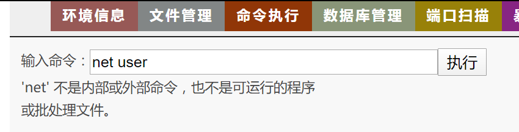
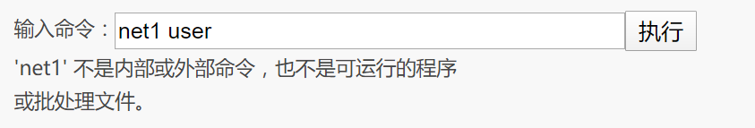
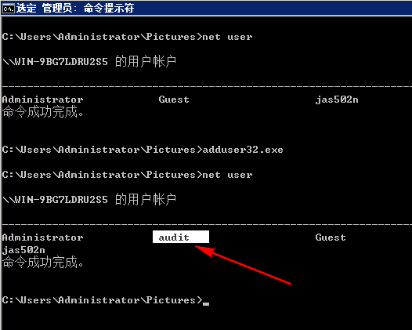
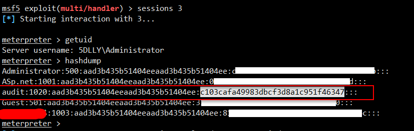
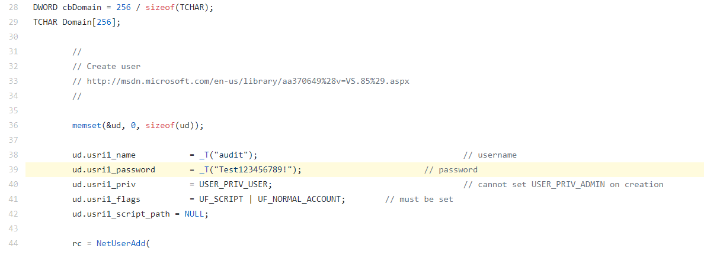

### adduser 单文件添加用户  

>【内网渗透-创建Windows用户】  

> Ps: net net1 等常见命令被过滤    

  
  

> 简介：adduser项目以编程方式创建“本地管理员” Windows用户。需要管理员权限。创建的用户被硬编码为以下内容：  

> 默认登录名：audit 密码：（Test123456789! ）  
  
  

> [你可以在源码中自定义修改账号密码](https://github.com/newsoft/adduser/blob/master/adduser.c#L39)  

  

> 内容来自 https://twitter.com/jas502n/status/1214413798330601472  此处仅作学习保留