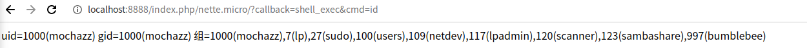
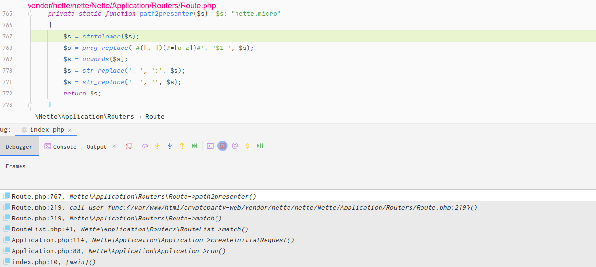
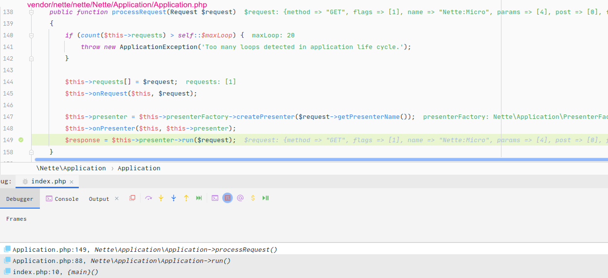
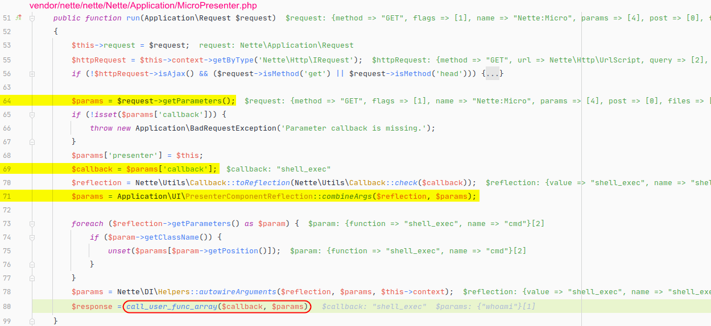
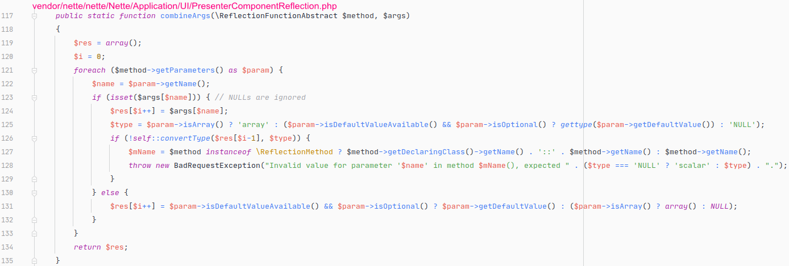
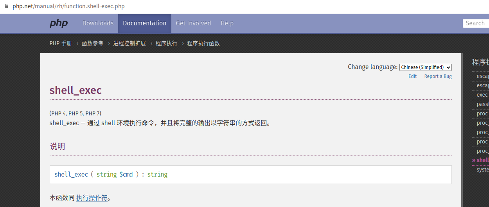

# Nette框架远程代码执行(CVE-2020-15227)

> Nette框架是一种流行的PHP web快速开发框架。其设计理念为：对开发者尽可能的友好并可用。它注重于安全性和性能，是最安全的PHP框架之一。Nette框架可以帮助您轻松建立好网站。
>
> github地址： https://github.com/nette/nette 

## 漏洞环境

这里在 **github** 上找了个基于 [Nette](http://nette.org/) 框架开发的项目 [https://github.com/Kedrigern/cryptoparty-web 1](https://github.com/Kedrigern/cryptoparty-web) ，我们只需要修改其 **composer.json** 文件，将 **nette/nette** 修改成受影响的版本 **2.1.12** 并执行 **composer update** 即可。测试环境为： **PHP5.6+Debian10+apache** 。网上公开的 **POC** ：https://github.com/hu4wufu/CVE-2020-15227 。

## 漏洞分析

程序在处理路由路径时，会通过 **path2presenter** 函数将 **nette.micro** 处理成 **Nette:Micro** 。

接着，程序会将处理得到的 **Nette:Micro** 对应到 **vendor/nette/nette/Nette/Application/MicroPresenter.php** 文件，并通过自动加载机制加载该文件。然后程序会通过反射加载该类（对应下图第147行代码），并运行该类的 **run()** 方法。而远程代码执行漏洞就发生在 **MicroPresenter:run()** 中，我们继续跟进。

在 **MicroPresenter:run()** 中，我们看到了高危函数 **call_user_func_array()** 的调用，来看下它的两个参数 **$callback、$params** 是否可控。第一个参数 **$callback** 来自 **$request->getParameters()** 。在 **nette** 框架中， **$request->getParameters()** 用于获得所有 **GET** 请求参数的数组，所以第一个参数 **$callback** 来自可控的 **$_GET['callback']** 。

第二个参数 **$params** 最开始为上面提到的 **$request->getParameters()** ，但是之后对其会有一段处理(对应上图第71行)。如果前面的 **$callback** 为一个可调函数的话，这里会通过反射去获取函数默认定义的参数名，如果 **$params** 数组中存在相同的键名，则存入 **$res** 数组中并在最终返回。

我们以 **$callback** 为 **shell_exec** 为例子，该函数默认参数名为 **cmd** ，那么我们访问 http://localhost:8888/index.php/nette.micro/?callback=shell_exec&cmd=whoami ，此时 **$params** 经过 **combineArgs** 函数处理后，最终的值将是 **array('cmd'=>'whoami')** 。

通过上面的分析，我们可以清晰的发现 **call_user_func_array()** 函数的两个参数都是可控的，这样也就成功触发远程代码执行漏洞了。如果我们想执行 **phpinfo** 函数的话，对应的 **URL** 为 http://localhost:8888/index.php/nette.micro/?callback=phpinfo&what=-1 。执行任意PHP代码：[http://localhost:8888/index.php/nette.micro/?callback=create_function&args=&code=return%20111;](http://localhost:8888/index.php/nette.micro/?callback=create_function&args=&code=return 111;)}phpinfo();exit();{

原文来自90SEC  七月火mochazz师傅：https://forum.90sec.com/t/topic/1333  欢迎大家投稿！

注：此文仅作留存学习，禁止他用。

