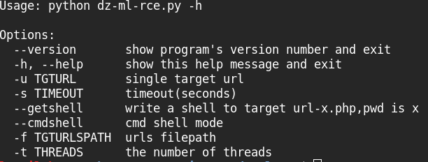
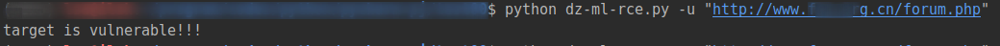
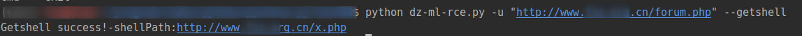
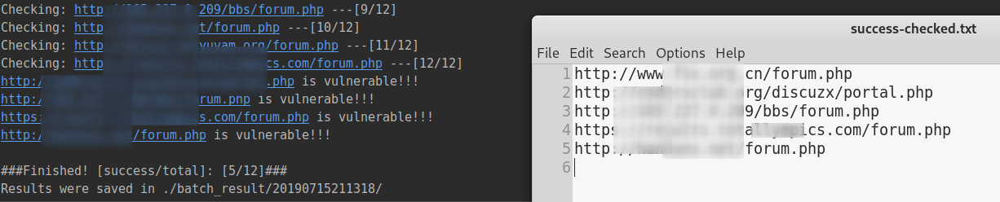
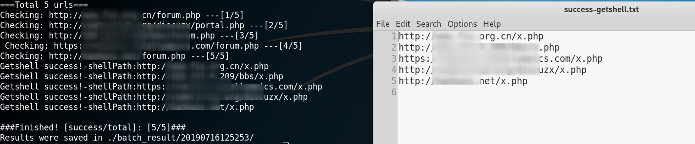

dz-ml-rce.py ：discuz ml RCE 漏洞检测工具
==
----------------

# 概述
 
漏洞在于cookie的language可控并且没有严格过滤，导致可以远程代码执行，详情参考

[discuz ml RCE漏洞重现及分析](http://www.lsablog.com/networksec/penetration/discuz-ml-rce-analysis/)

 
本工具支持单url和批量检测，有判断模式（只判断有无该漏洞）、cmdshell模式（返回简单的cmd shell）和getshell模式（写入一句话木马）。

----------------

# 需求
 
python2.7 
pip -r requirements.txt
  

**使用时加上漏洞PHP页面（如forum.php,portal.php），直接写域名可能会重定向导致误报!**

----------------

# 快速开始
 
使用帮助 
python dz-ml-rce.py -h 

 
判断模式 
python dz-ml-rce.py -u "http://www.xxx.cn/forum.php"  

 
cmdshell模式 
python dz-ml-rce.py -u "http://www.xxx.cn/forum.php" --cmdshell 

 
getshell模式 
python dz-ml-rce.py -u "http://www.xxx.cn/forum.php" --getshell 

 
批量检测 
python dz-ml-rce.py -f urls.txt 

 
批量getshell 
python dz-ml-rce.py -f urls.txt --getshell 

----------------

# TODO
有空会做各种优化。

----------------

# 反馈
[issus](https://github.com/theLSA/discuz-ml-rce/issues)
 
博客：http://www.lsablog.com/networksec/penetration/discuz-ml-rce-analysis/
 
gmail：lsasguge196@gmail.com
 
qq：2894400469@qq.com

