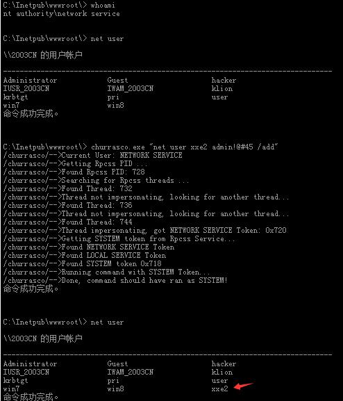
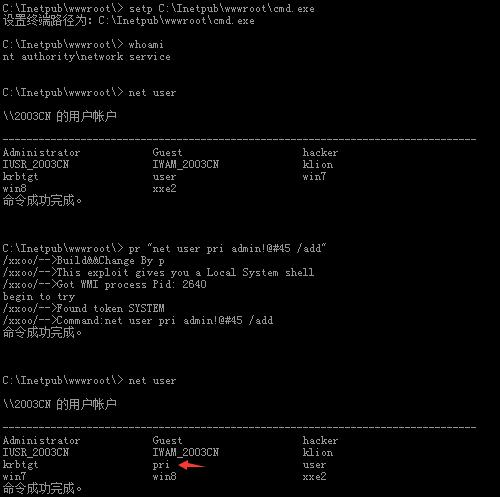
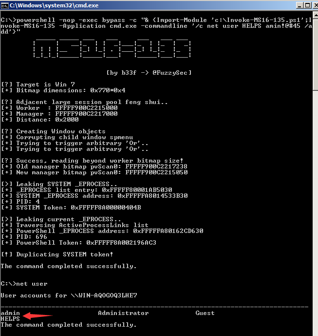
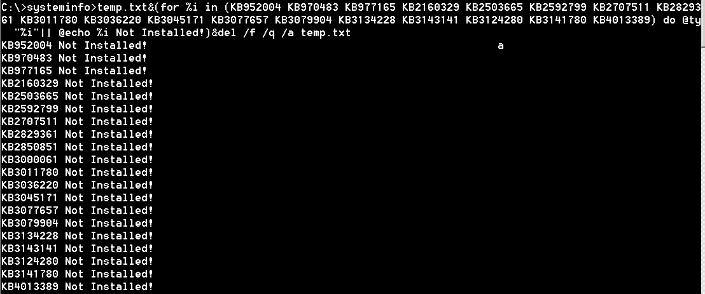

## windows 溢出提权小记+Linux&Windows提权思维导图  

### Linux&Windows提权思维导图：  


### windows 溢出提权小记  

#### 0x01 前言  

```
    平时用的相对比较多,就顺手自己记录了一份,不大完整,关键是大家能用上就好,都是一些已知的windows 0day exp,关于各个漏洞的详情,请自行查阅微软安全公告,链接如下:  
https://technet.microsoft.com/zh-cn/library/security/dn639106.aspx
```


#### 0x02 具体exp利用如下  

```
RPCSS服务没有正确地隔离NetworkService或LocalService帐号下运行的进程,导致本地攻击者可以利用令牌劫持的方式获得权限提升
漏洞代号: MS09-012
补丁编号: KB952004
exp 用途: 本地提权
适应平台: 针对03以下系统,菜刀可用
```

  
***
  


```
WebDAV extension for IIS处理HTTP请求的方式中存在一个特权提升漏洞,攻击者可能通过创建特制的匿名 HTTP 请求以访问通常需要身份验证的位置来利用此漏洞
漏洞代号: MS09-020
补丁编号: KB970483
exp 用途: IIS 5.x ,6.x 本地提权 
适应平台: 只针对 iis5.x 6.x,菜刀可用
```

  
***
```
常规内核级漏洞
漏洞代号: MS10-015
补丁编号: KB977165
exp 用途: 本地提权
适应平台: 03 32位系统本地测试成功,08 64位上并未成功(32的应该可以),在msf中已经直接提供该exp
```
***

```
win32k.sys  内核级漏洞
漏洞代号: MS10-048
补丁编号: KB2160329
exp 用途: 本地提权
适应平台: 03(32),08(64)本地测试成功,菜刀中执行还有点儿问题,需要调下exp
```
***

   
***
  

***
```
辅助功能驱动程序中的漏洞导致的提权
漏洞代号: MS11-046
补丁编号: KB2503665
exp 用途: 本地提权
适应平台: 03(32)菜刀可用,08以后可能不太好使,应该是exp兼容性的原因
```
***
  

***

```
辅助功能驱动程序中的漏洞导致的提权
漏洞代号: MS11-080
补丁编号: KB2592799
exp 用途: 本地提权
适应平台: 03本地测试成功,08以后的系统貌似也不太好使
```
***
```
Microsoft Windows用户态调度机制特权提升漏洞
漏洞代号:  MS12-042
补丁编号: KB2707511
exp 用途: 本地提权
适应平台: 08 r2 64位本地测试成功,只适合win7 or 2008,有可能会蓝屏,exp不太稳定
```
***
  

***

```
Microsoft Windows DirectX图形内核本地权限提升漏洞
漏洞代号: MS13-046
补丁编号: KB2829361
exp 用途: 本地提权
适应平台: 适合win 7 8 2008 2008R2,本地未测试
用法:
```
***
```
win32k.sys内存对象处理本地信息泄漏漏洞
漏洞代号: MS13-053
补丁编号: KB2850851
exp 用途: 本地提权
适应平台: 03 r2 32位本地测试成功,不太稳定,64位系统全部未成功
```
***

  

***

```
Win32k.sys CVE-2014-4113特权提升漏洞
漏洞代号: MS14-058
补丁编号: KB3000061
exp 用途: 本地提权
适应平台: 08 以后的系统基本都可以,exp写的很不错,成功率非常高
```
***
  

***

```
域内提权好帮手
漏洞代号: MS14-068
补丁编号: KB3011780
exp 用途: 域内提权
适应平台: 暂时只找到py版
```

****

```
内核提权
漏洞代号: MS15-010
补丁编号: KB3036220
exp 用途: 本地提权
适应平台: 本地未测成功,可能需要某些库支持
```
***

```
Windows内核模式驱动CVE-2015-1680信息泄露漏洞
漏洞代号: MS15-051
补丁编号: KB3045171
exp 用途: 本地提权
适应平台: 08 以后的系统基本都可以,成功率较高,菜刀直接可用
```

***

  

***

```
ATM 字体驱动程序中的漏洞可能允许特权提升
漏洞代号: MS15-077
补丁编号: KB3077657
exp 用途: 字体提权
适应平台: 可能该exp 32位系统好使,64位均未成功
```
***
  

***

```
Windows某些版本内核模式驱动程序win32k.sys的进程初始化实现中存在安全漏洞
漏洞代号: MS15-097
补丁编号: KB3079904
exp 用途: 本地提权
适应平台: 可能是exp自身的问题,测试均未成功,缺少库
```
***

```
微软Media播放器命令执行漏洞
漏洞代号: MS15-100
补丁编号: KB3087918
exp 用途: 适合钓鱼,msf中已有此exp
适应平台:
```
***
```
漏洞代号: MS16-014
补丁编号: KB3134228
exp 用途: 本地提权
适应平台: 实际测试只在2008(64)的系统上成功,其它系统直接蓝屏
```

***

  

***

```
wedav漏洞
漏洞代号: MS16-016
补丁编号: KB3143141
exp 用途: 本地提权
适应平台: 本地win7(32)并未成功
```
***
```
漏洞代号: MS16-032
补丁编号: KB3124280
exp 用途: powershell本地提权
适应平台: 08 r2以后的系统成功率较高,可能是powershell自身版本的问题,有exe版的,大家自己去找吧
```
***
```
powershell -nop -exec bypass -c "& {Import-Module 'c:\Invoke-MS16-032.ps1';Invoke-MS16-032 -Application cmd.exe -commandline '/c net user HELPS$ amin!@#45 /add'}"
```
***
  

***
  

***

```
漏洞代号: MS16-135
补丁编号: KB3141780
exp 用途: 利用.NET提权
适应平台: 08 R2本地测试成功,exp写的还不错
用法: 有调好的powershell版的,实战中大家直接用ps版的会更好些,exe的执行比较繁琐,实战中利用非常有限
```
***
```
powershell -nop -exec bypass -c "& {Import-Module 'c:\Invoke-MS16-135.ps1';Invoke-MS16-135 -Application cmd.exe -commandline '/c net user HELPS amin!@#45 /add'}"
```
***
  

```
smb远程执行
漏洞代号: MS17-010
补丁编号: KB4013389
exp 用途: 远程注入dll
用法: 这也可能是nsa工具包里最好用的一个,想必大家早都已经很熟练了,这里就不啰嗦了
```
***
快速检测目标系统未打漏洞补丁,注意,这里一定要先进到一个能读写的目录中去执行,要不然,没法创建临时文件:  

`systeminfo>temp.txt&(for %i in (KB952004 KB970483 KB977165 KB2160329 KB2503665 KB2592799 KB2707511 KB2829361 KB2850851 KB3000061 KB3011780 KB3036220 KB3045171 KB3077657 KB3079904 KB3134228 KB3143141 KB3124280 KB3141780 KB4013389) do @type temp.txt|@find /i  "%i"|| @echo %i Not Installed!)&del /f /q /a temp.txt`

***
  

***
```
后话:
    时间仓促,没有写完,后续会再抽空补上,其实,溢出提权,表面来讲没什么太多好说的,嘿嘿……原谅我不会逆向,所以才说不出来,实际提的过程中,最大的困难可能还是在免杀和调exp上,不同的系统exp在执行时经常会出现各种各样的问题,尤其是在64位机器上……如果这两点能搞定,拿着别人的exp,用用还是蛮轻松的,比如ms17-010……是吧,大家都懂的,嘿嘿,不好意思又跑题了,祝大家好运吧
```
