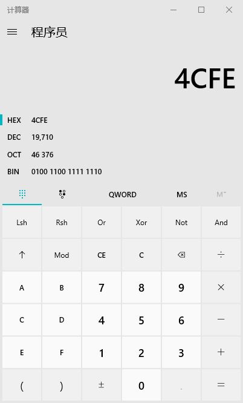

在命令行下执行：  
```shell
REG query HKLM\SYSTEM\CurrentControlSet\Control\Terminal" "Server\WinStations\RDP-Tcp /v PortNumber
```
返回：  
```shell
PortNumber    REG_DWORD    0x4cfe  
```
随后拿出来`0x4cfe`，转换成10进制，Windows下可以用计算器的程序员模式，
选择`HEX`输入`4cfe`即可得到10进制的端口号`19710`：  


当然你也可以使用其他软件(小葵多功能转换工具)或在线的进制转换工具，怎么方便怎么来

