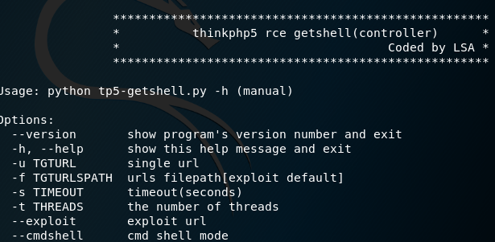
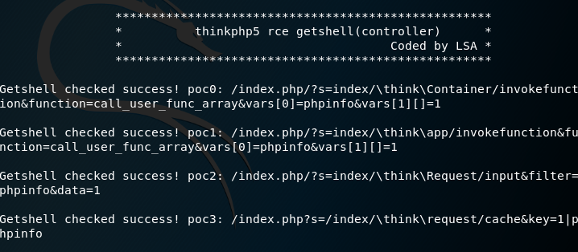
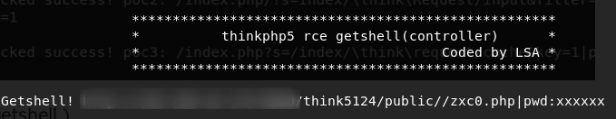
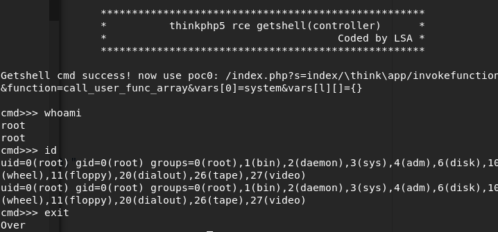
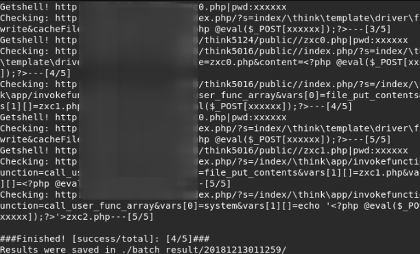

tp5-getshell.py - thinkphp5 rce漏洞检测工具
==

-----------------------

# 概述 

控制器过滤不严导致rce,漏洞详情参考

[thinkphp5 RCE漏洞重现及分析](demo/lsablog.com-ThinkPHP5%20RCE漏洞重现及分析.pdf)

 
本工具支持单url/批量检测，有phpinfo模式、cmd shell模式、getshell(写一句话)模式，批量检测直接使用getshell模式。

 

-----------------------

# 需求

python2.7

 
pip install -r requirements.txt 

 

-----------------------

# 快速开始

python tp5-getshell.py -h 

 
 
单url检测（phpinfo模式） 

使用4种poc-phpinfo检测 

python tp5-getshell.py -u http://www.xxx.com:8888/think5124/public/ 
 
 

单url检测（getshell模式） 

使用3种exp进行getshell，遇到先成功的exp就停止，防止重复getshell 

python tp5-getshell.py -u http://www.xxx.com:8888/think5124/public/ –exploit 

 
 

单url检测（cmd shell模式） 

python tp5-getshell.py -u http://www.xxx.com/ –cmdshell 

 
 

批量检测（getshell） 

使用3种exp进行getshell，遇到先成功的exp就停止，防止重复getshell 

python tp5-getshell.py -f urls.txt -t 2 -s 10 
 
 

----------------------

# 反馈

博客： http://www.lsablog.com/ 
gmail: lsasguge196@gmail.com 
qq: 2894400469@qq.com 
issues: https://github.com/theLSA/tp5-getshell/issues
